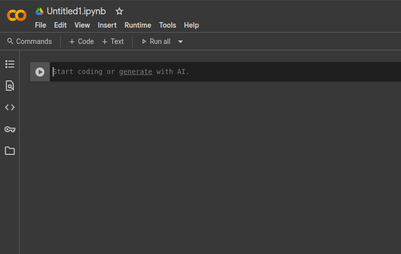

```{r setup, include=FALSE}
knitr::opts_chunk$set(echo = FALSE)
```


## Software R

R é uma linguagem e um ambiente para computação estatística e para preparação de gráficos

**Vantagens**

- software gratuito

- tratamento de dados

- ferramentas de diversos níveis para análise de dados

- ferramentas gráficas

## Referências

- Livro Frery, Cribari-Neto (2011) *Elementos de Estatística Computacional Usando Plataformas de Software Livre/Gratuito*
- Página do curso de *Ciência de dados* da profa. Carolina Mota e prof. Gilberto Sassi do DEst-UFBA: <https://ufba.netlify.app/paginas/catalogo>
- Página do curso *Estatística Computacional com R* do prof. Paulo Justiniano (UFPR) e equipe: <http://cursos.leg.ufpr.br/ecr/index.html>

<!--

-->


## R disponível no Google Colab

```{r , echo=FALSE, out.width="90%", fig.align='center'}
knitr::include_graphics("01_pagina_colab.png")
```


## Criando um notebook no Colab

```{r , echo=FALSE, out.width="90%", fig.align='center'}
knitr::include_graphics("02_novo_notebook.png")
```


## Página de um notebook no Colab

```{r , echo=FALSE, out.width="90%", fig.align='center'}

```


## Selecionando a linguagem R no Colab

```{r , echo=FALSE, out.width="90%", fig.align='center'}
knitr::include_graphics("04_config_notebook.png")
```


## Selecionando a linguagem R no Colab

```{r , echo=FALSE, out.width="90%", fig.align='center'}
knitr::include_graphics("05_selecionar_R.png")
```


## Operações básicas

**Adição**
```{r, echo = TRUE}
1+1
```

**Subtração**
```{r, echo = TRUE}
5 - 3
```


## Operações básicas

**Multiplicação**
```{r, echo = TRUE}
2 * 3
```

**Divisão**
```{r, echo = TRUE}
10/5
```

## Operadores lógicos

**Maior/menor que**
```{r, echo = TRUE}
5 > 3
```

```{r, echo = TRUE}
3>=3
```

```{r, echo = TRUE}
3>3
```

## Operadores lógicos

**Igual**
```{r, echo = TRUE}
5 == 3
```

```{r, echo = TRUE}
3 == 3
```

**Diferente**
```{r, echo = TRUE}
4 != 2
```

```{r, echo = TRUE}
4 != 4
```


## Tipos de dados em R


**Número real**
```{r, echo = TRUE}
class(0.5)
```
**Valor lógico**
```{r, echo = TRUE}
class(TRUE)
```

**Caractere**
```{r, echo = TRUE}
class('UFBA')
```

## Variável

- É como uma caixa nomeada. Você pode trocar o conteúdo da caixa, mas o nome permanece o mesmo.

Usamos os símbolos `<-` ou `=` para atribuir valores a uma variável
```{r, echo = TRUE}
x = 2
```

Para ver o valor da variável, basta rodar o seu nome
```{r, echo = TRUE}
x
```

## Variável

Podemos fazer operações com a variável
```{r, echo = TRUE}
5 * x
```
podemos trocar o seu valor
```{r, echo = TRUE}
x = 20
x
```

Podemos atribuir o valor de operações à outras variáveis
```{r, echo = TRUE}
idade = 2 * x
idade
```
## Funções

- Em matemática, funções recebem um ou mais argumentos e retornam um ou mais valores. Funções em R são similares.

**Função para criar uma sequência de 9 números**
```{r, echo  = TRUE}
seq(from = 1, to = 9)
```

## Vetores

- Vetores são listas indexadas de *variáveis do mesmo tipo*. É como um armário de gavetas numeradas como 1, 2, 3, ... Você pode mudar o conteúdo da gaveta 5 sem alterar o conteúdo da gaveta 1.

Vetores podem ser criados com a fórmula `c(x1, x2, ...)` 
```{r, echo = TRUE}
vet = c(1, 2, 5, 8, 1, 3)
```

\pause

Valores de elementos de um vetor podem ser vistos assim 
```{r, echo = TRUE}
vet[3]
```
Podemos alterar elementos do vetor
```{r, echo = TRUE}
vet[3] = 99
vet
```


## Conjuntos de dados em R

- Análise de dados geralmente envolvem tabelas com diferentes tipos de variáveis, tanto quantitativas como qualitativas. Em R, diferentes tipos de dados podem ser armazenados em estruturas chamadas *listas* e *dataframes*.

\pause

- Diversas funções soltam resultados em formas de listas.

- Dataframes geralmente são obtidos quando lemos planilhas com dados.

\pause

- \textcolor{blue}{Hoje:} Foco em dataframes já disponíveis no próprio R

## Dados de peso de galinhas segundo tipo de alimento

- Faremos gráficos com um conjunto de dados do R chamado \textit{chickwts}
- Esses dados são provenientes de um estudo sobre a efetividade de diferentes tipos de suplementos na taxa de crescimento de galinhas
- Duas variáveis: 
  + \textit{weight}: o peso da galinha
  + \textit{feed}: o tipo de alimento dado à galinha

##

**Carregando o conjunto de dados**
```{r, echo = TRUE}
data("chickwts")
```

**Variáveis**
```{r, echo = TRUE}
names(chickwts)
```

**Acessando uma das variáveis**
```{r, echo = TRUE}
chickwts$weight[1:5]
```

\pause

Para **visualizar os dados**, digite *View(chickwts)*

## 

\begin{center}
\large{\textcolor{blue}{Gráficos para variáveis qualitativas}}
\end{center}

## Gráfico de Colunas/barras

- Para criar um gráfico de colunas, primeiro contamos o número de observações para cada classe da variável qualitativa

- A função `table()` pode ser usada para fazer tal contagem

**Criando uma tabela de frequências da variável tipo de alimento**
```{r, echo = TRUE}
tpeso = table(chickwts$feed)
tpeso
```

## 

**Criando um gráfico de colunas**
\centering
```{r, echo=TRUE, out.height="0.5\\textheight", fig.align='center'}
barplot(tpeso)
```


## 

**Nomeando os elementos do gráfico de colunas**

\centering
```{r, echo=TRUE, out.height="0.5\\textheight", fig.align='center'}
barplot(tpeso, ylab = "contagem", 
        xlab = "alimento", 
        main = "título")
```

## 

**Criando um gráfico de barras**
\centering
```{r, echo=TRUE, out.height="0.5\\textheight", fig.align='center'}
barplot(tpeso, horiz = TRUE)
```


## Gráfico de setores/pizza

- Consiste num círculo dividido em partes, uma para cada classe da variável qualitativa, com cada parte tendo uma área proporcional à frequência da respectiva classe.

\pause

**Criando um gráfico de setores da variável sexo**

\centering
```{r, pizza, echo=TRUE, out.height="0.4\\textheight", fig.align='center'}
pie(tpeso)
```


## 

\begin{center}
\large{\textcolor{blue}{Gráficos de variáveis quantitativas}}
\end{center}

## Histograma

- O histograma é um gráfico de colunas justapostas, com a base proporcional ao intervalo da classe e área proporcional à frequência (relativa/absoluta) da respectiva classe.

- Útil para saber quais valores da variável qualitativa ocorrem com maior frequência.

- Em R, usamos a função `hist()` para criar histogramas. Mais informações sobre a função podem ser consultadas através do comando `?hist()`.


## Histograma

\centering
```{r, echo=TRUE, out.height="0.5\\textheight", fig.align='center'}
hist(chickwts$weight, main = 'Peso das galinhas',
     ylab = 'frequência', xlab = 'peso')
```


## Gráfico de linhas

- Gráfico usuda para representar séries temporais/históricas. No eixo vertical ficam os valores da variável e no eixo horizontal ficam os instantes em que os dados foram observados.

- Utilizaremos o conjunto de dados `LakeHuron` disponível no R para fazer um gráfico de linhas.

- Tais dados são medidas anuais do nível do Lago Huron (EUA/Canadá) obtidas entre 1875-1972.

\pause

**Carregando o conjunto de dados**
```{r, echo = TRUE}
data("LakeHuron")
```


##

\centering
```{r, echo=TRUE, out.height="0.5\\textheight", fig.align='center'}
plot(LakeHuron, main = 'Nível do Lago Huron',
     ylab = 'nível', xlab = 'ano')
```


## 

\begin{center}
\large{\textcolor{blue}{Medidas de posição central}}
\end{center}

## Medidas de posição central

**Calculando a média dos pesos das galinhas com a função** `mean`
```{r, echo = TRUE}
mean(chickwts$weight)
```

\pause

**Calculando a mediana dos pesos das galinhas com a função** `median`
```{r, echo = TRUE}
median(chickwts$weight)
```

\pause

- \textcolor{red}{Atenção}, `mode` em R não retorna a moda do vetor

## Moda

- Em geral, se usa tabelas de contagens ou histograma

**Usamos tabelas para identificar a classe modal**
```{r, echo = TRUE}
tabalim = table(chickwts$feed)
id_max = which.max(tabalim)
tabalim[id_max]
```

\pause

**Podemos usar um histograma para identificar a média da classe modal**
```{r, echo = TRUE}
hist_peso = hist(chickwts$weight, plot = FALSE)
id_max = which.max(hist_peso$counts)
hist_peso$mids[id_max]
```

