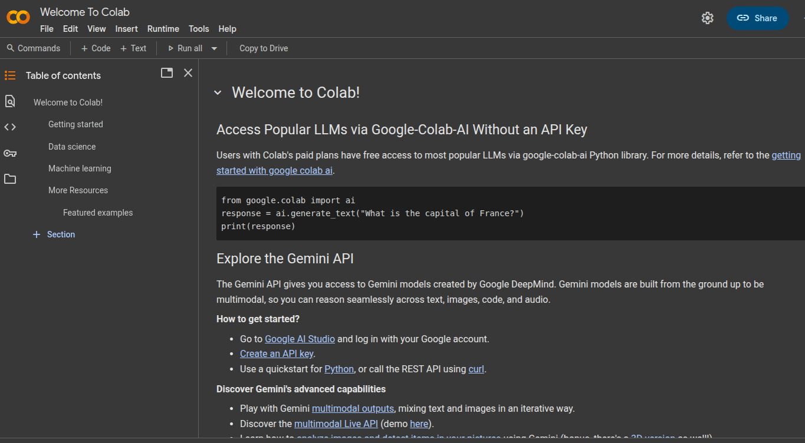
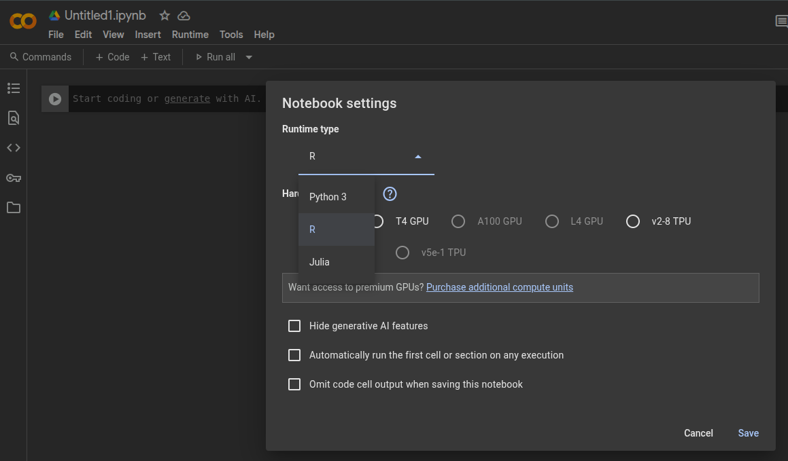
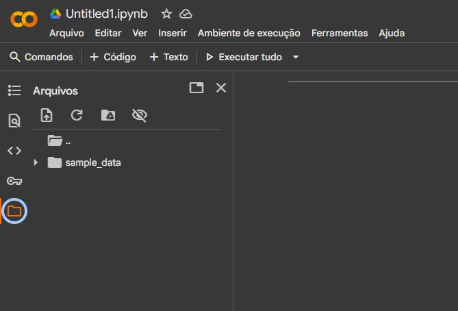

```{r setup, include=FALSE}
knitr::opts_chunk$set(echo = FALSE)
```


<!--

-->

\begin{center}
\large{\textcolor{blue}{Iniciando o R no Colab}}
\end{center}

## R disponível no Google Colab

```{r , echo=FALSE, out.width="90%", fig.align='center'}

```


## Criando um notebook no Colab

```{r , echo=FALSE, out.width="90%", fig.align='center'}

```


## Página de um notebook no Colab

```{r , echo=FALSE, out.width="90%", fig.align='center'}
knitr::include_graphics("03_pagina_notebook.png")
```


## Selecionando a linguagem R no Colab

```{r , echo=FALSE, out.width="90%", fig.align='center'}
knitr::include_graphics("04_config_notebook.png")
```


## Selecionando a linguagem R no Colab

```{r , echo=FALSE, out.width="90%", fig.align='center'}

```


## 

\begin{center}
\large{\textcolor{blue}{Carregar dados no Colab e em R}}
\end{center}

## 


- Vimos que planilhas em R são objetos do tipo **dataframes**, que que podem armazenar variáveis de diferentes tipos

\pause
- Nesse material, discutiremos como carregar arquivos .csv (sigla em inglês para *valores separados por vírgula*), que é um dos formatos mais comuns para arquivos de dados

- Usaremos a função `read.csv()` e os dados poderão ser salvos em uma variável **com algum nome sugestivo**

## Carregando a planilha no Colab

- Vamos fazer o upload da planilha `empresa.csv` disponível no Moodle para o Colab

- Baixe a planilha no link *Dados de empresas* no Moodle

- Abra o Colab e clique no ícone de uma pasta na aba do lado esquerdo

## Local para upload da planilha

- Você pode arrastar o arquivo para essa aba ou clicar no botão para upload (página com uma seta para cima)

```{r , echo=FALSE, out.width="90%", fig.align='center'}

```


<!--

## Lendo planilhas em R

- Vamos carregar no R a planilha `empresa.csv` disponível no Moodle

- Primeiro, salve o seu script R em alguma pasta, por exemplo *Downloads*

\pause

- Em seguida, baixe a planilha no link *Dados de empresas* no Moodle e **salve na mesma pasta onde o seu script está salvo**


-->

## Lendo planilhas em R

- Usamos a função `read.csv()` com o nome do arquivo entre aspas. A opção `header=TRUE` indica que a planilha tem um cabeçalho, enquanto `dec=','` indica que casas decimais são separadas por vírgula

```{r, echo = TRUE}
empresas = read.csv('empresas.csv', header = TRUE, 
                     dec = ',')
```

\pause
- Note que os dados já são lidos como um dataframe
```{r, echo = TRUE}
class(empresas)
```

Para visualizar a planilha, use a função `View(empresas)`


##

- A função `dim()` nos mostra a dimensão dos dados, que contém 106 observações e 11 variáveis
```{r, echo = TRUE}
dim(empresas)
```

\pause
**Nomes das variáveis**
```{r, echo = TRUE}
names(empresas)
```


##

**Checando os cinco primeiro valores de uma das variáveis**
```{r, echo=TRUE}
empresas$idade[1:5]
```

\pause
**Frequências absolutas de uma variável qualitativa**
```{r, echo=TRUE}
table(empresas$constituicao)
```


##

\begin{center}
\large{\textcolor{blue}{Medidas de posição central para variáveis quantitativas}}
\end{center}

##

**Calculando a média com a função** `mean`
```{r, echo = TRUE}
mean(empresas$idade)
```

\pause

**Calculando a mediana com a função** `median`
```{r, echo = TRUE}
median(empresas$idade)
```

\pause
**Sumário da variável**
```{r, echo=TRUE}
summary(empresas$idade)
```

## Histograma

\centering
```{r, echo=TRUE, out.height="0.6\\textheight", fig.align='center'}
hist(empresas$idade,
     main = 'Idade',
     ylab = 'Frequência', xlab = 'Anos')
```

##

\begin{center}
\large{\textcolor{blue}{Quantis em R}}
\end{center}

## Definição de percentil

- O percentil de ordem $i\%$ é um número $P_i$ tal que $i\%$ dos dados são menores que tal valor

- Percentis especiais
  - Primeiro quartil ou $Q1$: percentil $25\%$
  - Segundo quartil ou $Q2$: percentil $50\%$ (mediana)
  - Terceiro quartil ou $Q3$: percentil $75\%$

## Precentis em R

- Usamos a função `quantile()` para calcular percentis/quartis em R

\pause
**Percentil 50% do tempo de existência das empresas**
```{r, echo = TRUE}
quantile(x = empresas$idade, probs = 0.5)
```

**Mediana do tempo de existência das empresas**
```{r, echo = TRUE}
median(empresas$idade)
```


##

**Quartis do tempo de existência das empresas**
```{r, echo = TRUE}
Q1 = quantile(empresas$idade, 0.25)
Q2 = quantile(empresas$idade, 0.5)
Q3 = quantile(empresas$idade, 0.75)
print(c(Q1, Q2, Q3))
```

##

\centering
```{r, echo=FALSE, out.height="0.7\\textheight", fig.align='center'}
hist(empresas$idade,
     main = 'Idade',
     ylab = 'Frequencia', xlab = 'Anos', cex=1.5, cex.lab=1.5, cex.axis=1.5,
     cex.main=1.5)
abline(v=Q1, lwd= 2, col="blue")
abline(v=Q2, lwd= 2, col="red")
abline(v=Q3, lwd= 2, col="green")
legend('topright', legend = c('Q1', 'Q2', 'Q3'), 
       fill=c("blue", "red", "green"), title ='Quartis', cex = 1.5)
```


##

\begin{center}
\large{\textcolor{blue}{Medidas de dispersão}}
\end{center}

## Amplitude total

- Diferença entre valores mínimo e máximo nos dados $$AT = X_{max} - X_{min}$$

- Para calcular amplitude total no R, basta usar as funções `max()` e `min()`

\pause
**Amplitude total do tempo de existência das empresas**
```{r, echo = TRUE}
max(empresas$idade) - min(empresas$idade)
```


## Variância e desvio padrão amostral

- Dado um conjunto de dados $x_1, \ldots, x_n$, a variância é calculada como
$$
Var(X) = \frac{1}{n}\sum_{i=1}^{n} (x_i - \bar{x})^2,
$$
em que $\bar{x} = \frac{1}{n}\sum_{i=1}^{n}x_i$ é a média aritmética

\pause

- O desvio padrão é simplesmente a raiz quadrada da variância:
$$
dp(X) = \sqrt{\frac{1}{n}\sum_{i=1}^{n} (x_i - \bar{x})^2}.
$$

## 
- Em R, `var()` calcula variância e `sd()` calcula o desvio padrão de um vetor de dados

**Variância do tempo de existência**
```{r, echo = TRUE}
var(empresas$idade)
```

\pause

**Desvio padrão do tempo de existência**
```{r, echo = TRUE}
sd(empresas$idade)
```


## Coeficiente de variação

- É definido como a razão do desvio padrão e da média 
$$CV = \frac{dp(X)}{\bar{X}},$$
em que $\bar{X}$ é a média aritmética e $dp(X)$ é o desvio padrão

\pause

- Em R, usamos as funções `mean()` e `sd()` para calcular o $CV$

**Coeficiente de variação do tempo de existência**
```{r, echo = TRUE}
mean(empresas$idade)/sd(empresas$idade)
```

##

- Vamos comparar os faturamentos das empresas nos anos de 1998 e 1999

- O intuito é checar se houve um aumento nos faturamentos de 1999 em comparação aos faturamentos de 1998

- para agilizar a análise, vamos salvar esses dados em variáveis com nomes mais simples
```{r, echo = TRUE}
f98 = empresas$faturamento98
f99 = empresas$faturamento99
```

##

\centering
```{r, echo=TRUE, out.height="0.5\\textheight", fig.align='center'}
hist(f98, ylim = c(0, 45), col='blue')
hist(f99, col='magenta', density = 10, add = TRUE)
legend('topright',title='Anos',legend=c('1998','1999'), 
       fill = c('blue', 'magenta'))
```


## Medidas de posição central: faturamentos

**Faturamento em 1998**
```{r, echo = TRUE}
summary(f98)
```

**Faturamento em 1999**
```{r, echo = TRUE}
summary(f99)
```


## Medidas de dispersão: faturamentos

**Faturamento em 1998**
```{r, echo = TRUE}
sd(f98) 
sd(f98)/mean(f98)
```

**Faturamento em 1999**
```{r, echo = TRUE}
sd(f99)
sd(f99)/mean(f99)
```


## Boxplot

- Gráfico que fornece diferentes informações sobre os conjunto de dados: posição central, dispersão, assimetria e outliers (observações discrepantes)

- Construído a partir dos quartis $Q1$, $Q2$ e $Q3$

## 


**Boxplot do tempo de existência das empresas**
\centering
```{r, echo=FALSE, out.height="0.5\\textheight", fig.align='center'}
x = c(2, 20, 30, 25, 45, 100)
boxplot(empresas$idade, xlim = c(0.7, 1.3), ylim=c(0,50), 
        ylab="Idade da empresa", cex.lab=1.5, cex.axis=1.5)
text(0.75, quantile(empresas$idade, 0.25), 'Q1', cex=2)
text(0.75, quantile(empresas$idade, 0.5), 'Q2', cex=2)
text(0.75, quantile(empresas$idade, 0.75), 'Q3', cex=2)
dif_interquartil <- quantile(empresas$idade, 0.75) - quantile(empresas$idade, 0.25)
#text(0.75, quantile(empresas$tempo_existencia, 0.75) + 1.5*dif_interquartil, 'LS')
#text(0.75, quantile(empresas$tempo_existencia, 0.25) - 1.5*dif_interquartil, 'LS')
text(0.75, max(empresas$idade), 'LS', cex=2)
text(0.75, min(empresas$idade), 'LI', cex=2)
```


## Boxplot para faturamentos em 1998 e 1999

\centering
```{r, echo=TRUE, out.height="0.5\\textheight", fig.align='center'}
boxplot(f98, f99, 
        names = c('1998', '1999'), ylab="Faturamento")
```


## Gráfico de dispersão dos faturamentos em 1998 e 1999

\centering
```{r, echo=TRUE, out.height="0.5\\textheight", fig.align='center'}
plot(f98, f99, 
     xlab="Faturamento 1998", ylab="Faturamento 1999")
```

## Coeficiente de correlação

- Dado um conjunto de dados $(x_1,y_1), \ldots, (x_n, y_n)$, o coeficiente de correlação é calculado como
$$
cor(X,Y) = \frac{1}{n}\sum_{i=1}^{n} \left(\frac{x_i - \bar{x}}{dp(X)}\right) \left(\frac{y_i - \bar{y}}{dp(Y)}\right),
$$
em que $\bar{x}$ e $dp(X)$ são a média e desvio padrão de $x_1,\ldots,x_n$, e $\bar{y}$ e $dp(Y)$ são a média e desvio padrão de $y_1,\ldots,y_n$.

\pause

- Em R, `cor()` calcula o coeficiente de correlação de dois vetores de dados com tamanhos iguais

```{r, echo = TRUE}
cor(f98, f99)
```


##

\begin{center}
\large{\textcolor{blue}{Exercício}}
\end{center}

## Dados de prefeitos

- Baixe a planilha no link \textcolor{blue}{`Dados de prefeitos`} no Moodle

- Carregue esses dados no Google Colab e utilize o R para responder as seguintes perguntas:
  + Quantas pessoas de cada sexo foram prefeitos em 2021?
  + Qual foi o nível de escolaridade mais comum dentre os prefeitos?
  + Qual é a população média e mediana das cidades?
  + Como é a distribuição (histograma) das idades dos prefeitos?
  + Qual é a correlação entre a idade dos prefeitos e a população das cidades?


