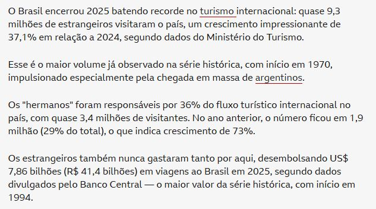
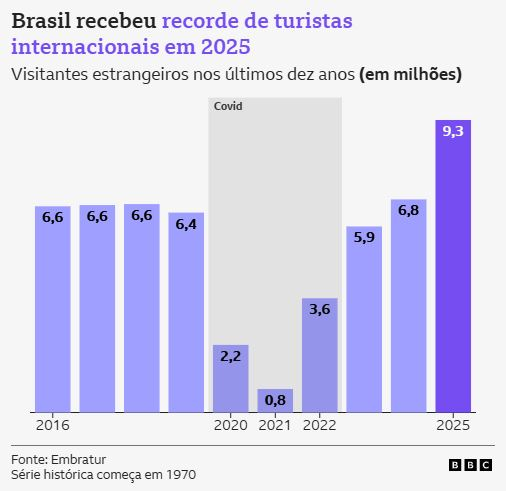
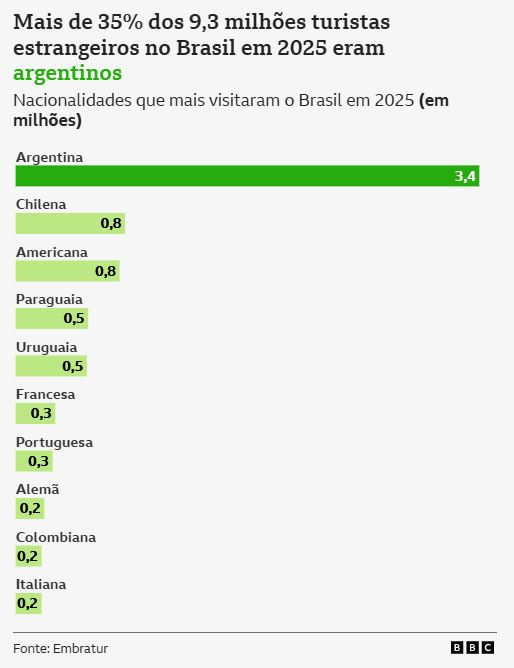
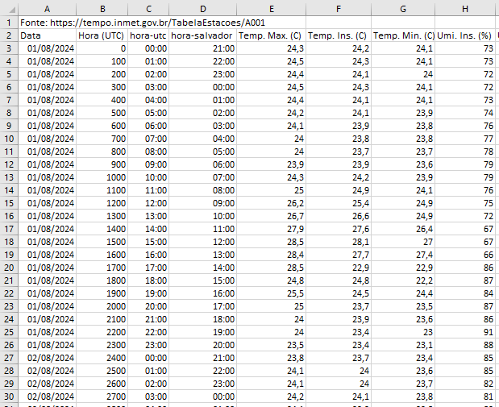
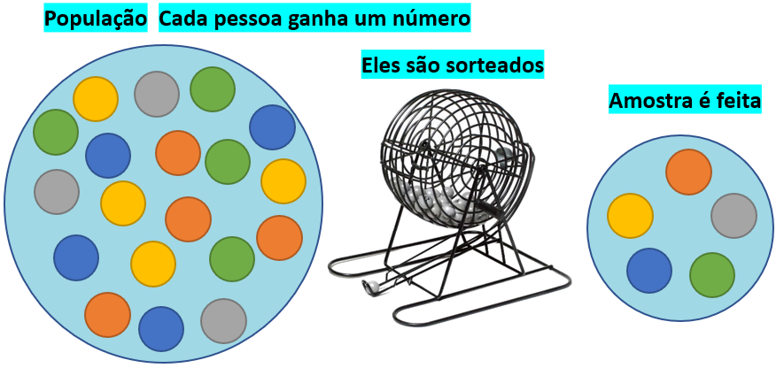
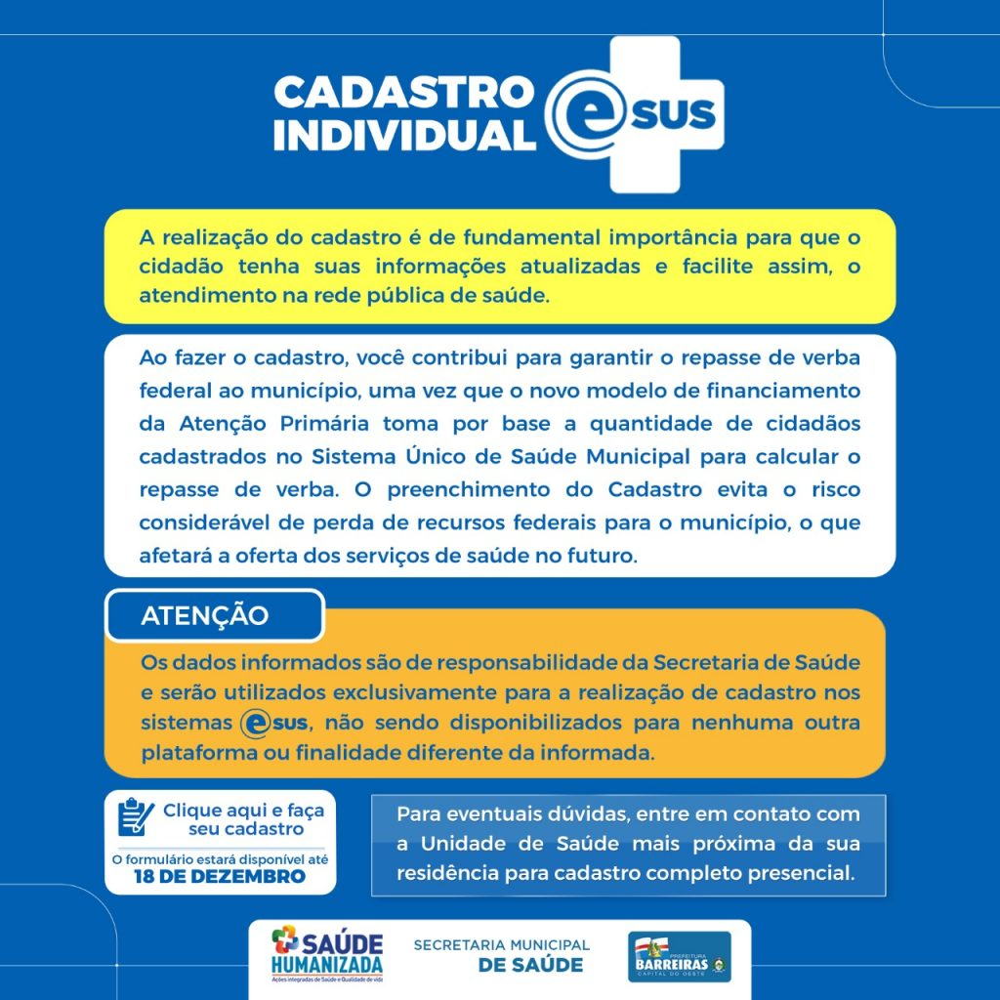

```{r setup, include=FALSE}
knitr::opts_chunk$set(echo = TRUE, warning = FALSE, message = FALSE, fig.retina = 2,
                      dev.args = list(bg = "transparent"))
suppressPackageStartupMessages(library(tidyverse))
empresas  <- read.csv("empresas.csv")
prefeitos <- read.csv("dados_prefeitos.csv")

# diagrama: população -> amostra -> inferência
caixa <- function(x, y, rot, cor = "#b5173d") {
  annotate("label", x = x, y = y, label = rot, size = 6, fill = cor, color = "white",
           label.padding = unit(0.7, "lines"), label.r = unit(0.9, "lines"))
}
```

class: inverse, center, middle

# MATF14: Estatística Econômica I

### Aula 01: Apresentação da disciplina · População e amostra · Tipos de variáveis

Raydonal Ospina · Departamento de Estatística, UFBA · 2026.2

2ª e 4ª-feira, 10:40–12:30 · Sala 22, PAF I

### Parte 1 (50 min) · intervalo · Parte 2 (50 min)

---

## Roteiro da aula (100 minutos)

.roteiro[

| Tempo | Parte 1: a disciplina e por que estudar Estatística |
|:---|:---|
| 0–10 min | Provocação: dados por toda parte; turistas; você já decide com números incertos |
| 10–28 min | Apresentação da disciplina: ementa, aulas, avaliação, bibliografia |
| 28–40 min | Por que estudar Estatística: descritiva e inferência; temperatura em Salvador |
| 40–50 min | **Atividade 1**: da análise exploratória à inferência |

| Tempo | Parte 2: população, amostra e variáveis |
|:---|:---|
| 0–20 min | População e amostra; viés de quem fica de fora; amostragem |
| 20–35 min | Tipos de variáveis; PNAD Contínua; contas nacionais |
| 35–45 min | **Atividade 2**: classificando bases reais; exercício-síntese |
| 45–50 min | Discussão final e resumo |

]

---

class: inverse, center, middle

# Parte 1: a disciplina e por que estudar Estatística

### 50 minutos

---

## Provocação: dados por toda parte .tempo[0–10 min]

.pull-left[
```{r economia-bbc, echo=FALSE, out.width="100%"}

```

.fonte[Fonte: BBC News Brasil, editoria de Economia, janeiro de 2026.]
]

.pull-right[
Abra qualquer página de notícias de economia: quase toda manchete depende de um **número**.

- Quem coletou esse número?
- Sobre **quem** ele fala: todos os brasileiros? Uma amostra?
- Ele é **exato** ou uma **estimativa**?
- O que dá, e o que **não** dá, para concluir a partir dele?

.caixa-discussao[
Esta disciplina é sobre fazer essas quatro perguntas com rigor.
]
]

---

## Um exemplo: o recorde de turistas em 2025

.pull-left-60[
```{r turismo-texto, echo=FALSE, out.width="100%"}

```

.fonte[Fonte: BBC News Brasil (2026), com dados do Ministério do Turismo, Embratur e Banco Central.]
]

.pull-right-40[
```{r turismo-serie, echo=FALSE, out.width="100%"}

```

]

---

## Dados históricos, atuais e projeções

.pull-left-40[
```{r turismo-nac, echo=FALSE, out.width="88%"}

```

]

.pull-right-60[
- **Dados históricos:** a série de visitantes começa em 1970; 2025 é o maior valor observado.
- **Dados atuais:** 9,3 milhões de turistas; 36% eram argentinos.
- **Uma queda que precisa de explicação:** 0,8 milhão em 2021.

.caixa-discussao[
**1.** Que evento explica a queda de 2020–2021? Um analista que olhasse **só** a média de 2016 a
2025 veria esse evento?

**2.** "Crescimento de 37,1% em relação a 2024": que fórmula está por trás desse número?

**3.** Com esses dados, dá para **prever** quantos turistas virão em 2026? Com que segurança?
]
]

---

## Você já decide com números incertos

- Uma pesquisa mostra a candidata A com **52%** e o candidato B com **48%**, margem de erro de 3
  pontos. A eleição está decidida?
- O IBGE divulga que o desemprego caiu para **6,4%**. O IBGE perguntou para **todos** os
  trabalhadores do país?
- Um banco oferece crédito "porque seu score está acima da média". Acima da média **de quem**?

--

.caixa-aplicacao[
Nas três situações há uma **população** de interesse, uma **amostra** efetivamente observada e
**variáveis** de tipos diferentes. São exatamente os três conceitos desta primeira aula.
]

---

class: inverse, center, middle

# Apresentação da disciplina

---

## Identificação do componente curricular .tempo[10–28 min]

| | |
|:---|:---|
| **Código e nome** | MATF14 · Estatística Econômica I |
| **Departamento** | Estatística, Instituto de Matemática e Estatística, UFBA |
| **Carga horária** | 60 h |
| **Pré-requisito** | MAT047 |
| **Horário e local** | 2ª e 4ª-feira, 10:40–12:30 · Sala 22, PAF I |
| **Período** | 24/08/2026 a 16/12/2026 |
| **Página do curso** | [raydonal.github.io/matf14](https://raydonal.github.io/matf14/) |

--

Disciplina de serviço para os cursos de **Economia** e **Estatística**: o objetivo é dar a quem vai
trabalhar com dados econômicos (preços, renda, câmbio, desemprego, pesquisas de opinião) o
ferramental para **ler um número com rigor** antes de opinar sobre ele.

---

## Ementa: quatro unidades

.pull-left[
**Unidade 1 · Estatística descritiva**
- População e amostra; tipos de variáveis.
- Tabelas e gráficos.
- Medidas de tendência central.
- Medidas de dispersão.
- Correlação, assimetria e curtose.

**Unidade 2 · Probabilidade**
- Espaço amostral, eventos e propriedades.
- Probabilidade condicional e independência.
- Teorema de Bayes.
]

.pull-right[
**Unidade 3 · Variáveis aleatórias discretas**
- Conceito, esperança e variância.
- Função de distribuição acumulada.
- Bernoulli, Binomial e Poisson.

**Unidade 4 · Variáveis aleatórias contínuas**
- Conceito, esperança e variância.
- Função de distribuição acumulada.
- Uniforme e Normal.
]

---

## Como as aulas funcionam

Cada encontro equivale a **duas aulas de 50 minutos**, com um intervalo entre elas. Todo deck começa com um
**roteiro cronometrado** e cada slide traz, no canto, o tempo previsto.

| Momento | O que acontece |
|:---|:---|
| **Provocação** | uma notícia ou pergunta real que motiva o tema |
| **Teoria** | definições e fórmulas, sempre com conta feita **na mão** |
| **Aplicação** | exemplos com dados reais (IBGE, Banco Central, empresas, prefeitos, notícias) |
| **Atividades** | em duplas, **em sala**: você resolve antes de ver a resposta |
| **Uso do R** | como fazer a mesma análise no computador |

--

- **Não há laboratório presencial** neste semestre: as aulas com R usam o **Google Colab**, no
  navegador, sem instalar nada.
- **Material:** livro-texto, slides de cada aula e listas de exercícios, todos na página do curso.
- As **listas não valem nota** e os **gabaritos não são publicados**: resolva antes de conferir com
  colegas e em sala.

---

## Por que as discussões valem tanto quanto as contas

As fórmulas deste curso são poucas e simples. A dificuldade real está em saber **qual pergunta cada
fórmula responde, e qual não responde**.

--

- Uma correlação de 0,86 entre gasto em propaganda e vendas prova que a propaganda **causa** as
  vendas?
- Um teste de fraude com 95% de acerto significa que 95% dos alarmes são fraudes de verdade?
- Um salário médio de R$ 6.000 descreve bem o trabalhador **típico** de uma categoria?

--

.caixa-discussao[
Nas provas, a diferença entre nota alta e nota mediana quase sempre está aqui: não em saber a
fórmula, mas em saber **quando ela se aplica** e **o que ela deixa de fora**.
]

---

## Avaliação

$$
NF = \frac{P\_1 + P\_2 + P\_3}{3}
$$

| Prova | Data | Conteúdo |
|:---:|:---:|:---|
| P1 | 23/09/2026 | Unidade 1: estatística descritiva |
| P2 | 18/11/2026 | Unidades 2 e 3: probabilidade e VA discretas |
| P3 | 16/12/2026 | Unidade 4: VA contínuas |

--

- Aprovação: frequência de pelo menos **75%** e \\(NF \geq 5{,}0\\).
- **Segunda chamada:** a combinar ao final do semestre, para quem perdeu uma prova por motivo
  justificado.
- Não há trabalhos ou projetos: listas de exercícios são para estudo e **não valem nota**.

---

## Bibliografia

**Referências principais**

- HOFFMANN, R. *Estatística para economistas*. São Paulo: Thomson, 2006.
- MORETTIN, P. A.; BUSSAB, W. O. *Estatística básica*. São Paulo: Saraiva, 2012.
- ROSS, S. *Probabilidade: um curso moderno com aplicações*. 6. ed. Porto Alegre: Bookman, 2010.

**Complementares**

- MAGALHÃES, M. N. *Probabilidade e variáveis aleatórias*. São Paulo: EDUSP, 2006.
- TRIOLA, M. F. *Introdução à estatística*. Rio de Janeiro: LTC, 2017.

--

.caixa-aplicacao[
O **livro-texto do curso** (na página da disciplina) segue a numeração da ementa e traz, para cada
aula, os mesmos exemplos com mais detalhes e contas passo a passo.
]

---

## Por que aprender Estatística? .tempo[28–40 min]

- Dados são coletados **a todo momento**: compras com cartão, aplicativos, censos, pesquisas de
  emprego, preços do supermercado.
- Precisamos ser capazes de **interpretar e analisar** os dados que nos rodeiam, e de desconfiar dos
  que estão mal apresentados.
- Na Economia, quase toda decisão (juros, salário mínimo, políticas sociais) é tomada com base em
  **dados incompletos**.

--

## Duas grandes divisões da Estatística

```{r divisoes, echo=FALSE, fig.height=1.9, fig.width=9, out.width="85%"}
ggplot() + xlim(0, 10) + ylim(0, 2) + theme_void() +
  caixa(2.6, 1, "Análise exploratória de dados\n(Estatística descritiva)") +
  caixa(7.4, 1, "Inferência estatística\n(probabilidade + estatística)")
```

---

## Exemplo: temperatura em Salvador, agosto de 2024

.pull-left[
```{r salvador-planilha, echo=FALSE, out.width="100%"}

```

.fonte[Fonte: INMET, estação automática de Salvador (tempo.inmet.gov.br).]
]

.pull-right[
- Dados meteorológicos registrados **a cada hora** durante o mês inteiro: centenas de linhas.
- Temperatura máxima e mínima de cada hora, umidade, vento...

.caixa-discussao[
Olhando só a planilha, dá para dizer se agosto foi um mês quente? Se a temperatura variou muito?
Fica **difícil extrair informação** dos dados brutos.
]
]

---

## Os mesmos dados, organizados

```{r salvador-linhas, echo=FALSE, out.width="52%", fig.align="center"}
knitr::include_graphics("images/salvador_temperatura_linhas.png")
```

.pull-left[
- A temperatura **média** foi de 24,13 °C.
- **Metade** dos registros ficou entre 22,57 °C e 25,12 °C.
]

.pull-right[
- A temperatura segue um **padrão cíclico**: sobe durante o dia e cai à noite.
]

.clear[]

.caixa-aplicacao[
**Toda análise estatística começa por uma análise exploratória**: organizar, apresentar, simplificar
e descrever os dados, em gráficos, tabelas e medidas-resumo.
]

---

## Da análise exploratória à inferência .tempo[40–50 min]

- Conjuntos de dados geralmente apresentam **regularidade**: um **padrão de variação** (como o ciclo
  diário da temperatura).
- **Intuito:** usar essa regularidade para construir um **modelo** que possa ser usado na
  inferência.

--

**Inferência estatística:** tirar conclusões sobre a **população** com base em uma **amostra**.

```{r ciclo-inferencia, echo=FALSE, fig.height=2.6, fig.width=9, out.width="82%"}
ggplot() + xlim(0, 10) + ylim(0, 3) + theme_void() +
  annotate("curve", x = 3.2, y = 1.9, xend = 6.8, yend = 1.9, curvature = -0.3,
           arrow = arrow(length = unit(0.25, "cm")), linewidth = 1) +
  annotate("curve", x = 6.8, y = 1.1, xend = 3.2, yend = 1.1, curvature = -0.3,
           arrow = arrow(length = unit(0.25, "cm")), linewidth = 1) +
  annotate("text", x = 5, y = 2.75, label = "Amostragem", size = 5.5) +
  annotate("text", x = 5, y = 0.3, label = "Inferência (usa probabilidade)", size = 5.5) +
  caixa(2, 1.5, "População") + caixa(8, 1.5, "Amostra")
```

.small[A **probabilidade** (Unidades 2 a 4) é o que permite medir o quanto podemos confiar na
volta, da amostra para a população.]

---

class: inverse, center, middle

# Intervalo

### 10 minutos

---

class: inverse, center, middle

# Parte 2: população, amostra e variáveis

### 50 minutos

---

## O que você entende por população e amostra? .tempo[0–20 min]

.pull-left[
```{r multidao, echo=FALSE, out.width="100%"}

```

.fonte[Imagem de notícia sobre a prévia do Censo 2022 (IBGE).]
]

.pull-right[
Na linguagem comum, "população" é o conjunto de **pessoas** de um lugar.

Em Estatística, o conceito é **mais amplo**:

- os preços de **todos** os produtos de um supermercado em um dia;
- **todas** as empresas industriais do Nordeste;
- **todas** as viagens feitas por um aplicativo de transporte em 2025.

.caixa-discussao[
Nenhum desses exemplos é um conjunto de pessoas. O que eles têm em comum?
]
]

---

## Por que definir bem a população importa

.pull-left[
```{r enem-redacao, echo=FALSE, out.width="100%"}

```

.fonte[Tema da redação do ENEM 2023.]
]

.pull-right[
```{r mulheres-capa, echo=FALSE, out.width="100%"}

```

.fonte[Criado Perez, C. *Mulheres invisíveis* (Intrínseca).]
]

---

## O viés de quem fica de fora

```{r mulheres-dados, echo=FALSE, out.width="28%", fig.align="center"}

```

.caixa-aplicacao[
O livro *Mulheres invisíveis* reúne casos em que produtos e políticas foram desenhados com dados que
**deixavam as mulheres de fora**:

- a temperatura "padrão" de escritórios foi calibrada para o metabolismo de homens;
- testes de segurança de carros usaram, por décadas, bonecos com medidas masculinas, e a
  probabilidade de uma mulher sair gravemente ferida em acidentes é **47%** maior;
- o trabalho de cuidado não remunerado, feito majoritariamente por mulheres, **não entra** nas
  estatísticas oficiais de produção (o tema da redação do ENEM 2023).
]

--

.caixa-discussao[
Nos três casos, os dados usados não representavam a **população** afetada pelas decisões. Que outro
grupo costuma ficar "invisível" nos dados econômicos brasileiros?
]

---

## População

**População:** conjunto de **todos** os elementos ou resultados sob investigação.

Exemplos:

- conjunto de todos os alunos da UFBA;
- conjunto de todos os habitantes de Salvador;
- tempo de duração de **todas** as viagens de carro feitas em uma cidade.

--

.caixa-discussao[
Diversas vezes, **não temos como coletar dados da população inteira**. Por quê?
]

--

## Dificuldades para acessar a população

- Pesquisas são feitas com **tempo e recursos limitados**.
- Dificilmente é possível estudar **todos** os elementos (o Censo do IBGE é feito só a cada 10 anos).
- Às vezes estudar um elemento o **destrói**: testar a durabilidade de uma lâmpada, provar um lote
  de vinho.

---

## Amostra

**Amostra:** qualquer **subconjunto** da população.

Exemplos:

- as idades dos alunos de Economia da UFBA (população: alunos da UFBA);
- a renda dos moradores do bairro de Ondina (população: moradores de Salvador);
- o tempo das viagens de carro realizadas **por um aplicativo** (população: todas as viagens).

--

.caixa-aplicacao[
**Ideia:** usar um número menor de elementos, uma **amostra**, de forma que ela **represente bem** a
população investigada.
]

--

.caixa-discussao[
A renda dos moradores de **Ondina** representa bem a renda de **Salvador**? Por quê?
]

---

## Noções de amostragem

**Amostragem** é o método escolhido para coletar a amostra: sorteio, facilidade de coleta, rapidez...
A escolha depende dos **recursos disponíveis** e das **características** da população.

--

Você faz amostragem no dia a dia:

- provar uma colher para **checar o sal** de uma panela inteira de sopa;
- **escolher frutas** em uma banca olhando algumas delas;
- usar o **período de teste** gratuito de um aplicativo antes de assinar.

--

.caixa-discussao[
Por que uma colher basta para avaliar o sal da sopa, mas olhar as frutas de cima da pilha pode
enganar? (Pense no que acontece antes de provar: você **mexe** a sopa.)
]

---

## Métodos de amostragem

Amostras podem ser **aleatórias** ou **não aleatórias**, dependendo da chance de cada elemento da
população pertencer à amostra.

.pull-left[
.caixa-aplicacao[
**Aleatórias:** chance **conhecida** (em geral igual) de cada elemento ser selecionado.

Ex.: sorteio de um certo número de elementos da população.
]
]

.pull-right[
.caixa-discussao[
**Não aleatórias:** chance **diferente** (ou desconhecida) de ser selecionado.

Ex.: o pesquisador entrevista só os seus amigos; enquete em rede social.
]
]

.clear[]

---

## Amostra aleatória simples

Os elementos da amostra são **sorteados** dentre **todos** os elementos da população, com a **mesma
chance**.

```{r aas, echo=FALSE, out.width="80%", fig.align="center"}

```

.fonte[Fonte: L. F. C. Alves, material online (bookdown.org/luisfca).]

---

## Amostra aleatória simples na prática

- Exige uma **lista completa** dos elementos da população (cadastro), para sortear itens dela.
- Pode ser **difícil** de aplicar quando a população é grande ou não há cadastro.

--

.caixa-economia[
A **PNAD Contínua** do IBGE, que mede o desemprego no Brasil, não entrevista todos os brasileiros:
visita cerca de **211 mil domicílios** por trimestre, escolhidos por **sorteio** em várias etapas.
É uma amostra aleatória, só que mais elaborada que a simples.
]

--

## Parâmetro e estatística

| | População | Amostra |
|:---|:---|:---|
| Medida-resumo | **parâmetro** (ex.: taxa real de desemprego) | **estatística** (ex.: taxa estimada pela PNAD) |
| Natureza | valor fixo, em geral **desconhecido** | **varia** de uma amostra para outra |

---

## O que são variáveis? .tempo[20–35 min]

.pull-left-40[
```{r esus, echo=FALSE, out.width="92%"}

```

.fonte[Fonte: Prefeitura de Barreiras (BA), cadastro individual do e-SUS.]
]

.pull-right-60[
- Dados geralmente são **medidas de características** de uma população ou amostra.
- Cada uma dessas características é chamada de **variável**.

Um cadastro do SUS pergunta nome, data de nascimento, sexo, raça/cor, escolaridade, se a pessoa tem
plano de saúde...

.caixa-discussao[
Cada campo do formulário é uma **variável**. Cada pessoa cadastrada é uma **observação**. Que tipos
de **valores** cada campo aceita?
]
]

---

## Exemplo: variáveis na PNAD Contínua

.pull-left[
```{r pnad, echo=FALSE, out.width="100%"}

```

.fonte[Fonte: Secom/Governo Federal (31/10/2024), com dados do IBGE.]
]

.pull-right[
A **PNAD** (Pesquisa Nacional por Amostra de Domicílios) coleta dados para acompanhar a força de
trabalho no Brasil. Em cada domicílio visitado são registradas variáveis como:

- número de pessoas com 14 anos ou mais;
- número de pessoas fora da força de trabalho;
- número de pessoas com e sem carteira assinada;
- rendimento do trabalho, horas trabalhadas, setor de atividade...
]

---

## Exercício: questionário de saúde da turma

Queremos aplicar um questionário para coletar informações sobre a saúde dos alunos de MATF14.

**a)** Quais variáveis poderiam ser coletadas? **b)** Que tipos de **valores** elas podem assumir?

--

.caixa-resposta[
- **CPF:** um número, mas funciona como **código** (identificação).
- **Sexo:** categorias (feminino, masculino).
- **Idade:** número inteiro (anos completos).
- **Altura:** número "quebrado" (em metros).
- **Peso:** número em kg.
- **Tem plano de saúde?** Sim ou não.
- **Faz atividade física?** Sim, não, às vezes.
]

.caixa-discussao[
As variáveis assumem **tipos de valores diferentes**. Isso muda o tipo de análise que podemos fazer?
]

---

## Exemplo: variáveis das contas nacionais

As **Contas Nacionais Trimestrais** do IBGE publicam, a cada trimestre, uma base com várias variáveis. Classifique:

| Variável | Exemplo de valor | Tipo |
|:---|:---|:---|
| PIB a preços correntes (R$ milhões) | 3.425.728 | quantitativa contínua |
| Crescimento sobre o trimestre anterior (%) | 0,5 | quantitativa contínua |
| Setor de atividade | Agropecuária, Serviços | qualitativa nominal |
| Trimestre de referência | 2º tri. de 2026 | qualitativa ordinal |
| Trimestres de queda do PIB no ano | 0, 1, 2, 3 ou 4 | quantitativa discreta |

.caixa-discussao[
"Setor de atividade" tem códigos numéricos no IBGE (01, 02, ...). Isso o torna quantitativo? E o **ano**, é uma variável
quantitativa ou qualitativa ordinal? Depende do uso?
]

.fonte[Fonte: IBGE, Contas Nacionais Trimestrais (PIB e crescimento do 2º trimestre de 2026).]

---

## Nem todo número é uma variável quantitativa

.pull-left-40[
```{r racas, echo=FALSE, out.width="62%"}

```

.fonte[Fonte: Petlove.]
]

.pull-right-60[
Neste ranking, o "número" de cada raça (1º, 2º, ..., 10º) indica apenas a **posição**.

- Faz sentido dizer que a raça em 4º lugar é "duas vezes" a raça em 2º?
- Faz sentido calcular a "posição média" das raças?

.caixa-aplicacao[
**O tipo de variável indica o tipo de análise** que pode ser feita. Números usados como **códigos**
(CPF, CEP, código do município) ou **posições** não são quantidades.
]
]

---

## Tipos de variáveis

```{r arvore-tipos, echo=FALSE, fig.height=2.9, fig.width=10, out.width="92%"}
ggplot() + xlim(0, 10) + ylim(0, 3.3) + theme_void() +
  annotate("segment", x = 5, y = 2.8, xend = c(2.5, 7.5), yend = 2.05, linewidth = 0.8) +
  annotate("segment", x = 2.5, y = 1.55, xend = c(1.2, 3.8), yend = 0.85, linewidth = 0.8) +
  annotate("segment", x = 7.5, y = 1.55, xend = c(6.2, 8.8), yend = 0.85, linewidth = 0.8) +
  annotate("label", x = 5, y = 3, label = "Variável", size = 6, label.padding = unit(0.5, "lines")) +
  caixa(2.5, 1.8, "Qualitativa", "#d98324") + caixa(7.5, 1.8, "Quantitativa", "#3b5bdb") +
  caixa(1.2, 0.55, "Nominal", "#e8a65a") + caixa(3.8, 0.55, "Ordinal", "#e8a65a") +
  caixa(6.2, 0.55, "Discreta", "#7b93e6") + caixa(8.8, 0.55, "Contínua", "#7b93e6")
```

.pull-left[.small[
**Qualitativas:** valores que representam **atributos** ou qualidades.

- **Nominal:** sem ordem (bairro, curso, etnia).
- **Ordinal:** com ordem (grau de instrução; satisfação: péssimo, ruim, bom, excelente).
]]

.pull-right[.small[
**Quantitativas:** valores numéricos de **contagens** ou **mensurações**.

- **Discreta:** contagens, valores inteiros (nº de filhos, nº de defeitos num carro).
- **Contínua:** mensurações, qualquer valor real (peso, altura, temperatura, duração de uma ligação).
]]

---

## Classificando uma base real: as 106 empresas .tempo[35–45 min]

```{r classifica-empresas, echo=FALSE}
tibble(
  Variável = c("constituicao", "porte", "empregados99", "faturamento99", "idade", "cidade", "setor"),
  Exemplo = c("Ltda., S.A.", "Pequena, Média, Grande", "9, 31, 119", "74392, 251488", "15, 5, 21",
              "Salvador, São Paulo", "Embalagens, Industrial"),
  Tipo = c("Qualitativa nominal", "Qualitativa ordinal", "Quantitativa discreta",
           "Quantitativa contínua", "Quantitativa discreta (anos completos)",
           "Qualitativa nominal", "Qualitativa nominal")) |>
  knitr::kable(format = "html")
```

--

.caixa-discussao[
A variável `Empresa` vai de 1 a 106. Ela é quantitativa? E a **idade da empresa**: se fosse medida
em dias, ou em anos com casas decimais, mudaria de tipo?
]

---

## Um segundo exemplo: prefeitos eleitos em 2020

```{r prefeitos-glimpse, echo=FALSE}
tibble(
  Variável = c("CodMun", "Pop.estimada.2021", "Faixa_pop", "sexo", "idade", "raca", "escolaridade"),
  Exemplo = c(as.character(prefeitos$CodMun[1]), format(prefeitos$Pop.estimada.2021[1], big.mark = "."),
              prefeitos$Faixa_pop[1], prefeitos$sexo[1], prefeitos$idade[1], prefeitos$raca[1],
              prefeitos$escolaridade[1]),
  Tipo = c("Qualitativa nominal (código!)", "Quantitativa discreta", "Qualitativa ordinal",
           "Qualitativa nominal", "Quantitativa discreta", "Qualitativa nominal", "Qualitativa ordinal")) |>
  knitr::kable(format = "html")
```

.caixa-aplicacao[
`CodMun` é um **número**, mas é um **código** do IBGE: somar ou tirar a média não faz sentido. Já
`Faixa_pop` agrupa a população em faixas **ordenadas**: virou qualitativa ordinal.
]

---

## Exercício-síntese

Uma empresa tem **5.000 clientes** e fez uma pesquisa com **500** deles. De cada um coletou: sexo,
idade (anos completos), altura, grau de satisfação (insatisfeito, satisfeito) e número de itens
comprados.

**a)** Qual é a população? **b)** Qual é a amostra? **c)** Qual é o tipo de cada variável?

--

.caixa-resposta[
**a)** Os 5.000 clientes. **b)** Os 500 clientes selecionados.

**c)** Sexo: qualitativa nominal · idade: quantitativa discreta · altura: quantitativa contínua ·
grau de satisfação: qualitativa ordinal · número de itens: quantitativa discreta.
]

--

.caixa-discussao[
Se os 500 clientes foram os que **responderam espontaneamente** a um e-mail, a amostra é
aleatória? Quem tende a responder pesquisas de satisfação?
]

---

## Para discutir (1/2) .tempo[45–50 min]

**1.** O IBGE registra "faixa de renda domiciliar" (até 1 salário mínimo, de 1 a 2, ...) em vez da
renda exata. A variável deixou de ser quantitativa? O que se ganha e o que se perde com essa
transformação?

**2.** Uma nota de 0 a 10 dada por um cliente a um aplicativo é quantitativa ou qualitativa ordinal?
Faz sentido dizer que a nota 8 é "o dobro" da nota 4?

**3.** Uma enquete em rede social pergunta "você aprova o governo?" e recebe 50 mil respostas. Uma
pesquisa com 2 mil pessoas sorteadas diz outra coisa. Em qual você confia mais? Por quê?

---

## Para discutir (2/2)

**4.** O desemprego medido pela PNAD é um **parâmetro** ou uma **estatística**? Se o IBGE repetisse a
pesquisa na mesma semana, com outros domicílios sorteados, o número seria idêntico?

**5.** Escolha uma notícia econômica recente. Identifique: a população, a amostra (se houver), duas
variáveis e seus tipos.

--

.caixa-r[
**Já no R:** a função `str()` mostra como o computador leu cada variável. O R lê `CodMun` como
número inteiro (`int`), mas **você** sabe que é um código. O tipo **estatístico** de uma variável
é uma decisão de quem analisa, não do software.
]

```{r str-exemplo, eval=FALSE}
prefeitos <- read.csv("dados_prefeitos.csv")
str(prefeitos)
```

---

## Resumo

- **Divisões da Estatística:** análise exploratória (descritiva) e inferência.
- **População:** todos os elementos do fenômeno ou problema investigado.
- **Amostra:** subconjunto da população; deve **representar bem** a população.
- **Amostragem aleatória simples:** todo elemento da população tem a **mesma chance** de ser sorteado.
- **Variável:** característica medida em cada elemento.
  - **Qualitativa:** nominal ou ordinal.
  - **Quantitativa:** discreta ou contínua.
- Números usados como **códigos** ou **posições** não são variáveis quantitativas.

---

class: inverse, center, middle

# Próxima aula (26/08)

## Apresentação tabular e representação gráfica
