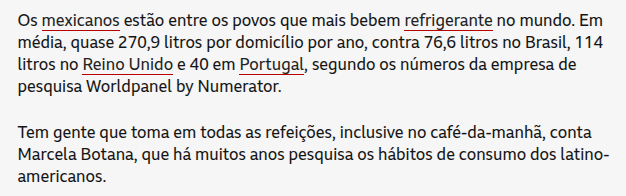

```{r setup, include=FALSE}
knitr::opts_chunk$set(echo = TRUE, warning = FALSE, message = FALSE, fig.retina = 2, fig.height=4.2)
suppressPackageStartupMessages(library(tidyverse))
empresas  <- read.csv("empresas.csv")
prefeitos <- read.csv("dados_prefeitos.csv")

setor_pct <- empresas |>
  mutate(setor = trimws(setor)) |>
  count(setor, sort = TRUE) |>
  mutate(pct = round(100 * n / sum(n), 1))

fat_regiao <- empresas |>
  group_by(regiao) |>
  summarise(faturamento_medio = mean(faturamento99), .groups = "drop")
```

class: inverse, center, middle

# Aula 03: Tabelas e gráficos

### Provocação · Teoria · Aplicação · Discussão · Uso do R

---

## Provocação 1: o mesmo dado, duas leituras

Faturamento médio de 1999 (`empresas.csv`), por região, eixo começando em **zero**:

```{r fig-eixo-zero, echo=FALSE, fig.height=3.4}
ggplot(fat_regiao, aes(x = fct_reorder(regiao, faturamento_medio), y = faturamento_medio)) +
  geom_col(fill = "#0d3b54") +
  labs(x = NULL, y = "Faturamento médio (R$)") +
  theme_minimal(base_size = 13)
```

--

Exatamente os **mesmos três números**, eixo começando perto do menor valor:

```{r fig-eixo-cortado, echo=FALSE, fig.height=3.4}
ggplot(fat_regiao, aes(x = fct_reorder(regiao, faturamento_medio), y = faturamento_medio)) +
  geom_col(fill = "#c9971e") +
  coord_cartesian(ylim = c(315000, 345000)) +
  labs(x = NULL, y = "Faturamento médio (R$)") +
  theme_minimal(base_size = 13)
```

--

Nenhum número está errado nos dois gráficos. O que muda, e por que isso importa para quem decide
com base neles?

---

## Provocação 2: qual fatia é maior?

```{r fig-pizza-setor, echo=FALSE, fig.height=4.6, fig.width=6}
ggplot(setor_pct, aes(x = "", y = pct, fill = setor)) +
  geom_col(width = 1, color = "white") +
  coord_polar(theta = "y") +
  geom_text(aes(label = paste0(pct, "%")), position = position_stack(vjust = 0.5), size = 3.5) +
  scale_fill_brewer(palette = "Blues", direction = -1) +
  labs(fill = "Setor", x = NULL, y = NULL) +
  theme_void(base_size = 12)
```

--

**Setor de atividade das 106 empresas da base.** "Industrial" e "Laminados plásticos" parecem do
mesmo tamanho? "Outros" e "Manilhas, canos e conexões"? Olhando só a pizza, dá para responder com
confiança?

---

class: inverse, center, middle

# Bloco 1: Teoria

---

## Tabela de frequências

Para \(f_i\) casos na categoria \(i\), de um total \(n=\sum_i f_i\):

$$
\text{Proporção}_i = \frac{f_i}{n}, \qquad \text{Porcentagem}_i = 100\times\frac{f_i}{n}\,\%
$$

--

Guarde essa definição, ela é exatamente o que está por trás da pizza do slide anterior, e é o que
o Bloco 2 vai reconstruir como tabela.

---

## Tabela de dupla entrada

Cruza duas variáveis qualitativas. Exemplo real: prefeitos eleitos em 2020, por região e sexo
(`dados_prefeitos.csv`).

```{r tab-dupla-prefeitos, echo=FALSE}
prefeitos |>
  filter(!is.na(sexo), !is.na(Regiao)) |>
  count(Regiao, sexo) |>
  pivot_wider(names_from = sexo, values_from = n, values_fill = 0)
```

--

Dividir pelo total da **linha** (não do total geral) dá a composição condicional daquela região,
essencial para comparar regiões de tamanhos diferentes: em toda linha, o número de prefeitas é uma
fração pequena do de prefeitos.

---

## Gráfico certo para cada tipo de variável

| Variável | Gráfico típico |
|---|---|
| Qualitativa (poucas categorias) | Barras, setores (pizza) |
| Quantitativa discreta (poucos valores) | Barras |
| Quantitativa contínua | Histograma |
| Série temporal (qualquer tipo) | Linha, respeitando a ordem no tempo |

--

**Erro comum**: usar gráfico de linha para conectar categorias *sem ordem numérica*, sugere uma
tendência que não existe.

--

**Uso correto**, três variáveis ao mesmo tempo (sexo, raça e o ano, esse sim uma sequência
temporal):

```{r fig-forca-trabalho, echo=FALSE, out.width="60%"}
knitr::include_graphics("images/forca_trabalho_raca_sexo.jpg")
```

---

class: inverse, center, middle

# Bloco 2: Aplicação

---

## O "gender pay gap" é um histograma disfarçado de notícia

```{r fig-gender-pay, echo=FALSE, out.width="65%"}
knitr::include_graphics("images/gender_pay_gap.png")
```

Eixo x = classes de diferença salarial (de ">50% mulheres ganham mais" a ">50% homens ganham
mais"); eixo y = número de empresas naquela classe. **É a mesma ideia da tabela de frequências**,
com barras no lugar de números: por isso "78% das empresas pagam mais aos homens" (a maioria das
barras está do lado roxo) é mais defensável que uma média isolada, ela usa a distribuição inteira,
não um único número resumo.

---

## Tabela de frequências: setor de atividade

A mesma base da pizza da Provocação 2, agora como tabela, dá para comparar "Industrial" e
"Laminados plásticos" sem adivinhar:

```{r tab-setor}
empresas |> count(setor, sort = TRUE) |>
  mutate(pct = round(100*n/sum(n), 1))
```

---

## Gráfico de barras

```{r grafico-barras}
ggplot(empresas, aes(x = fct_infreq(setor))) +
  geom_bar(fill = "#0d3b54") + coord_flip() +
  labs(x = NULL, y = "Nº de empresas") + theme_minimal(base_size = 13)
```

---

## Histograma

```{r histograma}
ggplot(empresas, aes(x = faturamento99)) +
  geom_histogram(bins = 20, fill = "#c9971e", color = "white") +
  labs(x = "Faturamento 1999 (R$ mil)", y = "Frequência") + theme_minimal(base_size = 13)
```

---

class: inverse, center, middle

# Bloco 3: Discussão (responda antes de ver o próximo bloco)

---

## Primeira rodada

**1.** Volte às duas Provocações de abertura (eixo cortado; pizza de 6 fatias). Para cada uma,
proponha o gráfico alternativo que resolveria o problema e explique, formalmente, por que resolve.

**2.** Veja a notícia abaixo, sobre consumo médio de refrigerante por domicílio/ano:

```{r fig-refri, echo=FALSE, out.width="55%"}

```

```{r fig-refri-grafico, echo=FALSE, fig.height=2.8, fig.width=5}
refri <- tibble(
  pais = c("México", "Reino Unido", "Brasil", "Portugal"),
  litros = c(270.9, 114, 76.6, 40)
)
ggplot(refri, aes(x = fct_reorder(pais, litros), y = litros)) +
  geom_col(fill = "#c9971e") + coord_flip() +
  labs(x = NULL, y = "Litros/domicílio/ano") + theme_minimal(base_size = 12)
```

Esse gráfico compara **médias entre países**. Que informação um histograma da distribuição de
consumo *dentro* de um único país acrescentaria, que a barra do valor médio esconde?

**3.** Refaça o histograma de faturamento com `bins = 5` e depois com `bins = 60`. Em cada extremo,
que conclusão errada um leitor apressado poderia tirar?

---

class: inverse, center, middle

# Bloco 4: Uso do R

---

## Tabela + gráfico, do dado bruto ao resultado

```{r r-completo, eval=FALSE}
library(tidyverse)
empresas <- read.csv("empresas.csv")

# tabela de frequências
empresas |> count(setor, sort = TRUE) |>
  mutate(pct = round(100*n/sum(n), 1))

# gráfico de barras ordenado por frequência
ggplot(empresas, aes(x = fct_infreq(setor))) +
  geom_col(fill = "#0d3b54") + coord_flip()

# histograma com número de classes ajustado
ggplot(empresas, aes(x = faturamento99)) +
  geom_histogram(bins = 20, fill = "#c9971e", color = "white")

# pizza (Provocação 2): por que é mais difícil de ler que a barra acima
ggplot(empresas, aes(x = "", fill = setor)) +
  geom_bar(position = "fill") + coord_polar(theta = "y")
```

`fct_infreq()` reordena os níveis de um fator pela frequência, essencial para gráficos de barra
legíveis. `bins =` no histograma sempre deve ser testado com mais de um valor. `coord_cartesian(ylim
= ...)` (Provocação 1) muda o que se vê sem mudar nenhum número, use com responsabilidade, ou
melhor, nunca em um gráfico de barras.

---

## Discussão final: trazendo tudo junto

**4.** Escolha entre as duas bases do curso (`empresas` ou `prefeitos`) uma variável e diga: (i)
que tabela você construiria, (ii) que gráfico acompanharia essa tabela, e (iii) uma manchete
enganosa que alguém *poderia* construir com o mesmo dado, mas um gráfico mal desenhado.

**5.** É possível que dois analistas, ambos "tecnicamente corretos", cheguem a gráficos que sugerem
conclusões opostas sobre o mesmo conjunto de dados? Dê um exemplo baseado no que foi visto hoje.

---

class: inverse, center, middle

# Próxima aula (31/08)

## Medidas de tendência central e suas relações
