```{r setup, include=FALSE}
knitr::opts_chunk$set(echo = TRUE, warning = FALSE, message = FALSE, fig.retina = 2,
                      fig.height = 4.2, dev.args = list(bg = "transparent"))
suppressPackageStartupMessages(library(tidyverse))
empresas  <- read.csv("empresas.csv")
prefeitos <- read.csv("dados_prefeitos.csv")
num_br <- scales::label_number(big.mark = ".", decimal.mark = ",")

setor_tab <- empresas |>
  mutate(setor = trimws(setor)) |>
  count(setor, sort = TRUE) |>
  mutate(pct = 100 * n / sum(n))

fat_regiao <- empresas |>
  group_by(regiao) |>
  summarise(faturamento_medio = mean(faturamento99), .groups = "drop") |>
  mutate(regiao = str_to_title(regiao))
```

class: inverse, center, middle

# Aula 03: Tabelas e gráficos

### Parte 1 (50 min) · intervalo · Parte 2 (50 min)

---

## Roteiro da aula (100 minutos)

.roteiro[

| Tempo | Parte 1: tabelas e frequências |
|:---|:---|
| 0–8 min | Provocações: os mesmos três números; qual fatia é maior? |
| 8–20 min | Representação tabular; distribuição de frequências |
| 20–32 min | Variáveis quantitativas em classes |
| 32–42 min | Razão e taxa de variação |
| 42–50 min | Tabela de dupla entrada |

| Tempo | Parte 2: gráficos e aplicações |
|:---|:---|
| 0–15 min | Colunas, barras, setores, cartograma, linhas e dispersão; qual gráfico? |
| 15–25 min | Histograma; histogramas nas notícias |
| 25–33 min | De volta à pizza; composição do PIB |
| 33–40 min | ENEM 2023; "gender pay gap" |
| 40–47 min | **Atividade**: instrução por sexo; força de trabalho |
| 47–50 min | Uso do R e resumo |

]

---

class: inverse, center, middle

# Parte 1: tabelas e frequências

### 50 minutos

---

## Provocação 1: os mesmos três números .tempo[0–8 min]

Faturamento médio (1999) das empresas da nossa base, por região.

.pull-left[
```{r fig-eixo-zero, echo=FALSE, fig.height=3.6, fig.width=4.6, out.width="100%"}
ggplot(fat_regiao, aes(x = fct_reorder(regiao, faturamento_medio), y = faturamento_medio)) +
  geom_col(fill = "#3d7a99") +
  scale_y_continuous(labels = num_br) +
  labs(x = NULL, y = "Faturamento médio", title = "Eixo começando em zero") +
  theme_minimal(base_size = 13)
```

]

.pull-right[
```{r fig-eixo-cortado, echo=FALSE, fig.height=3.6, fig.width=4.6, out.width="100%"}
ggplot(fat_regiao, aes(x = fct_reorder(regiao, faturamento_medio), y = faturamento_medio)) +
  geom_col(fill = "#c9971e") +
  coord_cartesian(ylim = c(315000, 345000)) +
  scale_y_continuous(labels = num_br) +
  labs(x = NULL, y = "Faturamento médio", title = "Eixo cortado") +
  theme_minimal(base_size = 13)
```

]

--

.caixa-discussao[
Nenhum número está errado. À direita, o Sudeste parece faturar **o triplo** do Sul; na verdade, a
diferença é de **7,7%** (342,5 mil contra 318,1 mil). Quem se beneficia de cada versão do gráfico?
]

---

## Provocação 2: qual fatia é maior?

.pull-left[
```{r fig-pizza-setor, echo=FALSE, fig.height=4.2, fig.width=5.2, out.width="100%"}
ggplot(setor_tab, aes(x = "", y = n, fill = setor)) +
  geom_col(width = 1, color = "white") +
  coord_polar(theta = "y") +
  scale_fill_brewer(palette = "Blues", direction = -1) +
  labs(fill = "Setor", x = NULL, y = NULL) +
  theme_void(base_size = 12)
```

]

.pull-right[
Setor de atividade das 106 empresas da base.

- "Industrial" e "Laminados plásticos": qual é maior?
- "Domiciliar e pessoal" ou "Outros"?


.caixa-discussao[
Olhando só a pizza, sem números, dá para responder com confiança? Guarde a resposta: vamos refazer
esse gráfico hoje de um jeito melhor.
]
]

---

## Representação tabular .tempo[8–20 min]

Uma **tabela** resume os dados por meio de **contagens** ou **agrupamentos**, distribuídos em
linhas e colunas de modo ordenado.

.pull-left-60[
<table style="font-size:0.9em; margin-top:0.2em;">
<caption style="caption-side:top; font-weight:bold; padding-bottom:0.3em;">Título: o quê? quando? onde?</caption>
<tr style="border-top:2px solid #333; border-bottom:1px solid #333;"><th>Tipo</th><th>Variável</th></tr>
<tr><td>A</td><td>12</td></tr>
<tr><td>B</td><td>18</td></tr>
<tr style="border-bottom:2px solid #333;"><td>C</td><td>10</td></tr>
</table>
<p style="font-size:0.7em; margin-left:2em;">Fonte: de onde os dados foram obtidos.</p>
]

.pull-right-40[.small[
- **Título:** responde **o quê?**, **quando?** e **onde?**
- **Cabeçalho:** especifica o conteúdo das colunas.
- **Corpo:** as linhas com os dados; cada cruzamento é uma **casa** (célula).
- **Fonte:** sempre abaixo da tabela.
- Tabelas são **fechadas** em cima e embaixo, mas **não** nas laterais.
]]

---

## Lendo uma tabela real

```{r tabela-jovens, echo=FALSE, out.width="56%", fig.align="center"}
knitr::include_graphics("images/tabela_jovens_ensino_medio.png")
```

.fonte[Fonte: Anuário Brasileiro da Educação Básica, 2021 (IBGE/PNAD Contínua; Todos Pela Educação).]


.caixa-aplicacao[
**O quê?** Jovens de 15 a 17 anos, por etapa de ensino. **Quando?** 2020. **Onde?** Brasil.
Colunas: frequência **absoluta** e **percentual**. 5,6% dos jovens (481.884) não estudam e não
concluíram o Ensino Médio.
]

---

## Distribuição de frequências

Interesse: conhecer o comportamento de uma variável, analisando a **ocorrência** de seus possíveis
valores.

- **Frequência absoluta:** número de observações em cada classe.
- **Frequência relativa:** proporção das observações em cada classe.

--

Seja \\(n\\) o total de observações e \\(m\\) o total da classe de interesse:

$$
\text{freq. absoluta} = m \qquad\qquad \text{freq. relativa} = \frac{m}{n} = \left(100\times\frac{m}{n}\right)\%
$$

--

.caixa-aplicacao[
Uma empresa tem 100 funcionários, e 30 ganham entre 1 e 2 salários mínimos. A frequência absoluta
dessa classe é **30** e a relativa é \\(30/100 = 0{,}30 = 30\\%\\).
]

---

## Frequência na notícia

```{r paho, echo=FALSE, out.width="64%", fig.align="center"}
knitr::include_graphics("images/frequencia_cancer_paho.png")
```

.fonte[Fonte: Organização Pan-Americana da Saúde (OPAS), 01/02/2024.]

--

.caixa-discussao[
Identifique na notícia uma **frequência absoluta** e uma **frequência relativa**. Com os números de
câncer de pulmão (2,5 milhões de casos, 12,4% do total), estime o **total** de novos casos de câncer
no mundo em 2022.
]

--

.caixa-resposta[
\\(n \approx 2{,}5 / 0{,}124 \approx 20\\) milhões de novos casos.
]

---

## Variáveis quantitativas: agrupar em classes .tempo[20–32 min]

Para variáveis quantitativas com muitos valores, **agrupamos** em intervalos (classes).

- As classes devem ser **disjuntas**: nenhuma observação pode pertencer a duas classes.
- Ex.: "1 a 3 filhos", "4 a 6 filhos", "7 ou mais filhos".
- Notação: \\([a, b)\\) inclui \\(a\\) e exclui \\(b\\).

--

Número de classes \\(k\\): uma regra usual é a **regra de Sturges**,

$$
k \approx 1 + \log\_2(n).
$$

Para as \\(n = 106\\) empresas: \\(k \approx 1 + 6{,}7 = 7{,}7\\), ou seja, 7 ou 8 classes.

---

## Tabela com classes: faturamento das 106 empresas

```{r tabela-classes, echo=FALSE}
empresas |>
  mutate(classe = cut(faturamento99 / 1000, breaks = seq(0, 700, 100), right = FALSE,
                      labels = paste0("[", seq(0, 600, 100), ", ", seq(100, 700, 100), ")"))) |>
  count(classe, name = "Freq. absoluta") |>
  mutate(`Freq. relativa (%)` = 100 * `Freq. absoluta` / sum(`Freq. absoluta`),
         `Freq. acumulada (%)` = cumsum(`Freq. relativa (%)`)) |>
  rename(`Faturamento 1999 (milhares)` = classe) |>
  knitr::kable(format = "html", digits = 1, format.args = list(decimal.mark = ","))
```

--

.caixa-aplicacao[
**76,4%** das empresas (81 de 106) faturaram menos de 400 mil. A classe mais frequente é
&#91;300, 400), com 43 empresas (40,6%).
]

---

## Frequência de uma tabela que já vem em classes

```{r tabela-municipios, echo=FALSE, out.width="62%", fig.align="center"}
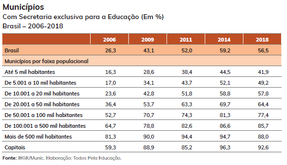
```

.fonte[Fonte: Anuário Brasileiro da Educação Básica, 2021 (IBGE/Munic; Todos Pela Educação).]

.caixa-discussao[
A variável "tamanho do município" foi **agrupada** em faixas populacionais. O que significa o
valor 41,9 na primeira linha de 2018? Por que não faz sentido somar a coluna de 2018?
]

---

## Razão e taxa de variação .tempo[32–42 min]

**Razão:** com \\(f\_1\\) casos em uma categoria e \\(f\_2\\) em outra, \\(\text{razão} = f\_1/f\_2\\)
("para cada 1 da categoria 2, há \\(f\_1/f\_2\\) da categoria 1").

--

**Taxa de variação:** para o valor de uma variável em dois instantes, \\(f\_1\\) (antes) e
\\(f\_2\\) (depois),

$$
\text{taxa de variação} = 100\times\frac{f\_2 - f\_1}{f\_1}\ \%.
$$

É a fórmula da **inflação** mês a mês: \\(f\_1\\) é o índice de preços do mês anterior e \\(f\_2\\), o
do mês atual.

--

**Exemplo:** a empresa 1 da base faturou 64.302 em 1998 e 74.392 em 1999:

$$
100\times\frac{74.392 - 64.302}{64.302} = 100\times\frac{10.090}{64.302} \approx 15{,}7\%.
$$

---

## Tabela de dupla entrada .tempo[42–50 min]

Cruza **duas** variáveis. Prefeitos dos 5.232 municípios de até 100 mil habitantes, por região e
sexo:

```{r tab-dupla-prefeitos, echo=FALSE}
prefeitos |>
  count(Regiao, sexo) |>
  pivot_wider(names_from = sexo, values_from = n) |>
  mutate(Total = Feminino + Masculino, `% mulheres` = 100 * Feminino / Total,
         Regiao = str_remove(Regiao, "^\\d - ")) |>
  rename(Região = Regiao) |>
  knitr::kable(format = "html", digits = 1, format.args = list(decimal.mark = ",", big.mark = "."))
```

--

.caixa-aplicacao[
O Nordeste tem **297** prefeitas e o Sudeste, **118**. Mas o Nordeste também tem mais municípios:
compare pelo **percentual da linha** (17,2% contra 7,8%), e não pelo total geral.
]

---

class: inverse, center, middle

# Intervalo

### 10 minutos

---

class: inverse, center, middle

# Parte 2: gráficos e aplicações

### 50 minutos

---

## Gráficos de colunas .tempo[0–15 min]

.pull-left[
```{r colunas, echo=FALSE, out.width="100%"}
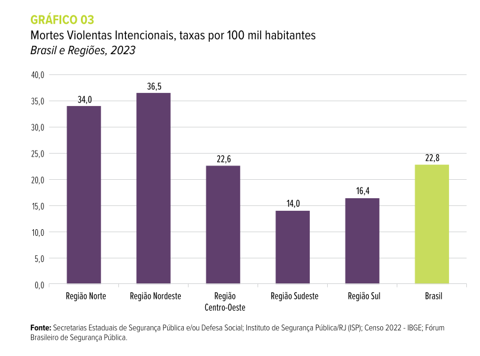
```

**Colunas:** compara valores de uma variável entre categorias.
]

.pull-right[
```{r colunas-emp, echo=FALSE, out.width="100%"}
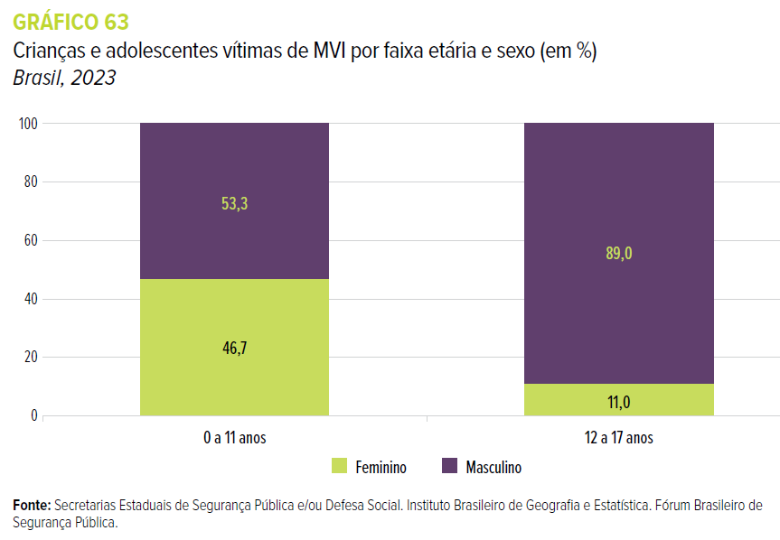
```

**Colunas empilhadas:** mostra a **composição** de cada categoria (cada coluna soma 100%).
]

.fonte[Fonte: Anuário Brasileiro de Segurança Pública, 2024. MVI: mortes violentas intencionais.]

---

## Gráficos de barras

.pull-left[
```{r barras, echo=FALSE, out.width="100%"}
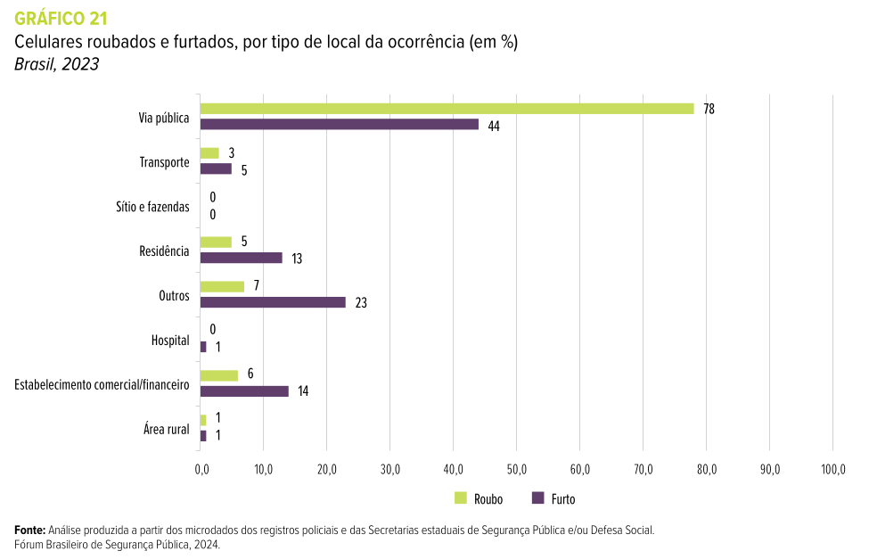
```

**Barras:** colunas "deitadas"; boas quando os **nomes** das categorias são longos.
]

.pull-right[
```{r barras-emp, echo=FALSE, out.width="100%"}
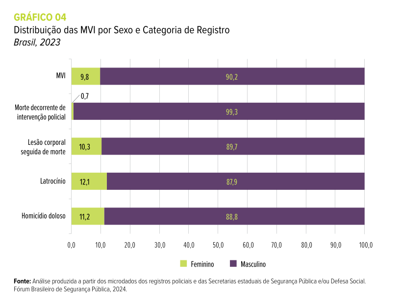
```

**Barras empilhadas:** composição por sexo em cada tipo de ocorrência.
]

.fonte[Fonte: Anuário Brasileiro de Segurança Pública, 2024.]

---

## Setores (pizza) e cartograma

.pull-left[
```{r setores, echo=FALSE, out.width="88%"}
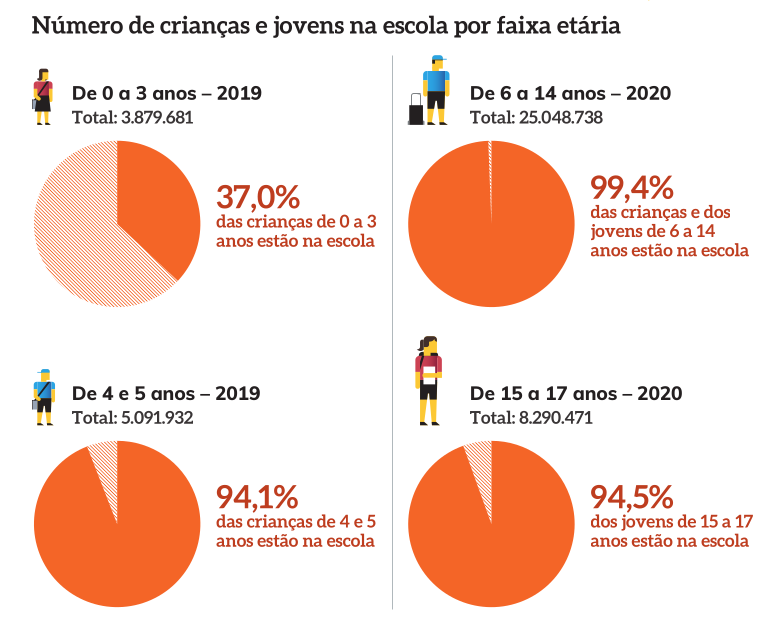
```

.fonte[Fonte: Anuário Brasileiro da Educação Básica, 2021.]

**Setores:** parte de um todo; funciona com **poucas** categorias e diferenças grandes.
]

.pull-right[
```{r cartograma, echo=FALSE, out.width="88%"}
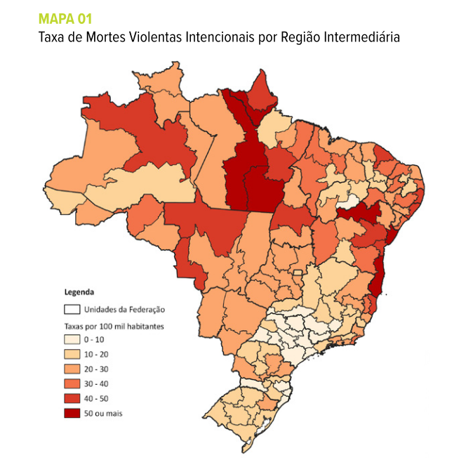
```

.fonte[Fonte: Anuário Brasileiro de Segurança Pública, 2024.]

**Cartograma:** valores associados a regiões **geográficas**.
]

---

## Linhas e dispersão

.pull-left[
```{r linhas, echo=FALSE, out.width="100%"}
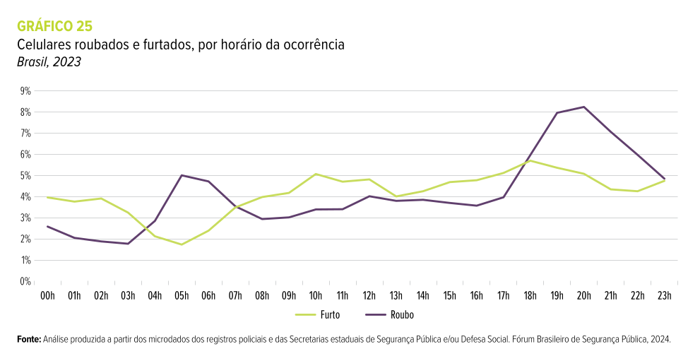
```

.fonte[Fonte: Anuário Brasileiro de Segurança Pública, 2024.]

**Linhas:** evolução ao longo de uma sequência **ordenada** (tempo, horário). Aqui: celulares
roubados atingem o pico às 20h.
]

.pull-right[
```{r dispersao, echo=FALSE, out.width="80%"}
knitr::include_graphics("images/grafico_dispersao_co2_pib.png")
```

.fonte[Fonte: The Washington Post (2023). Ponto verde: Brasil.]

**Dispersão:** relação entre **duas** variáveis quantitativas (PIB per capita e emissão de CO₂ per
capita).
]

---

## Qual gráfico para qual variável?

| Variável | Gráficos adequados |
|:---|:---|
| Qualitativa nominal | barras, colunas, setores (poucas categorias) |
| Qualitativa ordinal | barras ou colunas, **respeitando a ordem** das categorias |
| Quantitativa discreta (poucos valores) | colunas ou bastões |
| Quantitativa contínua | **histograma**, boxplot |
| Duas quantitativas | dispersão |
| Variável ao longo do tempo | linhas |

--

.caixa-aplicacao[
**Considerações sobre gráficos:** **simplicidade** ajuda a análise rápida; **clareza** evita
interpretações erradas; use **títulos informativos** (o quê? quando? onde?) e sempre cite a **fonte**.
]

---

## Histograma .tempo[15–25 min]

As frequências de variáveis **quantitativas** agrupadas em classes são representadas por um
**histograma**:

- colunas **justapostas** (sem espaço entre elas), uma por classe;
- a **base** de cada coluna é o intervalo da classe;
- a **área** de cada coluna é proporcional à frequência da classe.

--

```{r histograma-fat, echo=FALSE, fig.height=2.9, fig.width=9, out.width="88%"}
ggplot(empresas, aes(x = faturamento99 / 1000)) +
  geom_histogram(breaks = seq(0, 700, 100), fill = "#7fb8cf", color = "white", closed = "left") +
  stat_bin(breaks = seq(0, 700, 100), closed = "left", geom = "text", aes(label = after_stat(count)), vjust = -0.4) +
  scale_x_continuous(breaks = seq(0, 700, 100)) +
  labs(x = "Faturamento em 1999 (milhares)", y = "Nº de empresas") + theme_minimal(base_size = 13)
```

.small[Exatamente a tabela de classes de alguns slides atrás, agora em forma de gráfico.]

---

## Histogramas nas notícias

.pull-left[
```{r hist-bbc, echo=FALSE, out.width="100%"}
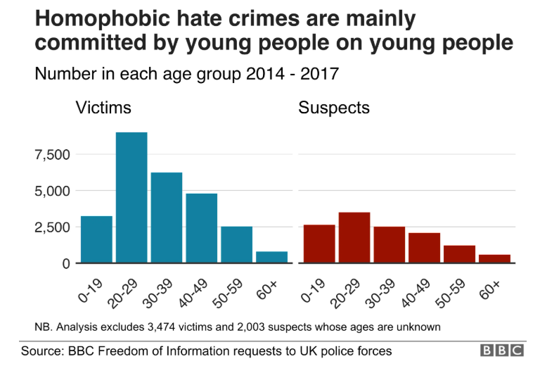
```

.fonte[Fonte: BBC News (2018).]

Crimes de homofobia no Reino Unido, por **faixa etária** de vítimas e suspeitos: a classe modal
dos dois é 20–29 anos.
]

.pull-right[
```{r piramide, echo=FALSE, out.width="72%"}
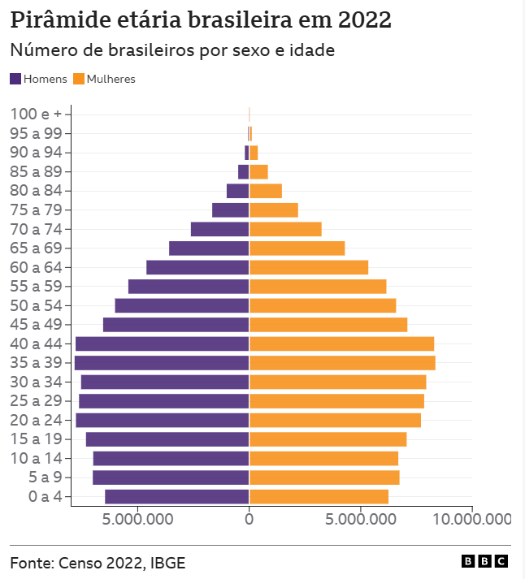
```

.fonte[Fonte: BBC News Brasil, com dados do Censo 2022 (IBGE).]

A **pirâmide etária** são dois histogramas "deitados", um para cada sexo.
]

---

## De volta à pizza: tabela e barras .tempo[25–33 min]

.pull-left-40[
```{r tab-setor, echo=FALSE}
setor_tab |> rename(Setor = setor, `Nº` = n, `%` = pct) |>
  knitr::kable(format = "html", digits = 1, format.args = list(decimal.mark = ","))
```

]

.pull-right-60[
```{r barras-setor, echo=FALSE, fig.height=3.7, fig.width=6, out.width="100%"}
ggplot(setor_tab, aes(x = n, y = fct_reorder(setor, n))) +
  geom_col(fill = "#3d7a99") +
  geom_text(aes(label = n), hjust = -0.3) +
  labs(x = "Nº de empresas", y = NULL) + xlim(0, 35) + theme_minimal(base_size = 13)
```

]

.clear[]

.caixa-aplicacao[
"Industrial" e "Laminados plásticos" **empatam** (17 empresas cada), e "Domiciliar e pessoal"
(16) supera "Outros" (13). Na pizza isso era quase impossível de ver.
]

---

## Dados reais: a composição do PIB em 2025

```{r pib-despesa, include=FALSE}
fmt <- function(x, d = 1) format(round(x, d), nsmall = d, decimal.mark = ",", big.mark = ".")
cor25 <- read.csv("pib_trimestral_correntes.csv")
a25 <- aggregate(valor_milhoes ~ componente, data = subset(cor25, trimestre %/% 100 == 2025), FUN = sum)
v <- function(n) a25$valor_milhoes[a25$componente == n]
pib <- v("PIB a preços de mercado")
desp <- data.frame(item = c("Consumo das famílias", "Consumo do governo", "Investimento (FBCF)", "Variação de estoques",
                            "Exportações", "Importações (−)"),
                   pct = 100 * c(v("Despesa de consumo das famílias"), v("Despesa de consumo da administração pública"),
                                 v("Formação bruta de capital fixo"), v("Variação de estoque"),
                                 v("Exportação de bens e serviços"), -v("Importação de bens e serviços (-)")) / pib)
```

.pull-left-60[
```{r pib-despesa-fig, echo=FALSE, fig.height=3.4, fig.width=6, out.width="100%"}
desp$item <- factor(desp$item, levels = desp$item[order(desp$pct)])
ggplot(desp, aes(item, pct, fill = pct > 0)) + geom_col(show.legend = FALSE) + coord_flip() +
  geom_text(aes(label = fmt(pct), hjust = ifelse(pct > 0, -0.15, 1.15)), size = 4) +
  scale_fill_manual(values = c("#c0392b", "#3b5bdb")) + scale_y_continuous(limits = c(-25, 75)) +
  labs(x = NULL, y = "% do PIB") + theme_minimal(base_size = 13)
```
]

.pull-right-40[
PIB de 2025: R$ `r fmt(pib / 1e6, 2)` trilhões, soma de consumo, investimento, estoques e exportações, **menos** importações.

.caixa-discussao[
Por que um gráfico de **pizza** não serve aqui? (Dica: a soma das fatias positivas é `r fmt(sum(desp$pct[desp$pct > 0]))`%.)
]
]

.fonte[Fonte: IBGE, Contas Nacionais Trimestrais, tabela 1846 (valores correntes, soma dos quatro trimestres).]

---

## ENEM 2023: lendo e checando um histograma .tempo[33–40 min]

.pull-left[
```{r enem, echo=FALSE, out.width="100%"}
knitr::include_graphics("images/exercicio_notas_enem2023.png")
```

.fonte[Fonte: Nexo Jornal (17/01/2024), dados do Inep.]
]

.pull-right[.small[
A reportagem afirma que **metade** dos participantes tirou entre 450 e 600 pontos. Vamos
conferir com as frequências do gráfico.

**Total** (soma de todas as colunas): \\(n = 2.734.100\\).

**Entre 450 e 600:** \\(474.387 + 548.739 + 497.944 = 1.521.070\\).

$$
\text{freq. relativa} = \frac{1.521.070}{2.734.100} \approx 0{,}556 = 55{,}6\%
$$

"Metade" é um arredondamento razoável. E "apenas 5% tirou mais de 700":

$$
\frac{100.396 + 27.342 + 2.094 + 2}{2.734.100} \approx 4{,}7\%
$$
]]

---

## "Gender pay gap": histograma na notícia

```{r gender, echo=FALSE, out.width="46%", fig.align="center"}
knitr::include_graphics("images/gender_pay_gap.png")
```

.fonte[Fonte: BBC News, dados de empresas do Reino Unido.]

.caixa-aplicacao[
Eixo horizontal: **classes** de diferença salarial entre homens e mulheres; eixo vertical: número de
empresas na classe. "78% das empresas pagam mais aos homens" é a **frequência relativa** das colunas à
direita do zero.
]

---

## Atividade 1: nível de instrução por sexo .tempo[40–47 min]

.pull-left[
```{r ex-instrucao, echo=FALSE, out.width="95%"}
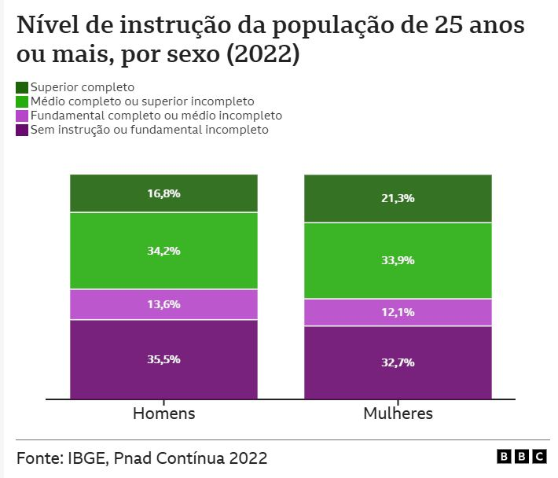
```

.fonte[Fonte: BBC News Brasil, com dados da PNAD Contínua 2022 (IBGE).]
]

.pull-right[
**a)** Que tipo de gráfico é apresentado?

**b)** Quais variáveis aparecem? Quais são os seus tipos?

**c)** Que conclusões podemos tirar do gráfico?


.caixa-resposta[
**a)** Colunas empilhadas (100%). **b)** Sexo (qualitativa nominal) e nível de instrução
(qualitativa **ordinal**). **c)** Entre pessoas de 25 anos ou mais, as mulheres têm mais ensino
superior completo (21,3% contra 16,8%) e menos pessoas sem instrução ou com fundamental incompleto
(32,7% contra 35,5%).
]
]

---

## Atividade 1 (cont.): força de trabalho por sexo e raça

.pull-left[
```{r ex-forca, echo=FALSE, out.width="100%"}
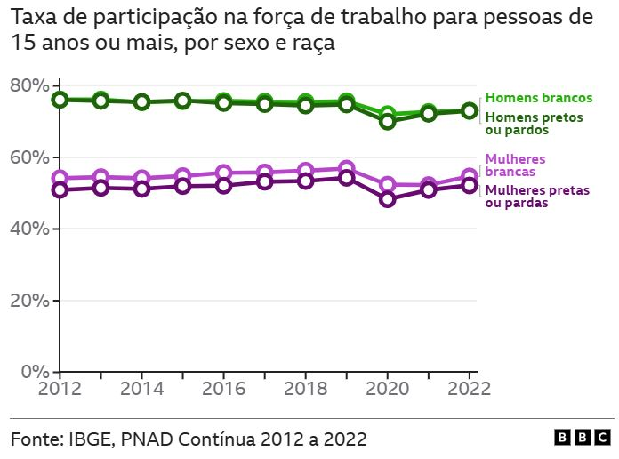
```

.fonte[Fonte: BBC News Brasil, com dados da PNAD Contínua 2012 a 2022 (IBGE).]
]

.pull-right[
**a)** Que tipo de gráfico é apresentado?

**b)** Quais variáveis aparecem? Quais são os seus tipos?

**c)** Que conclusões podemos tirar?


.caixa-resposta[
**a)** Linhas (série temporal). **b)** Ano (quantitativa discreta, ordenada no tempo), taxa de
participação (quantitativa contínua, em %), sexo e raça (qualitativas nominais). **c)** A
diferença entre **sexos** (cerca de 20 pontos) é muito maior que a diferença entre **raças**
dentro de cada sexo; há uma queda em 2020 (pandemia).
]
]

---

## Atividade 1 (cont.): discussão

**1.** Volte à Provocação 1. Proponha uma regra simples para decidir **quando** um eixo que não
começa em zero é aceitável (dica: gráfico de **colunas** vs. gráfico de **linhas**).

**2.** Refaça mentalmente o histograma do faturamento com classes de largura **10 mil** e depois
**300 mil**. Em cada caso extremo, que conclusão errada um leitor apressado poderia tirar?

**3.** Na tabela do Anuário da Educação (municípios com secretaria exclusiva), a porcentagem cresce
com o tamanho do município. Isso prova que municípios maiores **investem mais** em educação?

**4.** Escolha uma variável de `dados_prefeitos.csv`. Qual tabela você construiria? Qual gráfico?
Que manchete **enganosa** alguém poderia escrever com esse mesmo dado?

---

## Uso do R: tabelas de frequência .tempo[47–50 min]

```{r uso-r-1, eval=FALSE}
library(tidyverse)
empresas  <- read.csv("empresas.csv")
prefeitos <- read.csv("dados_prefeitos.csv")

table(empresas$setor)                        # frequência absoluta
prop.table(table(empresas$setor))            # frequência relativa
round(100 * prop.table(table(empresas$setor)), 1)

# tabela de dupla entrada e percentual por linha
tab <- table(prefeitos$Regiao, prefeitos$sexo)
tab
round(100 * prop.table(tab, margin = 1), 1)  # margin = 1: divide pelo total da linha

# classes para variável quantitativa
classes <- cut(empresas$faturamento99, breaks = seq(0, 700000, 100000), right = FALSE)
table(classes)
nclass.Sturges(empresas$faturamento99)       # regra de Sturges: 8
```

---

## Uso do R: gráficos

```{r uso-r-2, eval=FALSE}
# barras ordenadas por frequência
empresas |>
  count(setor) |>
  ggplot(aes(x = n, y = fct_reorder(setor, n))) +
  geom_col(fill = "steelblue") +
  labs(x = "Nº de empresas", y = NULL)

# histograma com classes de 100 mil
ggplot(empresas, aes(x = faturamento99)) +
  geom_histogram(breaks = seq(0, 700000, 100000), fill = "steelblue", color = "white") +
  labs(x = "Faturamento em 1999", y = "Nº de empresas")

# colunas empilhadas (100%) de sexo por região
ggplot(prefeitos, aes(x = Regiao, fill = sexo)) +
  geom_bar(position = "fill") +
  labs(x = NULL, y = "Proporção", fill = "Sexo")
```

.caixa-r[
**Exercício:** mude `breaks` no histograma para `seq(0, 700000, 25000)`. O que muda na leitura?
]

---

## Resumo

- **Tabelas** resumem os dados por contagens ou agrupamentos; têm título (o quê, quando, onde),
  cabeçalho, corpo e fonte.
- **Frequência absoluta** \\((m)\\) e **relativa** \\((m/n)\\); para variáveis quantitativas,
  agrupamos em **classes disjuntas**.
- **Tabela de dupla entrada:** compare pelo percentual da **linha** (ou da coluna), não pelo total.
- **Gráficos:** colunas, barras, setores, cartograma, linhas, dispersão, cada um para um tipo de
  pergunta; **histograma** para variáveis quantitativas agrupadas.
- Gráficos exigem **ter o público-alvo em mente**: simplicidade, clareza, títulos informativos e
  eixos honestos.

---

class: inverse, center, middle

# Próxima aula (31/08)

## Medidas de tendência central e suas relações
