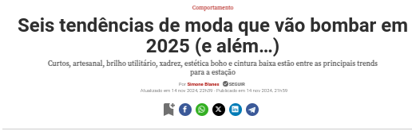
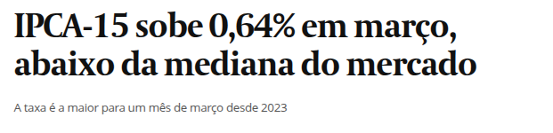
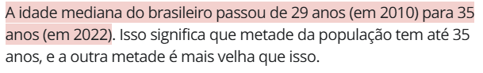
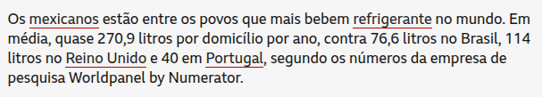

```{r setup, include=FALSE}
knitr::opts_chunk$set(echo = TRUE, warning = FALSE, message = FALSE, fig.retina = 2,
                      fig.height = 4.2, dev.args = list(bg = "transparent"))
suppressPackageStartupMessages(library(tidyverse))
empresas  <- read.csv("empresas.csv")
prefeitos <- read.csv("dados_prefeitos.csv")
num_br <- scales::label_number(big.mark = ".", decimal.mark = ",")
```

class: inverse, center, middle

# Aula 04: Medidas de tendência central

### Parte 1 (50 min) · intervalo · Parte 2 (50 min)

---

## Roteiro da aula (100 minutos)

.roteiro[

| Tempo | Parte 1: moda, mediana e média |
|:---|:---|
| 0–8 min | Provocação: três palavras que você lê todo dia |
| 8–15 min | Por que resumir? Moda |
| 15–30 min | Mediana: n ímpar ou par |
| 30–42 min | Média |
| 42–50 min | Média é sensível a extremos; mediana não |

| Tempo | Parte 2: usando as medidas |
|:---|:---|
| 0–10 min | **Atividade 1**: contribuições beneficentes; quando usar cada medida |
| 10–22 min | Forma dos dados; média a partir de tabelas |
| 22–30 min | Dados reais: PIB per capita, média simples e ponderada |
| 30–40 min | Notas em classes; prefeitos e municípios |
| 40–46 min | **Atividade 2**: discussão |
| 46–50 min | Uso do R e resumo |

]

---

class: inverse, center, middle

# Parte 1: moda, mediana e média

### 50 minutos

---

## Provocação: três palavras que você lê todo dia .tempo[0–8 min]

```{r manchete-moda, echo=FALSE, out.width="52%", fig.align="center"}

```

```{r manchete-mediana, echo=FALSE, out.width="52%", fig.align="center"}

```

```{r manchete-media, echo=FALSE, out.width="58%", fig.align="center"}

```

.fonte[Fontes: Veja (14/11/2024); Valor Econômico (27/03/2025); Agência Brasil (28/02/2025).]

---

## O que cada manchete quer dizer?

- A "moda" da Veja é o que **mais aparece**: é exatamente o sentido estatístico.
- "Abaixo da **mediana** do mercado": metade dos analistas previa uma inflação maior que um certo
  valor, e a outra metade, menor. Por que o jornal usa a mediana, e não a média das previsões?
- "Renda acima da **média** nacional": quantos estados você esperaria acima da média? Metade?

--

.caixa-discussao[
**Pergunta da aula.** Um sindicato cita a **mediana** dos salários de uma categoria; a empresa cita
a **média**. Os dois números vêm **dos mesmos dados**. Por que cada lado escolhe um, e quem está
"certo"?
]

---

## Por que resumir? .tempo[8–15 min]

- Uma **tabela de frequências** já resume os dados e é mais informativa que a lista bruta.
- Podemos resumir **ainda mais**, com um **único valor representativo**.

--

.caixa-aplicacao[
**Medidas de tendência central** (ou de posição central) são valores em torno dos quais os dados
tendem a se concentrar. As três principais são a **moda**, a **mediana** e a **média**.
]

--

Durante toda a aula vamos usar os mesmos cinco dados como exemplo:

$$
3,\quad 4,\quad 7,\quad 8,\quad 8
$$

---

## Moda

A **moda** \\((Mo)\\) é o valor **mais frequente** do conjunto de dados.

- Dados \\(3, 4, 7, 8, 8\\): o valor 8 aparece duas vezes, os demais uma vez. **Moda = 8**.

--

- Também serve para **variáveis qualitativas**: é a **categoria mais comum**. Entre as marcas de
  carros emplacados no Brasil em 2024, a mais vendida foi a Fiat: Fiat é a **moda** da variável
  "marca".

--

- Um conjunto pode ter **mais de uma moda** ou **nenhuma**:

| Dados | Moda |
|:---|:---|
| \\(2, 3, 3, 5, 7, 7\\) | 3 e 7 (**bimodal**) |
| \\(1, 4, 6, 9\\) | não há moda (todos com frequência 1) |

.caixa-discussao[
A moda é a **única** das três medidas que faz sentido para variável qualitativa **nominal**. Qual
seria a "média" da variável "marca do carro"?
]

---

## Mediana .tempo[15–30 min]

A **mediana** \\((Md)\\) é o valor que fica **no meio** dos dados **ordenados**, separando-os em
duas partes de mesmo tamanho.

- Dados \\(3, 4, 7, 8, 8\\): o valor do meio é **7**. Dois valores abaixo, dois acima.

--

```{r censo-mediana, echo=FALSE, out.width="75%", fig.align="center"}

```

.fonte[Fonte: G1, sobre o Censo 2022 do IBGE (27/10/2023).]

--

.caixa-aplicacao[
"Idade mediana de 35 anos" **não** quer dizer que a idade típica é 35, nem que 35 é a idade média:
quer dizer que **50%** da população tem **até** 35 anos.
]

---

## Cálculo da mediana: \\(n\\) ímpar ou par

**Passo 1.** Ordene os dados: \\(x\_{(1)} \le x\_{(2)} \le \cdots \le x\_{(n)}\\).

**Passo 2.** Use a posição central:

$$
Md = \begin{cases}
x\_{((n+1)/2)}, & \text{se } n \text{ for ímpar},\\\\[4pt]
\dfrac{x\_{(n/2)} + x\_{(n/2+1)}}{2}, & \text{se } n \text{ for par}.
\end{cases}
$$

--

.pull-left[
**\\(n\\) ímpar:** \\(30, 40, 70, 80, 80\\), \\(n = 5\\).

Posição \\((5+1)/2 = 3\\).

**Mediana = 70**.
]

.pull-right[
**\\(n\\) par:** \\(30, 40, 70, 80, 80, 100\\), \\(n = 6\\).

Posições \\(6/2 = 3\\) e \\(6/2+1 = 4\\).

**Mediana = \\((70 + 80)/2 = 75\\)**.
]

---

## Média .tempo[30–42 min]

A **média** (aritmética) \\(\bar x\\) é a **soma** dos valores dividida pelo **número** de valores.
Se temos \\(n\\) valores \\(x\_1, x\_2, \ldots, x\_n\\):

$$
\bar x = \frac{x\_1 + x\_2 + \cdots + x\_n}{n} = \frac{1}{n}\sum\_{i=1}^{n} x\_i
$$

--

Dados \\(3, 4, 7, 8, 8\\), com \\(n = 5\\):

$$
\bar x = \frac{3 + 4 + 7 + 8 + 8}{5} = \frac{30}{5} = 6
$$

--

```{r refri-media, echo=FALSE, out.width="68%", fig.align="center"}

```

.fonte[Fonte: BBC News Brasil.]

.small[Aqui a unidade é o **domicílio**: "270,9 litros por domicílio por ano" é o total consumido
dividido pelo número de domicílios.]

---

## Média é sensível a extremos; mediana não .tempo[42–50 min]

Troque o último 8 por **80** (um erro de digitação, ou um caso raro):

| Dados | Média | Mediana | Moda |
|:---|:---:|:---:|:---:|
| \\(3, 4, 7, 8, 8\\) | \\(30/5 = 6\\) | 7 | 8 |
| \\(3, 4, 7, 8, 80\\) | \\(102/5 = 20{,}4\\) | 7 | não há |

--

.caixa-aplicacao[
Um **único** valor mudou a média de 6 para 20,4, e ela deixou de representar **qualquer** dos cinco
dados. A mediana continuou 7: ela só depende de **qual valor está no meio**, não do tamanho dos
extremos.
]

--

.caixa-discussao[
Agora releia a manchete do IPCA-15: por que um jornal econômico prefere a **mediana** das previsões
de dezenas de analistas, e não a média?
]

---

class: inverse, center, middle

# Intervalo

### 10 minutos

---

class: inverse, center, middle

# Parte 2: usando as medidas

### 50 minutos

---

## Exercício: contribuições beneficentes .tempo[0–10 min]

Uma voluntária pede contribuições no bairro em que mora para um trabalho beneficente e recebe (em
reais):

$$
5,\quad 10,\quad 85,\quad 15,\quad 18,\quad 2,\quad 5
$$

**a)** Calcule a moda, a mediana e a média. **b)** Qual medida representa melhor as contribuições?

--

**Ordenando:** \\(2,\ 5,\ 5,\ 10,\ 15,\ 18,\ 85\\) \\((n = 7)\\).

- **Moda:** 5 (aparece duas vezes).
- **Mediana:** posição \\((7+1)/2 = 4\\) \\(\Rightarrow\\) **10**.
- **Média:** \\((2+5+5+10+15+18+85)/7 = 140/7 =\\) **20**.

--

.caixa-resposta[
**b)** A **mediana**. Seis das sete contribuições são de até 18 reais; a média (20) fica acima de
**todas** elas, puxada por uma única doação de 85 reais.
]

---

## Quando usar cada medida?

.pull-left[
**Moda**

- Mais simples; faz sentido em dados **discretos** ou **qualitativos**.
- Ex.: número de sapato mais vendido por uma loja; partido mais votado.

**Média**

- A mais usada e conhecida; usa **todos** os valores.
- Mais adequada para distribuições **simétricas**.
- Ex.: peso, altura, notas.
]

.pull-right[
**Mediana**

- Mais indicada para distribuições **assimétricas**.
- **Menos sensível** a valores extremos (outliers).
- Ex.: renda dos funcionários de uma empresa, PIB dos municípios, preço de imóveis.

.caixa-discussao[
Por que o IBGE divulga o **rendimento mediano** do trabalho, e não só o médio?
]
]

---

## As três medidas revelam a forma dos dados .tempo[10–22 min]

```{r formas, echo=FALSE, fig.height=3.1, fig.width=10, out.width="100%"}
set.seed(2026)
d <- tibble(
  forma = factor(rep(c("Assimétrica à esquerda", "Simétrica", "Assimétrica à direita"), each = 3000),
                 levels = c("Assimétrica à esquerda", "Simétrica", "Assimétrica à direita")),
  x = c(20 - rgamma(3000, 2.2, 0.35), rnorm(3000, 10, 2.5), rgamma(3000, 2.2, 0.35)))
moda_dens <- function(x) { dd <- density(x); dd$x[which.max(dd$y)] }
lin <- d |> group_by(forma) |>
  summarise(Média = mean(x), Mediana = median(x), Moda = moda_dens(x)) |>
  pivot_longer(-forma, names_to = "medida", values_to = "valor")
ggplot(d, aes(x)) +
  geom_histogram(aes(y = after_stat(density)), bins = 40, fill = "#dfe9ee", color = "white") +
  geom_vline(data = lin, aes(xintercept = valor, color = medida, linetype = medida), linewidth = 1.1) +
  scale_color_manual(values = c(Média = "#c0392b", Mediana = "#2e8b57", Moda = "#3b5bdb")) +
  facet_wrap(~forma, scales = "free_x") + labs(x = NULL, y = NULL, color = NULL, linetype = NULL) +
  theme_minimal(base_size = 13) + theme(legend.position = "top", axis.text.y = element_blank())
```

| Forma | Relação usual |
|:---|:---|
| Simétrica | média \\(\approx\\) mediana \\(\approx\\) moda |
| Assimétrica à direita (cauda longa de valores **altos**) | moda &lt; mediana &lt; média |
| Assimétrica à esquerda (cauda longa de valores **baixos**) | média &lt; mediana &lt; moda |

---

## Média a partir de uma tabela de frequências

Se os dados têm \\(k\\) valores possíveis \\(x\_1, \ldots, x\_k\\), com frequências absolutas
\\(n\_1, \ldots, n\_k\\) e relativas \\(f\_i = n\_i/n\\):

.pull-left-40[
| Valor | Freq. abs. | Freq. rel. |
|:---:|:---:|:---:|
| \\(x\_1\\) | \\(n\_1\\) | \\(f\_1 = n\_1/n\\) |
| \\(\vdots\\) | \\(\vdots\\) | \\(\vdots\\) |
| \\(x\_k\\) | \\(n\_k\\) | \\(f\_k = n\_k/n\\) |
| **Total** | \\(n\\) | \\(1\\) |
]

.pull-right-60[
$$
\bar x = \frac{1}{n}\sum\_{i=1}^{k} n\_i\, x\_i = \sum\_{i=1}^{k} f\_i\, x\_i
$$

Cada valor entra na soma **tantas vezes quanto aparece**: é uma média **ponderada** pelas
frequências.

**Moda** e **mediana** são calculadas como antes, lendo a tabela ordenada.
]

---

## Exemplo: número de filhos em 46 famílias

| Nº de filhos \\((x\_i)\\) | 0 | 1 | 2 | 3 | 4 | 5 | Total |
|:---|:---:|:---:|:---:|:---:|:---:|:---:|:---:|
| Freq. absoluta \\((n\_i)\\) | 9 | 10 | 14 | 9 | 3 | 1 | 46 |
| Freq. acumulada | 9 | 19 | 33 | 42 | 45 | 46 | |
| Posições ordenadas | 1–9 | 10–19 | 20–33 | 34–42 | 43–45 | 46 | |

--

- **Moda:** \\(x = 2\\), a maior frequência \\((14)\\).
- **Mediana:** \\(n = 46\\) é par \\(\Rightarrow\\) média das posições 23 e 24. As duas caem em
  "20–33", ou seja, em \\(x = 2\\). **Mediana = 2**.

--

- **Média:**

$$
\bar x = \frac{0\cdot 9 + 1\cdot 10 + 2\cdot 14 + 3\cdot 9 + 4\cdot 3 + 5\cdot 1}{46} = \frac{0 + 10 + 28 + 27 + 12 + 5}{46} = \frac{82}{46} \approx 1{,}78
$$

---

## Exercício: funcionários em 80 microempresas

Um escritório de contabilidade registrou o número de funcionários no setor administrativo de 80
microempresas:

| Nº de funcionários | 0 | 1 | 2 | 3 | 4 | 5 |
|:---|:---:|:---:|:---:|:---:|:---:|:---:|
| Freq. absoluta | 8 | 15 | 22 | 18 | 12 | 5 |

**a)** Moda. **b)** Mediana. **c)** Média.

--

.caixa-resposta[
**a)** Moda = 2 (frequência 22).

**b)** Acumuladas: 8, 23, **45**, 63, 75, 80. As posições 40 e 41 estão entre a 24ª e a 45ª, isto é,
em \\(x = 2\\): **mediana = 2**.

**c)** \\(\bar x = (0\cdot8 + 1\cdot15 + 2\cdot22 + 3\cdot18 + 4\cdot12 + 5\cdot5)/80 = 186/80 \approx 2{,}33\\).
]

---

## Dados reais: PIB per capita, média simples e ponderada .tempo[22–30 min]

```{r pib-uf, include=FALSE}
fmt <- function(x, d = 1) format(round(x, d), nsmall = d, decimal.mark = ",", big.mark = ".")
uf <- subset(read.csv("pib_uf.csv"), ano == 2021)
uf$pc <- 1000 * uf$pib / uf$populacao
br <- 1000 * sum(uf$pib) / sum(uf$populacao)
```

Com o PIB e a população de 2021 dos 27 estados:

.pull-left[
- **Média simples** dos PIBs per capita estaduais: R$ `r fmt(mean(uf$pc), 0)`.
- **Mediana** dos estados: R$ `r fmt(median(uf$pc), 0)`.
- **PIB per capita do Brasil** (PIB total ÷ população total): R$ `r fmt(br, 0)`.
]

.pull-right[
.caixa-aplicacao[
O PIB per capita do Brasil é uma **média ponderada** dos estados, com pesos iguais às populações:

$$
\bar x\_{\text{Brasil}} = \sum\_{i} \frac{\text{pop}\_i}{\text{pop total}}\\, \bar x\_i
$$
]
]

.clear[]

.caixa-discussao[
Por que a média ponderada fica **acima** da média simples? (Dica: onde estão os estados mais populosos?) Qual das três
medidas você usaria para dizer "o estado típico"?
]

.fonte[Fonte: IBGE, Contas Regionais (tabela 5938) e Estimativas de População (tabela 6579).]

---

## Dados em classes: notas da Prova 1 (2025.2) .tempo[30–40 min]

.pull-left[
```{r hist-notas, echo=FALSE, out.width="100%"}
knitr::include_graphics("images/notas_prova1_matf14.png")
```

.fonte[Dados de uma turma de MATF14.]

Quando só temos as **classes**, usamos o **ponto médio** \\(c\_i\\) de cada classe no lugar dos
valores.
]

.pull-right[.small[
| Classe | \\(c\_i\\) | \\(n\_i\\) | \\(c\_i\, n\_i\\) |
|:---:|:---:|:---:|:---:|
| &#91;1, 2) | 1,5 | 1 | 1,5 |
| &#91;2, 3) | 2,5 | 1 | 2,5 |
| &#91;3, 4) | 3,5 | 3 | 10,5 |
| &#91;4, 5) | 4,5 | 3 | 13,5 |
| &#91;5, 6) | 5,5 | 5 | 27,5 |
| &#91;6, 7) | 6,5 | 2 | 13,0 |
| &#91;7, 8) | 7,5 | 5 | 37,5 |
| &#91;8, 9) | 8,5 | 5 | 42,5 |
| &#91;9, 10&#93; | 9,5 | 7 | 66,5 |
| **Total** | | **32** | **215,0** |
]]

---

## Notas da Prova 1: as três medidas

- **Média (aproximada):** \\(\bar x \approx 215/32 \approx 6{,}72\\).

- **Classe mediana:** \\(n = 32\\), posições 16 e 17. Acumuladas: 1, 2, 5, 8, 13, **15, 20**, ...
  As posições 16 e 17 estão na classe **[7, 8)**, ponto médio 7,5.

- **Classe modal:** **[9, 10]**, com 7 alunos, ponto médio 9,5.

--

.caixa-aplicacao[
Média (6,72) &lt; mediana (≈ 7,5) &lt; moda (≈ 9,5): a distribuição das notas é **assimétrica à
esquerda**. A maioria foi bem (19 dos 32 alunos tiraram 6 ou mais), mas uma cauda de notas baixas
puxa a média para baixo.
]

.caixa-discussao[
Por que o resultado com classes é **aproximado**? Em que situação o ponto médio subestimaria a média
verdadeira de uma classe?
]

---

## Dados reais: prefeitos e municípios brasileiros

Base com os **5.232** municípios de até 100 mil habitantes e seus prefeitos (eleições de 2020).

```{r prefeitos-resumo, echo=FALSE}
moda <- function(x) { t <- table(x); names(t)[which.max(t)] }
tibble(Variável = c("Idade do prefeito (anos)", "População estimada em 2021 (hab.)"),
       Média = c(mean(prefeitos$idade), mean(prefeitos$Pop.estimada.2021)),
       Mediana = c(median(prefeitos$idade), median(prefeitos$Pop.estimada.2021))) |>
  knitr::kable(format = "html", digits = 1, format.args = list(big.mark = ".", decimal.mark = ","))
```

```{r prefeitos-hist, echo=FALSE, fig.height=2.9, fig.width=10, out.width="100%"}
p1 <- ggplot(prefeitos, aes(idade)) + geom_histogram(binwidth = 3, fill = "#cfe8ef", color = "white") +
  geom_vline(xintercept = mean(prefeitos$idade), color = "#c0392b", linewidth = 1) +
  geom_vline(xintercept = median(prefeitos$idade), color = "#2e8b57", linewidth = 1, linetype = "dashed") +
  labs(x = "Idade do prefeito", y = "Frequência") + theme_minimal(base_size = 12)
p2 <- ggplot(prefeitos, aes(Pop.estimada.2021)) + geom_histogram(binwidth = 4000, fill = "#cfe8ef", color = "white") +
  geom_vline(xintercept = mean(prefeitos$Pop.estimada.2021), color = "#c0392b", linewidth = 1) +
  geom_vline(xintercept = median(prefeitos$Pop.estimada.2021), color = "#2e8b57", linewidth = 1, linetype = "dashed") +
  scale_x_continuous(labels = num_br) + labs(x = "População do município (2021)", y = NULL) +
  theme_minimal(base_size = 12)
patchwork::wrap_plots(p1, p2)
```

.small[Linha vermelha cheia: **média**. Linha verde tracejada: **mediana**.]

---

## Lendo os dois histogramas

.caixa-aplicacao[
**Idade dos prefeitos:** média 49,8 e mediana 50 praticamente coincidem, e o histograma é quase
simétrico.

**População dos municípios:** a média (≈ 17,2 mil) é **57% maior** que a mediana (≈ 10,9 mil). Poucos
municípios grandes formam uma cauda longa à direita. A **metade** dos municípios tem menos de 11 mil
habitantes, e o "município médio" de 17 mil habitantes não descreve o município típico.
]

--

.caixa-discussao[
A moda da idade é 54 anos (190 prefeitos), mas 48 anos tem 186 e 43 anos tem 181. Faz sentido dizer
que "a idade típica de um prefeito é 54 anos"? O que isso mostra sobre a moda de uma variável com
muitos valores possíveis?
]

---

## Atividade 2: voltando ao sindicato e à empresa .tempo[40–46 min]

**1.** Salários costumam ter distribuição **assimétrica à direita** (poucos salários muito altos).
Qual é maior, a média ou a mediana? Por que a empresa prefere citar a média, e o sindicato, a
mediana?

**2.** Algum dos dois números é "errado"? Que **terceira** informação você pediria para decidir
qual deles descreve melhor o trabalhador típico?

--

**3.** Nas 106 empresas da nossa base, o **faturamento** tem média de 334,3 mil e mediana de
327,9 mil; o **número de empregados** tem média de 60,7 e mediana de 34. Em qual das duas
variáveis a média é enganosa como "valor típico"? O que você espera ver nos histogramas?

---

## Atividade 2 (cont.): médias nas notícias

**4.** "Nove estados e o DF têm renda por pessoa **acima da média nacional**." São 27 unidades da
federação. Se a média nacional fosse substituída pela **mediana das 27 UFs**, quantas estariam acima
dela? Por que a manchete com a média é mais informativa sobre **desigualdade regional**?

**5.** Um fundo anuncia "retorno **médio** de 15% ao ano nos últimos 5 anos". Os retornos foram
\\(-10\\%,\ 2\\%,\ 3\\%,\ 5\\%,\ 75\\%\\). Calcule a média e a mediana. Qual número você usaria para
decidir investir?

--

**6.** É possível que a moda fique **fora** do intervalo entre a média e a mediana? Teste com os
dados \\(1, 1, 1, 6, 7, 8, 9, 9\\).

--

.caixa-resposta[
**5.** Média \\(= 75/5 = 15\\%\\), mediana \\(= 3\\%\\): um único ano excepcional sustenta o anúncio.
**6.** Moda \\(= 1\\), mediana \\(= (6+7)/2 = 6{,}5\\), média \\(= 42/8 = 5{,}25\\): a moda fica **abaixo**
das duas, fora do intervalo.
]

---

## Uso do R: média, mediana e moda .tempo[46–50 min]

```{r uso-r-1, eval=FALSE}
x <- c(5, 10, 85, 15, 18, 2, 5)          # contribuições
mean(x)      # 20
median(x)    # 10
table(x)     # frequências: a moda é o valor de maior contagem

# o R não tem função pronta para a moda estatística (mode() é outra coisa!)
moda <- function(v) { t <- table(v); names(t)[t == max(t)] }
moda(x)      # "5"

# a partir de uma tabela de frequências
valores <- 0:5; freq <- c(9, 10, 14, 9, 3, 1)
weighted.mean(valores, w = freq)                 # 1,78
median(rep(valores, times = freq))               # reconstrói os 46 dados: 2
```

.caixa-r[
`mode(x)` no R devolve o **tipo** do objeto (`"numeric"`), não a moda. Cuidado com `NA`: use
`mean(x, na.rm = TRUE)`.
]

---

## Uso do R: com dados reais

```{r uso-r-2, eval=FALSE}
library(tidyverse)
prefeitos <- read.csv("dados_prefeitos.csv")
empresas  <- read.csv("empresas.csv")

prefeitos |> summarise(media = mean(Pop.estimada.2021), mediana = median(Pop.estimada.2021))

# média e mediana por região
prefeitos |> group_by(Regiao) |>
  summarise(media_idade = mean(idade), mediana_idade = median(idade))

# moda de uma variável qualitativa: a categoria mais frequente
prefeitos |> count(escolaridade, sort = TRUE) |> slice(1)

empresas |> summarise(media = mean(empregados99), mediana = median(empregados99))
```

.caixa-r[
**Exercício:** faça o histograma de `empregados99` com linhas verticais na média e na mediana
(`geom_vline()`) e compare com o de `faturamento99`.
]

---

## Resumo

- **Moda:** valor (ou categoria) mais frequente. Pode não existir ou não ser única. Única medida para
  variáveis nominais.
- **Mediana:** valor central dos dados **ordenados**; posição \\((n+1)/2\\) se \\(n\\) é ímpar, média
  das posições \\(n/2\\) e \\(n/2+1\\) se \\(n\\) é par. Robusta a valores extremos.
- **Média:** soma dos valores dividida por \\(n\\); usa todos os dados e é sensível a extremos.
- **Tabela de frequências:** \\(\bar x = \frac{1}{n}\sum n\_i x\_i = \sum f\_i x\_i\\); com classes,
  usa-se o ponto médio (resultado aproximado).
- **Forma:** simétrica \\(\Rightarrow\\) média ≈ mediana ≈ moda; cauda à direita \\(\Rightarrow\\) média
  &gt; mediana; cauda à esquerda \\(\Rightarrow\\) média &lt; mediana.

---

class: inverse, center, middle

# Próxima aula (02/09)

## Quantis, distância interquartílica e boxplots
