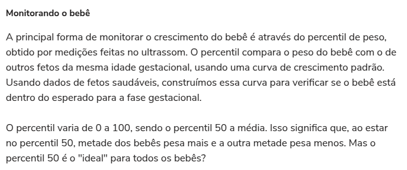
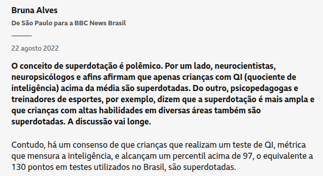
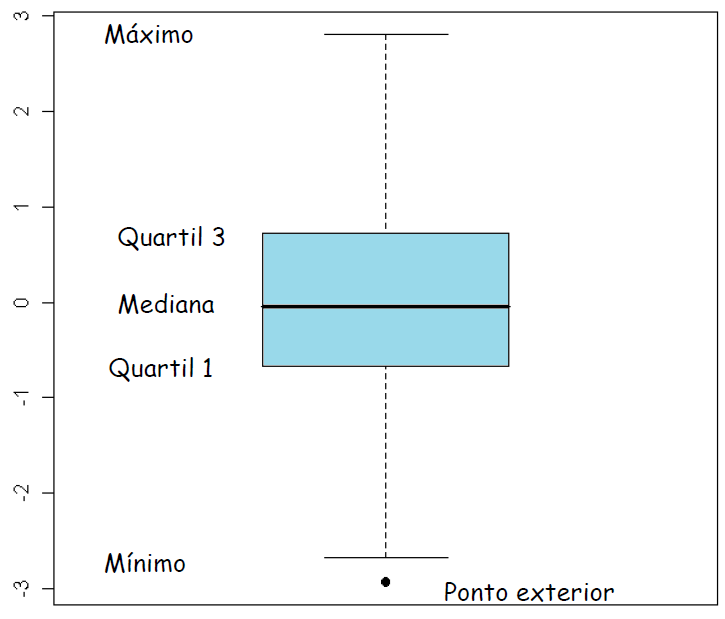
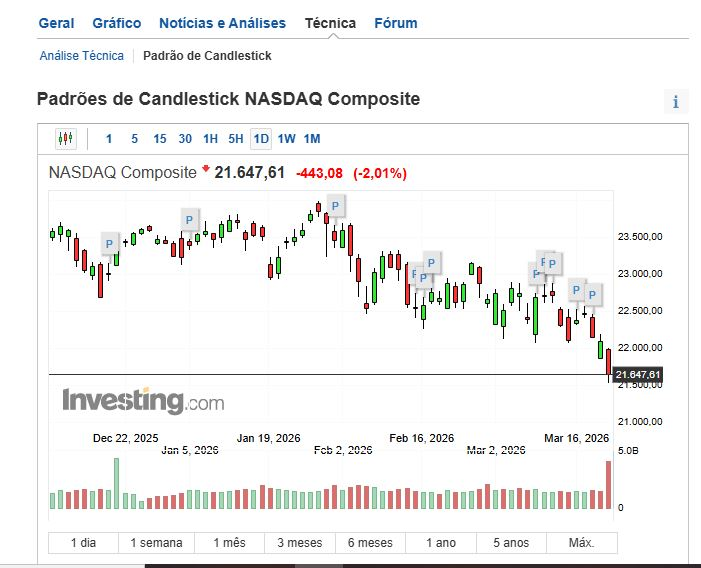
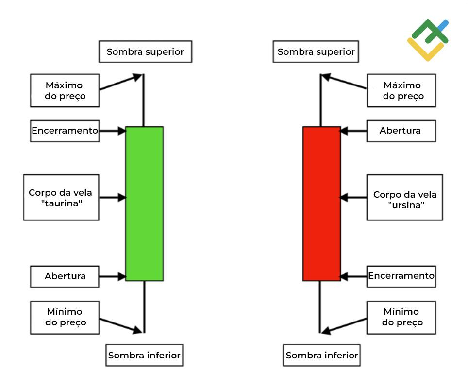
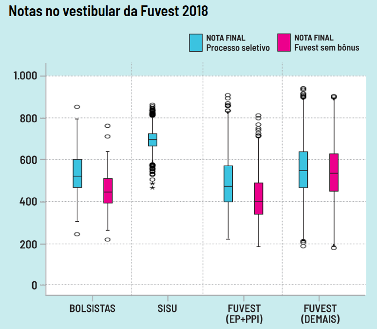

```{r setup, include=FALSE}
knitr::opts_chunk$set(echo = TRUE, warning = FALSE, message = FALSE, fig.retina = 2,
                      fig.height = 4.2, dev.args = list(bg = "transparent"))
suppressPackageStartupMessages({library(tidyverse); library(patchwork)})
empresas <- read.csv("empresas.csv")
empresas$porte <- factor(empresas$porte, levels = c("Pequena", "Média", "Grande"))
num_br <- scales::label_number(big.mark = ".", decimal.mark = ",")
```

class: inverse, center, middle

# Aula 05: Quantis, IQR e boxplot

### Parte 1 (50 min) · intervalo · Parte 2 (50 min)

---

## Roteiro da aula (100 minutos)

.roteiro[

| Tempo | Parte 1: percentis, quartis e IQR |
|:---|:---|
| 0–7 min | Provocações: bebê de percentil 6; qual agência é mais lenta? |
| 7–22 min | Separatrizes; algoritmo do percentil; exemplo na mão |
| 22–35 min | Quartis e distância interquartil; temperatura em Salvador |
| 35–50 min | **Atividade 1**: percentis nas notícias |

| Tempo | Parte 2: boxplot e aplicações |
|:---|:---|
| 0–15 min | Boxplot passo a passo; as duas agências |
| 15–25 min | Forma da distribuição; temperatura global; candlestick |
| 25–32 min | Exemplo com tabela; faturamento por porte |
| 32–38 min | Dados reais: boxplot do crescimento do PIB |
| 38–46 min | **Atividade 2**: FUVEST 2018; agências; critério do outlier |
| 46–50 min | Uso do R e resumo |

]

---

class: inverse, center, middle

# Parte 1: percentis, quartis e IQR

### 50 minutos

---

## Provocação: o que é um "bebê de percentil 6"? .tempo[0–7 min]

```{r noticia-bebe, echo=FALSE, out.width="85%", fig.align="center"}
knitr::include_graphics("images/percentil_bebe_noticia.png")
```

.fonte[Fonte: O Globo, 12/04/2023.]

--

- O bebê é "6% do tamanho normal"? É "6% menor que a média"?

- Ou significa que **6%** dos bebês na mesma idade gestacional são menores que ele, e **94%** são
  maiores?

--

Ao fim da aula você vai conseguir responder isso com precisão, e reconhecer quando uma notícia usa
"percentil" de forma errada.

---

## Uma segunda provocação: qual agência é mais lenta?

Tempo (em dias) de aprovação de crédito em 8 processos de duas agências bancárias:

| Agência | Tempos ordenados (dias) |
|:---:|:---|
| A | 3, 4, 5, 5, 6, 6, 7, 8 |
| B | 2, 3, 3, 4, 4, 5, 6, **45** |

--

Na agência B, um processo ficou 45 dias travado no jurídico.

- Pela **média**, A leva \\(44/8 = 5{,}5\\) dias e B leva \\(72/8 = 9\\) dias.
- Pela **amplitude total**, A tem \\(8-3=5\\) dias e B tem \\(45-2=43\\) dias.

.caixa-discussao[
As duas medidas dizem que B é "pior". Mas 7 dos 8 processos de B levaram **no máximo 6 dias**. Que
medida descreve o processo *típico* sem ser sequestrada por um único caso?
]

---

## Da mediana às separatrizes .tempo[7–22 min]

Já vimos que a **mediana** deixa 50% dos dados abaixo e 50% acima.

- Dados \\(3, 4, 7, 8, 8, 10\\) (\\(n = 6\\)): a mediana é \\((7+8)/2 = 7{,}5\\).

--

A mediana também é chamada de **quantil 50%** ou **percentil 50**. E se quisermos o valor que deixa
10%, 25% ou 90% dos dados abaixo?

--

.caixa-aplicacao[
**Percentil \\(P\\)%** é o número tal que \\(P\\)% dos valores observados estão abaixo dele.

- Dados \\(18, 21, 23, 24, 28\\): o percentil 50 é 23 e o percentil 25 é 21.
- Um bebê de **percentil 6** (em tamanho) é aquele em que **94%** dos bebês observados, na mesma
  idade gestacional, são **maiores**.
]

---

## Algoritmo geral do percentil \\(P\\)%

**Passo 1.** Ordene os \\(n\\) valores em ordem crescente.

**Passo 2.** Calcule a posição

$$
k = \frac{P \cdot n}{100}.
$$

**Passo 3.**

- Se \\(k\\) **for inteiro**: o percentil é a **média** entre os valores das posições \\(k\\) e
  \\(k+1\\).
- Se \\(k\\) **não for inteiro**: arredonde \\(k\\) **para cima**; o percentil é o valor nessa
  posição.

--

.caixa-discussao[
Por que tirar a média quando \\(k\\) é inteiro? Porque então exatamente \\(P\\)% dos dados ocupam as
posições \\(1, \ldots, k\\), e o "corte" fica **entre** a posição \\(k\\) e a \\(k+1\\).
]

---

## Exemplo na mão: \\(n = 5\\)

Dados ordenados: \\(x\_{(1)}=18,\ x\_{(2)}=21,\ x\_{(3)}=23,\ x\_{(4)}=24,\ x\_{(5)}=28\\).

| Percentil | \\(k = P\cdot n/100\\) | \\(k\\) inteiro? | Resultado |
|:---:|:---:|:---:|:---:|
| 25 | \\(25\times5/100 = 1{,}25\\) | não \\(\to\\) posição 2 | \\(21\\) |
| 40 | \\(40\times5/100 = 2\\) | sim \\(\to\\) média das posições 2 e 3 | \\((21+23)/2 = 22\\) |
| 50 | \\(50\times5/100 = 2{,}5\\) | não \\(\to\\) posição 3 | \\(23\\) |
| 75 | \\(75\times5/100 = 3{,}75\\) | não \\(\to\\) posição 4 | \\(24\\) |

--

```{r percentil-manual}
x <- c(18, 21, 23, 24, 28)
quantile(x, probs = c(0.25, 0.40, 0.50, 0.75), type = 2)  # type = 2: o algoritmo acima
```

---

## Quartis .tempo[22–35 min]

Os **quartis** dividem os dados ordenados em **quatro partes** de mesmo tamanho:

- \\(Q\_1\\) (percentil 25): deixa 25% dos valores abaixo dele;
- \\(Q\_2\\) (percentil 50): a **mediana**;
- \\(Q\_3\\) (percentil 75): deixa 75% dos valores abaixo dele.

--

Leituras equivalentes, úteis para interpretar gráficos e notícias:

.pull-left[
- 75% dos valores estão **acima** de \\(Q\_1\\);
- 25% dos valores estão **acima** de \\(Q\_3\\);
]
.pull-right[
- 50% dos valores estão **entre** \\(Q\_1\\) e \\(Q\_3\\);
- 25% dos valores estão entre \\(Q\_1\\) e \\(Q\_2\\).
]

.clear[]

---

## Distância interquartil

$$
IQR = Q\_3 - Q\_1
$$

\\(Q\_2\\) mede o **centro**; a distância entre \\(Q\_1\\) e \\(Q\_3\\) mede a **variabilidade** dos 50%
centrais. Quanto maior o \\(IQR\\), mais espalhados estão os dados.

--

**Exemplo:** notas de duas turmas com \\(n = 8\\) alunos, já ordenadas.

| Turma | Notas | \\(Q\_1\\) (\\(k=2\\)) | Mediana (\\(k=4\\)) | \\(Q\_3\\) (\\(k=6\\)) | \\(IQR\\) |
|:---:|:---|:---:|:---:|:---:|:---:|
| X | 5, 6, 6, 7, 7, 8, 8, 9 | \\((6+6)/2=6\\) | \\((7+7)/2=7\\) | \\((8+8)/2=8\\) | \\(2\\) |
| Y | 2, 3, 5, 7, 7, 9, 10, 10 | \\((3+5)/2=4\\) | \\((7+7)/2=7\\) | \\((9+10)/2=9{,}5\\) | \\(5{,}5\\) |

--

.caixa-aplicacao[
Mesma mediana (7), mas os 50% centrais da turma Y ocupam uma faixa **quase três vezes maior**
(\\(5{,}5\\) contra \\(2\\) pontos): a turma Y é bem mais **heterogênea**.
]

---

## Temperatura em Salvador (agosto de 2024)

.pull-left-60[
```{r salvador-hist, echo=FALSE, out.width="82%"}
knitr::include_graphics("images/temperatura_salvador_quartis.png")
```

]

.pull-right-40[
- \\(Q\_1 = 23{,}2\\) °C
- \\(Q\_2 = 24{,}1\\) °C
- \\(Q\_3 = 25{,}6\\) °C

**50%** das temperaturas registradas ficaram entre 23,2 °C e 25,6 °C.

\\(IQR = 25{,}6 - 23{,}2 = 2{,}4\\) °C.

.caixa-discussao[
Note que \\(Q\_2 - Q\_1 = 0{,}9\\) e \\(Q\_3 - Q\_2 = 1{,}5\\): a metade superior está mais
espalhada. O histograma mostra isso?
]
]

.clear[]

.fonte[Registros horários da estação do INMET em Salvador.]

---

## Percentil nas notícias: exercício 1 .tempo[35–50 min]

A notícia abaixo define "percentil 50". A definição está correta? Se não, qual é o erro?

```{r noticia-terra, echo=FALSE, out.width="80%", fig.align="center"}

```

.fonte[Fonte: Terra, "Percentil fetal: quando o crescimento do bebê é um alerta".]

--

.caixa-resposta[
**Erro:** o percentil 50 é a **mediana**, não a média. A frase seguinte da própria notícia ("metade
dos bebês pesa mais e a outra metade pesa menos") descreve a mediana. Média e mediana só coincidem
em distribuições simétricas.
]

---

## Percentil nas notícias: exercício 2

Qual é o significado do percentil que aparece na notícia?

```{r noticia-bbc, echo=FALSE, out.width="62%", fig.align="center"}

```

.fonte[Fonte: BBC News Brasil, 22/08/2022.]

--

.caixa-resposta[
"Percentil acima de 97" significa que a criança teve pontuação **maior que a de 97%** das pessoas
avaliadas no teste. Apenas cerca de **3%** ficam acima desse corte, que corresponde a 130 pontos de
QI nos testes usados no Brasil.
]

---

class: inverse, center, middle

# Intervalo

### 10 minutos

---

class: inverse, center, middle

# Parte 2: boxplot e aplicações

### 50 minutos

---

## Boxplot (diagrama de caixa) .tempo[0–15 min]

.pull-left[
Um gráfico construído a partir dos quartis:

- a **linha central** é a mediana \\(Q\_2\\): tendência central;
- a **altura da caixa** é o \\(IQR\\): variabilidade;
- caixa com lados de comprimentos **iguais** em torno da mediana sugere **simetria**;
- pontos além dos **limites** são **observações atípicas** (outliers).
]

.pull-right[
```{r anatomia, echo=FALSE, out.width="95%"}

```

.fonte[Notas de aula de MAT236 (UFBA).]
]

---

## Como construir um boxplot, passo a passo

**1.** Calcule \\(Q\_1\\), \\(Q\_2\\), \\(Q\_3\\) e \\(IQR = Q\_3 - Q\_1\\).

**2.** Calcule os **limites** (cercas):

$$
LI = Q\_1 - 1{,}5 \times IQR \qquad\qquad LS = Q\_3 + 1{,}5\times IQR
$$

**3.** Desenhe a caixa de \\(Q\_1\\) a \\(Q\_3\\), com uma linha na mediana.

**4.** Os "bigodes" vão da caixa até o **menor** e o **maior** valor observado que **ainda estão
dentro** de \\([LI,\ LS]\\).

**5.** Cada valor fora de \\([LI,\ LS]\\) é marcado **individualmente** como um ponto: é um candidato a
outlier.

--

.caixa-discussao[
O bigode **não** vai até \\(LI\\) ou \\(LS\\): ele para no último dado real dentro dos limites. Esse
é um erro comum na prova!
]

---

## Construindo na mão: as duas agências

.pull-left[
**Agência B:** \\(2, 3, 3, 4, 4, 5, 6, 45\\), \\(n=8\\).

- \\(Q\_1\\): \\(k = 25\cdot 8/100 = 2\\), inteiro: \\((3+3)/2 = 3\\)
- \\(Q\_2\\): \\(k = 4\\), inteiro: \\((4+4)/2 = 4\\)
- \\(Q\_3\\): \\(k = 6\\), inteiro: \\((5+6)/2 = 5{,}5\\)
- \\(IQR = 5{,}5 - 3 = 2{,}5\\)
- \\(LI = 3 - 3{,}75 = -0{,}75\\)
- \\(LS = 5{,}5 + 3{,}75 = 9{,}25\\)

45 &gt; 9,25: **outlier**. O bigode superior para em **6**.
]

--

.pull-right[
**Agência A:** \\(3, 4, 5, 5, 6, 6, 7, 8\\).

- \\(Q\_1 = (4+5)/2 = 4{,}5\\), \\(Q\_2 = (5+6)/2 = 5{,}5\\)
- \\(Q\_3 = (6+7)/2 = 6{,}5\\), \\(IQR = 2\\)
- \\(LI = 1{,}5\\), \\(LS = 9{,}5\\): nenhum outlier.

```{r agencias-box, echo=FALSE, fig.height=2.6, fig.width=5, out.width="100%"}
ag <- tibble(agencia = rep(c("A", "B"), each = 8),
             dias = c(3, 4, 5, 5, 6, 6, 7, 8, 2, 3, 3, 4, 4, 5, 6, 45))
ggplot(ag, aes(x = agencia, y = dias)) +
  geom_boxplot(fill = "#cfe8ef", outlier.color = "#c0392b", outlier.size = 2.5) +
  coord_flip() + labs(x = "Agência", y = "Dias até a aprovação") +
  theme_minimal(base_size = 12)
```

]

---

## O boxplot mostra a forma da distribuição .tempo[15–25 min]

```{r formas, echo=FALSE, fig.height=4.3, fig.width=10, out.width="100%"}
set.seed(2026)
formas <- tibble(
  forma = factor(rep(c("Assimétrica à esquerda", "Simétrica", "Assimétrica à direita"), each = 400),
                 levels = c("Assimétrica à esquerda", "Simétrica", "Assimétrica à direita")),
  x = c(10 - rgamma(400, 2, 0.8), rnorm(400, 5, 1.2), rgamma(400, 2, 0.8)))
h <- ggplot(formas, aes(x)) + geom_histogram(bins = 25, fill = "#cfe8ef", color = "white") +
  facet_wrap(~forma, scales = "free_x") + labs(x = NULL, y = "Frequência") +
  theme_minimal(base_size = 12)
bx <- ggplot(formas, aes(x = x, y = "")) + geom_boxplot(fill = "#7fb8cf", outlier.size = 0.8) +
  facet_wrap(~forma, scales = "free_x") + labs(x = NULL, y = NULL) +
  theme_minimal(base_size = 12) + theme(strip.text = element_blank())
h / bx + plot_layout(heights = c(2, 1))
```

Na assimétrica à direita, a mediana fica **mais perto de \\(Q\_1\\)**, o bigode direito é **mais
longo** e os pontos atípicos aparecem **à direita**.

---

## Boxplots lado a lado: 85 anos de temperatura global

```{r ft-box, echo=FALSE, out.width="78%", fig.align="center"}
knitr::include_graphics("images/boxplot_temperatura_global_ft.png")
```

.fonte[Fonte: Financial Times. Cada caixa resume as anomalias diárias de temperatura de um ano (em relação à média pré-industrial).]

.small[
Cada ano vira **uma** caixa. A sequência de caixas mostra, ao mesmo tempo, a **tendência** da
mediana (subindo desde 1980) e a **variabilidade** dentro de cada ano.
]

---

## Boxplot ou gráfico de velas (candlestick)?

.pull-left[
```{r nasdaq, echo=FALSE, out.width="100%"}

```

.fonte[Fonte: Investing.com, índice NASDAQ Composite.]

.small[
Em finanças, o **gráfico de velas** resume o preço de um ativo em cada período (dia, semana) de
uma **série temporal**.
]
]

.pull-right[
```{r velas, echo=FALSE, out.width="88%"}

```

.fonte[Fonte: LiteFinance.]
]

---

## Candlestick não é boxplot

| | Boxplot | Vela (candlestick) |
|:---|:---|:---|
| Corpo | de \\(Q\_1\\) a \\(Q\_3\\) (50% centrais) | da **abertura** ao **encerramento** do preço |
| Linha no corpo | mediana | não existe |
| Hastes | até o último dado dentro dos limites | até o **máximo** e o **mínimo** do período |
| Cor | não tem significado | verde: fechou em **alta**; vermelho: em **baixa** |
| Pontos isolados | outliers | não existem |

.caixa-discussao[
Os dois têm "caixa e hastes", mas respondem perguntas diferentes: o boxplot resume a
**distribuição** de muitos valores; a vela resume a **trajetória** do preço em um período.
]

---

## Exemplo completo com tabela de frequências .tempo[25–32 min]

.pull-left-40[
| \\(X\\) | Freq. absoluta |
|:---:|:---:|
| 9 | 1 |
| 8 | 5 |
| 0 | 1 |
| 2 | 2 |
| 6 | 1 |
| 3 | 4 |
| 4 | 1 |
]

.pull-right-60[
**a)** Moda de \\(X\\). **b)** \\(Q\_1\\), \\(Q\_2\\), \\(Q\_3\\). **c)** Média. **d)** Há outliers?

**Passo 0: ordene a tabela.** São \\(n = 1+5+1+2+1+4+1 = 15\\) valores:

| Valor | 0 | 2 | 3 | 4 | 6 | 8 | 9 |
|:---|:---:|:---:|:---:|:---:|:---:|:---:|:---:|
| Freq. | 1 | 2 | 4 | 1 | 1 | 5 | 1 |
| Posições | 1 | 2–3 | 4–7 | 8 | 9 | 10–14 | 15 |

**a)** Moda \\(= 8\\) (frequência 5, a maior).
]

---

## Exemplo completo (continuação)

**b)** Quartis, com \\(n = 15\\):

- \\(Q\_1\\): \\(k = 25\cdot15/100 = 3{,}75 \to\\) posição 4 \\(\to Q\_1 = 3\\)
- \\(Q\_2\\): \\(k = 50\cdot15/100 = 7{,}5 \to\\) posição 8 \\(\to Q\_2 = 4\\)
- \\(Q\_3\\): \\(k = 75\cdot15/100 = 11{,}25 \to\\) posição 12 \\(\to Q\_3 = 8\\)

--

**c)** Média, ponderando cada valor pela sua frequência:

$$
\bar x = \frac{0\cdot1 + 2\cdot2 + 3\cdot4 + 4\cdot1 + 6\cdot1 + 8\cdot5 + 9\cdot1}{15} = \frac{75}{15} = 5
$$

--

**d)** \\(IQR = 8 - 3 = 5\\), \\(LI = 3 - 7{,}5 = -4{,}5\\) e \\(LS = 8 + 7{,}5 = 15{,}5\\). Todos
os valores (de 0 a 9) estão dentro: **nenhum outlier**.

```{r tabela-freq}
x <- rep(c(0, 2, 3, 4, 6, 8, 9), times = c(1, 2, 4, 1, 1, 5, 1))
c(quantile(x, c(.25, .5, .75), type = 2), media = mean(x))
```

---

## Faturamento de 106 empresas por porte

```{r boxplot-porte, echo=FALSE, fig.height=3.7, fig.width=9, out.width="92%"}
ggplot(empresas, aes(x = porte, y = faturamento99, fill = porte)) +
  geom_boxplot(show.legend = FALSE, outlier.color = "#c0392b", outlier.size = 2.5) +
  scale_fill_manual(values = c("#cfe8ef", "#7fb8cf", "#3d7a99")) +
  scale_y_continuous(labels = num_br) +
  labs(x = "Porte", y = "Faturamento em 1999") + theme_minimal(base_size = 14)
```

```{r quartis-porte, echo=FALSE}
empresas |> group_by(porte) |>
  summarise(n = n(), Q1 = quantile(faturamento99, .25), mediana = median(faturamento99),
            Q3 = quantile(faturamento99, .75), IQR = IQR(faturamento99)) |>
  knitr::kable(format = "html", format.args = list(big.mark = ".", decimal.mark = ","), digits = 0)
```

---

## Lendo o boxplot das empresas

.caixa-aplicacao[
- A **mediana** cresce com o porte: empresa grande típica fatura mais que a média, que fatura mais
  que a pequena.
- As caixas **quase não se sobrepõem**: porte é um bom resumo do faturamento típico.
- Mas a **variabilidade** não é a mesma: compare o \\(IQR\\) de cada grupo na tabela.
- Pontos vermelhos: empresas com faturamento atípico **para o seu porte**, não para a amostra toda.
]

.caixa-discussao[
Um banco que concede crédito só com base no porte está ignorando a dispersão **dentro** de cada
grupo. Que empresa "Média" do gráfico receberia crédito demais? E de menos?
]

---

## Dados reais: o boxplot do crescimento do PIB .tempo[32–38 min]

```{r pib-box, include=FALSE}
fmt <- function(x, d = 1) format(round(x, d), nsmall = d, decimal.mark = ",", big.mark = ".")
tx <- read.csv("pib_trimestral_taxas.csv")
qq <- subset(tx, componente == "PIB a preços de mercado" & grepl("imediatamente", taxa))
qs <- quantile(qq$valor_pct, c(0.25, 0.5, 0.75), type = 2)
```

.pull-left-60[
```{r pib-box-fig, echo=FALSE, fig.height=2.6, fig.width=6.4, out.width="100%"}
ggplot(qq, aes(x = valor_pct, y = "")) + geom_boxplot(fill = "#f4e04d", outlier.color = "#c0392b", outlier.size = 3) +
  annotate("text", x = c(-8.9, 7.9), y = 1.25, label = c("2º tri 2020", "3º tri 2020"), hjust = c(0, 1), size = 4) +
  labs(x = "Crescimento do PIB contra o trimestre anterior (%)", y = NULL) + theme_minimal(base_size = 13)
```
]

.pull-right-40[
Trimestres de 1996 a 2026:

- \\(Q\_1\\) = `r fmt(qs[1])`%, mediana `r fmt(qs[2])`%, \\(Q\_3\\) = `r fmt(qs[3])`%.
- Distância interquartílica: `r fmt(qs[3] - qs[1])` ponto percentual.
- Atípicos: quedas em 1998, 2008, 2015 e na pandemia; altas em 1996 e na retomada de 2020.
]

.clear[]

.caixa-discussao[
A queda de 8,9% no 2º trimestre de 2020 é um "erro" a ser descartado? O que o boxplot ganharia e perderia sem ela?
]

.fonte[Fonte: IBGE, Contas Nacionais Trimestrais, tabela 5932.]

---

## Atividade 2: leitura de boxplot (FUVEST 2018) .tempo[38–46 min]

.pull-left-60[
```{r fuvest, echo=FALSE, out.width="93%"}

```

.fonte[Fonte: Jornal da USP, "Estudo investiga se bolsas podem impactar desempenho acadêmico de alunos".]
]

.pull-right-40[.small[
Notas no vestibular da USP em 2018. Azul: **nota final no processo seletivo** (com bônus). Rosa:
**nota na Fuvest sem o bônus**.

**a)** Qual grupo e tipo de nota tem a **mediana mais alta**?

**b)** Qual grupo e tipo de nota tem a **menor variabilidade**?

**c)** Entre as notas do processo seletivo, qual grupo teve a **nota mais alta**?

**d)** Entre as notas Fuvest sem bônus, qual grupo tem o **menor percentil 25**?

**e)** O bônus ajudou os bolsistas?
]]

---

## Atividade 2: respostas comentadas

.caixa-resposta[
**a)** A nota final do **SISU**: sua mediana (perto de 700) está acima de todas as outras.

**b)** Também o **SISU**: a caixa mais baixa (menor \\(IQR\\)), embora com muitos outliers dos dois
lados.

**c)** O grupo **FUVEST (Demais)**: o ponto mais alto do gráfico, perto de 940. Atenção: a pergunta é
sobre a **maior nota**, não sobre a maior mediana.

**d)** O grupo **FUVEST (EP+PPI)**: a base da caixa rosa (\\(Q\_1\\)) está perto de 340, abaixo das
demais.

**e)** Entre os bolsistas, a caixa azul (com bônus) está **acima** da rosa (sem bônus): mediana de
cerca de 520 contra 445. O bônus **elevou** as notas finais.
]

.caixa-discussao[
Isso responde se o bônus foi **justo** ou se os bolsistas tiveram **melhor desempenho** depois, na
graduação? Que dado a mais você precisaria?
]

---

## Atividade 2 (cont.): voltando às agências

**1.** Com os boxplots das duas agências, qual é o tempo **típico** de cada uma? Qual medida (média,
mediana, \\(AT\\), \\(IQR\\)) você usaria em um relatório sobre **consistência** do processo? E em
um relatório sobre o **pior caso** que um cliente pode enfrentar?

**2.** O processo de 45 dias deve ser **excluído** da análise? Em que situação excluí-lo seria
**desonesto** com o cliente?

--

**3.** No boxplot das empresas, os pontos atípicos do grupo "Grande" são **erro nos dados** ou
**heterogeneidade real**? Que verificação você faria antes de decidir?

**4.** Um banco adota a regra "investigue todo pedido cujo tempo de análise seja outlier no boxplot
histórico". Se um novo sistema deixar **todos** os processos mais lentos, o que acontece com essa
regra?

---

## Atividade 2 (cont.): o critério do outlier

**5.** Por que o boxplot usa \\(1{,}5 \times IQR\\), e não "3 desvios padrão da média" (medida da
próxima aula)? Pense no que acontece com a **média** e o **desvio padrão** quando há um valor
extremo, e com \\(Q\_1\\) e \\(Q\_3\\).

**6.** Voltando a Salvador (\\(Q\_1 = 23{,}2\\), \\(Q\_3 = 25{,}6\\)): calcule \\(LI\\) e \\(LS\\).
Uma hora com 29,5 °C seria marcada como atípica? E faz sentido chamá-la de "erro"?

--

.caixa-resposta[
**6.** \\(IQR = 2{,}4\\); \\(LI = 23{,}2 - 3{,}6 = 19{,}6\\) °C e \\(LS = 25{,}6 + 3{,}6 = 29{,}2\\) °C.
Sim, 29,5 °C &gt; 29,2 °C seria marcada. Mas uma tarde quente em agosto não é erro de medição:
"atípico" quer dizer **raro**, não **errado**.
]

---

## Uso do R: quantis e boxplot .tempo[46–50 min]

```{r uso-r-1, eval=FALSE}
empresas <- read.csv("empresas.csv")

# quartis e IQR (type = 2 reproduz o algoritmo da aula; o padrão do R é type = 7)
quantile(empresas$faturamento99, probs = c(.25, .50, .75), type = 2)
IQR(empresas$faturamento99)

# qualquer percentil: por exemplo, P10 e P90
quantile(empresas$faturamento99, probs = c(.10, .90), type = 2)

# os números por trás do boxplot: bigodes, quartis e outliers
boxplot.stats(empresas$faturamento99)
```

.caixa-r[
`boxplot.stats()` devolve `$stats` (bigode inferior, \\(Q\_1\\), mediana, \\(Q\_3\\), bigode
superior) e `$out` (os valores marcados como outliers). Use para conferir as contas na mão.
]

---

## Uso do R: boxplot por grupo

```{r uso-r-2, eval=FALSE}
library(tidyverse)

# resumo por grupo
empresas |>
  group_by(porte) |>
  summarise(Q1 = quantile(faturamento99, .25), mediana = median(faturamento99),
            Q3 = quantile(faturamento99, .75), IQR = IQR(faturamento99))

# gráfico
ggplot(empresas, aes(x = porte, y = faturamento99)) +
  geom_boxplot(fill = "lightblue") +
  labs(x = "Porte", y = "Faturamento em 1999")
```

.caixa-r[
**Exercício:** refaça as contas do exemplo com tabela de frequências usando
`x <- rep(c(0, 2, 3, 4, 6, 8, 9), times = c(1, 2, 4, 1, 1, 5, 1))` e compare `quantile(x, type = 2)`
com `quantile(x)` (padrão, `type = 7`). Por que os resultados podem diferir?
]

---

## Resumo

- **Percentil \\(P\\)%**: valor que deixa \\(P\\)% dos dados abaixo. Algoritmo: ordenar, calcular
  \\(k = P\cdot n/100\\), usar a posição (arredondada para cima) ou a média de duas posições.
- **Quartis**: \\(Q\_1\\) (P25), \\(Q\_2\\) (mediana, P50), \\(Q\_3\\) (P75).
- **Distância interquartil**: \\(IQR = Q\_3 - Q\_1\\), dispersão dos 50% centrais, robusta a valores
  extremos.
- **Boxplot**: caixa de \\(Q\_1\\) a \\(Q\_3\\), linha na mediana, bigodes até o último dado dentro de
  \\([Q\_1 - 1{,}5\,IQR,\ Q\_3 + 1{,}5\,IQR]\\), pontos fora são atípicos.
- O boxplot mostra **centro, variabilidade, simetria e outliers**, e é ideal para **comparar grupos**.
- Candlestick parece boxplot, mas resume **abertura, fechamento, máximo e mínimo** de um preço.

---

class: inverse, center, middle

# Próxima aula (09/09)

## Medidas de dispersão: amplitude total, desvio padrão, variância e coeficiente de variação
