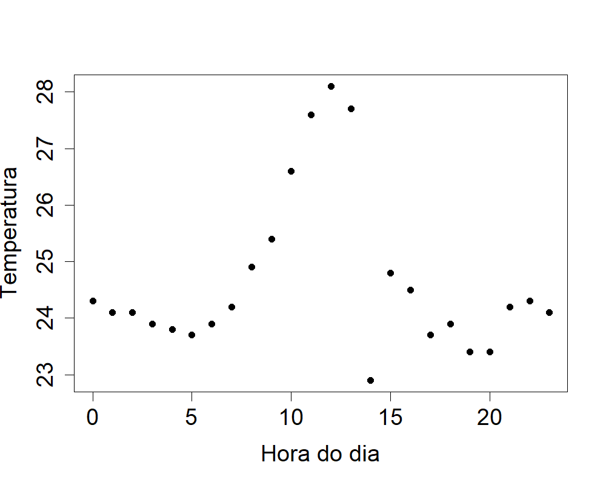
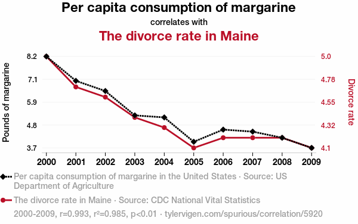
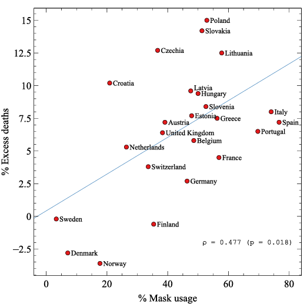

```{r setup, include=FALSE}
knitr::opts_chunk$set(echo = TRUE, warning = FALSE, message = FALSE, fig.retina = 2,
                      fig.height = 4.2, dev.args = list(bg = "transparent"))
suppressPackageStartupMessages({library(tidyverse); library(patchwork)})
empresas  <- read.csv("empresas.csv")
prefeitos <- read.csv("dados_prefeitos.csv")
num_br <- scales::label_number(big.mark = ".", decimal.mark = ",")
dp_n <- function(x) sqrt(mean((x - mean(x))^2))
assimetria <- function(x) mean((x - mean(x))^3) / mean((x - mean(x))^2)^(3/2)
curtose    <- function(x) mean((x - mean(x))^4) / mean((x - mean(x))^2)^2
br <- function(x, d = 2) format(round(x, d), nsmall = d, decimal.mark = ",", big.mark = ".")
capitais <- tibble(
  capital = c("Recife", "Aracaju", "São Luís", "Natal", "João Pessoa", "Salvador", "Fortaleza",
              "Teresina", "Maceió"),
  pib = c(33094.37, 27139, 36827, 28409, 21662, 28483, 24296, 22279, 24322),
  idh = c(0.772, 0.770, 0.768, 0.763, 0.763, 0.759, 0.754, 0.751, 0.721))
```

class: inverse, center, middle

# Aula 08: Correlação, assimetria e curtose

### Parte 1 (50 min) · intervalo · Parte 2 (50 min)

---

## Roteiro da aula (100 minutos)

.roteiro[

| Tempo | Parte 1: correlação |
|:---|:---|
| 0–5 min | Provocação: como medir associação? |
| 5–15 min | Duas variáveis ao mesmo tempo; PIB per capita e IDH; tipos de associação |
| 15–22 min | **Atividade 1**: faturamento e empregados |
| 22–35 min | Coeficiente de correlação; exemplo na mão |
| 35–42 min | Correlação zero; espúria; não é causalidade |
| 42–50 min | **Atividade 2**: estime a correlação |

| Tempo | Parte 2: assimetria, curtose e aplicações |
|:---|:---|
| 0–10 min | Assimetria: simetria e caudas; coeficiente |
| 10–22 min | Exemplo na mão; curtose |
| 22–32 min | Dados reais: poupança e investimento; o crescimento do PIB |
| 32–40 min | Nossas bases de dados |
| 40–46 min | **Atividade 3**: discussão |
| 46–50 min | Uso do R e resumo |

]

---

class: inverse, center, middle

# Parte 1: correlação

### 50 minutos

---

## Provocação: como medir associação? .tempo[0–5 min]

.pull-left-40[
```{r gordura, echo=FALSE, out.width="92%"}

```

.fonte[Fonte: BBC News Brasil.]
]

.pull-right-60[
Até agora resumimos **uma** variável por vez. Mas muitas perguntas envolvem **duas**:

- Pessoas mais altas pesam mais? E quem pesa mais tem mais gordura corporal?
- Empresas com mais empregados faturam mais?
- Capitais mais ricas têm maior desenvolvimento humano?

.caixa-discussao[
Se o peso "acompanha" a altura na maioria das pessoas, é possível alguém ter peso saudável e
excesso de gordura? O que isso diz sobre **associação** entre variáveis?
]
]

---

## Duas variáveis quantitativas ao mesmo tempo .tempo[5–15 min]

Em muitos dados há **várias mensurações** para cada observação:

- peso e altura de cada pessoa numa pesquisa;
- número de habitantes e área de cada cidade;
- tempo de duração e preço de cada viagem de carro por aplicativo.

--

.caixa-aplicacao[
O **gráfico de dispersão** é uma forma simples e útil de analisar a associação entre duas variáveis
quantitativas: cada observação vira um **ponto** \\((x\_i, y\_i)\\) no plano.
]

---

## PIB per capita e IDH das capitais do Nordeste

.pull-left[.small[
```{r tab-capitais, echo=FALSE}
capitais |> transmute(Capital = capital, `PIB per capita (R$)` = br(pib, 2), IDH = br(idh, 3)) |>
  knitr::kable(format = "html", align = "lrr")
```

.fonte[Fontes: IBGE (PIB per capita de 2021) e PNUD (IDHM 2010).]
]]

.pull-right[
```{r disp-capitais, echo=FALSE, fig.height=4.2, fig.width=5, out.width="100%"}
ggplot(capitais, aes(pib, idh, label = capital)) +
  geom_point(size = 3, color = "#3b5bdb") +
  ggrepel::geom_text_repel(size = 3.6, seed = 1) +
  scale_x_continuous(labels = num_br) +
  labs(x = "PIB per capita (R$)", y = "IDH") + theme_minimal(base_size = 14)
```

]

.clear[]

.small[Cada ponto é uma capital. Capitais com PIB per capita mais alto têm uma **leve tendência** a
ter IDH maior: indício de **associação moderada**.]

---

## Tipos de associação

Variáveis relacionadas (associadas) umas com as outras são chamadas **correlacionadas**.

```{r tipos-assoc, echo=FALSE, fig.height=3, fig.width=10, out.width="100%"}
set.seed(8)
x0 <- rnorm(60)
d <- tibble(x = rep(x0, 3),
            y = c(0.9 * x0 + rnorm(60, 0, 0.35), -0.9 * x0 + rnorm(60, 0, 0.35), rnorm(60)),
            tipo = factor(rep(c("Relação linear positiva", "Relação linear negativa", "Ausência de relação linear"), each = 60),
                          levels = c("Relação linear positiva", "Relação linear negativa", "Ausência de relação linear")))
ggplot(d, aes(x, y)) + geom_hline(yintercept = 0, color = "grey70") + geom_vline(xintercept = 0, color = "grey70") +
  geom_point(color = "#3b5bdb") + facet_wrap(~tipo) + theme_minimal(base_size = 13) +
  theme(axis.text = element_blank()) + labs(x = "X", y = "Y")
```

Queremos uma **medida** que indique o **grau** e o **tipo** de associação entre duas variáveis
quantitativas.

---

## Exercício 1: faturamento e número de empregados .tempo[15–22 min]

.pull-left[
```{r disp-empresas, echo=FALSE, fig.height=3.8, fig.width=5, out.width="92%"}
ggplot(empresas, aes(empregados99, faturamento99 / 1000)) +
  geom_point(size = 2.2) +
  labs(x = "Número de empregados", y = "Faturamento anual (x 1.000)") + theme_minimal(base_size = 14)
```

]

.pull-right[
Dados de **106 empresas**.

**a)** Qual é o tipo das variáveis?

**b)** Elas parecem ser associadas?

**c)** Qual é o tipo de associação?
]

--

.pull-right[
.caixa-resposta[
**a)** Ambas quantitativas. **b)** Sim: mais empregados, maior tende a ser o faturamento.
**c)** Linear **positiva**.
]
]

---

## Coeficiente de correlação linear .tempo[22–35 min]

Sejam \\((x\_1, y\_1), \ldots, (x\_n, y\_n)\\) pares de valores de duas variáveis \\(X\\) e \\(Y\\). O
**coeficiente de correlação** entre \\(X\\) e \\(Y\\) é

$$
cor(X, Y) = \frac{1}{n}\sum\_{i=1}^{n}\left(\frac{x\_i - \bar x}{dp(X)}\right)\left(\frac{y\_i - \bar y}{dp(Y)}\right),
$$

em que \\(\bar x\\) e \\(\bar y\\) são as médias e \\(dp(X)\\) e \\(dp(Y)\\) os desvios padrão de \\(X\\) e \\(Y\\).

--

.caixa-aplicacao[
**Intuição.** Cada fator \\((x\_i - \bar x)/dp(X)\\) diz se o ponto está **acima** (positivo) ou
**abaixo** (negativo) da média de \\(X\\), em "unidades de desvio padrão". O produto é **positivo**
quando \\(x\_i\\) e \\(y\_i\\) estão do **mesmo lado** das suas médias, e **negativo** quando estão em
lados opostos.
]

---

## O sinal de cada produto

```{r quadrantes, echo=FALSE, fig.height=3.9, fig.width=8, out.width="80%", fig.align="center"}
ggplot(capitais, aes(pib, idh)) +
  annotate("rect", xmin = -Inf, xmax = mean(capitais$pib), ymin = -Inf, ymax = mean(capitais$idh), fill = "#eef7f1") +
  annotate("rect", xmin = mean(capitais$pib), xmax = Inf, ymin = mean(capitais$idh), ymax = Inf, fill = "#eef7f1") +
  annotate("rect", xmin = -Inf, xmax = mean(capitais$pib), ymin = mean(capitais$idh), ymax = Inf, fill = "#fdf3e7") +
  annotate("rect", xmin = mean(capitais$pib), xmax = Inf, ymin = -Inf, ymax = mean(capitais$idh), fill = "#fdf3e7") +
  geom_vline(xintercept = mean(capitais$pib), linetype = "dashed") +
  geom_hline(yintercept = mean(capitais$idh), linetype = "dashed") +
  geom_point(size = 3, color = "#3b5bdb") +
  ggrepel::geom_text_repel(aes(label = capital), size = 3.4, seed = 1) +
  annotate("text", x = c(Inf, -Inf, -Inf, Inf), y = c(Inf, Inf, -Inf, -Inf), hjust = c(1.1, -0.1, -0.1, 1.1),
           vjust = c(1.5, 1.5, -0.8, -0.8), label = c("produto +", "produto -", "produto +", "produto -"),
           fontface = "bold", size = 4.5) +
  scale_x_continuous(labels = num_br) + labs(x = "PIB per capita (R$)", y = "IDH") + theme_minimal(base_size = 13)
```

.small[Linhas tracejadas: \\(\bar x = 27.390\\) e \\(\bar y = 0{,}758\\). Pontos nas regiões verdes
**aumentam** a correlação; nas laranjas, **diminuem**.]

---

## Exemplo na mão: PIB e IDH das capitais

\\(\bar x = 27.390{,}15\\), \\(dp(X) = 4.735{,}34\\), \\(\bar y = 0{,}7579\\), \\(dp(Y) = 0{,}01462\\).

```{r tab-produtos, echo=FALSE}
capitais |>
  mutate(zx = (pib - mean(pib)) / dp_n(pib), zy = (idh - mean(idh)) / dp_n(idh), prod = zx * zy) |>
  transmute(Capital = capital, `x (PIB)` = br(pib, 0), `y (IDH)` = br(idh, 3),
            `(x - x̄)/dp(X)` = br(zx, 3), `(y - ȳ)/dp(Y)` = br(zy, 3), Produto = br(prod, 3)) |>
  knitr::kable(format = "html", align = "lrrrrr")
```

--

Somando a última coluna: \\(1{,}162 - 0{,}044 + 1{,}378 + 0{,}075 - 0{,}423 + 0{,}018 + 0{,}174 + 0{,}508 + 1{,}634 = 4{,}483\\).

$$
cor(X, Y) = \frac{4{,}483}{9} \approx 0{,}498
$$

---

## Interpretação do coeficiente de correlação

- \\(cor(X, Y)\\) é **sempre** um número entre \\(-1\\) e \\(1\\).
- \\(cor(X, Y) \approx 0\\): **ausência de relação linear** entre as variáveis.
- \\(cor(X, Y)\\) próximo de \\(1\\) ou de \\(-1\\): indícios de que as variáveis são **linearmente
  associadas**.
  - \\(cor(X, Y) \approx 1\\): associação linear **positiva**;
  - \\(cor(X, Y) \approx -1\\): associação linear **negativa**.

--

.caixa-aplicacao[
**PIB e IDH das capitais:** \\(cor = 0{,}498\\), associação linear **positiva moderada**.
]

--

.caixa-discussao[
**Cuidado!**

- \\(cor(X, Y) \approx 0\\) **não** significa ausência total de associação: ela pode ser
  **não linear**.
- Correlação alta **não** implica causalidade: a correlação pode ser **espúria**.
]

---

## Correlação zero, associação perfeita .tempo[35–42 min]

Considere \\(X = -2, -1, 0, 1, 2\\) e \\(Y = X^2 = 4, 1, 0, 1, 4\\).

--

- \\(\bar x = 0\\) e \\(\bar y = (4+1+0+1+4)/5 = 2\\).
- Produtos dos desvios \\((x\_i - \bar x)(y\_i - \bar y)\\):
  \\((-2)(2) + (-1)(-1) + (0)(-2) + (1)(-1) + (2)(2) = -4 + 1 + 0 - 1 + 4 = 0\\).

Logo, \\(cor(X, Y) = 0\\), embora \\(Y\\) seja **totalmente determinado** por \\(X\\)!

--

.pull-left[
```{r parabola, echo=FALSE, fig.height=2.4, fig.width=4.5, out.width="82%"}
ggplot(tibble(x = -2:2, y = (-2:2)^2), aes(x, y)) + geom_point(size = 3.5, color = "#c0392b") +
  stat_function(fun = function(x) x^2, color = "grey60") + theme_minimal(base_size = 13)
```

]

.pull-right[
```{r salvador-cor, echo=FALSE, out.width="58%"}

```

.small[
Temperatura em Salvador (01/08/2024) por hora do dia: \\(cor = -0{,}0418\\).
]

]

---

## Correlação espúria

```{r margarina, echo=FALSE, out.width="62%", fig.align="center"}

```

.fonte[Fonte: Tyler Vigen, *Spurious correlations* (tylervigen.com).]

.caixa-discussao[
Consumo de margarina nos EUA e taxa de divórcio no estado do Maine: \\(r = 0{,}993\\). Comer menos
margarina **salva casamentos**? O que as duas séries têm em comum (olhe o eixo horizontal)?
]

---

## Correlação não é causalidade

.pull-left[
```{r mascaras-estadao, echo=FALSE, out.width="100%"}

```

.fonte[Fonte: Estadão Verifica.]

.small[Um estudo mostrou correlação positiva \\((\rho = 0{,}477)\\) entre o **uso de máscaras** e o
**excesso de mortes** em 24 países europeus durante a pandemia.]
]

.pull-right[
```{r mascaras-tausk, echo=FALSE, out.width="80%"}

```

.fonte[Tausk & Spira (2025), *BMC Public Health*.]
]

.clear[]

.caixa-discussao[
A correlação prova que máscaras **causam** mortes? Pense na direção inversa: países onde a epidemia
estava **pior** tendiam a usar **mais** máscaras.
]

---

## Exercícios 2 e 3: estime a correlação .tempo[42–50 min]

.pull-left[
```{r ex2, echo=FALSE, fig.height=3.3, fig.width=4.6, out.width="95%"}
ggplot(empresas, aes(empregados99, faturamento99 / 1000)) + geom_point(size = 1.8) +
  labs(x = "Número de empregados", y = "Faturamento (x 1.000)") + theme_minimal(base_size = 13)
```

**2.** Faturamento e empregados (106 empresas):

\\(-0{,}81\\) · \\(-0{,}15\\) · \\(0{,}21\\) · \\(0{,}74\\)
]

.pull-right[
```{r ex3, echo=FALSE, fig.height=3.3, fig.width=4.6, out.width="95%"}
ggplot(prefeitos, aes(Pop.estimada.2021 / 1000, idade)) + geom_point(size = 0.5, alpha = 0.5) +
  labs(x = "População do município (x 1.000)", y = "Idade do prefeito") + theme_minimal(base_size = 13)
```

**3.** População e idade do prefeito (5.232 municípios):

\\(-0{,}81\\) · \\(-0{,}25\\) · \\(0{,}05\\) · \\(0{,}54\\)
]

---

## Exercícios 2 e 3: respostas

.caixa-resposta[
**2.** \\(0{,}74\\). As variáveis têm associação linear **positiva** considerável, então a correlação
deve ser um valor positivo e próximo de 1. (No R: `cor(empresas$empregados99, empresas$faturamento99)`
\\(= 0{,}747\\).)

**3.** \\(0{,}05\\). Os pontos formam uma "nuvem" sem padrão aparente: idade do prefeito e população
do município **não** são correlacionadas. (No R: \\(0{,}053\\).)
]

--

.caixa-discussao[
No exercício 3 há mais de 5 mil pontos. Uma correlação de 0,05 com tantos dados é "zero"? E faria
sentido dizer que a população **causa** a idade do prefeito?
]

---

class: inverse, center, middle

# Intervalo

### 10 minutos

---

class: inverse, center, middle

# Parte 2: assimetria, curtose e aplicações

### 50 minutos

---

## O que é uma distribuição ser assimétrica? .tempo[0–10 min]

.pull-left-60[
```{r pay-gap, echo=FALSE, out.width="100%"}
knitr::include_graphics("images/gender_pay_gap.png")
```

.fonte[Fonte: BBC News (2018), diferença salarial mediana entre homens e mulheres em empresas do Reino Unido.]
]

.pull-right-40[
- A distribuição de uma variável quantitativa costuma ser representada por um **histograma**.
- A distribuição é **simétrica** se as metades de cada lado do centro são aproximadamente imagens
  num **espelho**.
- Neste histograma, a "cauda" da direita (empresas que pagam **mais aos homens**) é bem mais longa
  que a da esquerda.
]

---

## Simetria e caudas

```{r formas-assim, echo=FALSE, fig.height=3.1, fig.width=10, out.width="100%"}
set.seed(2026)
fa <- tibble(forma = factor(rep(c("Assimetria à esquerda", "Simétrica", "Assimetria à direita"), each = 2000),
                            levels = c("Assimetria à esquerda", "Simétrica", "Assimetria à direita")),
             x = c(rbeta(2000, 8, 1.5), rnorm(2000, 500, 90), rbeta(2000, 1.2, 9)))
coef <- fa |> group_by(forma) |> summarise(a = assimetria(x), m = median(x))
ggplot(fa, aes(x)) + geom_histogram(bins = 25, fill = "grey80", color = "grey40") +
  geom_vline(data = coef, aes(xintercept = m), color = "#c0392b", linetype = "dashed", linewidth = 1) +
  geom_text(data = coef, aes(x = -Inf, y = Inf, label = paste("assimetria =", br(a, 3))), hjust = -0.1, vjust = 1.5, size = 4.3) +
  facet_wrap(~forma, scales = "free") + labs(x = NULL, y = "Frequência") + theme_minimal(base_size = 13)
```

- As extremidades da distribuição são as **caudas**.
- Se uma cauda é **mais longa** que a outra, a distribuição é **assimétrica para o lado da cauda maior**.

---

## Coeficiente de assimetria

A medida de assimetria de \\(x\_1, \ldots, x\_n\\) é

$$
\frac{\frac{1}{n}\sum\_{i=1}^{n}(x\_i - \bar x)^3}{var(X)^{3/2}} = \frac{\frac{1}{n}\sum\_{i=1}^{n}(x\_i - \bar x)^3}{\left(\frac{1}{n}\sum\_{i=1}^{n}(x\_i - \bar x)^2\right)^{3/2}}
$$

--

- O valor de **referência é 0**, que corresponde a uma distribuição **simétrica**.
- Assimetria **&gt; 0**: distribuição assimétrica **à direita**.
- Assimetria **≈ 0**: distribuição **simétrica**.
- Assimetria **&lt; 0**: distribuição assimétrica **à esquerda**.

--

.caixa-aplicacao[
Por que o **cubo**? Ele preserva o **sinal** dos desvios: um desvio grande para a direita pesa muito
e é positivo; um grande para a esquerda pesa muito e é negativo. Numa distribuição simétrica, eles se
cancelam.
]

---

## Exemplo na mão: dados 1, 2, 3, 4, 10 .tempo[10–22 min]

\\(n = 5\\) e \\(\bar x = 20/5 = 4\\).

| \\(x\_i\\) | \\(x\_i - \bar x\\) | \\((x\_i - \bar x)^2\\) | \\((x\_i - \bar x)^3\\) | \\((x\_i - \bar x)^4\\) |
|:---:|:---:|:---:|:---:|:---:|
| 1 | \\(-3\\) | 9 | \\(-27\\) | 81 |
| 2 | \\(-2\\) | 4 | \\(-8\\) | 16 |
| 3 | \\(-1\\) | 1 | \\(-1\\) | 1 |
| 4 | 0 | 0 | 0 | 0 |
| 10 | 6 | 36 | 216 | 1.296 |
| **Soma** | **0** | **50** | **180** | **1.394** |

--

\\(var(X) = 50/5 = 10\\). **Assimetria:**

$$
\frac{180/5}{10^{3/2}} = \frac{36}{31{,}62} \approx 1{,}14 > 0 \quad \Rightarrow \quad \text{assimétrica à direita}
$$

---

## Curtose

Há diferentes tipos de distribuições **simétricas**, que variam de acordo com o **pico** e as
**caudas**: a **curtose**.

```{r formas-curt, echo=FALSE, fig.height=2.9, fig.width=10, out.width="100%"}
set.seed(7)
fc <- tibble(forma = factor(rep(c("Leptocúrtica", "Mesocúrtica", "Platicúrtica"), each = 3000),
                            levels = c("Leptocúrtica", "Mesocúrtica", "Platicúrtica")),
             x = c(rt(3000, 4), rnorm(3000), runif(3000)))
cc <- fc |> group_by(forma) |> summarise(k = curtose(x))
ggplot(fc, aes(x)) + geom_histogram(bins = 40, fill = "grey80", color = "grey40") +
  geom_text(data = cc, aes(x = -Inf, y = Inf, label = paste("curtose =", br(k, 2))), hjust = -0.1, vjust = 1.5, size = 4.3) +
  facet_wrap(~forma, scales = "free") + labs(x = NULL, y = "Frequência") + theme_minimal(base_size = 13)
```

- **Leptocúrtica:** pico **afunilado** e caudas pesadas (valores extremos mais frequentes).
- **Mesocúrtica:** formato de **sino**, como a distribuição normal.
- **Platicúrtica:** distribuição **achatada**.

---

## Coeficiente de curtose

A medida de curtose de \\(x\_1, \ldots, x\_n\\) é

$$
\frac{\frac{1}{n}\sum\_{i=1}^{n}(x\_i - \bar x)^4}{var(X)^{2}} = \frac{\frac{1}{n}\sum\_{i=1}^{n}(x\_i - \bar x)^4}{\left(\frac{1}{n}\sum\_{i=1}^{n}(x\_i - \bar x)^2\right)^{2}}
$$

- O valor de **referência é 3**, que corresponde a uma distribuição **mesocúrtica** (a normal).
- Curtose **&gt; 3**: distribuição **afunilada** (leptocúrtica).
- Curtose **≈ 3**: formato similar à **curva de sino**.
- Curtose **&lt; 3**: distribuição **achatada** (platicúrtica).

--

**Dados 1, 2, 3, 4, 10:**

$$
\frac{1.394/5}{10^2} = \frac{278{,}8}{100} \approx 2{,}79
$$

.small[Pouco abaixo de 3. Com só 5 observações, porém, curtose (e assimetria) são medidas **muito
instáveis**: um único valor muda tudo.]

---

## Dados reais: poupança, investimento e crescimento .tempo[22–32 min]

```{r cn-corr, include=FALSE}
fmt <- function(x, d = 1) format(round(x, d), nsmall = d, decimal.mark = ",", big.mark = ".")
ce <- read.csv("contas_economicas_trimestrais.csv"); ce$ano <- ce$trimestre %/% 100
soma <- function(conta) tapply(ce$valor_milhoes[ce$conta == conta], ce$ano[ce$conta == conta], sum)
anos <- as.character(2000:2025)
pib <- soma("Produto Interno Bruto")[anos]
poup <- 100 * soma("(=) Poupança bruta")[anos] / pib
inv <- 100 * soma("(-) Formação bruta de capital")[anos] / pib
tx <- read.csv("pib_trimestral_taxas.csv")
qq <- subset(tx, componente == "PIB a preços de mercado" & grepl("imediatamente", taxa))$valor_pct
mom <- function(x, k) mean((x - mean(x))^k) / mean((x - mean(x))^2)^(k / 2)
```

.pull-left-60[
```{r cn-corr-fig, echo=FALSE, fig.height=3.2, fig.width=5.6, out.width="100%"}
ggplot(data.frame(poup, inv, ano = as.integer(anos)), aes(poup, inv)) + geom_point(color = "#0d3b54", size = 2.5) +
  geom_text(aes(label = ifelse(ano %in% c(2000, 2010, 2020, 2025), ano, "")), vjust = -0.8, size = 3.5) +
  labs(x = "Poupança bruta (% do PIB)", y = "Investimento (% do PIB)") + theme_minimal(base_size = 13)
```
]

.pull-right-40[
**Poupança × investimento** (2000–2025): \\(r = `r gsub(",", "{,}", fmt(cor(poup, inv), 2))`\\). Países que poupam mais tendem a investir
mais: a regularidade de Feldstein e Horioka (1980).

**Crescimento trimestral do PIB:** assimetria `r fmt(mom(qq, 3), 2)`, curtose `r fmt(mom(qq, 4), 1)` (caudas muito pesadas).
]

.clear[]

.fonte[Fonte: IBGE, Contas Nacionais Trimestrais, tabelas 2072 e 5932.]

---

## Nossas bases de dados .tempo[32–40 min]

```{r tab-formas, echo=FALSE}
tibble(
  Variável = c("Faturamento (empresas)", "Nº de empregados (empresas)", "Idade do prefeito", "População do município"),
  x = list(empresas$faturamento99, empresas$empregados99, prefeitos$idade, prefeitos$Pop.estimada.2021)) |>
  mutate(Média = map_dbl(x, mean), Mediana = map_dbl(x, median),
         Assimetria = map_dbl(x, assimetria), Curtose = map_dbl(x, curtose)) |>
  select(-x) |>
  knitr::kable(format = "html", digits = 2, format.args = list(big.mark = ".", decimal.mark = ","))
```

--

.caixa-aplicacao[
- **Idade do prefeito:** assimetria ≈ 0,12 e curtose ≈ 2,6: quase simétrica, próxima de um sino.
- **Faturamento:** assimetria pequena (0,36): por isso média e mediana quase coincidem.
- **Empregados** e **população:** assimetria forte à direita (1,73 e 2,05) e curtose alta: poucas
  empresas e municípios **muito grandes**.
]

---

## Atividade 3: discussão .tempo[40–46 min]

**1.** A correlação entre faturamento de 1998 e de 1999 das mesmas empresas é 0,87. Isso quer dizer
que o faturamento de 1998 **causa** o de 1999? Que variável "escondida" explica os dois?

**2.** Um estudo encontra correlação **negativa** entre número de policiais por habitante e taxa de
crimes entre cidades. E outro, correlação **positiva**. Como os dois podem estar certos?

--

**3.** A assimetria da renda no Brasil é fortemente positiva. O que isso diz sobre a relação entre a
renda **média** e a **mediana**? Qual das duas o governo deveria usar para definir quem é "classe
média"?

**4.** Em finanças, retornos de ações costumam ter curtose **maior que 3**. O que isso significa para
quem calcula o risco supondo uma distribuição normal (curtose 3)?

---

## Uso do R: correlação .tempo[46–50 min]

```{r uso-r-1, eval=FALSE}
library(tidyverse)
empresas <- read.csv("empresas.csv")

# gráfico de dispersão
ggplot(empresas, aes(x = empregados99, y = faturamento99)) + geom_point()
plot(empresas$empregados99, empresas$faturamento99)          # versão base do R

# coeficiente de correlação
cor(empresas$empregados99, empresas$faturamento99)            # 0,747

# várias correlações de uma vez
empresas |> select(empregados99, faturamento98, faturamento99, idade) |> cor()

# PIB e IDH das capitais
pib <- c(33094.37, 27139, 36827, 28409, 21662, 28483, 24296, 22279, 24322)
idh <- c(0.772, 0.770, 0.768, 0.763, 0.763, 0.759, 0.754, 0.751, 0.721)
cor(pib, idh)                                                 # 0,498
```

.caixa-r[
A correlação **não** depende de dividir por \\(n\\) ou \\(n-1\\): os dois se cancelam na fórmula.
]

---

## Uso do R: assimetria e curtose

```{r uso-r-2, eval=FALSE}
assimetria <- function(x) mean((x - mean(x))^3) / mean((x - mean(x))^2)^(3/2)
curtose    <- function(x) mean((x - mean(x))^4) / mean((x - mean(x))^2)^2

x <- c(1, 2, 3, 4, 10)
assimetria(x)                      # 1,14
curtose(x)                         # 2,79

assimetria(empresas$empregados99)  # 1,73
curtose(empresas$empregados99)     # 4,96

hist(empresas$empregados99)        # confira a cauda à direita
```

.caixa-r[
Pacotes como `moments` e `e1071` também calculam essas medidas, mas algumas versões usam
correções ou subtraem 3 da curtose ("excesso de curtose"). Nas provas, use as fórmulas desta aula.
]

---

## Resumo

- **Gráfico de dispersão:** primeira ferramenta para ver a associação entre duas variáveis
  quantitativas.
- **Correlação linear:** \\(cor(X,Y) = \frac{1}{n}\sum \left(\frac{x\_i - \bar x}{dp(X)}\right)\left(\frac{y\_i - \bar y}{dp(Y)}\right)\\),
  entre \\(-1\\) e \\(1\\).
- \\(cor \approx 0\\) **não** exclui associação **não linear**; correlação alta **não** implica
  **causalidade** (pode ser espúria).
- **Assimetria:** referência 0; positiva \\(\Rightarrow\\) cauda à direita; negativa \\(\Rightarrow\\) cauda
  à esquerda.
- **Curtose:** referência 3; leptocúrtica (&gt; 3), mesocúrtica (≈ 3), platicúrtica (&lt; 3).

---

class: inverse, center, middle

# Fim da Unidade 1

## Próxima aula (21/09): Espaço amostral e eventos · Prova 1: 23/09
