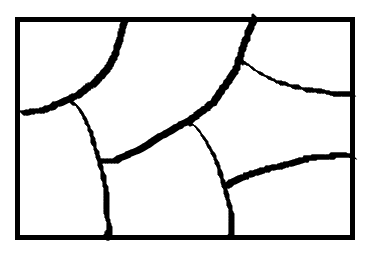

```{r setup, include=FALSE}
knitr::opts_chunk$set(echo = TRUE, warning = FALSE, message = FALSE, fig.retina = 2)
```

class: inverse, center, middle

# Início da Unidade 2: Probabilidade

# Aula 09: Espaço amostral e eventos

### Provocação · Teoria · Aplicação · Discussão

---

## Diariamente você decide sob incerteza

> Devo investir na bolsa este mês?

--

> Vale a pena contratar um seguro para o carro novo?

--

> Devo levar guarda-chuva hoje, mesmo sem certeza de chuva?

--

> Devo me matricular numa disciplina eletiva com alta taxa de reprovação?

--

Todas essas perguntas têm a mesma estrutura formal por trás: um **experimento aleatório**, um
**espaço de resultados possíveis**, e um **evento** de interesse dentro desse espaço. Hoje
construímos esse vocabulário.

---

class: inverse, center, middle

# Bloco 1: Teoria

---

## Por que probabilidade, depois de estatística descritiva?

O Capítulo 1 resumiu dados **já observados**. Agora: como quantificar incerteza sobre um resultado
que **ainda não ocorreu**? Um investidor não sabe se uma ação sobe amanhã; um banco não sabe se um
cliente específico vai inadimplir. Probabilidade é a linguagem formal para essas perguntas.

--

## Experimento aleatório, espaço amostral, evento

- **Experimento aleatório**: processo cujo resultado não pode ser previsto com certeza.
- **Espaço amostral** \\(\Omega\\): conjunto de todos os resultados possíveis.
- **Evento** \\(A\subseteq\Omega\\): um subconjunto de resultados de interesse.

---

## Nem todo espaço amostral é pequeno

\\(\Omega\\) pode ser **finito** (as quatro categorias de risco de crédito que vemos daqui a pouco),
mas também pode ser:

--

**Enumerável (infinito contável)**: número de sinistros que um segurado reporta em um ano,
\\(\Omega = \\{0, 1, 2, 3, \ldots\\}\\). Não há limite superior fixo, mas dá para contar um por um.

--

**Não enumerável (contínuo)**: o retorno percentual de uma ação no próximo mês,
\\(\Omega = \\{x; x \in \mathbb{R}\\}\\). Entre quaisquer dois retornos possíveis sempre existe outro,
não dá para "listar" os resultados um a um.

--

A distinção não é só formal: é a mesma que separa variável **discreta** de **contínua** (Aula 01) —
aqui aplicada ao espaço de resultados, e não a uma variável já observada.

---

## Revisão de teoria de conjuntos

Como eventos são conjuntos, valem as operações usuais:

| Operação | Notação | Significado |
|---|---|---|
| União | \\(A\cup B\\) | \\(A\\) ou \\(B\\) ocorre |
| Interseção | \\(A\cap B\\) | \\(A\\) e \\(B\\) ocorrem juntos |
| Complemento | \\(A^c\\) | \\(A\\) não ocorre |

--

**Mutuamente exclusivos**: \\(A\cap B=\emptyset\\), não podem ocorrer juntos.

Exemplo: "inflação do mês acima da meta" e "inflação do mês abaixo do piso da meta", mutuamente
exclusivos (não podem ocorrer no mesmo mês).

---

class: inverse, center, middle

# Bloco 2: Aplicação

---

## Classificação de risco de crédito

Um banco classifica cada empréstimo em uma de quatro categorias:

$$
\Omega = \\{AA, A, B, C\\}
$$

Evento "risco elevado": \\(R = \\{B, C\\}\\). Evento "risco baixo": \\(L=\\{AA,A\\}\\).

--

\\(R\\) e \\(L\\) são mutuamente exclusivos (\\(R\cap L=\emptyset\\)) e \\(R\cup L=\Omega\\), formam uma
**partição** do espaço amostral: pedaços que não se sobrepõem e cobrem tudo, como neste diagrama
(conceito que retomamos na Aula 14, Teorema de Bayes):

```{r fig-particao, echo=FALSE, out.width="45%"}

```

---

## Um espaço amostral maior: dois empréstimos

Se o banco observa 2 empréstimos, cada um classificado em \\(\\{AA,A,B,C\\}\\):

```{r espaco-produto}
risco <- c("AA","A","B","C")
Omega <- expand.grid(emp1 = risco, emp2 = risco)
nrow(Omega)
head(Omega, 4)
```

\\(|\Omega| = 4\times 4 = 16\\) resultados possíveis, o princípio multiplicativo de contagem
(retomado na Aula 10) já aparece aqui.

---

## Um evento como subconjunto de \\(\Omega\\)

Evento \\(R\\) = "pelo menos um dos dois empréstimos tem risco elevado (B ou C)". Contando à mão:
\\(R^c\\) (nenhum dos dois é B ou C) só ocorre quando **ambos** são AA ou A, \\(2\times 2=4\\) combinações,
logo \\(|R| = 16-4=12\\). Conferindo com o código:

```{r evento-visual}
Omega$risco_elevado <- Omega$emp1 %in% c("B", "C") | Omega$emp2 %in% c("B", "C")
table(Omega$risco_elevado)
```

A contagem bate: 4 combinações fora de \\(R\\), 12 dentro, exatamente o \\(4\\) e o \\(12\\) da conta manual
acima.

---

## O mesmo evento, visualmente

```{r evento-visual-plot, echo=FALSE, fig.height=4.6}
cores <- ifelse(Omega$risco_elevado, "#c9971e", "#0d3b54")
plot(as.numeric(Omega$emp1), as.numeric(Omega$emp2),
     pch = 15, cex = 7, col = cores,
     xaxt = "n", yaxt = "n", xlim = c(0.5, 4.5), ylim = c(0.5, 4.5),
     xlab = "Empréstimo 1", ylab = "Empréstimo 2",
     main = "Evento R: pelo menos um empréstimo de risco elevado")
axis(1, at = 1:4, labels = risco)
axis(2, at = 1:4, labels = risco)
legend("topleft", legend = c("em R (risco elevado)", "fora de R"),
       col = c("#c9971e", "#0d3b54"), pch = 15, bty = "n", cex = 0.9)
```

Cada quadrado é um dos 16 resultados de \\(\Omega\\); o evento \\(R\\) (dourado) é literalmente um
subconjunto de células nessa grade, exatamente a ideia de "evento como subconjunto do espaço
amostral" desta aula, só que agora visível.

---

class: inverse, center, middle

# Bloco 3: Discussão (bloco central da aula)

---

## Rodada 1: voltando à provocação inicial

**1.** Escolha uma das quatro perguntas de abertura (investir na bolsa, seguro do carro, guarda-
chuva, disciplina eletiva). Defina explicitamente: qual é o experimento aleatório, qual é um
espaço amostral razoável \\(\Omega\\), e qual evento \\(A\\) representa a "consequência ruim" que você quer
evitar.

**2.** Dê um exemplo de dois eventos econômicos que sejam mutuamente exclusivos, e outro de dois
eventos que possam ocorrer simultaneamente (não exclusivos).

---

## Rodada 2: granularidade do espaço amostral

**3.** O evento "a Selic sobe na próxima reunião" e o evento "a Selic sobe mais de 0,5 p.p. na
próxima reunião" têm alguma relação de subconjunto entre si? Qual?

**4.** Um analista define \\(\Omega\\) do PIB do próximo trimestre como \\(\\{\\)crescimento, recessão\\(\\}\\).
Outro define com 5 categorias mais finas. Nenhum dos dois está "errado", mas o que se perde ao
escolher a versão mais grosseira?

---

class: inverse, center, middle

# Próxima aula (28/09)

## Propriedades de probabilidade. Métodos de contagem
