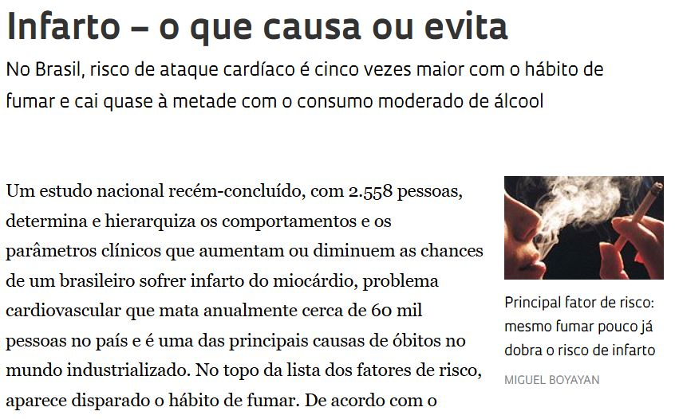

```{r setup, include=FALSE}
knitr::opts_chunk$set(echo = TRUE, warning = FALSE, message = FALSE, fig.retina = 2,
                      dev.args = list(bg = "transparent"))
suppressPackageStartupMessages({library(tidyverse); library(patchwork)})
pnad <- read.csv("pnad_2026t2.csv") |> mutate(across(pop14:informais, as.numeric))
pn_tot <- filter(pnad, recorte == "total")
pn_h <- filter(pnad, categoria == "Homens")
pn_m <- filter(pnad, categoria == "Mulheres")
nb <- function(x, d = 3) format(round(x, d), nsmall = d, decimal.mark = ",", big.mark = ".")
nbm <- function(x, d = 3) gsub(",", "{,}", nb(x, d), fixed = TRUE)
mil <- function(x) format(x, big.mark = ".", decimal.mark = ",")
```

class: inverse, center, middle

# Aula 11: Probabilidade condicional

### Parte 1 (50 min): probabilidade geométrica e condicional · intervalo · Parte 2 (50 min): tabelas de contingência

---

## Roteiro da aula (100 minutos)

.roteiro[

| Tempo | Parte 1: áreas e informação |
|:---|:---|
| 0–5 min | Provocação: duas frases sobre mulheres e mercado de trabalho |
| 5–22 min | Probabilidade geométrica: espera, encontro, barganha, Monte Carlo |
| 22–40 min | Probabilidade condicional e regra da multiplicação |
| 40–50 min | **Atividade 1**: urna, casas e orçamento |

| Tempo | Parte 2: tabelas de contingência com a PNAD |
|:---|:---|
| 0–12 min | Conjunta, marginal e condicional |
| 12–20 min | Taxa ou nível? O evento condicionante |
| 20–30 min | Falácia da inversão: escolaridade e desocupação |
| 30–40 min | Confundimento e paradoxo de Simpson |
| 40–50 min | **Atividade 2**, Uso do R e fechamento |

]

---

## Provocação: as duas frases dizem a mesma coisa? .tempo[0–5 min]

Com dados da PNAD Contínua do 2º trimestre de 2026 (IBGE):

.caixa-discussao[
**Frase 1:** "`r round(100 * pn_m$fora / pn_tot$fora)`% das pessoas fora da força de trabalho são mulheres."

**Frase 2:** "`r round(100 * pn_m$fora / pn_m$pop14)`% das mulheres estão fora da força de trabalho."
]

--

- As duas usam o **mesmo** número de mulheres fora da força de trabalho (`r mil(pn_m$fora)` mil).
- Mudam o **denominador**: todos os que estão fora da força, ou todas as mulheres.

--

.caixa-aplicacao[
Cada frase é uma **probabilidade condicional** diferente. Hoje: como a informação muda a probabilidade, e
como ler uma **tabela de contingência** sem trocar os denominadores.
]

---

class: inverse, center, middle

# Parte 1: áreas e informação

### 50 minutos

---

## Probabilidade geométrica .tempo[5–22 min]

Quando o resultado é um **ponto ao acaso** num intervalo ou numa região do plano, não dá para contar
resultados. Regiões de mesmo tamanho têm a mesma chance:

.caixa-aplicacao[
$$
P(A) = \frac{\text{comprimento (ou área) de } A}{\text{comprimento (ou área) de } \Omega}
$$

Comprimentos e áreas são não negativos, aditivos e \\(P(\Omega) = 1\\): os **axiomas** valem.
]

--

**Espera pelo ônibus.** Um ônibus passa a cada 15 minutos; o passageiro chega num instante ao acaso.

- \\(P(\text{esperar mais de 10 min}) = \dfrac{15 - 10}{15} = \dfrac{1}{3}\\).
- \\(P(\text{esperar exatamente 10 min}) = 0\\): um ponto tem comprimento **zero**, mesmo sendo possível (Unidade 4).

---

## O problema do encontro

Comprador e vendedor combinam de se encontrar entre 9h e 10h. Cada um chega num instante ao acaso, de forma
independente, e espera **no máximo 15 minutos**. Qual a chance de o negócio ser fechado?

.pull-left-40[
\\(\Omega = [0, 60] \times [0, 60]\\), área 3.600.

Encontro: \\(|x - y| \leq 15\\), a faixa em torno da diagonal.

Fora da faixa: dois triângulos de catetos 45, área \\(2 \times 45^2/2 = 2.025\\).

$$
P = 1 - \frac{2.025}{3.600} = \frac{7}{16} = 0{,}4375
$$
]

.pull-right-60[
```{r encontro, echo=FALSE, fig.height=3.6, fig.width=7, out.width="100%"}
faixa <- tibble(x = c(0, 15, 60, 60, 45, 0), y = c(0, 0, 45, 60, 60, 15))
g1 <- ggplot() + geom_polygon(data = faixa, aes(x, y), fill = "#f4e04d") +
  annotate("rect", xmin = 0, xmax = 60, ymin = 0, ymax = 60, fill = NA, color = "#2a7fb8", linewidth = 1) +
  annotate("text", x = c(45, 15), y = c(12, 48), label = "sem encontro", size = 4) +
  coord_fixed() + labs(x = "Comprador (min)", y = "Vendedor (min)") + theme_minimal(base_size = 12)
set.seed(2026)
cheg <- tibble(x = runif(1500, 0, 60), y = runif(1500, 0, 60), enc = abs(x - y) <= 15)
g2 <- ggplot(cheg, aes(x, y, color = enc)) + geom_point(size = 0.5) + coord_fixed() +
  scale_color_manual(values = c("grey60", "#c0392b"), guide = "none") +
  labs(x = "Comprador", y = "Vendedor", title = "1.500 simulações") + theme_minimal(base_size = 12)
g1 + g2
```

]

---

## Barganha e o método de Monte Carlo

.pull-left[
**Barganha.** O preço máximo do comprador \\(b\\) e o mínimo do vendedor \\(s\\) são pontos ao acaso em \\([0, 1]\\)
(R$ milhões), independentes.

- Há acordo possível se \\(b \geq s\\): metade do quadrado, \\(P = 1/2\\).
- Ganho de troca \\(b - s \geq 0{,}2\\): triângulo de catetos 0,8, \\(P = 0{,}8^2/2 = 0{,}32\\).
]

.pull-right[
**Monte Carlo.** Pontos ao acaso no quadrado \\([0, 1]^2\\): a proporção dentro do quarto de círculo aproxima \\(\pi/4\\).

```{r monte-carlo}
set.seed(1)
x <- runif(100000); y <- runif(100000)
4 * mean(x^2 + y^2 <= 1)
```

.small[
Finanças usam a mesma ideia para precificar opções e medir risco quando não há fórmula.
]
]

--

.caixa-discussao[
**"Ao acaso" precisa ser definido.** Sortear uma **empresa** ao acaso ou sortear um **trabalhador** ao acaso e
olhar sua empresa dá tamanhos médios de empresa muito diferentes. Por quê?
]

---

## Probabilidade condicional .tempo[22–40 min]

.pull-left-40[
```{r infarto, echo=FALSE, out.width="100%"}

```

.fonte[Fonte: Revista Pesquisa FAPESP.]
]

.pull-right-60[
A chance de infarto de uma pessoa **qualquer** é igual à de uma pessoa **que fuma**? Não: informação extra
**muda** probabilidades.

.caixa-aplicacao[
Com \\(P(A) > 0\\), a **probabilidade condicional** de \\(B\\) **dado** \\(A\\) é

$$
P(B \mid A) = \frac{P(A \cap B)}{P(A)}.
$$

Condicionar é **restringir** o espaço amostral a \\(A\\) e **reescalar** para que \\(A\\) tenha probabilidade 1.
]
]

---

## Exemplo: um dado e a falácia da inversão

Dado honesto; \\(A = \\{2\\}\\) e \\(B = \\{2, 4, 6\\}\\) ("par").

$$
P(A \mid B) = \frac{P(A \cap B)}{P(B)} = \frac{1/6}{3/6} = \frac13
\qquad
P(B \mid A) = \frac{P(A \cap B)}{P(A)} = \frac{1/6}{1/6} = 1
$$

--

.caixa-discussao[
**Em geral, \\(P(A \mid B) \neq P(B \mid A)\\).** "A maioria dos presos é jovem" não quer dizer "a maioria dos jovens é
presa". Confundir as duas é a **falácia da inversão**.
]

--

.caixa-aplicacao[
**A condicional é uma probabilidade:** \\(Q(B) = P(B \mid A)\\) obedece aos três axiomas. Logo
\\(P(B^c \mid A) = 1 - P(B \mid A)\\). Mas, em geral, \\(P(B \mid A^c) \neq 1 - P(B \mid A)\\).
]

---

## Regra da multiplicação e árvores

Da definição: \\(P(A \cap B) = P(A)\\, P(B \mid A)\\). Um lote tem 50 peças boas e 10 defeituosas; retiram-se **duas sem reposição**.

.pull-left-40[
$$
P(D\_1 \cap D\_2) = \frac{10}{60} \times \frac{9}{59} \approx 0{,}0254
$$

Pela contagem (Aula 10): \\(\binom{10}{2} / \binom{60}{2} = 45/1.770\\), o mesmo valor.
]

.pull-right-60[
```{r arvore, echo=FALSE, fig.height=3.4, fig.width=6.4, out.width="100%"}
no <- tibble(x = c(0, 3, 3, 7, 7, 7, 7), y = c(0, 1.5, -1.5, 2.3, 0.7, -0.7, -2.3), lab = c("", "D1", "B1", "D2", "B2", "D2", "B2"))
arestas <- tibble(x = c(0, 0, 3, 3, 3, 3), y = c(0, 0, 1.5, 1.5, -1.5, -1.5), xend = c(3, 3, 7, 7, 7, 7),
                  yend = c(1.5, -1.5, 2.3, 0.7, -0.7, -2.3), p = c("10/60", "50/60", "9/59", "50/59", "10/59", "49/59"))
final <- tibble(y = c(2.3, 0.7, -0.7, -2.3), lab = c("0,0254", "0,1412", "0,1412", "0,6921"))
ggplot() + geom_segment(data = arestas, aes(x, y, xend = xend, yend = yend), color = "grey40") +
  geom_label(data = arestas, aes((x + xend) / 2, (y + yend) / 2, label = p), label.size = 0, size = 4) +
  geom_point(data = no, aes(x, y)) + geom_label(data = no[-1, ], aes(x, y, label = lab), fill = "#f4e04d", size = 4.5) +
  geom_text(data = final, aes(8, y, label = lab), hjust = 0, size = 4.5) + xlim(0, 9.5) + theme_void()
```

]

.clear[]

.caixa-aplicacao[
**Em geral:** \\(P(A\_1 \cap A\_2 \cap A\_3) = P(A\_1)\\, P(A\_2 \mid A\_1)\\, P(A\_3 \mid A\_1 \cap A\_2)\\), e assim por diante.
]

---

## Atividade 1 (duplas) .tempo[40–50 min]

.caixa-atividade[
**1.** Uma urna tem 3 bolas brancas e 7 vermelhas. Qual a probabilidade de duas brancas em duas retiradas sem
reposição? E da sequência \\(B\_1 B\_2 V\_3 V\_4 B\_5\\) em cinco retiradas?

**2.** Casas classificadas por preço e banheiros (proporções): baixo e mais de um banheiro 0,22; baixo e um
banheiro 0,40; alto e mais de um 0,34; alto e um 0,04. Calcule \\(P(\text{mais de um banheiro} \mid \text{alto})\\).

**3.** Um investidor divide R$ 1 milhão em duas partes, cortando \\([0, 1]\\) num ponto ao acaso. Qual a
probabilidade de a parte maior ser pelo menos o **triplo** da menor?
]

---

## Atividade 1: respostas

.caixa-resposta[
**1.** \\(\frac{3}{10} \cdot \frac{2}{9} = \frac{1}{15} \approx 0{,}067\\). Sequência: \\(\frac{3}{10} \cdot \frac{2}{9} \cdot \frac{7}{8} \cdot \frac{6}{7} \cdot \frac{1}{6} = \frac{1}{120}\\).

**2.** \\(P(\text{alto}) = 0{,}34 + 0{,}04 = 0{,}38\\); \\(P(\text{mais de um} \mid \text{alto}) = 0{,}34/0{,}38 \approx 0{,}895\\).

**3.** Com corte em \\(u\\), a parte maior é pelo menos o triplo da menor se \\(u \leq 1/4\\) ou \\(u \geq 3/4\\):
comprimento favorável \\(1/4 + 1/4\\), \\(P = 0{,}5\\).
]

---

class: inverse, center, middle

# Intervalo

### 10 minutos

---

class: inverse, center, middle

# Parte 2: tabelas de contingência com a PNAD

### 50 minutos

---

## Uma tabela, três tipos de probabilidade .tempo[0–12 min]

Pessoas de 14 anos ou mais, Brasil, 2º trimestre de 2026 (mil pessoas):

```{r tab-sexo, echo=FALSE}
tab <- tibble(Sexo = c("Homens", "Mulheres"),
              Ocupados = c(pn_h$ocupadas, pn_m$ocupadas),
              Desocupados = c(pn_h$desocupadas, pn_m$desocupadas),
              `Fora da força` = c(pn_h$fora, pn_m$fora)) |>
  mutate(Total = Ocupados + Desocupados + `Fora da força`)
tab_tot <- bind_rows(tab, summarise(tab, Sexo = "Total", across(-Sexo, sum)))
knitr::kable(tab_tot, format = "html", format.args = list(big.mark = "."), align = "lrrrr")
```

.fonte[Fonte: IBGE, PNAD Contínua, tabela 4093. Totais podem diferir em 1 por arredondamento.]

--

.small[

| Tipo | Pergunta | Cálculo |
|:---|:---|:---|
| **Conjunta** | chance de \\(A\\) **e** \\(B\\) | célula / total geral |
| **Marginal** | chance de \\(A\\) | total da linha (ou coluna) / total geral |
| **Condicional** | chance de \\(B\\) **entre** os que têm \\(A\\) | célula / total da **linha** (ou **coluna**) |

]

---

## Lendo a tabela

```{r calc, include=FALSE}
n_tot <- sum(tab$Total)
```

- **Conjunta:** \\(P(\text{mulher} \cap \text{fora}) = `r mil(pn_m$fora)` / `r mil(n_tot)` \approx `r nbm(pn_m$fora / n_tot)`\\).
- **Marginal:** \\(P(\text{mulher}) \approx `r nbm(pn_m$pop14 / n_tot)`\\); \\(P(\text{fora}) \approx `r nbm(pn_tot$fora / n_tot)`\\).

--

- **Perfil-linha:** \\(P(\text{fora} \mid \text{mulher}) \approx `r nbm(pn_m$fora / pn_m$pop14)`\\) e \\(P(\text{fora} \mid \text{homem}) \approx `r nbm(pn_h$fora / pn_h$pop14)`\\).
- **Perfil-coluna:** \\(P(\text{mulher} \mid \text{fora}) \approx `r nbm(pn_m$fora / pn_tot$fora)`\\).

--

.caixa-aplicacao[
**Marginais são probabilidades totais:** cada conjunta é "condicional × marginal", e a margem soma as conjuntas:

$$
P(\text{fora}) = P(\text{fora} \mid H)\\, P(H) + P(\text{fora} \mid M)\\, P(M)
$$
]

---

## Taxa ou nível? O condicionante muda a resposta .tempo[12–20 min]

O IBGE publica **dois** indicadores de desocupação, que diferem **só** no evento condicionante:

.caixa-aplicacao[
**Taxa de desocupação** \\(= P(\text{desocupado} \mid \text{na força de trabalho}) = `r mil(pn_tot$desocupadas)` / `r mil(pn_tot$forca)` \approx `r nbm(pn_tot$desocupadas / pn_tot$forca)`\\)

**Nível da desocupação** \\(= P(\text{desocupado} \mid \text{14 anos ou mais}) = `r mil(pn_tot$desocupadas)` / `r mil(pn_tot$pop14)` \approx `r nbm(pn_tot$desocupadas / pn_tot$pop14)`\\)
]

--

- A **taxa** pergunta: entre quem participa do mercado de trabalho, quantos não conseguem emprego?
- O **nível** pergunta: na população em idade de trabalhar, quantos procuram emprego sem conseguir?

--

.caixa-discussao[
Se muitos desocupados desistem de procurar emprego (passam para "fora da força"), o que acontece com a **taxa**?
A economia melhorou?
]

---

## Falácia da inversão com dados reais .tempo[20–30 min]

```{r instrucao, echo=FALSE, fig.height=3.9, fig.width=11, out.width="100%"}
instr <- filter(pnad, recorte == "instrucao") |>
  mutate(grupo = factor(c("Sem instrução", "Fund. incompleto", "Fund. completo", "Médio incompleto",
                          "Médio completo", "Sup. incompleto", "Sup. completo"),
                        levels = c("Sem instrução", "Fund. incompleto", "Fund. completo", "Médio incompleto",
                                   "Médio completo", "Sup. incompleto", "Sup. completo")),
         taxa = desocupadas / forca, comp = desocupadas / sum(desocupadas))
pc <- function(x) paste0(format(round(100 * x, 1), nsmall = 1, decimal.mark = ","), "%")
g1 <- ggplot(instr, aes(grupo, taxa)) + geom_col(fill = "#3b5bdb") + coord_flip() +
  geom_text(aes(label = pc(taxa)), hjust = -0.1, size = 4.5) + scale_y_continuous(limits = c(0, 0.11), labels = NULL) +
  labs(x = NULL, y = NULL, title = "P(desocupado | escolaridade)") + theme_minimal(base_size = 14)
g2 <- ggplot(instr, aes(grupo, comp)) + geom_col(fill = "#c9971e") + coord_flip() +
  geom_text(aes(label = pc(comp)), hjust = -0.1, size = 4.5) + scale_y_continuous(limits = c(0, 0.56), labels = NULL) +
  labs(x = NULL, y = NULL, title = "P(escolaridade | desocupado)") + theme_minimal(base_size = 14)
g1 + g2
```

.small[
Quem tem **médio completo** é `r pc(instr$comp[5])` dos desocupados (maior fatia), mas a taxa do grupo é `r pc(instr$taxa[5])`, perto da média. "O desemprego atinge principalmente quem tem ensino médio" lê a direita como se fosse a esquerda.
]

.fonte[Fonte: IBGE, PNAD Contínua, 2º trimestre de 2026, tabela 4095.]

---

## Confundimento: a idade por trás da escolaridade .tempo[30–40 min]

.pull-left-40[
Quem **não tem instrução** tem taxa (`r pc(instr$taxa[1])`) **menor** que quem tem médio incompleto (`r pc(instr$taxa[4])`).
Estudar protege menos?

Não: só `r pc(instr$forca[1] / instr$pop14[1])` das pessoas sem instrução estão na força de trabalho (muitas são idosas), e o
médio incompleto concentra **jovens**.
]

.pull-right-60[
```{r idade, echo=FALSE}
filter(pnad, recorte == "idade") |>
  transmute(Idade = categoria, `Taxa de desocupação` = pc(desocupadas / forca),
            `Participação na força` = pc(forca / pop14)) |>
  knitr::kable(format = "html", align = "lrr")
```

.fonte[Fonte: IBGE, PNAD Contínua, 2º tri 2026, tabela 4094.]
]

.clear[]

.caixa-aplicacao[
A **idade** é uma **variável de confundimento**: está associada à escolaridade **e** à desocupação. Comparar taxas de
grupos com composições diferentes mistura os dois efeitos.
]

---

## O paradoxo de Simpson

Dois bancos analisam pedidos de crédito (dados ilustrativos):

| | Banco A: pedidos | aprovados | Banco B: pedidos | aprovados |
|:---|:---:|:---:|:---:|:---:|
| Risco baixo | 800 | 720 (90%) | 200 | 190 (95%) |
| Risco alto | 200 | 100 (50%) | 800 | 440 (55%) |
| **Total** | 1.000 | **820 (82%)** | 1.000 | **630 (63%)** |

--

O Banco B aprova **mais** em **cada** classe e **menos** no total. A taxa total é uma **média ponderada**:

$$
P(\text{aprov}) = P(\text{aprov} \mid \text{baixo})\\, P(\text{baixo}) + P(\text{aprov} \mid \text{alto})\\, P(\text{alto})
$$

com pesos diferentes: 80% dos pedidos do A são de risco baixo; no B, só 20%.

.small[
Caso real: admissões na pós-graduação de Berkeley em 1973 (Bickel, Hammel e O'Connell, 1975).
]

---

## Atividade 2 (duplas) .tempo[40–47 min]

.caixa-atividade[
Com a tabela de sexo e condição na força de trabalho:

**a)** Calcule \\(P(\text{desocupado} \mid \text{mulher})\\) e \\(P(\text{desocupado} \mid \text{mulher, na força de trabalho})\\). Por que
são tão diferentes?

**b)** Calcule \\(P(\text{homem} \mid \text{ocupado})\\) e compare com \\(P(\text{ocupado} \mid \text{homem})\\).

**c)** A taxa de desocupação do Brasil pode cair mesmo que a taxa de **cada** grupo de idade suba? Que mudança na
composição da força de trabalho produziria isso?
]

---

## Atividade 2: respostas

.caixa-resposta[
**a)** \\(`r mil(pn_m$desocupadas)` / `r mil(pn_m$pop14)` \approx `r nbm(pn_m$desocupadas / pn_m$pop14)`\\) e
\\(`r mil(pn_m$desocupadas)` / `r mil(pn_m$forca)` \approx `r nbm(pn_m$desocupadas / pn_m$forca)`\\). O segundo condiciona num evento
menor: quase metade das mulheres está fora da força de trabalho.

**b)** \\(P(\text{homem} \mid \text{ocupado}) = `r mil(pn_h$ocupadas)` / `r mil(pn_tot$ocupadas)` \approx `r nbm(pn_h$ocupadas / pn_tot$ocupadas)`\\);
\\(P(\text{ocupado} \mid \text{homem}) = `r mil(pn_h$ocupadas)` / `r mil(pn_h$pop14)` \approx `r nbm(pn_h$ocupadas / pn_h$pop14)`\\).

**c)** Sim (Simpson): se a força de trabalho **envelhece**, cresce o peso dos grupos com taxas menores (40 anos ou
mais) e a média ponderada pode cair mesmo com todas as taxas subindo.
]

---

## Uso do R: tabelas e probabilidades .tempo[47–50 min]

```{r uso-r}
m <- matrix(c(pn_h$ocupadas, pn_h$desocupadas, pn_h$fora,
              pn_m$ocupadas, pn_m$desocupadas, pn_m$fora), nrow = 2, byrow = TRUE,
            dimnames = list(c("Homens", "Mulheres"), c("Ocup", "Desoc", "Fora")))
round(prop.table(m), 3)              # conjuntas
round(prop.table(m, margin = 1), 3)  # perfil-linha: P(condição | sexo)
round(prop.table(m, margin = 2), 3)  # perfil-coluna: P(sexo | condição)
```

---

## Resumo

- **Probabilidade geométrica:** razão de comprimentos ou áreas; um ponto tem probabilidade zero.
- **Condicional:** \\(P(B \mid A) = P(A \cap B)/P(A)\\); em geral \\(P(A \mid B) \neq P(B \mid A)\\).
- **Multiplicação:** \\(P(A \cap B) = P(A)\\, P(B \mid A)\\); árvores.
- **Tabelas de contingência:** conjunta (célula/total), marginal (margem/total), condicional (célula/linha ou coluna).
- **Taxa × nível de desocupação:** mesmo numerador, condicionantes diferentes.
- **Confundimento e Simpson:** taxas totais são médias ponderadas; compare grupos com composições parecidas.

.small[Livro: Seções 2.5, 2.6 e 2.7. Lista 06.]

---

class: inverse, center, middle

# Próxima aula (05/10)

## Independência estatística, risco relativo e razão de chances
