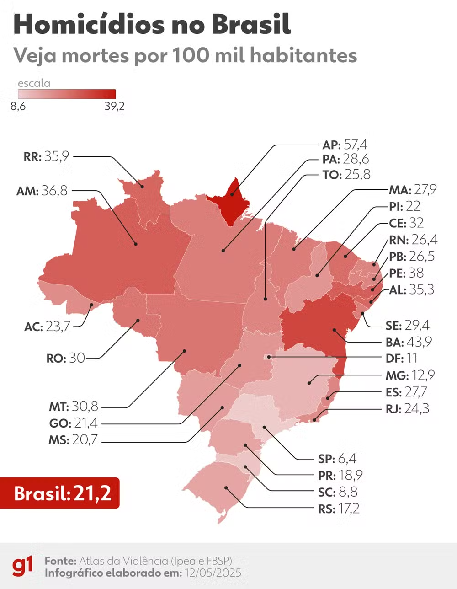

```{r setup, include=FALSE}
knitr::opts_chunk$set(echo = TRUE, warning = FALSE, message = FALSE, fig.retina = 2,
                      dev.args = list(bg = "transparent"))
suppressPackageStartupMessages(library(tidyverse))
source("R/venn.R")
pnad <- read.csv("pnad_2026t2.csv") |> mutate(across(pop14:informais, as.numeric))
options(knitr.kable.NA = "")
pc <- function(x, d = 1) paste0(format(round(100 * x, d), nsmall = d, decimal.mark = ","), "%")
# partição em 7 regiões (curvas) com um evento A elíptico, no estilo de um diagrama de partição
particao_plot <- function(pinta_A = TRUE, rotulos = TRUE) {
  g <- expand.grid(x = seq(0, 10, length.out = 500), y = seq(0, 6, length.out = 300))
  regiao <- with(g, case_when(
    y > 3.2 + 0.25 * sin(x) & x < 2.8 + 0.3 * cos(y) ~ "B1",
    y > 3.2 + 0.25 * sin(x) & x < 6.6 - 0.4 * sin(y) ~ "B3",
    y > 3.2 + 0.25 * sin(x) & x < 8.8 ~ "B5",
    y > 3.2 + 0.25 * sin(x) ~ "B6",
    x < 3.4 + 0.3 * sin(y) ~ "B2",
    x < 7.2 + 0.2 * cos(y) ~ "B4",
    TRUE ~ "B7"))
  g$A <- ((g$x - 5.2) / 3)^2 + ((g$y - 3.1) / 1.3)^2 <= 1
  p <- ggplot(g, aes(x, y)) +
    geom_raster(aes(fill = if (pinta_A) ifelse(A, regiao, "fora") else regiao), show.legend = FALSE) +
    scale_fill_manual(values = c(B1 = "#dfe9ee", B2 = "#eef3fb", B3 = "#e8f1ea", B4 = "#fdf3e7",
                                 B5 = "#f3f0fa", B6 = "#fdf8ee", B7 = "#eaeaea", fora = "white")) +
    geom_contour(aes(z = as.numeric(factor(regiao))), color = "black", linewidth = 1.3, breaks = seq(1.5, 6.5, 1)) +
    annotate("path", x = 5.2 + 3 * cos(seq(0, 2 * pi, length.out = 200)), y = 3.1 + 1.3 * sin(seq(0, 2 * pi, length.out = 200)),
             color = "#c9971e", linewidth = 1.5) +
    annotate("rect", xmin = 0, xmax = 10, ymin = 0, ymax = 6, fill = NA, color = "black", linewidth = 1.5) +
    coord_fixed(expand = FALSE) + theme_void()
  if (rotulos) p <- p + annotate("text", x = c(0.6, 4.3, 7.6, 9.4, 0.6, 5, 9.4), y = c(5.5, 5.5, 5.5, 5.5, 0.5, 0.5, 0.5),
                                 label = paste0("B[", c(1, 3, 5, 6, 2, 4, 7), "]"), parse = TRUE, size = 6) +
    annotate("text", x = 6.3, y = 3.4, label = "A", size = 8, fontface = "italic", color = "#8a5a00")
  p
}
```

class: inverse, center, middle

# Aula 14: Teorema da probabilidade total e Teorema de Bayes

### Parte 1 (50 min): probabilidade total · intervalo · Parte 2 (50 min): Bayes e testes

---

## Roteiro da aula (100 minutos)

.roteiro[

| Tempo | Parte 1: dividir para somar |
|:---|:---|
| 0–5 min | Provocação: um sistema com "95% de acerto" |
| 5–20 min | Partição e teorema da probabilidade total |
| 20–30 min | Peças defeituosas e três urnas |
| 30–40 min | Dados reais: a taxa de desocupação do Brasil como média das regiões |
| 40–50 min | **Atividade 1** |

| Tempo | Parte 2: atualizar com informação |
|:---|:---|
| 0–15 min | Teorema de Bayes: bolsa e dólar, três fábricas |
| 15–25 min | Falsos alarmes: antifraude e doenças raras |
| 25–35 min | Sensibilidade, especificidade, valores preditivos; Bayes na forma de chances |
| 35–45 min | **Atividade 2**: escore de crédito |
| 45–50 min | Uso do R e fechamento da Unidade 2 |

]

---

## Provocação: um sistema com "95% de acerto" .tempo[0–5 min]

> Um sistema antifraude de um banco detecta **95%** das fraudes reais e dá falso alarme em apenas
> **3%** das transações legítimas. Fraudes são raras: **0,2%** de todas as transações.

> Quando o sistema aponta uma transação como "suspeita", qual é a chance de ser **mesmo** uma
> fraude? 95%? 50%? Bem menos?

--

.caixa-discussao[
Anote o seu palpite. No fim da aula, vamos calcular o valor exato, e ele costuma surpreender.
]

---

class: inverse, center, middle

# Parte 1: dividir para somar

### 50 minutos

---

## O que é uma partição? .tempo[5–20 min]

.pull-left-40[
```{r atlas, echo=FALSE, out.width="88%"}

```

.fonte[Fonte: G1 (12/05/2025), com dados do Atlas da Violência (Ipea/FBSP).]
]

.pull-right-60[
O mapa divide o Brasil em **27 unidades da federação**:

- nenhum município pertence a **dois** estados ao mesmo tempo;
- **todo** município pertence a **algum** estado.

.caixa-aplicacao[
É exatamente a ideia de **partição**: pedaços que **não se sobrepõem** e que, juntos, **cobrem
tudo**.
]

.caixa-discussao[
A taxa do Brasil (21,2 por 100 mil) pode ser obtida a partir das taxas dos estados? Precisamos de
mais alguma informação?
]
]

---

## Particionando um evento com dois conjuntos

.pull-left[
Considere dois eventos \\(A\\) e \\(B\\). Podemos representar \\(A\\) como

$$
A = (A \cap B) \cup (A \cap B^c).
$$

Como \\(A \cap B\\) e \\(A \cap B^c\\) são **disjuntos**,

$$
P(A) = P(A \cap B) + P(A \cap B^c).
$$

Note que \\(S = B \cup B^c\\) e \\(B \cap B^c = \emptyset\\): \\(B\\) e \\(B^c\\) formam uma partição de \\(S\\).
]

.pull-right[
```{r venn-part, echo=FALSE, fig.height=3, fig.width=5, out.width="100%"}
venn(function(a, b, c) a, dois, cor = "#f4e04d") +
  geom_raster(data = subset(expand.grid(x = seq(0, 10, length.out = 400), y = seq(0, 6, length.out = 240)),
                            (x - 6.1)^2 + (y - 2.9)^2 <= 1.8^2 & (x - 3.9)^2 + (y - 2.9)^2 <= 1.8^2),
              aes(x, y), fill = "#9cc5a1", inherit.aes = FALSE) +
  geom_circle(data = dois, aes(x0 = x0, y0 = y0, r = r), color = "#2a7fb8", linewidth = 0.9, inherit.aes = FALSE) +
  annotate("text", x = c(2.9, 5), y = 2.9, label = c("A∩Bᶜ", "A∩B"), size = 5)
```

]

---

## Partição do espaço amostral

Os eventos \\(B\_1, B\_2, \ldots, B\_n\\) formam uma **partição** do espaço amostral \\(S\\) quando

**a)** \\(B\_i \cap B\_j = \emptyset\\) para todo \\(i \neq j\\) (não se sobrepõem);

**b)** \\(B\_1 \cup B\_2 \cup \cdots \cup B\_n = S\\) (cobrem tudo);

**c)** \\(P(B\_i) &gt; 0\\) para todo \\(i\\).

--

**Ex.:** no lançamento de um dado, \\(B\_1 = \\{1, 2\\}\\), \\(B\_2 = \\{3, 4, 5\\}\\) e \\(B\_3 = \\{6\\}\\) formam uma
partição de \\(S = \\{1, \ldots, 6\\}\\).

Já \\(C\_1 = \\{1, 2, 3, 4\\}\\) e \\(C\_2 = \\{4, 5, 6\\}\\) **não** formam uma partição. Por quê?

--

.caixa-resposta[
Porque \\(C\_1 \cap C\_2 = \\{4\\} \neq \emptyset\\): o resultado 4 pertence aos dois.
]

---

## Particionando um evento qualquer

.pull-left[
Seja \\(A\\) um evento de \\(S\\) e \\(B\_1, \ldots, B\_n\\) uma partição de \\(S\\):

$$
A = (A \cap B\_1) \cup (A \cap B\_2) \cup \cdots \cup (A \cap B\_n).
$$

Como os pedaços \\(A \cap B\_i\\) são disjuntos,

$$
P(A) = \sum\_{i=1}^{n} P(A \cap B\_i).
$$
]

.pull-right[
```{r particao-fig, echo=FALSE, fig.height=3.3, fig.width=5.5, out.width="100%"}
particao_plot()
```

]

.clear[]

--

Pela regra da multiplicação, \\(P(A \cap B\_i) = P(A \mid B\_i)\,P(B\_i)\\). Obtemos o **teorema da
probabilidade total**:

$$
P(A) = \sum\_{i=1}^{n} P(A \mid B\_i)\, P(B\_i).
$$

---

## Exemplo: peças defeituosas .tempo[20–30 min]

Um lote tem **20 peças defeituosas** e **80 sem defeito**. Extraímos **duas** peças, sem reposição.
Qual é a probabilidade de a **segunda** peça extraída ser defeituosa?

--

Considere \\(B\\) = {a primeira peça é defeituosa} e \\(A\\) = {a segunda peça é defeituosa}. \\(B\\) e
\\(B^c\\) formam uma partição.

- \\(P(B) = 20/100\\) e \\(P(B^c) = 80/100\\).
- Se a primeira foi defeituosa, restam 19 defeituosas em 99: \\(P(A \mid B) = 19/99\\).
- Se a primeira foi boa, restam 20 defeituosas em 99: \\(P(A \mid B^c) = 20/99\\).

--

$$
P(A) = P(A \mid B)P(B) + P(A \mid B^c)P(B^c) = \frac{19}{99}\cdot\frac{20}{100} + \frac{20}{99}\cdot\frac{80}{100} = \frac{380 + 1.600}{9.900} = \frac{1}{5}
$$

.caixa-discussao[
\\(P(A) = 1/5\\) é **igual** à probabilidade de a **primeira** ser defeituosa. Coincidência?
]

---

## Exercício 1: três urnas

.pull-left[
- \\(U\_1\\) tem 3 bolas brancas e 5 vermelhas;
- \\(U\_2\\) tem 4 bolas brancas e 2 vermelhas;
- \\(U\_3\\) tem 1 bola branca e 3 vermelhas.

As urnas \\(U\_1\\), \\(U\_2\\) e \\(U\_3\\) são escolhidas com probabilidades \\(2/6\\), \\(3/6\\) e \\(1/6\\).

Sorteando uma urna e depois retirando uma bola dela, qual é a probabilidade de a bola ser **branca**?
]

.pull-right[
```{r arvore-urnas, echo=FALSE, fig.height=3.4, fig.width=5, out.width="100%"}
arestas <- tibble(x = 0, y = 0, xend = 3, yend = c(2, 0, -2), p = c("2/6", "3/6", "1/6"))
arestas2 <- tibble(x = 3, y = c(2, 0, -2), xend = 6, yend = c(2.5, 0.5, -1.5), p = c("3/8", "4/6", "1/4"))
ggplot() +
  geom_segment(data = arestas, aes(x, y, xend = xend, yend = yend), color = "grey40", linewidth = 0.9) +
  geom_segment(data = arestas2, aes(x, y, xend = xend, yend = yend), color = "grey40", linewidth = 0.9) +
  geom_label(data = arestas, aes((x + xend) / 2, (y + yend) / 2, label = p), size = 4.5, label.size = 0) +
  geom_label(data = arestas2, aes((x + xend) / 2, (y + yend) / 2 + 0.25, label = p), size = 4.5, label.size = 0) +
  annotate("label", x = 3, y = c(2, 0, -2), label = c("U1", "U2", "U3"), size = 5, fill = "#dfe9ee") +
  annotate("label", x = 6, y = c(2.5, 0.5, -1.5), label = "branca", size = 4.5, fill = "#f4e04d") +
  xlim(-0.2, 6.8) + theme_void()
```

]

.clear[]

--

.caixa-resposta[
Seja \\(A\\) = {bola branca} e \\(B\_i\\) = {urna \\(U\_i\\) é escolhida}.
\\(P(A) = \frac{3}{8}\cdot\frac{2}{6} + \frac{4}{6}\cdot\frac{3}{6} + \frac{1}{4}\cdot\frac{1}{6} = 0{,}125 + 0{,}333 + 0{,}042 = \frac{1}{2}\\).
]

---

## Dados reais: a desocupação do Brasil como média das regiões .tempo[30–40 min]

As cinco grandes regiões formam uma **partição** da força de trabalho. Com \\(A\\) = "desocupado":

```{r regioes, echo=FALSE}
reg <- filter(pnad, recorte == "regiao") |>
  transmute(Região = categoria, `P(desocupado | região)` = desocupadas / forca,
            `P(região)` = forca / sum(forca), Produto = `P(desocupado | região)` * `P(região)`)
tot <- tibble(Região = "Soma (Brasil)", Produto = sum(reg$Produto))
knitr::kable(bind_rows(reg, tot), format = "html", digits = 4,
             format.args = list(decimal.mark = ","), align = "lrrr")
```

.fonte[Fonte: IBGE, PNAD Contínua, 2º trimestre de 2026.]

--

.caixa-aplicacao[
A soma, `r pc(sum(reg$Produto), 2)`, é a taxa de desocupação do Brasil. O **Nordeste** tem a maior taxa (`r pc(reg[[2]][2])`), mas o
**Sudeste** contribui com a maior parcela, porque concentra `r pc(reg[[3]][3])` da força de trabalho: pesos importam (Simpson, Aula 11).
]

---

## Atividade 1 (duplas) .tempo[40–50 min]

.caixa-atividade[
**1.** Uma seguradora tem 60% de clientes de **baixo risco** (sinistro no ano com probabilidade 5%) e 40% de **alto
risco** (probabilidade 20%). Qual a probabilidade de um cliente sorteado ter sinistro no ano?

**2.** Um banco tem carteira com 60% Pessoa Física (inadimplência 4%), 30% Pequena Empresa (7%) e 10% Grande Empresa
(1%). Qual a inadimplência esperada da carteira? Se a inadimplência observada foi 6%, isso **prova** que as taxas por
segmento pioraram?
]

--

.caixa-resposta[
**1.** \\(0{,}6 \times 0{,}05 + 0{,}4 \times 0{,}20 = 0{,}03 + 0{,}08 = 0{,}11\\).

**2.** \\(0{,}6 \times 0{,}04 + 0{,}3 \times 0{,}07 + 0{,}1 \times 0{,}01 = 0{,}046\\). Não prova: a **composição** da carteira pode ter
mudado (mais Pequena Empresa), elevando a média ponderada sem que nenhuma taxa piore.
]

---

class: inverse, center, middle

# Intervalo

### 10 minutos

---

class: inverse, center, middle

# Parte 2: atualizar com informação

### 50 minutos

---

## Atualização de informação .tempo[0–15 min]

.pull-left[
```{r bayes-bbc, echo=FALSE, out.width="95%"}
knitr::include_graphics("images/bayes_teorema.jpg")
```

.fonte[Fonte: BBC News Brasil.]
]

.pull-right[
O Teorema de Bayes virou regra essencial da computação: filtros de spam, sistemas de recomendação,
diagnósticos com inteligência artificial.

.caixa-aplicacao[
**Ideia central:** começamos com uma probabilidade **a priori** e a **atualizamos** quando chega
uma **informação adicional**.
]

Ex.: a probabilidade de a bolsa cair **dado que** o dólar subiu é igual à probabilidade de a bolsa
cair **vezes** um fator de atualização pela alta do dólar.
]

---

## Teorema de Bayes

Seja \\(A\\) um evento e \\(B\_1, B\_2, \ldots, B\_n\\) uma partição do espaço amostral \\(S\\). Então, para
todo \\(j = 1, \ldots, n\\):

$$
P(B\_j \mid A) = \frac{P(B\_j \cap A)}{P(A)} = \frac{P(A \mid B\_j)\, P(B\_j)}{\sum\_{i=1}^{n} P(A \mid B\_i)\, P(B\_i)}
$$

--

- O **numerador** vem da regra da multiplicação.
- O **denominador** é o teorema da probabilidade total.

--

$$
\underbrace{P(B\_j \mid A)}\_{\text{a posteriori}} = \underbrace{P(B\_j)}\_{\text{a priori}} \times \underbrace{\frac{P(A \mid B\_j)}{\sum\_{i} P(A \mid B\_i)\, P(B\_i)}}\_{\text{fator de atualização pela informação } A}
$$

---

## Passo a passo

**1.** Identifique a **partição** \\(B\_1, \ldots, B\_n\\) e a **informação adicional** \\(A\\). A
probabilidade de interesse deve ser do tipo \\(P(B\_j \mid A)\\).

**2.** Calcule as probabilidades **a priori** \\(P(B\_1), \ldots, P(B\_n)\\).

**3.** Calcule as **condicionais** \\(P(A \mid B\_1), \ldots, P(A \mid B\_n)\\).

**4.** Aplique a fórmula de Bayes.

.caixa-discussao[
O erro mais comum na prova é **inverter** o passo 3: usar \\(P(B\_j \mid A)\\), que é o que se quer
calcular, no lugar de \\(P(A \mid B\_j)\\), que é o que o enunciado dá.
]

---

## Exemplo: a bolsa e o dólar

Uma avaliação aponta que a probabilidade de a **bolsa cair amanhã** é **10%**. Surge a informação
de que o **dólar teve alta** hoje. A experiência passada indica que o dólar teve alta no dia
anterior em **20%** das vezes em que a bolsa caiu, e em **5%** das vezes em que a bolsa subiu.

Qual é a probabilidade de a bolsa cair amanhã, **dado que** o dólar teve alta hoje?

--

**1.** \\(A\\) = {alta do dólar}; \\(B\\) = {bolsa cai no dia seguinte}; partição \\(B\\) e \\(B^c\\).
**2.** \\(P(B) = 0{,}10\\), \\(P(B^c) = 0{,}90\\). **3.** \\(P(A \mid B) = 0{,}20\\), \\(P(A \mid B^c) = 0{,}05\\).

--

**4.**

$$
P(B \mid A) = \frac{P(A \mid B)\,P(B)}{P(A \mid B)\,P(B) + P(A \mid B^c)\,P(B^c)} = \frac{0{,}2 \times 0{,}1}{0{,}2 \times 0{,}1 + 0{,}05 \times 0{,}9} = \frac{0{,}020}{0{,}065} \approx 0{,}3077
$$

.caixa-aplicacao[
A notícia **triplicou** a probabilidade de queda: de 10% (a priori) para cerca de 31% (a posteriori).
]

---

## Exercício 2: três fábricas

Todas as peças que uma empresa usa são produzidas por três fábricas \\(B\_1\\), \\(B\_2\\) e \\(B\_3\\), que
produzem **15%**, **35%** e **50%** do total de peças. As probabilidades de as fábricas produzirem
peças defeituosas são **1%**, **5%** e **2%**.

Uma peça é escolhida ao acaso e está **defeituosa**. Qual é a probabilidade de ter sido produzida
pela fábrica \\(B\_2\\)?

--

.caixa-resposta[
\\(D\\) = {peça defeituosa}. \\(P(B\_1) = 0{,}15\\), \\(P(B\_2) = 0{,}35\\), \\(P(B\_3) = 0{,}50\\);
\\(P(D \mid B\_1) = 0{,}01\\), \\(P(D \mid B\_2) = 0{,}05\\), \\(P(D \mid B\_3) = 0{,}02\\).

\\(P(D) = 0{,}01 \times 0{,}15 + 0{,}05 \times 0{,}35 + 0{,}02 \times 0{,}50 = 0{,}0015 + 0{,}0175 + 0{,}0100 = 0{,}029\\).

\\(P(B\_2 \mid D) = \dfrac{0{,}05 \times 0{,}35}{0{,}029} = \dfrac{0{,}0175}{0{,}029} \approx 0{,}6034\\).
]

.caixa-discussao[
A fábrica \\(B\_2\\) faz só 35% das peças, mas responde por **60%** das defeituosas. Onde você
investiria primeiro em controle de qualidade?
]

---

## Resolvendo a provocação: o sistema antifraude .tempo[15–25 min]

\\(P(\text{fraude}) = 0{,}002\\); \\(P(\text{suspeita} \mid \text{fraude}) = 0{,}95\\);
\\(P(\text{suspeita} \mid \text{legítima}) = 0{,}03\\).

--

$$
P(\text{fraude} \mid \text{suspeita}) = \frac{0{,}95 \times 0{,}002}{0{,}95 \times 0{,}002 + 0{,}03 \times 0{,}998} = \frac{0{,}0019}{0{,}0019 + 0{,}02994} = \frac{0{,}0019}{0{,}03184} \approx 0{,}060
$$

--

.pull-left-40[
.caixa-resposta[
Só **6%** das transações apontadas como suspeitas são fraudes reais!
]
]

.pull-right-60[
**Por quê?** Em 100.000 transações:

- 200 fraudes: o sistema aponta \\(0{,}95 \times 200 = 190\\);
- 99.800 legítimas: aponta \\(0{,}03 \times 99.800 = 2.994\\).

Das \\(190 + 2.994 = 3.184\\) suspeitas, só 190 são fraudes: \\(190/3.184 \approx 6\\%\\).
]

---

## O mesmo raciocínio em testes de doenças raras

Uma doença atinge **1 em cada 1.000** pessoas. Um teste detecta 99% dos doentes (**sensibilidade**) e
dá resultado positivo em 5% das pessoas sadias (falso positivo).

--

$$
P(\text{doente} \mid +) = \frac{0{,}99 \times 0{,}001}{0{,}99 \times 0{,}001 + 0{,}05 \times 0{,}999} = \frac{0{,}00099}{0{,}05094} \approx 0{,}019
$$

--

.caixa-economia[
Menos de **2%** dos positivos estão doentes. A mesma matemática aparece em **análise de crédito**
(o cliente "de alto risco" que na verdade paga), **antifraude** e **triagem de currículos**: quando o
evento é **raro**, a maioria dos alertas é **falso alarme**, mesmo com um teste bom.
]

---

## Sensibilidade, especificidade e valores preditivos .tempo[25–35 min]

.pull-left-60[
.small[

| Medida | Definição | Antifraude |
|:---|:---|:---:|
| Prevalência | \\(P(\text{condição})\\) | 0,002 |
| Sensibilidade | \\(P(+ \mid \text{condição})\\) | 0,95 |
| Especificidade | \\(P(- \mid \text{sem condição})\\) | 0,97 |
| VPP | \\(P(\text{condição} \mid +)\\) | 0,06 |
| VPN | \\(P(\text{sem condição} \mid -)\\) | 0,9999 |

]

Sensibilidade e especificidade descrevem o **teste**; os valores preditivos, que interessam a quem recebe o resultado,
dependem também da **prevalência**.
]

.pull-right-40[
```{r vpp, echo=FALSE, fig.height=3.8, fig.width=4.4, out.width="100%"}
vpp <- function(prev, sens = 0.95, espec = 0.97) sens * prev / (sens * prev + (1 - espec) * (1 - prev))
ggplot(tibble(prev = 10^seq(-4, -0.3, length.out = 200)), aes(prev, vpp(prev))) +
  geom_line(color = "#3b5bdb", linewidth = 1.2) + scale_x_log10(labels = function(x) paste0(100 * x, "%")) +
  labs(x = "Prevalência (escala log)", y = "VPP = P(condição | +)") + theme_minimal(base_size = 13)
```

]

---

## Bayes na forma de chances

Dividindo Bayes para \\(B\\) por Bayes para \\(B^c\\), o denominador some:

$$
\underbrace{\frac{P(B \mid A)}{P(B^c \mid A)}}\_{\text{chance a posteriori}} = \underbrace{\frac{P(B)}{P(B^c)}}\_{\text{chance a priori}} \times \underbrace{\frac{P(A \mid B)}{P(A \mid B^c)}}\_{\text{razão de verossimilhança}}
$$

--

**Antifraude:** chance a priori \\(0{,}002/0{,}998 \approx 0{,}002\\); razão de verossimilhança \\(0{,}95/0{,}03 \approx 31{,}7\\).

- Um alerta: chance \\(\approx 0{,}0635\\), \\(P = 0{,}0635/1{,}0635 \approx 0{,}06\\).
- **Dois** alertas de sistemas independentes: chance \\(\approx 0{,}0635 \times 31{,}7 \approx 2{,}0\\), \\(P \approx 0{,}67\\).

.caixa-aplicacao[
Evidências independentes se acumulam **multiplicando chances**. A razão de verossimilhança mede a **força** da evidência.
]

---

## Atividade 2: escore de crédito .tempo[35–45 min]

.caixa-atividade[
Um modelo de escore classifica como **alto risco** 80% dos clientes que vão ficar inadimplentes e 10% dos que vão pagar em
dia. A inadimplência da carteira é **5%**.

**a)** Qual a probabilidade de um cliente classificado como alto risco ficar inadimplente?

**b)** Refaça pela forma de chances.

**c)** E se a carteira tiver **20%** de inadimplência?
]

--

.caixa-resposta[
**a)** \\(\dfrac{0{,}8 \times 0{,}05}{0{,}8 \times 0{,}05 + 0{,}1 \times 0{,}95} = \dfrac{0{,}040}{0{,}135} \approx 0{,}296\\).

**b)** Chance a priori \\(0{,}05/0{,}95 \approx 0{,}0526\\); razão de verossimilhança \\(0{,}8/0{,}1 = 8\\); chance a posteriori \\(\approx 0{,}421\\);
\\(P = 0{,}421/1{,}421 \approx 0{,}296\\).

**c)** Chance a priori \\(0{,}25\\), a posteriori \\(2\\), \\(P = 2/3 \approx 0{,}667\\).
]

---


## Para discutir: sensibilidade ao cenário

**1.** No sistema antifraude, o que acontece com \\(P(\text{fraude} \mid \text{suspeita})\\) se as fraudes
forem **2%** das transações, e não 0,2%? Arrisque antes de calcular.

**2.** E se o banco reduzir os falsos alarmes de 3% para **0,3%**, mantendo a detecção em 95%?
Qual das duas mudanças (mais fraudes ou menos falsos alarmes) tem efeito maior?

--

.caixa-resposta[
**1.** \\(\frac{0{,}95 \times 0{,}02}{0{,}95 \times 0{,}02 + 0{,}03 \times 0{,}98} = \frac{0{,}019}{0{,}0484} \approx 0{,}39\\).
**2.** \\(\frac{0{,}0019}{0{,}0019 + 0{,}003 \times 0{,}998} \approx 0{,}39\\). Os dois efeitos são parecidos: a
posteriori depende **tanto** da **raridade** do evento **quanto** da taxa de **falso alarme**.
]

---

## Para discutir: Bayes no dia a dia

**3.** Um exame de triagem para uma vaga de emprego "acerta 90%". Por que um RH não deveria tratar
todos os reprovados como candidatos ruins? Que informação sobre a população de candidatos
falta?

**4.** "A maioria das pessoas internadas com Covid estava vacinada, logo a vacina não funciona."
Use a ideia de probabilidade total: o que acontece com esse raciocínio quando **90%** da população
está vacinada?

**5.** Em um julgamento, a acusação diz: "a chance de um inocente ter esse tipo sanguíneo é de 1%,
então a chance de o réu ser inocente é de 1%". Qual é o erro? (É conhecido como **falácia do
promotor**.)

---

## Uso do R: Bayes em poucas linhas .tempo[45–50 min]

```{r uso-r-1}
bayes <- function(priori, verossim) {
  conjunta <- priori * verossim          # P(A | B_i) P(B_i)
  total    <- sum(conjunta)              # probabilidade total P(A)
  conjunta / total                       # P(B_i | A)
}

# três fábricas
bayes(priori = c(0.15, 0.35, 0.50), verossim = c(0.01, 0.05, 0.02))

# antifraude: partição {fraude, legítima}
bayes(priori = c(0.002, 0.998), verossim = c(0.95, 0.03))
```

---

## Conferindo por simulação

```{r uso-r-2}
set.seed(14)
n <- 1e6
fraude   <- runif(n) < 0.002
suspeita <- ifelse(fraude, runif(n) < 0.95, runif(n) < 0.03)

mean(fraude[suspeita])        # P(fraude | suspeita), perto de 0,06
mean(suspeita[fraude])        # P(suspeita | fraude), perto de 0,95
```

.caixa-r[
As duas linhas finais mostram, com os mesmos dados simulados, que \\(P(\text{fraude} \mid \text{suspeita})\\) e
\\(P(\text{suspeita} \mid \text{fraude})\\) são números **muito** diferentes.
]

---

## Resumo

- **Partição** de \\(S\\): eventos \\(B\_1, \ldots, B\_n\\) disjuntos, com probabilidade positiva, cuja união é
  \\(S\\).
- **Probabilidade total:** \\(P(A) = \sum\_{i=1}^{n} P(A \mid B\_i)\, P(B\_i)\\).
- **Teorema de Bayes:** \\(P(B\_j \mid A) = \dfrac{P(A \mid B\_j)\, P(B\_j)}{\sum\_{i=1}^{n} P(A \mid B\_i)\, P(B\_i)}\\): atualiza a
  probabilidade **a priori** com a informação \\(A\\).
- Quando o evento de interesse é **raro**, mesmo testes bons geram **muitos falsos alarmes** (VPP baixo).
- **Forma de chances:** chance a posteriori = chance a priori \\(\times\\) razão de verossimilhança.

.small[Livro: Seções 2.10 e 2.11. Lista 07.]


---

class: inverse, center, middle

# Fim da Unidade 2

## Próxima aula (19/10): Revisão intermediária e exercícios, Unidades 1 e 2
