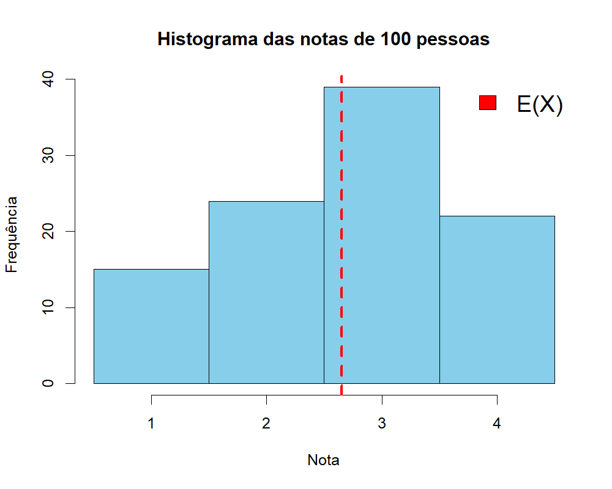

```{r setup, include=FALSE}
knitr::opts_chunk$set(echo = TRUE, warning = FALSE, message = FALSE, fig.retina = 2,
                      dev.args = list(bg = "transparent"))
suppressPackageStartupMessages({library(tidyverse); library(patchwork)})
barras_prob <- function(k, p, xlab = "k", cor = "#3b5bdb", media = NULL) {
  g <- ggplot(tibble(k = k, p = p), aes(k, p)) +
    geom_col(width = 0.08 * diff(range(k)) / 3, fill = cor) + geom_point(size = 3, color = cor) +
    scale_y_continuous(expand = expansion(mult = c(0, 0.15))) +
    labs(x = xlab, y = "P(X = k)") + theme_minimal(base_size = 14)
  if (!is.null(media)) g <- g + geom_vline(xintercept = media, color = "#c0392b", linetype = "dashed", linewidth = 1)
  g
}
```

class: inverse, center, middle

# Aula 18: Esperança e variância

### Variáveis aleatórias discretas

### Parte 1 (50 min) · intervalo · Parte 2 (50 min)

---

## Roteiro da aula (100 minutos)

.roteiro[

| Tempo | Parte 1: esperança |
|:---|:---|
| 0–5 min | Provocação: resultado "acima do esperado" |
| 5–15 min | Valor esperado: a seguradora |
| 15–30 min | Definição; **Atividade 1**: posto de saúde |
| 30–40 min | Esperança de uma função de X |
| 40–50 min | **Atividade 2**: o dado |

| Tempo | Parte 2: variância, propriedades e risco |
|:---|:---|
| 0–12 min | Variância e desvio padrão |
| 12–22 min | Três valores; duas moedas |
| 22–30 min | Propriedades da esperança e da variância |
| 30–38 min | Dados reais: trimestres de queda do PIB |
| 38–45 min | **Atividade 3**: dois investimentos e a rifa |
| 45–50 min | Uso do R e resumo |

]

---

class: inverse, center, middle

# Parte 1: esperança

### 50 minutos

---

## Provocação: o que é um valor "esperado"? .tempo[0–5 min]

.pull-left[
```{r microsoft, echo=FALSE, out.width="100%"}

```

.fonte[Fonte: TI Inside (30/04/2025).]
]

.pull-right[
"Resultado **acima do esperado**": os analistas esperavam lucro de US$ 3,22 por ação e a Microsoft
entregou US$ 3,46.

- O que quer dizer "esperar" um valor que **ninguém** sabia de antemão?
- A seguradora da aula passada paga R$ 0, R$ 50.000 ou R$ 100.000. Quanto ela "espera" pagar por
  cliente?

.caixa-discussao[
O valor esperado **não precisa** ser um dos valores possíveis. Nenhum cliente recebe o valor
esperado do seguro.
]
]

---

## Valor esperado de uma variável aleatória .tempo[5–15 min]

- Uma variável aleatória é um valor baseado no resultado de um experimento aleatório.
- Se o experimento fosse repetido **muitas** vezes, poderíamos calcular a **média** dos valores
  obtidos:
  - a média dos valores obtidos no lançamento de um dado;
  - a média do número de gols de um time em diferentes partidas;
  - a média das receitas de uma empresa em diferentes anos.

--

.caixa-aplicacao[
O **valor esperado** (ou **esperança**) de uma variável aleatória é o valor que ela assume **em
média**, no longo prazo.
]

---

## Exemplo: quanto a seguradora paga, em média?

| Pagamento (R$) | 100.000 | 50.000 | 0 |
|:---|:---:|:---:|:---:|
| Probabilidade | 1/1.000 | 2/1.000 | 997/1.000 |

Suponha **1.000 clientes** exatamente como na distribuição: 1 morreu, 2 ficaram incapacitados e 997
não tiveram problema. Qual é a média dos pagamentos?

--

$$
\frac{100.000 \times 1 + 50.000 \times 2 + 0 \times 997}{1.000} = 200
$$

ou, equivalentemente,

$$
100.000 \times \frac{1}{1.000} + 50.000 \times \frac{2}{1.000} + 0 \times \frac{997}{1.000} = 200.
$$

.caixa-aplicacao[
A média é **cada valor possível multiplicado pela sua probabilidade**, e depois somado.
]

---

## Definição de valor esperado .tempo[15–30 min]

Seja \\(X\\) uma variável aleatória que assume os valores \\(x\_1, x\_2, \ldots, x\_k\\) com probabilidades

| valor | \\(x\_1\\) | \\(x\_2\\) | \\(\cdots\\) | \\(x\_k\\) |
|:---|:---:|:---:|:---:|:---:|
| probabilidade | \\(P(X = x\_1)\\) | \\(P(X = x\_2)\\) | \\(\cdots\\) | \\(P(X = x\_k)\\) |

O **valor esperado** de \\(X\\) é

$$
E(X) = x\_1 \cdot P(X = x\_1) + \cdots + x\_k \cdot P(X = x\_k) = \sum\_{i=1}^{k} x\_i \cdot P(X = x\_i).
$$

--

.caixa-discussao[
**Atenção:** \\(E(X)\\) **não** é calculado a partir de dados, mas da **distribuição de probabilidade**.
Compare com a média de uma tabela de frequências, \\(\bar x = \sum f\_i x\_i\\) (Aula 04): mesma
estrutura, com **probabilidades** no lugar de **frequências relativas**.
]

---

## Exercício 1: avaliação de um posto de saúde

Os usuários de um posto de saúde avaliam o serviço com uma nota de 1 a 4. Seja \\(X\\) a nota recebida,
com distribuição

| \\(k\\) | 1 | 2 | 3 | 4 |
|:---:|:---:|:---:|:---:|:---:|
| \\(P(X = k)\\) | 0,15 | 0,25 | 0,40 | 0,20 |

Em média, qual é a nota recebida pelo posto?

--

.caixa-resposta[
\\(E(X) = 1 \cdot 0{,}15 + 2 \cdot 0{,}25 + 3 \cdot 0{,}40 + 4 \cdot 0{,}20 = 0{,}15 + 0{,}50 + 1{,}20 + 0{,}80 = 2{,}65\\).

Em média, o posto recebe nota **2,65**.
]

---

## Valor esperado de uma função de \\(X\\) .tempo[30–40 min]

Suponha que queremos a **nota ao quadrado**, \\(E(X^2)\\). \\(X^2\\) também é uma variável aleatória:

| \\(k\\) | 1 | 2 | 3 | 4 |
|:---:|:---:|:---:|:---:|:---:|
| \\(k^2\\) | 1 | 4 | 9 | 16 |
| \\(P(X = k)\\) | 0,15 | 0,25 | 0,40 | 0,20 |

$$
E(X^2) = 1 \cdot 0{,}15 + 4 \cdot 0{,}25 + 9 \cdot 0{,}40 + 16 \cdot 0{,}20 = 7{,}95
$$

--

De forma geral, para qualquer função real \\(g\\):

$$
E[g(X)] = g(x\_1) \cdot P(X = x\_1) + \cdots + g(x\_k) \cdot P(X = x\_k) = \sum\_{i=1}^{k} g(x\_i) \cdot P(X = x\_i)
$$

.caixa-discussao[
\\(E(X^2) = 7{,}95\\) e \\([E(X)]^2 = 2{,}65^2 = 7{,}02\\). Em geral, \\(E(X^2) \neq [E(X)]^2\\).
]

---

## Exercício 2: o dado .tempo[40–50 min]

Seja \\(Y\\) o valor obtido no lançamento de um dado honesto. **a)** Qual é \\(E(Y)\\)? **b)** Qual é
\\(E(Y^2)\\)?

--

.caixa-resposta[
**a)** \\(E(Y) = 1 \cdot \frac{1}{6} + 2 \cdot \frac{1}{6} + 3 \cdot \frac{1}{6} + 4 \cdot \frac{1}{6} + 5 \cdot \frac{1}{6} + 6 \cdot \frac{1}{6} = \frac{21}{6} = 3{,}5\\).

**b)** \\(E(Y^2) = (1 + 4 + 9 + 16 + 25 + 36) \cdot \frac{1}{6} = \frac{91}{6} \approx 15{,}17\\).
]

--

```{r dado-media, echo=FALSE, fig.height=2.4, fig.width=9, out.width="80%"}
set.seed(18)
medias <- tibble(n = 1:3000, media = cumsum(sample(1:6, 3000, replace = TRUE)) / (1:3000))
ggplot(medias, aes(n, media)) + geom_hline(yintercept = 3.5, color = "#c0392b", linetype = "dashed") +
  geom_line(color = "#3b5bdb") + scale_x_log10() + labs(x = "Número de lançamentos (log)", y = "Média acumulada") +
  theme_minimal(base_size = 13)
```

.small[O valor 3,5 **nunca** sai no dado, mas é para onde a **média** dos lançamentos converge.]

---

class: inverse, center, middle

# Intervalo

### 10 minutos

---

class: inverse, center, middle

# Parte 2: variância, propriedades e risco

### 50 minutos

---

## E a variabilidade? .tempo[0–12 min]

.pull-left-60[
```{r hist-posto, echo=FALSE, out.width="88%"}

```

]

.pull-right-40[
Uma amostra de **100 notas** do posto de saúde.

- O **valor esperado** (linha vermelha) é uma medida de **tendência central**.
- Como medir a **variabilidade** de \\(X\\)?
]

.clear[]

--

.caixa-aplicacao[
**Relembrando** (Aula 06): para dados \\(x\_1, \ldots, x\_n\\), \\(\bar x = \frac{1}{n}\sum x\_i\\) e
\\(var = \frac{1}{n}\sum (x\_i - \bar x)^2\\). Para variáveis aleatórias, trocamos \\(1/n\\) pelas
**probabilidades**.
]

---

## Variância e desvio padrão

Seja \\(X\\) uma variável aleatória com valores \\(x\_1, \ldots, x\_k\\) e \\(\mu = E(X)\\). A **variância** de
\\(X\\) é

$$
Var(X) = E[(X - \mu)^2] = \sum\_{i=1}^{k} (x\_i - \mu)^2 \cdot P(X = x\_i).
$$

--

**Fórmula alternativa** (em geral mais rápida):

$$
Var(X) = E(X^2) - \mu^2
$$

--

O **desvio padrão** de \\(X\\) é

$$
dp(X) = \sqrt{Var(X)}.
$$

---

## Exemplo: três valores .tempo[12–22 min]

Seja \\(X\\) com valores \\(\\{-1, 0, 1\\}\\) e \\(P(X = -1) = 0{,}2\\), \\(P(X = 0) = 0{,}5\\), \\(P(X = 1) = 0{,}3\\).
**a)** Qual é a variância de \\(X\\)? **b)** E o desvio padrão?

--

.pull-left[
**Pela fórmula alternativa:**

\\(E(X) = (-1)(0{,}2) + 0(0{,}5) + 1(0{,}3) = 0{,}1\\)

\\(E(X^2) = (-1)^2(0{,}2) + 0^2(0{,}5) + 1^2(0{,}3) = 0{,}5\\)

\\(Var(X) = 0{,}5 - 0{,}1^2 = 0{,}49\\)

\\(dp(X) = \sqrt{0{,}49} = 0{,}7\\)
]

--

.pull-right[
**Pela definição:**

| \\(x\\) | \\(x - 0{,}1\\) | \\((x - 0{,}1)^2\\) | \\(P\\) | produto |
|:---:|:---:|:---:|:---:|:---:|
| \\(-1\\) | \\(-1{,}1\\) | 1,21 | 0,2 | 0,242 |
| 0 | \\(-0{,}1\\) | 0,01 | 0,5 | 0,005 |
| 1 | 0,9 | 0,81 | 0,3 | 0,243 |
| | | | **Soma** | **0,490** |
]

---

## Exercício 3: duas moedas

Seja \\(X\\) o número de caras após lançar uma moeda honesta **duas vezes**. **a)** Ache a distribuição
de \\(X\\). **b)** Qual é a média de \\(X\\)? **c)** Qual é a variância de \\(X\\)?

--

.caixa-resposta[
**a)** \\(X \in \\{0, 1, 2\\}\\), \\(P(X = 0) = 1/4\\), \\(P(X = 1) = 1/2\\), \\(P(X = 2) = 1/4\\).

**b)** \\(E(X) = 0 \cdot \frac{1}{4} + 1 \cdot \frac{1}{2} + 2 \cdot \frac{1}{4} = 1\\).

**c)** \\(Var(X) = (0-1)^2 \cdot \frac{1}{4} + (1-1)^2 \cdot \frac{1}{2} + (2-1)^2 \cdot \frac{1}{4} = \frac{1}{2}\\).
]

--

**Exercício 4.** Calcule a variância e o desvio padrão da nota do posto de saúde.

.caixa-resposta[
\\(Var(X) = E(X^2) - [E(X)]^2 = 7{,}95 - 2{,}65^2 = 7{,}95 - 7{,}0225 = 0{,}9275\\); \\(dp(X) \approx 0{,}963\\).
]

---

## Propriedades da esperança .tempo[22–30 min]

Sejam \\(c\\) uma constante e \\(X\\), \\(Y\\) variáveis aleatórias.

| Propriedade | Exemplo |
|:---|:---|
| \\(E(c \cdot X) = c \cdot E(X)\\) | preço em dólar \\(\times\\) câmbio |
| \\(E(c + X) = c + E(X)\\) | taxa fixa somada a um custo aleatório |
| \\(E(X + Y) = E(X) + E(Y)\\) | receita total de duas filiais |
| \\(E(X \cdot Y) = E(X) \cdot E(Y)\\), **se** \\(X\\) e \\(Y\\) forem **independentes** | |

--

.caixa-aplicacao[
**Ex.:** a seguradora cobra R$ 350 por apólice. O **lucro** por cliente é \\(L = 350 - X\\), e

\\(E(L) = 350 - E(X) = 350 - 200 = 150\\) reais por cliente, em média.
]

---

## Propriedades da variância

Sejam \\(c\\) uma constante e \\(X\\), \\(Y\\) variáveis aleatórias.

| Propriedade | Leitura |
|:---|:---|
| \\(Var(c + X) = Var(X)\\) | somar uma constante **desloca**, não espalha |
| \\(Var(c \cdot X) = c^2 \cdot Var(X)\\) | mudar a escala multiplica a variância por \\(c^2\\) |
| \\(Var(X + Y) = Var(X) + Var(Y)\\), **se** independentes | riscos independentes **se somam** na variância |

--

.caixa-discussao[
Se \\(Var(cX) = c^2 Var(X)\\), o que acontece com o **desvio padrão** quando multiplicamos \\(X\\) por
\\(c\\)? E com o desvio padrão de um valor medido em reais quando o convertemos para milhares de reais?
]

---

```{r pib-quedas, include=FALSE}
tx <- read.csv("pib_trimestral_taxas.csv")
qq <- subset(tx, componente == "PIB a preços de mercado" & grepl("imediatamente", taxa))
qq$ano <- qq$trimestre %/% 100
anos <- aggregate(valor_pct ~ ano, data = subset(qq, ano >= 1997 & ano <= 2025), FUN = function(v) sum(v < 0))
dist <- as.numeric(prop.table(table(factor(anos$valor_pct, levels = 0:4))))
p_q <- mean(subset(qq, ano >= 1997 & ano <= 2025)$valor_pct < 0)
fmt <- function(x, d = 3) format(round(x, d), nsmall = d, decimal.mark = ",")
fmtm <- function(x, d = 3) gsub(",", "{,}", fmt(x, d), fixed = TRUE)
```

## Dados reais: E(X) e Var(X) das quedas do PIB .tempo[30–38 min]

Na Aula 17, \\(X\\) = número de trimestres de queda do PIB em um ano, com a distribuição observada em 1997–2025.

.pull-left[
$$
E(X) = \sum k\\, P(X = k) \approx `r fmtm(sum(0:4 * dist), 2)`
$$

$$
Var(X) = \sum k^2 P(X = k) - [E(X)]^2 \approx `r fmtm(sum((0:4)^2 * dist) - sum(0:4 * dist)^2, 2)`
$$

.small[
Se os trimestres fossem **independentes**, cada um com a mesma chance \\(p \approx `r fmtm(p_q, 3)`\\) de queda, a Aula 20
mostrará que \\(E(X) = 4p \approx `r fmtm(4 * p_q, 2)`\\) e \\(Var(X) = 4p(1-p) \approx `r fmtm(4 * p_q * (1 - p_q), 2)`\\).
]
]

.pull-right[
```{r quedas-media, echo=FALSE, fig.height=3, fig.width=5, out.width="100%"}
barras_prob(0:4, dist, "Trimestres de queda no ano", cor = "#0d3b54", media = sum(0:4 * dist))
```
]

.clear[]

.caixa-economia[
A média bate com a do modelo "trimestres independentes", mas a **variância observada é quase o dobro**: anos ruins vêm
com **várias** quedas (recessões duram). Para planejar receitas públicas, a variância importa tanto quanto a média.
]

---

## Dois investimentos com o mesmo retorno esperado .tempo[38–45 min]

.pull-left[
**Investimento A:** rende \\(+10\\%\\) ou \\(-2\\%\\), cada um com probabilidade 0,5.

**Investimento B:** rende \\(+20\\%\\) ou \\(-12\\%\\), cada um com probabilidade 0,5.
]

.pull-right[
```{r invest, echo=FALSE, fig.height=2.3, fig.width=5, out.width="100%"}
tibble(inv = rep(c("A", "B"), each = 2), r = c(10, -2, 20, -12), p = 0.5) |>
  ggplot(aes(r, p, color = inv)) + geom_segment(aes(xend = r, yend = 0), linewidth = 1.2) + geom_point(size = 3) +
  geom_vline(xintercept = 4, linetype = "dashed") + facet_wrap(~inv, ncol = 1) +
  scale_color_manual(values = c("#3b5bdb", "#c9971e"), guide = "none") +
  labs(x = "Retorno (%)", y = "Probabilidade") + theme_minimal(base_size = 12)
```

]

.clear[]

--

.caixa-resposta[
\\(E(A) = 0{,}5(10) + 0{,}5(-2) = 4\\%\\) e \\(E(B) = 0{,}5(20) + 0{,}5(-12) = 4\\%\\).

\\(E(A^2) = 0{,}5(100) + 0{,}5(4) = 52\\), \\(Var(A) = 52 - 16 = 36\\), \\(dp(A) = 6\\) p.p.

\\(E(B^2) = 0{,}5(400) + 0{,}5(144) = 272\\), \\(Var(B) = 272 - 16 = 256\\), \\(dp(B) = 16\\) p.p.
]

.caixa-economia[
Mesmo **retorno esperado**, **riscos** muito diferentes: em finanças, o desvio padrão do retorno é a
medida mais simples de **risco**.
]

---

## Rifa: vale a pena comprar?

Um bilhete de rifa custa **R$ 10**. São vendidos 1.000 bilhetes e sorteado **um** prêmio de
**R$ 5.000**. Seja \\(G\\) o ganho líquido de quem compra um bilhete.

--

| Resultado | Ganho líquido \\(G\\) | Probabilidade |
|:---|:---:|:---:|
| Ganha | \\(5.000 - 10 = 4.990\\) | 1/1.000 |
| Perde | \\(-10\\) | 999/1.000 |

--

$$
E(G) = 4.990 \cdot \frac{1}{1.000} + (-10) \cdot \frac{999}{1.000} = 4{,}99 - 9{,}99 = -5
$$

.caixa-discussao[
Em média, cada comprador **perde R$ 5**, e a organização da rifa ganha R$ 5 por bilhete. Por que
então tanta gente compra? O valor esperado é o único critério razoável para uma decisão?
]

---

## Atividade 3 (cont.): seguros e diversificação

**1.** Uma seguradora cobra exatamente o **valor esperado** do pagamento (R$ 200). Por que ela
quebraria no longo prazo? Que outras despesas e **riscos** o preço precisa cobrir?

**2.** Uma empresa tem 1.000 apólices **independentes** iguais. Use as propriedades para calcular a
esperança e a variância do **pagamento total**, sabendo que \\(Var(X) = 14.960.000\\) por apólice. O
desvio padrão do total cresce **na mesma proporção** que o número de apólices?

--

.caixa-resposta[
**2.** \\(E(\text{total}) = 1.000 \times 200 = 200.000\\); \\(Var(\text{total}) = 1.000 \times 14.960.000\\), logo
\\(dp(\text{total}) = \sqrt{1.000} \times 3.868 \approx 122.300\\). A média cresce 1.000 vezes, o desvio padrão só
\\(\sqrt{1.000} \approx 32\\) vezes: o risco **relativo** cai. É o princípio da **diversificação** dos seguros.
]

---

## Uso do R: esperança e variância .tempo[45–50 min]

```{r uso-r-1}
k <- 1:4
p <- c(0.15, 0.25, 0.40, 0.20)           # notas do posto

EX  <- sum(k * p)                         # E(X)
EX2 <- sum(k^2 * p)                       # E(X^2)
VarX <- EX2 - EX^2
c(E = EX, E2 = EX2, Var = VarX, dp = sqrt(VarX))

# seguradora
pag <- c(100000, 50000, 0); pr <- c(1, 2, 997) / 1000
c(E = sum(pag * pr), dp = sqrt(sum(pag^2 * pr) - sum(pag * pr)^2))
```

---

## Uso do R: conferindo por simulação

```{r uso-r-2}
set.seed(18)
notas <- sample(1:4, 100000, replace = TRUE, prob = c(0.15, 0.25, 0.40, 0.20))
c(media = mean(notas), var_n = mean((notas - mean(notas))^2))    # perto de 2,65 e 0,9275

# lucro de 1.000 apólices, repetido 5.000 vezes
lucro_total <- replicate(5000, {
  pagamentos <- sample(c(100000, 50000, 0), 1000, replace = TRUE, prob = c(1, 2, 997) / 1000)
  1000 * 350 - sum(pagamentos)
})
c(media = mean(lucro_total), prob_prejuizo = mean(lucro_total < 0))
```

.caixa-r[
Mesmo com lucro **esperado** de R$ 150.000, há uma probabilidade não desprezível de **prejuízo** em um
ano ruim. A variância importa!
]

---

## Resumo

- **Esperança:** \\(E(X) = \sum x\_i \, P(X = x\_i)\\), a média de \\(X\\) no longo prazo.
- **Função de \\(X\\):** \\(E[g(X)] = \sum g(x\_i) \, P(X = x\_i)\\); em geral \\(E(X^2) \neq [E(X)]^2\\).
- **Variância:** \\(Var(X) = E[(X - \mu)^2] = E(X^2) - \mu^2\\); **desvio padrão:** \\(dp(X) = \sqrt{Var(X)}\\).
- **Propriedades:** \\(E(cX + d) = cE(X) + d\\); \\(Var(cX + d) = c^2 Var(X)\\); somas de variáveis
  **independentes** somam as variâncias.
- Mesmo valor esperado pode esconder **riscos** muito diferentes.

---

class: inverse, center, middle

# Próxima aula (28/10)

## Função de distribuição acumulada (VA discreta)
