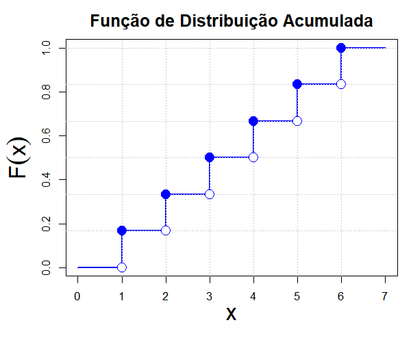
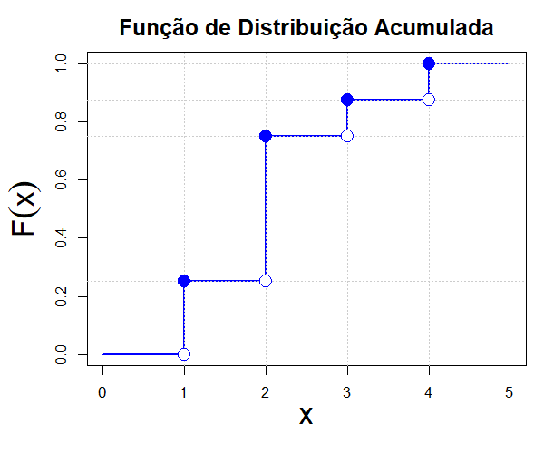

```{r setup, include=FALSE}
knitr::opts_chunk$set(echo = TRUE, warning = FALSE, message = FALSE, fig.retina = 2)
suppressPackageStartupMessages(library(tidyverse))
```

class: inverse, center, middle

# Aula 19: FDA de variável discreta

### Provocação · Teoria · Aplicação · Discussão

---

## Um ponto a menos que faz toda a diferença

> \(P(X\ge2)\) e \(P(X>2)\) soam quase iguais em português. Para uma variável discreta que só assume
> valores inteiros, elas são a mesma coisa? E se \(X\) fosse contínua?

---

class: inverse, center, middle

# Bloco 1: Teoria

---

## Definição

$$
F(x) = P(X\le x) = \sum_{x_i\le x} p(x_i)
$$

Para VA discreta, \(F\) é **função em escada**: constante entre valores possíveis, com salto de
tamanho \(p(x_i)\) em cada \(x_i\).

--

## Cuidado com \(\le\) vs. \(<\)

$$
P(X > x) = 1-F(x) \qquad P(X\ge x) = 1-F(x-1) \ \text{(para $X$ inteira)}
$$

A diferença de um ponto **importa** no caso discreto, ao contrário do caso contínuo (Cap. 4).

---

class: inverse, center, middle

# Bloco 2: Aplicação

---

## FDA do número de sinistros

```{r fda}
sinistros <- tibble(x = 0:4, p = c(0.60, 0.25, 0.10, 0.04, 0.01)) |>
  mutate(F = cumsum(p))
sinistros
```

```{r grafico-fda, fig.height=3.3, echo=FALSE}
ggplot(sinistros, aes(x, F)) + geom_step(color="#0d3b54", linewidth=1) +
  geom_point(color="#c9971e", size=2) +
  labs(x="x", y="F(x)") + theme_minimal(base_size=13)
```

---

## Lendo probabilidades da FDA

$$
P(X\le 2) = F(2) = 0{,}95 \qquad P(X>2) = 1-F(2) = 0{,}05
$$
$$
P(X\ge 2) = 1-F(1) = 1-0{,}85 = 0{,}15
$$

```{r leituras}
sinistros$F[sinistros$x == 2]         # F(2)
1 - sinistros$F[sinistros$x == 1]     # P(X >= 2) = 1 - F(1)
```

---

## Contraste: uma FDA com saltos iguais

```{r fig-fda-dado, echo=FALSE, out.width="55%"}

```

Lançamento de um dado honesto: seis saltos, todos de tamanho \(1/6\) (distribuição uniforme
discreta). Na FDA dos sinistros, os saltos têm tamanhos diferentes, proporcionais a cada
\(p(x_i)\), porque ali a distribuição não é uniforme. Mesma definição de \(F\), formato da escada
diferente porque \(p(x)\) é diferente.

---

class: inverse, center, middle

# Bloco 3: Discussão (bloco central da aula)

---

## Rodada 1: resolvendo a provocação inicial

**1.** Volte à pergunta de abertura: \(P(X\ge2)\) e \(P(X>2)\) são iguais para \(X\) discreta? Calcule as
duas usando a tabela e confirme numericamente.

**2.** Por que \(P(X\ge2)\) usa \(F(1)\) (não \(F(2)\)) na fórmula? Em que ponto exatamente \(1-F(2)\) e
\(1-F(1)\) diferem, e o que cada expressão representa em termos do gráfico em escada?

---

## Rodada 2: leia outra FDA

```{r fig-fda-exercicio, echo=FALSE, out.width="50%"}

```

**3.** Nesse gráfico, o círculo **cheio** marca o ponto que pertence à escada (o valor de \(F\) ali),
o círculo **aberto** marca o valor que a escada está deixando para trás no salto seguinte. Leia
\(F(2)\), \(P(X>2)\) e \(P(X=3)\) diretamente do gráfico.

---

## Rodada 2: continuação

**4.** A partir só do gráfico anterior (sem nenhuma tabela de \(p(x)\)), como você recuperaria
\(p(x_i)\) para cada \(x_i\)? Escreva a fórmula geral usando a diferença de dois valores de \(F\), e
confira aplicando-a aos saltos que você acabou de ler.

**5.** Um contrato de seguro paga um bônus se "o segurado tiver no máximo 1 sinistro no ano". Um
segundo contrato paga o mesmo bônus se "o segurado tiver menos de 2 sinistros". Para uma variável
discreta como esta, os dois contratos pagam exatamente nas mesmas condições? Formalize com \(F\).

---

class: inverse, center, middle

# Próxima aula (04/11)

## Distribuição de Bernoulli e Distribuição Binomial
