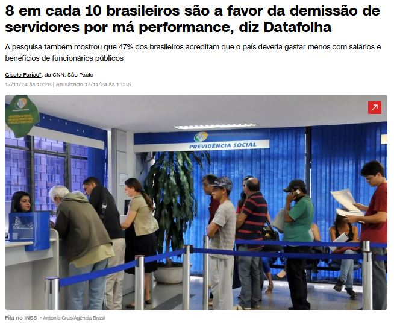

```{r setup, include=FALSE}
knitr::opts_chunk$set(echo = TRUE, warning = FALSE, message = FALSE, fig.retina = 2,
                      dev.args = list(bg = "transparent"))
suppressPackageStartupMessages({library(tidyverse); library(patchwork)})
barras_bin <- function(n, p, destaque = NULL, cor = "#3b5bdb") {
  d <- tibble(k = 0:n, pk = dbinom(0:n, n, p), dest = if (is.null(destaque)) FALSE else k %in% destaque)
  ggplot(d, aes(k, pk, fill = dest)) + geom_col(width = 0.6, show.legend = FALSE) +
    scale_fill_manual(values = c(`FALSE` = cor, `TRUE` = "#c0392b")) +
    scale_x_continuous(breaks = 0:n) + labs(x = "k", y = "P(X = k)") + theme_minimal(base_size = 13)
}
```

class: inverse, center, middle

# Aula 20: Distribuições de Bernoulli e Binomial

### Parte 1 (50 min) · intervalo · Parte 2 (50 min)

---

## Roteiro da aula (100 minutos)

.roteiro[

| Tempo | Parte 1: Bernoulli e Binomial |
|:---|:---|
| 0–5 min | Provocação: a variável aleatória de uma opinião |
| 5–18 min | Modelos probabilísticos; Bernoulli |
| 18–32 min | Binomial: de onde vem a fórmula |
| 32–42 min | Forma da Binomial; garantia de qualidade |
| 42–50 min | **Atividade 1**: pacotes com cinco peças |

| Tempo | Parte 2: aplicações e limites da Binomial |
|:---|:---|
| 0–12 min | Propriedades; **Atividade 2**: cinco moedas |
| 12–20 min | De volta à pesquisa do celular |
| 20–28 min | Tamanho de amostra para detectar um defeito |
| 28–38 min | Dados reais: a Binomial falha nos trimestres de queda do PIB |
| 38–44 min | **Atividade 3**: discussão |
| 44–50 min | Uso do R e resumo |

]

---

class: inverse, center, middle

# Parte 1: Bernoulli e Binomial

### 50 minutos

---

## Provocação: qual é a variável aleatória de uma opinião? .tempo[0–5 min]

.pull-left[
```{r celular, echo=FALSE, out.width="100%"}
knitr::include_graphics("images/pesquisa_celular.jpg")
```

.fonte[Fonte: Agência Brasil (14/11/2024).]
]

.pull-right[
Cada entrevistado responde **a favor** ou **contra** a restrição do celular nas escolas.

- Que número associamos à resposta de **uma** pessoa?
- E ao resultado de uma pesquisa com **1.000** pessoas?
- Se 86% da população é a favor, qual é a chance de **exatamente** 8 de 10 entrevistados serem a
  favor?

.caixa-discussao[
Respostas do tipo **sim/não** aparecem em toda parte. Hoje veremos os **modelos** para elas.
]
]

---

## Distribuições mais comuns na prática .tempo[5–18 min]

Variáveis aleatórias **binárias** (valor 0 ou 1) são comuns em estudos sobre a **ocorrência ou não**
de um evento:

- **pesquisa de opinião:** concorda ou não com algo;
- **finanças:** o cliente de uma seguradora acionou ou não o seguro;
- **saúde:** o paciente contraiu ou não a doença.

--

De forma geral, algumas distribuições aparecem **muito mais** que outras:

| Tipo de dado | Valores | Modelos (nesta disciplina) |
|:---|:---|:---|
| Binário | \\(\\{0, 1\\}\\) | Bernoulli |
| Contagem | \\(\\{0, 1, 2, \ldots\\}\\) | Binomial, Poisson |
| Mensuração | números reais | Uniforme, Normal (Unidade 4) |

---

## Modelos probabilísticos

Essas distribuições mais comuns são **modelos probabilísticos**:

- **famílias** de distribuições de probabilidade que dependem de um ou mais **parâmetros**;
- sabendo o valor do parâmetro, podemos calcular **qualquer** probabilidade;
- os parâmetros **caracterizam** a distribuição: probabilidades, média, variância, FDA...

--

.caixa-aplicacao[
Em vez de construir uma tabela nova para cada problema (como nas Aulas 17 a 19), reconhecemos o
**modelo** e usamos a sua fórmula. O primeiro modelo é a distribuição de **Bernoulli**.
]

---

## Distribuição de Bernoulli

Modela um experimento com **dois** resultados: **sucesso** ou **fracasso**.

$$
X = \begin{cases} 1, & \text{se o resultado é sucesso},\\\\ 0, & \text{se o resultado é fracasso}. \end{cases}
$$

Seja \\(p = P(X = 1)\\), com \\(0 \leq p \leq 1\\). A distribuição de \\(X\\) é

| \\(k\\) | 0 | 1 |
|:---:|:---:|:---:|
| \\(P(X = k)\\) | \\(1 - p\\) | \\(p\\) |

**Notação:** \\(X \sim \text{Bernoulli}(p)\\), "\\(X\\) segue distribuição de Bernoulli com parâmetro \\(p\\)".

--

.caixa-discussao[
"Sucesso" é só um **rótulo** para o evento de interesse: pode ser "o cliente **deu calote**" ou "a
peça **tem defeito**".
]

---

## Exemplos de Bernoulli

**1.** Pessoas têm probabilidade de **1%** de contrair uma doença. Uma pessoa é sorteada e anota-se
\\(X = 1\\) se ela tem a doença e \\(X = 0\\) caso contrário:

$$
X \sim \text{Bernoulli}(0{,}01).
$$

**2.** Um equipamento eletrônico apresenta defeito em 5 anos com probabilidade de **10%**. Anota-se
\\(Y = 1\\) se houve defeito e \\(Y = 0\\) caso contrário:

$$
Y \sim \text{Bernoulli}(0{,}1).
$$

---

## Propriedades da Bernoulli

Seja \\(X \sim \text{Bernoulli}(p)\\), com \\(0 &lt; p &lt; 1\\).

**Função de probabilidade:**

$$
P(X = k) = p^k (1 - p)^{1-k}, \qquad k \in \\{0, 1\\}.
$$

.small[
Confira: \\(k = 1\\) dá \\(p^1(1-p)^0 = p\\); \\(k = 0\\) dá \\(p^0(1-p)^1 = 1 - p\\).
]

--

**Média e variância** (pelas fórmulas da Aula 18):

$$
E(X) = 0 \cdot (1 - p) + 1 \cdot p = p
$$

$$
E(X^2) = 0^2 (1 - p) + 1^2 p = p \quad \Rightarrow \quad Var(X) = p - p^2 = p(1 - p)
$$

.caixa-discussao[
Para qual valor de \\(p\\) a variância é **máxima**? Faz sentido que seja quando a incerteza é maior?
]

---

## Qual é a variável aleatória de uma pesquisa? .tempo[18–32 min]

.pull-left[
```{r datafolha, echo=FALSE, out.width="100%"}

```

.fonte[Fonte: CNN Brasil (17/11/2024).]
]

.pull-right[
- Cada entrevistado é um **experimento de Bernoulli**: concorda (1: sucesso) ou não (0: fracasso).
- Interesse: o **número de sucessos** em um certo número de repetições.
- Ex.: dentre 10 pessoas aleatórias, **8** concordam.

.caixa-aplicacao[
Precisamos de um **modelo para contagens** de sucessos: a distribuição **Binomial**.
]
]

---

## Distribuição Binomial

São realizadas \\(n\\) repetições **independentes** de um experimento de Bernoulli, cada uma com
probabilidade de sucesso \\(p\\) (e de fracasso \\(1 - p\\)).

Seja \\(X\\) o **número de sucessos** nessas \\(n\\) repetições. Então \\(X\\) tem **distribuição Binomial**
com parâmetros \\(n\\) e \\(p\\):

$$
X \sim \text{Bin}(n, p), \qquad X \in \\{0, 1, 2, \ldots, n\\}.
$$

--

**Ex.:** se pessoas sorteadas aprovam a demissão de servidores por má performance com probabilidade
**80%**, o número \\(X\\) de pessoas que aprovam dentre **100** sorteadas é

$$
X \sim \text{Bin}(100;\ 0{,}8), \qquad X \in \\{0, 1, 2, \ldots, 99, 100\\}.
$$

---

## De onde vem a fórmula? Um exemplo pequeno

Três clientes independentes, cada um paga o empréstimo com probabilidade \\(p = 0{,}9\\). Seja \\(X\\) o
número de clientes que pagam. Quanto vale \\(P(X = 2)\\)?

--

**Sequências** com exatamente 2 pagamentos (P) e 1 calote (C):

| Sequência | Probabilidade (independência) |
|:---:|:---|
| P P C | \\(0{,}9 \times 0{,}9 \times 0{,}1 = 0{,}081\\) |
| P C P | \\(0{,}9 \times 0{,}1 \times 0{,}9 = 0{,}081\\) |
| C P P | \\(0{,}1 \times 0{,}9 \times 0{,}9 = 0{,}081\\) |

--

- **Cada** sequência tem probabilidade \\(p^2 (1 - p)^1\\).
- **Quantas** sequências? Escolher as 2 posições dos sucessos entre 3: \\(\binom{3}{2} = 3\\).

$$
P(X = 2) = \binom{3}{2}\, (0{,}9)^2\, (0{,}1)^1 = 3 \times 0{,}081 = 0{,}243
$$

---

## Função de probabilidade Binomial

A probabilidade de observarmos \\(k\\) sucessos em \\(n\\) tentativas é

$$
P(X = k) = \binom{n}{k}\, p^k\, (1 - p)^{n-k}, \qquad k \in \\{0, 1, \ldots, n\\},
$$

em que \\(\binom{n}{k} = \dfrac{n!}{k!\,(n-k)!}\\) (Aula 10).

--

.pull-left[
- \\(\binom{n}{k}\\): **quantas** sequências têm \\(k\\) sucessos.
- \\(p^k (1-p)^{n-k}\\): probabilidade de **cada** uma delas.
- Se \\(n = 1\\), obtemos a **Bernoulli**\\((p)\\).
]

.pull-right[
**Quatro condições:**

1. \\(n\\) fixo de tentativas;
2. só dois resultados por tentativa;
3. \\(p\\) igual em todas;
4. tentativas **independentes**.
]

---

## A forma da Binomial depende de \\(n\\) e \\(p\\) .tempo[32–42 min]

```{r formas-bin, echo=FALSE, fig.height=3.6, fig.width=10, out.width="100%"}
(barras_bin(10, 0.1) + ggtitle("Bin(10; 0,1)")) + (barras_bin(10, 0.5) + ggtitle("Bin(10; 0,5)")) +
  (barras_bin(10, 0.86) + ggtitle("Bin(10; 0,86)"))
```

.caixa-discussao[
Com \\(p = 0{,}1\\), a distribuição é assimétrica à **direita**; com \\(p = 0{,}5\\), **simétrica**; com
\\(p = 0{,}86\\), assimétrica à **esquerda**. Onde fica a moda em cada caso?
]

---

## Exemplo: garantia de qualidade

As peças de uma fábrica têm **1%** de probabilidade de serem defeituosas, independentemente umas das
outras. A fábrica vende pacotes com **10** unidades e **devolve o dinheiro** se **mais de uma** peça
do pacote for defeituosa. Qual é a probabilidade de a empresa devolver o dinheiro por um pacote?

--

Seja \\(X\\) o número de peças defeituosas num pacote: \\(X \sim \text{Bin}(10;\ 0{,}01)\\). O dinheiro é
devolvido se \\(X &gt; 1\\).

$$
P(X &gt; 1) = 1 - P(X \leq 1) = 1 - P(X = 0) - P(X = 1)
$$

$$
= 1 - \binom{10}{0}(0{,}01)^0(0{,}99)^{10} - \binom{10}{1}(0{,}01)^1(0{,}99)^9 = 1 - 0{,}9044 - 0{,}0914 \approx 0{,}0043
$$

.caixa-aplicacao[
Usar o **complementar** evita somar \\(P(X = 2) + \cdots + P(X = 10)\\), nove termos.
]

---

## Exercício 1: pacotes com cinco peças .tempo[42–50 min]

As peças de uma fábrica têm **10%** de probabilidade de serem defeituosas, independentemente umas das
outras. A fábrica vende pacotes com **cinco** unidades. Um pacote é escolhido ao acaso.

**a)** Qual é a probabilidade de o pacote ter **quatro peças boas**?

**b)** Qual é a probabilidade de o pacote ter **duas peças defeituosas**?

--

.pull-left[
.caixa-resposta[
Seja \\(X\\) o número de defeituosas: \\(X \sim \text{Bin}(5;\ 0{,}1)\\).

**a)** Quatro boas = **uma** defeituosa:
\\(P(X = 1) = \binom{5}{1}(0{,}1)^1(0{,}9)^4 \approx 0{,}328\\).

**b)** \\(P(X = 2) = \binom{5}{2}(0{,}1)^2(0{,}9)^3 = 10 \times 0{,}01 \times 0{,}729 \approx 0{,}0729\\).
]
]

.pull-right[
```{r ex1-bin, echo=FALSE, fig.height=3, fig.width=5, out.width="100%"}
barras_bin(5, 0.1, destaque = 1:2)
```

]

---

class: inverse, center, middle

# Intervalo

### 10 minutos

---

class: inverse, center, middle

# Parte 2: aplicações e limites da Binomial

### 50 minutos

---

## Propriedades da Binomial .tempo[0–12 min]

Seja \\(I\_j \sim \text{Bernoulli}(p)\\) o resultado da \\(j\\)-ésima tentativa. O número de sucessos em \\(n\\)
tentativas independentes é

$$
X = I\_1 + I\_2 + \cdots + I\_n \sim \text{Bin}(n, p).
$$

--

Pelas propriedades da Aula 18 (soma de variáveis **independentes**):

$$
E(X) = E(I\_1) + \cdots + E(I\_n) = n \cdot p
$$

$$
Var(X) = Var(I\_1) + \cdots + Var(I\_n) = n \cdot p \cdot (1 - p)
$$

.caixa-aplicacao[
**Pesquisa:** \\(X \sim \text{Bin}(1.000;\ 0{,}86)\\) tem \\(E(X) = 860\\) e \\(dp(X) = \sqrt{1.000 \times 0{,}86 \times 0{,}14} \approx 11\\).
Numa amostra de 1.000, esperamos cerca de 860 ± 11 respostas favoráveis.
]

---

## Exercício 2: cinco moedas

Cinco moedas honestas são lançadas independentemente.

**a)** Qual é a probabilidade de se obter **mais de três** caras?

**b)** Qual é o número esperado de caras? **c)** Qual é a variância do número de caras?

--

.caixa-resposta[
Seja \\(X\\) o número de caras: \\(X \sim \text{Bin}(5;\ 0{,}5)\\).

**a)** \\(P(X &gt; 3) = P(X = 4) + P(X = 5) = \binom{5}{4}(0{,}5)^4(0{,}5)^1 + \binom{5}{5}(0{,}5)^5(0{,}5)^0 = \frac{5}{32} + \frac{1}{32} = 0{,}1875\\).

**b)** \\(E(X) = 5 \times 0{,}5 = 2{,}5\\). **c)** \\(Var(X) = 5 \times 0{,}5 \times 0{,}5 = 1{,}25\\).
]

---

## De volta à pesquisa do celular .tempo[12–20 min]

Suponha que **86%** da população apoie a restrição. Entrevistamos **10** pessoas ao acaso. Seja \\(X\\)
o número de pessoas a favor: \\(X \sim \text{Bin}(10;\ 0{,}86)\\).

.pull-left[
**a)** \\(P(X = 8)\\)?

**b)** \\(P(X \geq 8)\\)?

**c)** \\(E(X)\\) e \\(dp(X)\\)?
]

.pull-right[
```{r celular-bin, echo=FALSE, fig.height=2.4, fig.width=5, out.width="100%"}
barras_bin(10, 0.86, destaque = 8:10)
```

]

.clear[]

--

.caixa-resposta[
**a)** \\(P(X = 8) = \binom{10}{8}(0{,}86)^8(0{,}14)^2 = 45 \times 0{,}2992 \times 0{,}0196 \approx 0{,}264\\).

**b)** \\(P(X \geq 8) = P(8) + P(9) + P(10) \approx 0{,}264 + 0{,}360 + 0{,}221 = 0{,}845\\) (ou `1 - pbinom(7, 10, 0.86)`).

**c)** \\(E(X) = 8{,}6\\); \\(dp(X) = \sqrt{10 \times 0{,}86 \times 0{,}14} \approx 1{,}10\\).
]

---

## Tamanho de amostra para detectar um defeito .tempo[20–28 min]

Itens com **1%** de defeito. Qual é o **menor** tamanho de amostra \\(n\\) que garante
\\(P(\text{pelo menos 1 defeituoso}) \geq 0{,}95\\)?

--

Com \\(X \sim \text{Bin}(n;\ 0{,}01)\\):

$$
P(X \geq 1) = 1 - P(X = 0) = 1 - 0{,}99^n \geq 0{,}95 \iff 0{,}99^n \leq 0{,}05
$$

Aplicando logaritmo (e lembrando que \\(\log 0{,}99 &lt; 0\\), o que **inverte** a desigualdade):

$$
n \geq \frac{\log(0{,}05)}{\log(0{,}99)} \approx 298{,}07 \quad \Rightarrow \quad n = 299.
$$

.caixa-economia[
Para ter 95% de chance de **flagrar** um problema que atinge 1% dos itens, é preciso inspecionar quase
**300** itens. É por isso que auditorias por amostragem de eventos raros são caras.
]

---

```{r pib-quedas, include=FALSE}
tx <- read.csv("pib_trimestral_taxas.csv")
qq <- subset(tx, componente == "PIB a preços de mercado" & grepl("imediatamente", taxa))
qq$ano <- qq$trimestre %/% 100
anos <- aggregate(valor_pct ~ ano, data = subset(qq, ano >= 1997 & ano <= 2025), FUN = function(v) sum(v < 0))
dist <- as.numeric(prop.table(table(factor(anos$valor_pct, levels = 0:4))))
p_q <- mean(subset(qq, ano >= 1997 & ano <= 2025)$valor_pct < 0)
fmt <- function(x, d = 3) format(round(x, d), nsmall = d, decimal.mark = ",")
fmtm <- function(x, d = 3) gsub(",", "{,}", fmt(x, d), fixed = TRUE)
```

## Dados reais: trimestres de queda do PIB são Binomiais? .tempo[28–38 min]

Se cada trimestre tivesse chance \\(p \approx `r fmtm(p_q, 3)`\\) de queda **independentemente** dos outros, \\(X \sim \text{Bin}(4; p)\\).

.pull-left-60[
```{r bin-quedas, echo=FALSE, fig.height=3.1, fig.width=6, out.width="100%"}
tibble(k = rep(0:4, 2), prob = c(dist, dbinom(0:4, 4, p_q)),
       fonte = rep(c("Observada (1997–2025)", "Binomial(4; p)"), each = 5)) |>
  ggplot(aes(k, prob, fill = fonte)) + geom_col(position = "dodge", width = 0.6) +
  scale_fill_manual(values = c("#c9971e", "#0d3b54")) +
  labs(x = "Trimestres de queda no ano", y = "Probabilidade", fill = NULL) +
  theme_minimal(base_size = 13) + theme(legend.position = "top")
```
]

.pull-right-40[
.small[

| | Observada | Binomial |
|:---|:---:|:---:|
| \\(P(X = 0)\\) | `r fmt(dist[1])` | `r fmt(dbinom(0, 4, p_q))` |
| \\(P(X \geq 2)\\) | `r fmt(sum(dist[3:5]))` | `r fmt(1 - pbinom(1, 4, p_q))` |
| \\(E(X)\\) | `r fmt(sum(0:4 * dist), 2)` | `r fmt(4 * p_q, 2)` |

]

.caixa-economia[
Qual hipótese da Binomial falhou? Recessões duram vários trimestres: as quedas **não são independentes**.
]
]

---

## Atividade 3: discussão .tempo[38–44 min]

**1.** Toda Binomial supõe quatro condições. Qual delas falha em cada situação?

- **a)** número de inadimplentes entre 50 empresas **do mesmo setor** durante uma crise;
- **b)** número de sorteados com prêmio ao retirar 5 bilhetes **sem reposição** de uma urna com 20;
- **c)** número de dias com chuva em uma semana de janeiro em Salvador.

**2.** Uma pesquisa com \\(n = 10\\) encontrou 6 pessoas a favor. Se o verdadeiro apoio fosse 86%, esse
resultado seria **raro**? Calcule \\(P(X \leq 6)\\) e discuta.

--

.caixa-resposta[
**1a)** Independência (choques comuns). **1b)** \\(p\\) constante (sem reposição, \\(p\\) muda). **1c)**
Independência e \\(p\\) constante (chuva de um dia se correlaciona com a do dia seguinte).
**2.** \\(P(X \leq 6) \approx 0{,}040\\): raro. Ou o apoio é menor que 86%, ou a amostra não foi aleatória.
]

---

## Uso do R: Binomial com `dbinom`, `pbinom`, `rbinom` .tempo[44–50 min]

```{r uso-r-1}
dbinom(2, size = 5, prob = 0.1)           # P(X = 2), o mesmo que choose(5, 2) * 0.1^2 * 0.9^3
pbinom(1, size = 10, prob = 0.01)         # P(X <= 1)  (FDA)
1 - pbinom(1, size = 10, prob = 0.01)     # P(X > 1): devolver o dinheiro
1 - pbinom(7, size = 10, prob = 0.86)     # P(X >= 8)
```

.caixa-r[
Padrão dos nomes no R: `d` = probabilidade pontual, `p` = FDA, `r` = simulação (e `q` = quantil).
Vale para todas as distribuições: `dpois`, `ppois`, `punif`, `pnorm`...
]

---

## Uso do R: simulado vs. teórico

```{r uso-r-2, fig.height=2.5, fig.width=9, out.width="80%"}
set.seed(20)
x <- rbinom(10000, size = 10, prob = 0.86)        # 10 mil pesquisas com 10 entrevistados
simulado <- prop.table(table(factor(x, levels = 0:10)))
teorico  <- dbinom(0:10, size = 10, prob = 0.86)
barplot(rbind(simulado, teorico), beside = TRUE, names.arg = 0:10,
        legend.text = c("simulado", "teórico"), args.legend = list(x = "topleft"))
c(media_sim = mean(x), media_teo = 10 * 0.86, var_sim = var(x), var_teo = 10 * 0.86 * 0.14)
```

---

## Resumo

- **Bernoulli\\((p)\\):** \\(X \in \\{0, 1\\}\\), \\(P(X = k) = p^k(1 - p)^{1-k}\\); \\(E(X) = p\\), \\(Var(X) = p(1 - p)\\).
- **Binomial\\((n, p)\\):** número de sucessos em \\(n\\) tentativas de Bernoulli **independentes** com
  mesmo \\(p\\).
- \\(P(X = k) = \binom{n}{k} p^k (1 - p)^{n-k}\\), \\(k = 0, 1, \ldots, n\\).
- \\(E(X) = np\\) e \\(Var(X) = np(1 - p)\\).
- "Mais de", "pelo menos", "no máximo": pense no **complementar** e na **FDA**.

---

class: inverse, center, middle

# Próxima aula (09/11)

## Distribuição de Poisson
