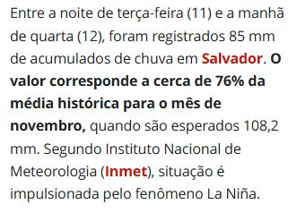
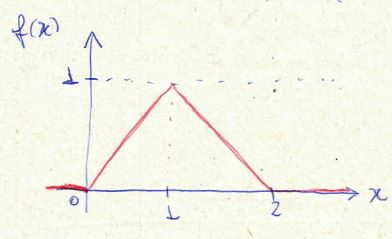

```{r setup, include=FALSE}
knitr::opts_chunk$set(echo = TRUE, warning = FALSE, message = FALSE, fig.retina = 2,
                      dev.args = list(bg = "transparent"))
suppressPackageStartupMessages({library(tidyverse); library(patchwork)})
area_plot <- function(f, xlim, a, b, titulo = NULL, rotulo = NULL, n = 400) {
  d <- tibble(x = seq(xlim[1], xlim[2], length.out = n), y = f(x))
  g <- ggplot(d, aes(x, y)) +
    geom_area(data = filter(d, x >= a, x <= b), fill = "#f4a6a6", alpha = 0.8) +
    geom_line(color = "#1f3fbf", linewidth = 1.1) + labs(x = "x", y = "f(x)", title = titulo) +
    theme_minimal(base_size = 13)
  if (!is.null(rotulo)) g <- g + annotate("text", x = (a + b) / 2, y = max(d$y) * 0.25, label = rotulo, size = 6)
  g
}
tri <- function(x) ifelse(x >= 0 & x <= 1, x, ifelse(x > 1 & x <= 2, 2 - x, 0))
```

class: inverse, center, middle

# Aula 24: Variável aleatória contínua

### Início da Unidade 4: Variáveis aleatórias contínuas

### Parte 1 (50 min) · intervalo · Parte 2 (50 min)

---

## Roteiro da aula (100 minutos)

.roteiro[

| Tempo | Parte 1: da soma à área |
|:---|:---|
| 0–8 min | De onde viemos; provocação: quanto choveu? |
| 8–20 min | Variável aleatória contínua; como calcular probabilidades |
| 20–30 min | **Atividade 1**: avaliação de um posto de saúde |
| 30–42 min | Função densidade; probabilidades como áreas |
| 42–50 min | Probabilidade de um ponto é zero; densidade não é probabilidade |

| Tempo | Parte 2: densidades na prática |
|:---|:---|
| 0–15 min | Distribuição triangular e resolução |
| 15–25 min | **Atividade 2**; tempo de espera em uma fila |
| 25–35 min | Dados reais: o crescimento do PIB como variável contínua |
| 35–44 min | **Atividade 3**: discreta ou contínua? densidades válidas |
| 44–50 min | Uso do R e resumo |

]

---

class: inverse, center, middle

# Parte 1: da soma à área

### 50 minutos

---

## De onde viemos .tempo[0–8 min]

- **Variáveis aleatórias** são valores obtidos a partir do resultado de fenômenos aleatórios.
- A **distribuição de probabilidade** indica os valores possíveis e a probabilidade de cada um.
- Na Unidade 3, os valores eram **contáveis** (0, 1, 2, ...): somávamos probabilidades.

--

.caixa-aplicacao[
Nesta unidade, as variáveis assumem valores em **intervalos** da reta real: tempo, renda, chuva,
retorno de investimentos. Somas viram **integrais**, e probabilidades viram **áreas**.
]

---

## Provocação: quanto choveu?

.pull-left-60[
```{r chuva-manchete, echo=FALSE, out.width="100%"}
knitr::include_graphics("images/chuva_salvador_nov2025_manchete.jpg")
```

.fonte[Fonte: G1 Bahia (12/11/2025).]
]

.pull-right-40[
```{r chuva-texto, echo=FALSE, out.width="100%"}

```

]

.clear[]

--

.caixa-discussao[
Foram **85 mm** em menos de um dia. Poderiam ter sido 85,3 mm? 84,97 mm? A quantidade de chuva
**não** é uma contagem: entre dois valores possíveis sempre existe outro. Qual é a probabilidade de
chover **exatamente** 85 mm, com infinitas casas decimais?
]

---

## Variável aleatória contínua .tempo[8–20 min]

.caixa-aplicacao[
Uma **variável aleatória contínua** é uma função \\(X\\) definida no espaço amostral \\(S\\) que assume
valores em um **intervalo** de números reais.
]

- Tipicamente é fruto de algum tipo de **mensuração** e gera dados com valores "quebrados".

--

**Exemplos:**

- quantidade de chuva num dia;
- tempo de duração de uma viagem;
- rentabilidade de um investimento;
- renda mensal de um trabalhador;
- tempo de espera em uma fila de banco.

---

## Como calcular probabilidades?

A forma de calcular probabilidades é **diferente** para variáveis discretas e contínuas.

.pull-left[
.caixa-aplicacao[
**Discretas:** basta **somar** as probabilidades correspondentes ao evento.

Ex.: se \\(X \in \\{-2, -1, 0, 1, 2\\}\\),

\\(P(X &gt; 0) = P(X = 1) + P(X = 2)\\).
]
]

.pull-right[
.caixa-economia[
**Contínuas:** a distribuição é definida por uma **função**, e probabilidades são calculadas pela
**área** sob o gráfico dela.
]
]

---

## Exercício 1: avaliação de um posto de saúde .tempo[20–30 min]

.pull-left[
```{r posto, echo=FALSE, fig.height=3.8, fig.width=5, out.width="100%"}
tibble(nota = factor(1:4), p = c(0.2, 0.1, 0.4, 0.3)) |>
  ggplot(aes(nota, p)) + geom_col(width = 1, fill = "#4682b4", color = "white") +
  labs(x = "Nota", y = "Probabilidade", title = "Distribuição de probabilidade das notas") +
  theme_minimal(base_size = 13)
```

]

.pull-right[
Os usuários de um posto de saúde avaliam o serviço com notas de 1 a 4. Qual é a probabilidade de:

**a)** o posto receber nota 4?

**b)** receber nota menor que 3?

**c)** Qual é a nota mais provável?
]

.clear[]

--

.caixa-resposta[
**a)** 0,3. **b)** \\(P(1) + P(2) = 0{,}2 + 0{,}1 = 0{,}3\\). **c)** Nota 3. Note que as barras têm **largura 1**:
a **área total** do gráfico é 1, e cada probabilidade é a **área** de uma parte dele.
]

---

## A mesma ideia para variáveis contínuas

.pull-left[
```{r area-normal, echo=FALSE, fig.height=3.8, fig.width=5, out.width="100%"}
area_plot(dnorm, c(-4, 4), 0, 4, "Distribuição de uma variável contínua", "50%")
```

]

.pull-right[
Seja \\(X\\) uma variável aleatória contínua com a distribuição ao lado.

- A **área total** sob a curva vale **1**.
- A probabilidade \\(P(X &gt; 0)\\) é a **área** sob a curva na parte vermelha.
- Por simetria, \\(P(X &gt; 0) = 0{,}50\\).
]

---

## Função densidade de probabilidade .tempo[30–42 min]

- Se \\(X\\) é **discreta**, atribuímos probabilidade a **cada valor** \\(x\_1, x\_2, \ldots\\)
- Se \\(X\\) é **contínua**, atribuímos probabilidade a **intervalos** \\((a, b)\\), usando uma função real.

--

.caixa-aplicacao[
**Definição.** A **função densidade de probabilidade** (f.d.p.) de uma variável aleatória contínua é
uma função real \\(f\\) que satisfaz:

**i.** \\(f(x) \geq 0\\) para todo \\(x\\) (a função é não negativa);

**ii.** \\(\displaystyle\int\_{-\infty}^{\infty} f(x)\,dx = 1\\) (análogo a "a soma das probabilidades é 1").
]

---

## Probabilidades via função densidade

.pull-left[
A área **total** sob o gráfico da densidade vale 1:

$$
P(-\infty &lt; X &lt; \infty) = \int\_{-\infty}^{\infty} f(x)\,dx = 1
$$

A área entre dois pontos \\(a\\) e \\(b\\) é a probabilidade de \\(X\\) estar no intervalo:

$$
P(a &lt; X \leq b) = \int\_a^b f(x)\,dx
$$
]

.pull-right[
```{r desenho-area, echo=FALSE, out.width="100%"}
knitr::include_graphics("images/fdp_area_desenho.jpg")
```

]

---

## Probabilidade de um ponto é zero .tempo[42–50 min]

Para uma variável contínua, a área sobre um **único ponto** tem largura zero:

$$
P(X = a) = \int\_a^a f(x)\,dx = 0.
$$

--

Consequência: incluir ou não os extremos **não muda** a probabilidade.

$$
P(a &lt; X &lt; b) = P(a \leq X &lt; b) = P(a &lt; X \leq b) = P(a \leq X \leq b)
$$

--

.caixa-discussao[
Isso **não** quer dizer que o valor \\(a\\) seja impossível: a chuva **foi** de algum valor exato. Quer dizer
que faz sentido perguntar a probabilidade de "entre 84 e 86 mm", e não de "exatamente 85 mm".
Compare com a Aula 19, em que \\(\leq\\) e \\(&lt;\\) faziam diferença.
]

---

## Densidade não é probabilidade

.pull-left[
```{r dens-maior-1, echo=FALSE, fig.height=3.4, fig.width=5, out.width="100%"}
area_plot(function(x) ifelse(x >= 0 & x <= 1, 2 * x, 0), c(-0.2, 1.2), 0.9, 1, "f(x) = 2x em [0, 1]")
```

]

.pull-right[
- \\(f(1) = 2\\): a **densidade** pode ser **maior que 1**.
- O que não pode passar de 1 é a **área**.
- \\(P(0{,}9 &lt; X &lt; 1) = 0{,}19\\), pois \\(\int\_{0{,}9}^{1} 2x\,dx = 1 - 0{,}81\\).
]

.clear[]

.caixa-aplicacao[
A densidade mede **quão concentrada** a probabilidade está **perto** de um ponto, e não a probabilidade
do ponto.
]

---

class: inverse, center, middle

# Intervalo

### 10 minutos

---

class: inverse, center, middle

# Parte 2: densidades na prática

### 50 minutos

---

## Exemplo: distribuição triangular .tempo[0–15 min]

Seja \\(X\\) uma variável aleatória contínua com f.d.p.

$$
f(x) = \begin{cases} 0, & x &lt; 0,\\\\ x, & 0 \leq x \leq 1,\\\\ 2 - x, & 1 &lt; x \leq 2,\\\\ 0, & x &gt; 2. \end{cases}
$$

**a)** Mostre que \\(f(x)\\) é uma legítima função densidade de probabilidade.

**b)** Calcule \\(P(0 &lt; X &lt; 0{,}8)\\) e \\(P(0{,}3 &lt; X &lt; 1{,}5)\\).

.pull-left[
```{r tri-desenho, echo=FALSE, out.width="76%"}

```

]

.pull-right[
```{r tri-plot, echo=FALSE, fig.height=2.4, fig.width=5, out.width="95%"}
area_plot(tri, c(-0.5, 2.5), 0, 2, "Área total = 1")
```

]

---

## Triangular: resolução

**a)** \\(f(x) \geq 0\\) para todo \\(x\\), e

$$
\int\_{-\infty}^{\infty} f(x)\,dx = \int\_0^1 x\,dx + \int\_1^2 (2 - x)\,dx = \Big[\frac{x^2}{2}\Big]\_0^1 + \Big[2x - \frac{x^2}{2}\Big]\_1^2 = \frac{1}{2} + \left(2 - \frac{3}{2}\right) = 1.
$$

--

**b)**

$$
P(0 &lt; X &lt; 0{,}8) = \int\_0^{0{,}8} x\,dx = \frac{0{,}8^2}{2} = 0{,}32
$$

--

$$
P(0{,}3 &lt; X &lt; 1{,}5) = \int\_{0{,}3}^{1} x\,dx + \int\_1^{1{,}5} (2 - x)\,dx
$$

$$
= \frac{1 - 0{,}09}{2} + \Big[2x - \frac{x^2}{2}\Big]\_1^{1{,}5} = 0{,}455 + 0{,}375 = 0{,}83
$$

.caixa-discussao[
Por que foi preciso **quebrar** a segunda integral em duas partes?
]

---

## As probabilidades como áreas

```{r tri-areas, echo=FALSE, fig.height=3.3, fig.width=10, out.width="100%"}
area_plot(tri, c(-0.3, 2.3), 0, 0.8, "P(0 < X < 0,8) = 0,32", "0,32") +
  area_plot(tri, c(-0.3, 2.3), 0.3, 1.5, "P(0,3 < X < 1,5) = 0,83", "0,83")
```

---

## Exercício 2 .tempo[15–25 min]

Seja \\(X\\) uma variável aleatória contínua com f.d.p.

$$
f(x) = \begin{cases} 2(1 - x), & 0 \leq x \leq 1,\\\\ 0, & \text{caso contrário}. \end{cases}
$$

**a)** Mostre que \\(f(x)\\) é uma legítima f.d.p. **b)** Calcule \\(P(1/2 &lt; X &lt; 2/3)\\).

--

.pull-left[
.caixa-resposta[
**a)** \\(f(x) \geq 0\\) em \\([0, 1]\\) e \\(\int\_0^1 2(1-x)\,dx = \Big[2x - x^2\Big]\_0^1 = 1\\).

**b)** \\(\int\_{1/2}^{2/3} 2(1-x)\,dx = \Big[2x - x^2\Big]\_{1/2}^{2/3}\\)

\\(= \left(\frac{4}{3} - \frac{4}{9}\right) - \left(1 - \frac{1}{4}\right) = \frac{8}{9} - \frac{3}{4} = \frac{5}{36} \approx 0{,}1389\\).
]
]

.pull-right[
```{r ex2-plot, echo=FALSE, fig.height=3.2, fig.width=5, out.width="100%"}
area_plot(function(x) ifelse(x >= 0 & x <= 1, 2 * (1 - x), 0), c(-0.2, 1.2), 1/2, 2/3, "P(1/2 < X < 2/3)")
```

]

---

## Tempo de espera em uma fila

O tempo de espera \\(X\\) (em minutos) no caixa de uma agência bancária tem densidade

$$
f(x) = 0{,}2\,e^{-0{,}2x}, \qquad x \geq 0.
$$

Qual é a probabilidade de esperar **entre 5 e 15 minutos**?

--

.pull-left[
Usando a revisão de cálculo: uma primitiva de \\(0{,}2\,e^{-0{,}2x}\\) é \\(-e^{-0{,}2x}\\) (confira derivando). Logo,

$$
P(5 \leq X \leq 15) = \Big[-e^{-0{,}2x}\Big]\_5^{15} = e^{-1} - e^{-3}
$$

\\(\approx 0{,}368 - 0{,}050 = 0{,}318\\).
]

.pull-right[
```{r fila, echo=FALSE, fig.height=3.2, fig.width=5, out.width="100%"}
area_plot(function(x) 0.2 * exp(-0.2 * x), c(0, 30), 5, 15, "f(x) = 0,2 exp(-0,2x)", "0,318")
```

]

---

```{r pib-qq, include=FALSE}
tx <- read.csv("pib_trimestral_taxas.csv")
qq <- subset(tx, componente == "PIB a preços de mercado" & grepl("imediatamente", taxa))$valor_pct
fmt <- function(x, d = 3) format(round(x, d), nsmall = d, decimal.mark = ",")
fmtm <- function(x, d = 3) gsub(",", "{,}", fmt(x, d), fixed = TRUE)
```

## Dados reais: crescimento do PIB como variável contínua .tempo[25–35 min]

A taxa de crescimento trimestral do PIB (com ajuste sazonal, 1996–2026) pode assumir **qualquer** valor em um intervalo:
é uma variável contínua. Um histograma **em escala de densidade** tem área total 1, como uma função densidade.

.pull-left-60[
```{r pib-dens, echo=FALSE, fig.height=3.2, fig.width=6, out.width="100%"}
ggplot(tibble(x = qq), aes(x)) +
  geom_histogram(aes(y = after_stat(density)), binwidth = 0.5, boundary = 0, fill = "#7fb8cf", color = "white") +
  geom_density(color = "#1f3fbf", linewidth = 1.1) +
  labs(x = "Crescimento trimestral do PIB (%)", y = "Densidade") + theme_minimal(base_size = 13)
```
]

.pull-right-40[
.caixa-discussao[
A área das barras entre 0% e 1% é a proporção de trimestres nesse intervalo: `r fmt(mean(qq >= 0 & qq < 1), 2)`.

Qual a "probabilidade" de o PIB crescer **exatamente** 0,5%? E entre 0,4% e 0,6%?
]
]

.fonte[Fonte: IBGE, Contas Nacionais Trimestrais, tabela 5932.]

---

## Atividade 3: discreta ou contínua? .tempo[35–44 min]

**1.** Classifique e justifique: **a)** a renda mensal de um trabalhador; **b)** o número de parcelas
atrasadas de um financiamento; **c)** o preço de uma ação ao fim do dia (com duas casas decimais);
**d)** o tempo até um cliente cancelar uma assinatura.

**2.** O preço de uma ação só tem duas casas decimais: rigorosamente, é uma variável **discreta**. Por
que economistas costumam tratá-lo como **contínuo**?

--

**3.** "A probabilidade de a inflação do ano ser **exatamente** 4,5% é zero." Isso quer dizer que a
inflação **nunca** será 4,5%? Como você reformularia a pergunta para ela fazer sentido?

---

## Atividade 3 (cont.): densidades válidas

**4.** Quais funções são densidades válidas? Justifique.

.pull-left[
- **a)** \\(f(x) = 1/2\\), para \\(0 \leq x \leq 2\\);
- **b)** \\(f(x) = x\\), para \\(0 \leq x \leq 1\\);
]

.pull-right[
- **c)** \\(f(x) = 1 - x\\), para \\(0 \leq x \leq 2\\);
- **d)** \\(f(x) = 3x^2\\), para \\(0 \leq x \leq 1\\).
]

.clear[]

--

.caixa-resposta[
**a)** Sim (área \\(= 1/2 \times 2 = 1\\)). **b)** Não (área \\(= 1/2\\)). **c)** Não (fica **negativa** para
\\(x &gt; 1\\)). **d)** Sim (\\(\int\_0^1 3x^2 dx = 1\\)).
]

--

.caixa-discussao[
Na letra **b**, que constante \\(C\\) faria \\(f(x) = Cx\\) virar uma densidade válida em \\([0, 1]\\)?
]

---

## Uso do R: integrais e densidades .tempo[44–50 min]

```{r uso-r-1}
f_tri <- function(x) ifelse(x >= 0 & x <= 1, x, ifelse(x > 1 & x <= 2, 2 - x, 0))
integrate(f_tri, 0, 2)$value                    # área total: 1
integrate(f_tri, 0, 0.8)$value                  # 0,32
integrate(f_tri, 0.3, 1.5)$value                # 0,83
integrate(function(x) 2 * (1 - x), 1/2, 2/3)$value         # 5/36
integrate(function(x) 0.2 * exp(-0.2 * x), 5, 15)$value    # fila: 0,318
```

---

## Uso do R: visualizando e simulando

```{r uso-r-2, fig.height=3.2, fig.width=9, out.width="85%"}
set.seed(24)
# simulando a triangular: soma de duas Uniformes(0,1) tem exatamente essa densidade
x <- runif(10000) + runif(10000)
hist(x, breaks = 40, freq = FALSE, main = "10 mil valores simulados", xlab = "x")
curve(f_tri, from = -0.2, to = 2.2, add = TRUE, col = "red", lwd = 2)
mean(x > 0.3 & x < 1.5)                          # perto de 0,83
```

---

## Resumo

- Variáveis aleatórias **contínuas** assumem qualquer valor em intervalos da reta real; costumam vir
  de **mensurações**.
- A distribuição é dada por uma **função densidade** \\(f\\): não negativa e com **integral igual a 1**.
- Probabilidades são **áreas**: \\(P(a &lt; X \leq b) = \int\_a^b f(x)\,dx\\).
- \\(P(X = a) = 0\\): incluir ou não os extremos dos intervalos não muda a probabilidade.
- Densidade **não** é probabilidade: \\(f(x)\\) pode ser maior que 1.

---

class: inverse, center, middle

# Próxima aula (25/11)

## Esperança e variância de variáveis aleatórias contínuas
