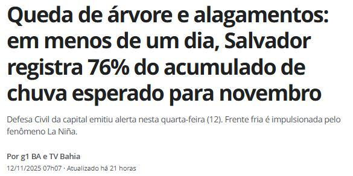

```{r setup, include=FALSE}
knitr::opts_chunk$set(echo = TRUE, warning = FALSE, message = FALSE, fig.retina = 2, fig.height=4)
suppressPackageStartupMessages(library(tidyverse))
```

class: inverse, center, middle

# Início da Unidade 4

# Aula 24: Variável aleatória contínua

### Provocação · Teoria · Aplicação · Discussão

---

## Um paradoxo aparente

> Toda variável aleatória contínua tem \\(P(X=x)=0\\) para qualquer valor específico \\(x\\). Mas
> obviamente \\(X\\) assume *algum* valor quando o experimento acontece. Como um evento de
> probabilidade zero pode, ainda assim, ocorrer?

---

class: inverse, center, middle

# Bloco 1: Teoria

---

## Do discreto ao contínuo

\\(X\\) é **contínua** quando assume qualquer valor em um intervalo da reta. Diferença crucial: para
\\(X\\) contínua, \\(P(X=x)=0\\) para **todo** \\(x\\), a probabilidade só se acumula em intervalos.

--

## Função densidade de probabilidade (fdp)

$$
P(a\le X\le b) = \int\_a^b f(x)\,dx, \qquad f(x)\ge0, \qquad \int\_{-\infty}^{\infty}f(x)\,dx=1
$$

\\(f(x)\\) **não é probabilidade**, é densidade. Geometricamente: \\(f\\) é a curva, \\(P(a\le X\le b)\\) é a
**área** sob ela entre \\(a\\) e \\(b\\).

---

## A área é a probabilidade

```{r fig-fdp-exemplo-mao, echo=FALSE, out.width="65%"}
knitr::include_graphics("images/fdp_exemplo_mao.jpg")
```

Leia a figura devagar: a curva é \\(f(x)\\), a região hachurada entre \\(a\\) e \\(b\\) é
\\(P(a&lt; X\le b)\\), e a área sob a curva **inteira** vale 1. É a mesma figura, com \\(f\\), \\(a\\) e
\\(b\\) diferentes, que vai reaparecer em toda distribuição contínua deste capítulo, inclusive nos
dois exemplos a seguir.

---

class: inverse, center, middle

# Bloco 2: Aplicação

---

## Chuva acumulada: uma variável contínua real

```{r fig-chuva-salvador, echo=FALSE, out.width="75%"}

```

Volume de chuva acumulado (mm) pode assumir qualquer valor não negativo, não é uma contagem como
no Capítulo 3. A manchete: em **menos de um dia**, Salvador já tinha acumulado 76% de todo o
volume de chuva *esperado* (climatologicamente) para o mês inteiro de novembro.

---

## Colocando o "76%" em números

Suponha, só para exercitar a ferramenta (números ilustrativos, não a série real da Defesa Civil),
que o acumulado esperado para novembro seja \\(\mu=300\\)mm e que o acumulado diário em dias de
frente fria siga uma Exponencial com média 40mm, \\(f(x)=0{,}025\,e^{-0{,}025x}\\), \\(x\ge0\\). A
manchete equivale a um único dia acumulando \\(0{,}76\times300\approx228\\)mm. Qual a probabilidade
de isso acontecer, \\(P(X\ge228)\\)?

**Antes de pedir ao R**: a primitiva de \\(f(x)=0{,}025\,e^{-0{,}025x}\\) é \\(F(x)=-e^{-0{,}025x}\\)
(confira: \\(F'(x)=0{,}025\,e^{-0{,}025x}=f(x)\\)). Logo, à mão,
$$
P(X\ge228)=\lim\_{b\to\infty}F(b)-F(228)=0-\left(-e^{-0{,}025\times228}\right)=e^{-5{,}7}\approx0{,}0033
$$

```{r prob-chuva}
f <- function(x) 0.025*exp(-0.025*x)
integrate(f, lower = 228, upper = Inf)   # confirma o valor calculado à mão acima
```

Uma probabilidade desse tamanho é exatamente o que torna o evento **notícia**: sob o modelo, um dia
assim é raro, o mesmo raciocínio de \\(P(X\ge x\_{obs})\\) que vamos reaplicar (com uma variável
diferente) na fila de espera a seguir.

---

## Tempo de espera em uma fila (agência bancária)

\\(X=\\) tempo de espera no caixa de uma agência (minutos), \\(f(x)=0{,}2\,e^{-0{,}2x}\\), \\(x\ge0\\)
(Exponencial). Assim como a chuva, é uma mensuração econômica típica: tempo de atendimento,
duração de uma ligação de call center, tempo até o próximo saque num caixa eletrônico, todos
seguem o mesmo padrão contínuo não negativo.

```{r fdp-fila, fig.height=3.8}
f <- function(x) 0.2*exp(-0.2*x)
df <- tibble(x = seq(0,30,length.out=300), y = f(x))
ggplot(df, aes(x,y)) + geom_line(color="#0d3b54") +
  geom_area(data = filter(df, x>=5, x<=15), fill="#c9971e", alpha=.5) +
  labs(x="minutos", y="f(x)") + theme_minimal(base_size=13)
```

---

## Calculando uma probabilidade por integral

$$
P(5\le X\le 15) = \int\_5^{15} 0{,}2\,e^{-0{,}2x}\,dx
$$

**À mão primeiro**: a primitiva de \\(0{,}2\,e^{-0{,}2x}\\) é \\(-e^{-0{,}2x}\\), então
$$
\int\_5^{15} 0{,}2\,e^{-0{,}2x}\,dx = \left[-e^{-0{,}2x}\right]\_5^{15} = -e^{-3}-\left(-e^{-1}\right)=e^{-1}-e^{-3}\approx0{,}368-0{,}050=0{,}318
$$

```{r integral-fila}
integrate(f, lower = 5, upper = 15)   # confirma o valor calculado à mão
```

---

class: inverse, center, middle

# Bloco 3: Discussão (bloco central da aula)

---

## Rodada 1: resolvendo o paradoxo da abertura

**1.** Ofereça uma resposta ao paradoxo: se \\(P(X=x)=0\\) para todo \\(x\\), como \\(X\\) ainda "assume" algum
valor com probabilidade total 1? (Dica: pense em quantos valores diferentes existem entre 0 e 1,
o intervalo é "infinito" de um jeito diferente da lista de números naturais.)

**2.** Compare com o caso discreto: lá, \\(\sum\_i p(x\_i)=1\\) com uma soma de (possivelmente) infinitos
termos, mas cada termo positivo. Aqui, a "soma" vira integral e cada "termo" individual é zero. Por
que a integral ainda pode dar 1 mesmo com "termos individuais nulos"? Essa é a mesma sutileza da
integral imprópria do Apêndice B.

---

## Rodada 2: quando tratar como contínua

**3.** Por que "renda familiar mensal exata, em centavos" costuma ser tratada como VA contínua,
mesmo sabendo que, tecnicamente, o menor incremento monetário é discreto (1 centavo)? O que se
ganha nessa aproximação matemática?

**4.** Dê um exemplo de variável econômica que é claramente contínua (sem nenhuma ressalva como a
da renda), e outro que é discreta mas às vezes aproximada por um modelo contínuo por conveniência.

---

class: inverse, center, middle

# Próxima aula (25/11)

## Esperança e variância (VA contínua)
