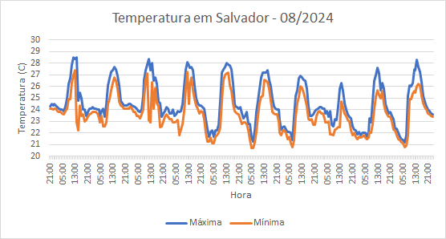
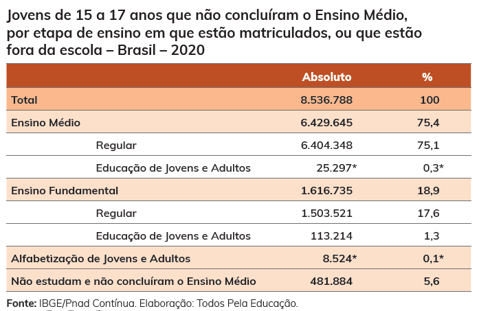
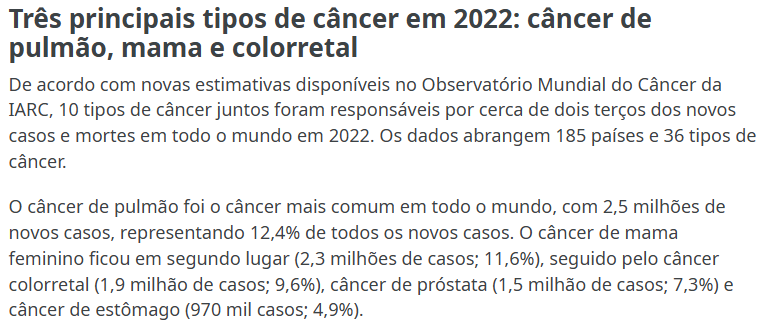
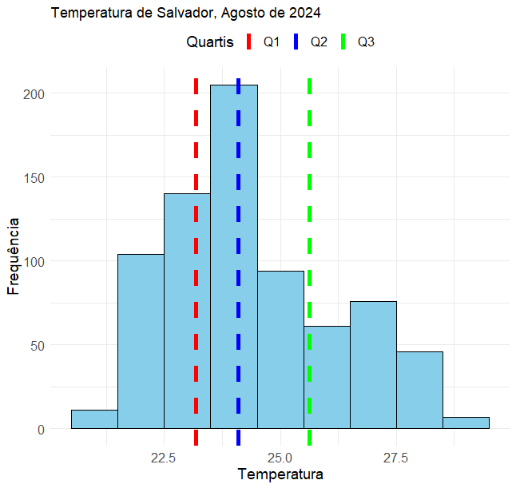
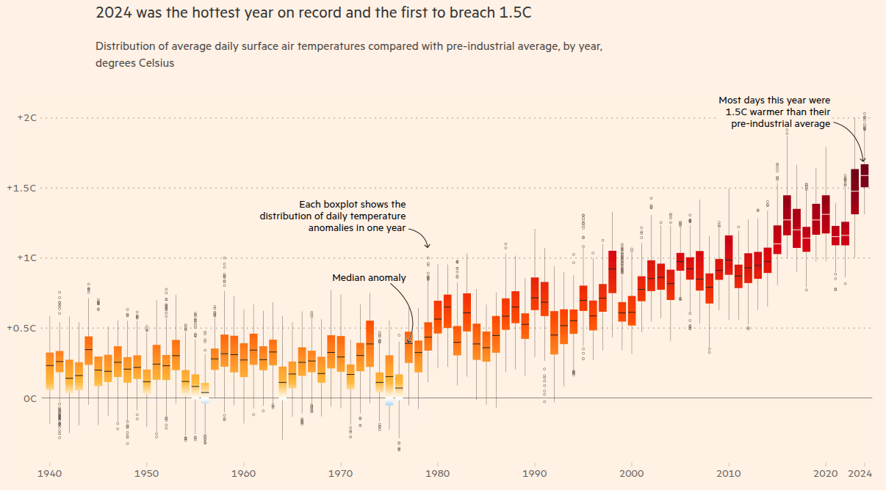

# Estatística Descritiva e Exploratória de Dados

```{r setup-cap1, include=FALSE}
knitr::opts_chunk$set(echo = TRUE, warning = FALSE, message = FALSE, fig.align = "center",
                      out.width = "80%")
suppressPackageStartupMessages({
  library(tidyverse)
  library(kableExtra)
  library(patchwork)
})
options(scipen = 999)
empresas  <- read_csv("data/empresas.csv", show_col_types = FALSE)
prefeitos <- read_csv("data/dados_prefeitos.csv", show_col_types = FALSE)
empresas$porte <- factor(empresas$porte, levels = c("Pequena", "Média", "Grande"))
num_br <- scales::label_number(big.mark = ".", decimal.mark = ",")
br <- function(x, d = 2) format(round(x, d), nsmall = d, decimal.mark = ",", big.mark = ".")
tabela <- function(df, caption = NULL, digits = 2) {
  kbl(df, caption = caption, digits = digits, format.args = list(decimal.mark = ",", big.mark = ".")) |>
    kable_styling(bootstrap_options = c("striped", "hover"), full_width = FALSE)
}
```

Abra qualquer página de notícias de economia: quase toda manchete depende de um **número**. Quem
coletou esse número? Sobre quem ele fala: todos os brasileiros ou uma amostra? Ele é exato ou uma
estimativa? O que dá, e o que não dá, para concluir a partir dele?

```{r fig-noticias-economia, echo=FALSE, out.width="75%", fig.cap="Página de economia de um portal de notícias: quase toda manchete depende de um dado. Fonte: BBC News Brasil (janeiro de 2026)."}
knitr::include_graphics("images/noticias_economia_bbc.jpg")
```

Este capítulo constrói o vocabulário para fazer essas perguntas com rigor: população e amostra, tipos
de variáveis, tabelas e gráficos, medidas de tendência central, de dispersão, de associação e de
forma. Ele segue a Unidade 1 da ementa e as Aulas 01 e 03 a 08, e se apoia nas referências clássicas da área [@hoffmann2006estatistica;
@morettinbussab2012].

Duas bases de dados reais acompanham o capítulo:

::: {.caixa-aplicacao}
**As duas bases do capítulo**

- `empresas`: 106 empresas brasileiras do setor de plásticos, com porte, natureza jurídica, número de
  empregados, faturamento em 1998 e 1999, idade, cidade, setor e região.
- `prefeitos`: perfil dos prefeitos eleitos em 2020 nos 5.232 municípios brasileiros com até 100 mil
  habitantes: sexo, idade, raça, escolaridade, população do município, região.
:::

```{r glimpse-dados}
glimpse(empresas)
```

::: {.caixa-r}
**Uso do R: separador decimal.** O arquivo `empresas.csv` usa ponto como separador decimal, e por
isso `read_csv()` funciona sem ajuste. Planilhas exportadas do Excel em português costumam usar
**vírgula** (`74392,50`). Nesse caso, use `read.csv("arquivo.csv", dec = ",")`; sem isso, o R lê a
coluna como texto e todas as contas falham ou geram `NA`.
:::

## População e amostra {#populacao-amostra}

### Por que estudar Estatística?

Dados são coletados a todo momento: compras com cartão, aplicativos, censos, pesquisas de emprego,
preços de supermercado. Na Economia, quase toda decisão (juros, salário mínimo, políticas sociais) é
tomada com base em dados **incompletos**. Saber interpretar e analisar esses dados, e desconfiar dos
que estão mal apresentados, é o objetivo deste curso.

A Estatística tem duas grandes divisões:

- a **análise exploratória de dados** (ou estatística descritiva), que organiza, apresenta, simplifica e
  descreve os dados observados;
- a **inferência estatística**, que usa **probabilidade** para tirar conclusões sobre uma população a
  partir de uma amostra.

**Exemplo: temperatura em Salvador.** A estação automática do INMET em Salvador registra a
temperatura a cada hora. Em agosto de 2024, foram centenas de registros.

```{r fig-salvador-planilha, echo=FALSE, out.width="55%", fig.cap="Parte dos registros horários de temperatura em Salvador, agosto de 2024. Fonte: INMET (tempo.inmet.gov.br)."}
knitr::include_graphics("images/salvador_temperatura_planilha.png")
```

Olhando a planilha, é difícil dizer se o mês foi quente ou se a temperatura variou muito. Organizados
em um gráfico, os mesmos dados revelam um **padrão**:

```{r fig-salvador-linhas, echo=FALSE, out.width="60%", fig.cap="Temperatura horária em Salvador em agosto de 2024. Fonte: INMET."}

```

A temperatura **média** foi de 24,13 °C; **metade** dos registros ficou entre 22,57 °C e 25,12 °C; e a
temperatura segue um **padrão cíclico**, subindo durante o dia e caindo à noite. Toda análise
estatística começa assim: por uma análise **exploratória**. A regularidade encontrada (o ciclo diário)
é o que permite, depois, construir um **modelo** e fazer **inferência**.

```{r fig-ciclo-inferencia, echo=FALSE, fig.height=2.2, fig.width=8, out.width="70%", fig.cap="O ciclo da inferência estatística: da população, por amostragem, obtemos uma amostra; da amostra, usando probabilidade, voltamos à população."}
caixa <- function(x, y, rot) annotate("label", x = x, y = y, label = rot, size = 5.5, fill = "#b5173d",
                                      color = "white", label.padding = unit(0.6, "lines"))
ggplot() + xlim(0, 10) + ylim(0, 3) + theme_void() +
  annotate("curve", x = 3.2, y = 1.9, xend = 6.8, yend = 1.9, curvature = -0.3,
           arrow = arrow(length = unit(0.25, "cm")), linewidth = 1) +
  annotate("curve", x = 6.8, y = 1.1, xend = 3.2, yend = 1.1, curvature = -0.3,
           arrow = arrow(length = unit(0.25, "cm")), linewidth = 1) +
  annotate("text", x = 5, y = 2.8, label = "Amostragem", size = 5) +
  annotate("text", x = 5, y = 0.25, label = "Inferência (usa probabilidade)", size = 5) +
  caixa(2, 1.5, "População") + caixa(8, 1.5, "Amostra")
```

### População

::: {.caixa-aplicacao}
**População** é o conjunto de **todos** os elementos ou resultados sob investigação.
:::

Na linguagem comum, "população" é o conjunto de pessoas de um lugar. Em Estatística o conceito é mais
amplo: são populações o conjunto de todos os alunos da UFBA, de todos os habitantes de Salvador, dos
preços de todos os produtos de um supermercado em um dia, ou da duração de todas as viagens de carro
feitas em uma cidade.

Raramente é possível estudar a população inteira:

- pesquisas são feitas com **tempo e recursos limitados** (o Censo do IBGE é feito a cada dez anos);
- às vezes a população é **grande demais** ou **difícil de acessar**;
- às vezes estudar um elemento o **destrói** (testar a durabilidade de uma lâmpada, provar um lote de
  vinho).

### Amostra

::: {.caixa-aplicacao}
**Amostra** é qualquer **subconjunto** da população. A ideia é usar um número menor de elementos de
forma que a amostra **represente bem** a população investigada.
:::

Exemplos: as idades dos alunos de Economia da UFBA (população: alunos da UFBA); a renda dos moradores
do bairro de Ondina (população: moradores de Salvador); a duração das viagens feitas por um
aplicativo (população: todas as viagens na cidade).

::: {.caixa-discussao}
**Discussão.** A renda dos moradores de Ondina representa bem a renda de Salvador? E a duração das
viagens de um único aplicativo representa bem todas as viagens de carro da cidade? Por quê?
:::

### Por que definir bem a população importa

Decisões tomadas com dados que não representam a população afetada podem ser sistematicamente
injustas. O livro *Mulheres invisíveis*, de Caroline Criado Perez, reúne exemplos: a temperatura
"padrão" de escritórios foi calibrada para o metabolismo masculino; testes de segurança de carros
usaram por décadas bonecos com medidas de homens; e o trabalho de cuidado não remunerado, feito
majoritariamente por mulheres, não entra nas estatísticas oficiais de produção, tema da redação do
ENEM 2023.

```{r fig-mulheres-invisiveis, echo=FALSE, out.width="48%", fig.show="hold", fig.cap="Tema da redação do ENEM 2023 e o livro Mulheres invisíveis: dados que deixam grupos de fora da amostra. Fontes: Inep; Intrínseca."}
knitr::include_graphics(c("images/enem2023_redacao_cuidado.png", "images/mulheres_invisiveis_capa.jpg"))
```

### Amostragem

**Amostragem** é o método escolhido para coletar a amostra: sorteio, facilidade de coleta, rapidez. A
escolha depende dos recursos disponíveis e das características da população. Você faz amostragem no
dia a dia quando prova uma colher para checar o sal de uma panela de sopa, quando escolhe frutas
olhando algumas delas, ou quando usa o período de teste de um aplicativo antes de assinar.

Amostras podem ser:

- **aleatórias**: cada elemento da população tem uma chance **conhecida** (em geral igual) de ser
  selecionado, como em um sorteio;
- **não aleatórias**: a chance é diferente ou desconhecida, como quando o pesquisador entrevista só
  os amigos ou quando uma enquete é respondida espontaneamente em uma rede social.

Na **amostra aleatória simples**, os elementos são sorteados dentre **todos** os elementos da
população, com a **mesma chance**. Ela exige uma lista completa da população (um cadastro) e pode ser
difícil de aplicar quando a população é muito grande.

```{r fig-aas, echo=FALSE, out.width="60%", fig.cap="Amostra aleatória simples: sorteio com a mesma chance para todos os elementos. Fonte: L. F. C. Alves, material online."}
knitr::include_graphics("images/amostra_aleatoria_simples.png")
```

::: {.caixa-economia}
**Leitura econômica.** A PNAD Contínua do IBGE, que mede o desemprego no Brasil, não entrevista todos
os brasileiros: visita cerca de 211 mil domicílios por trimestre, sorteados em várias etapas
[@ibge2024pnad]. É uma amostra aleatória, mais elaborada que a simples, e por isso a taxa de
desemprego divulgada é uma **estimativa**.
:::

### Parâmetro e estatística

| | População | Amostra |
|:---|:---|:---|
| Medida-resumo | **parâmetro** (ex.: taxa real de desemprego) | **estatística** (ex.: taxa estimada pela PNAD) |
| Natureza | valor fixo, em geral desconhecido | varia de uma amostra para outra |

::: {.caixa-discussao}
**Discussão.** Uma enquete em rede social pergunta "você aprova o governo?" e recebe 50 mil respostas.
Uma pesquisa com 2 mil pessoas sorteadas diz outra coisa. Em qual você confia mais? O tamanho da
amostra compensa a forma como ela foi coletada?
:::

## Tipos de variáveis {#tipos-variaveis}

Dados geralmente são **medidas de características** de uma população ou amostra. Cada característica
é uma **variável**. Um cadastro do SUS registra nome, data de nascimento, sexo, raça/cor, escolaridade;
cada campo é uma variável e cada pessoa cadastrada é uma observação. A PNAD Contínua registra, em cada
domicílio, o número de pessoas com 14 anos ou mais, o número de pessoas fora da força de trabalho, com
e sem carteira assinada, o rendimento, as horas trabalhadas.

```{r fig-variaveis, echo=FALSE, out.width="48%", fig.show="hold", fig.cap="Variáveis em formulários e pesquisas: cadastro individual do e-SUS e indicadores da PNAD Contínua. Fontes: Prefeitura de Barreiras (BA); Secom/Governo Federal com dados do IBGE."}
knitr::include_graphics(c("images/variaveis_cadastro_esus.jpg", "images/variaveis_pnad_desemprego.png"))
```

### Classificação

```{r fig-arvore-tipos, echo=FALSE, fig.height=2.6, fig.width=9, out.width="80%", fig.cap="Classificação dos tipos de variáveis."}
caixa2 <- function(x, y, rot, cor) annotate("label", x = x, y = y, label = rot, size = 5, fill = cor,
                                            color = "white", label.padding = unit(0.5, "lines"))
ggplot() + xlim(0, 10) + ylim(0, 3.3) + theme_void() +
  annotate("segment", x = 5, y = 2.8, xend = c(2.5, 7.5), yend = 2.05, linewidth = 0.8) +
  annotate("segment", x = 2.5, y = 1.55, xend = c(1.2, 3.8), yend = 0.85, linewidth = 0.8) +
  annotate("segment", x = 7.5, y = 1.55, xend = c(6.2, 8.8), yend = 0.85, linewidth = 0.8) +
  annotate("label", x = 5, y = 3, label = "Variável", size = 5.5) +
  caixa2(2.5, 1.8, "Qualitativa", "#d98324") + caixa2(7.5, 1.8, "Quantitativa", "#3b5bdb") +
  caixa2(1.2, 0.55, "Nominal", "#e8a65a") + caixa2(3.8, 0.55, "Ordinal", "#e8a65a") +
  caixa2(6.2, 0.55, "Discreta", "#7b93e6") + caixa2(8.8, 0.55, "Contínua", "#7b93e6")
```

- **Qualitativas** (categóricas): os valores representam **atributos** ou qualidades.
  - **Nominais**: não há ordem entre as categorias (bairro, curso, etnia, setor de atividade).
  - **Ordinais**: há ordem natural (grau de instrução; satisfação: péssimo, ruim, bom, excelente).
- **Quantitativas** (numéricas): os valores resultam de **contagens** ou **mensurações**.
  - **Discretas**: contagens, valores inteiros (número de filhos, número de defeitos em um carro).
  - **Contínuas**: mensurações, qualquer valor em um intervalo (peso, altura, temperatura, duração de
    uma ligação).

### Nem todo número é uma variável quantitativa

O tipo da variável indica o tipo de análise que pode ser feita. Números usados como **códigos** (CPF,
CEP, código do município) ou como **posições** (1º, 2º, 3º lugar) não são quantidades: não faz sentido
somá-los ou tirar a média deles.

::: {.caixa-discussao}
**Discussão.** Em um ranking das dez raças de cães mais populares, faz sentido dizer que a raça em 4º
lugar é "duas vezes" a raça em 2º? E calcular a "posição média" das raças?
:::

### Classificando bases reais

```{r tabela-tipos-empresas, echo=FALSE}
tibble(
  Variável = c("constituicao", "porte", "empregados99", "faturamento99", "idade", "cidade", "setor"),
  Exemplo = c("Ltda., S.A.", "Pequena, Média, Grande", "9, 31, 119", "74.392, 251.488", "15, 5, 21",
              "Salvador, São Paulo", "Embalagens, Industrial"),
  Tipo = c("Qualitativa nominal", "Qualitativa ordinal", "Quantitativa discreta",
           "Quantitativa contínua", "Quantitativa discreta (anos completos)",
           "Qualitativa nominal", "Qualitativa nominal")) |>
  tabela(caption = "Tipos das variáveis da base de empresas")
```

```{r tabela-tipos-prefeitos, echo=FALSE}
tibble(
  Variável = c("CodMun", "Pop.estimada.2021", "Faixa_pop", "sexo", "idade", "raca", "escolaridade"),
  Tipo = c("Qualitativa nominal (código do IBGE)", "Quantitativa discreta", "Qualitativa ordinal",
           "Qualitativa nominal", "Quantitativa discreta", "Qualitativa nominal", "Qualitativa ordinal")) |>
  tabela(caption = "Tipos das variáveis da base de prefeitos")
```

A variável `CodMun` é um **número**, mas é um **código**: somar ou tirar a média não faz sentido. Já
`Faixa_pop` agrupa a população em faixas **ordenadas**: a informação quantitativa virou qualitativa
ordinal.

::: {.caixa-r}
**Uso do R.** `str(prefeitos)` mostra como o computador leu cada coluna: `CodMun` aparece como número
inteiro. O tipo **estatístico** de uma variável é uma decisão de quem analisa, não do software.
:::

### Exercícios resolvidos

**Exercício 1.** Queremos aplicar um questionário sobre a saúde dos alunos de MATF14. Que variáveis
poderiam ser coletadas, e que tipos de valores elas assumem?

::: {.caixa-resposta}
**Resposta.** CPF (código: qualitativa nominal); sexo (qualitativa nominal); idade em anos completos
(quantitativa discreta); altura e peso (quantitativas contínuas); tem plano de saúde? (qualitativa
nominal); frequência de atividade física: nunca, às vezes, sempre (qualitativa ordinal).
:::

**Exercício 2.** Uma empresa tem 5.000 clientes e fez uma pesquisa com 500 deles. De cada um coletou:
sexo, idade (anos completos), altura, grau de satisfação (insatisfeito, satisfeito) e número de itens
comprados. Qual é a população? A amostra? O tipo de cada variável?

::: {.caixa-resposta}
**Resposta.** População: os 5.000 clientes. Amostra: os 500 pesquisados. Sexo: qualitativa nominal;
idade: quantitativa discreta; altura: quantitativa contínua; grau de satisfação: qualitativa ordinal;
número de itens: quantitativa discreta. Se os 500 foram os que responderam espontaneamente a um
e-mail, a amostra **não** é aleatória.
:::

## Apresentação tabular e principais tipos de representação gráfica {#tabelas-graficos}

### Tabelas

Uma **tabela** resume os dados por meio de contagens ou agrupamentos, distribuídos em linhas e
colunas de modo ordenado. Os seus elementos são:

- **título**: responde às perguntas *o quê?*, *quando?* e *onde?*;
- **cabeçalho**: especifica o conteúdo de cada coluna;
- **corpo**: as linhas com os dados; cada cruzamento de linha e coluna é uma **casa** (célula);
- **fonte**: sempre abaixo da tabela, indica de onde vieram os dados.

Por convenção, tabelas são fechadas em cima e embaixo, mas não nas laterais.

```{r fig-tabela-jovens, echo=FALSE, out.width="60%", fig.cap="Jovens de 15 a 17 anos por etapa de ensino, Brasil, 2020. Fonte: Anuário Brasileiro da Educação Básica 2021 (Todos Pela Educação, com dados da PNAD Contínua/IBGE)."}

```

Na tabela acima: **o quê?** jovens de 15 a 17 anos por etapa de ensino; **quando?** 2020; **onde?**
Brasil. As colunas trazem a frequência **absoluta** e a **percentual**: 5,6% dos jovens (481.884) não
estudam e não concluíram o Ensino Médio.

### Distribuição de frequências

O interesse é conhecer o comportamento de uma variável analisando a **ocorrência** de seus possíveis
valores. Seja $n$ o total de observações e $m$ o número de observações em uma classe de interesse:

- **frequência absoluta** da classe: $m$;
- **frequência relativa** da classe: $m/n$, ou $100 \times m/n$ em porcentagem.

Ex.: uma empresa tem 100 funcionários, e 30 ganham entre 1 e 2 salários mínimos. A frequência absoluta
dessa classe é 30 e a relativa é $30/100 = 0{,}30 = 30\%$.

```{r tabela-freq-setor}
empresas |>
  count(setor, name = "Freq. absoluta", sort = TRUE) |>
  mutate(`Freq. relativa (%)` = 100 * `Freq. absoluta` / sum(`Freq. absoluta`)) |>
  tabela(caption = "Empresas por setor de atividade", digits = 1)
```

```{r fig-paho, echo=FALSE, out.width="70%", fig.cap="Frequências absolutas e relativas em uma notícia sobre câncer. Fonte: Organização Pan-Americana da Saúde (01/02/2024)."}

```

::: {.caixa-aplicacao}
**Aplicação.** Na notícia, "2,5 milhões de novos casos" de câncer de pulmão é uma frequência
**absoluta** e "12,4% do total" é uma frequência **relativa**. Juntas, elas permitem estimar o total de
novos casos de câncer no mundo em 2022: $n \approx 2{,}5/0{,}124 \approx 20$ milhões.
:::

### Variáveis quantitativas: classes

Para variáveis quantitativas com muitos valores, agrupamos os dados em **classes** (intervalos)
**disjuntas**: nenhuma observação pode pertencer a duas classes. A notação $[a, b)$ indica o intervalo
que inclui $a$ e exclui $b$. Uma regra usual para o número de classes é a **regra de Sturges**,
$k \approx 1 + \log_2(n)$. Para as 106 empresas, $k \approx 1 + 6{,}7 = 7{,}7$: sete ou oito classes.

```{r tabela-classes}
empresas |>
  mutate(classe = cut(faturamento99 / 1000, breaks = seq(0, 700, 100), right = FALSE)) |>
  count(classe, name = "Freq. absoluta") |>
  mutate(`Freq. relativa (%)` = 100 * `Freq. absoluta` / sum(`Freq. absoluta`),
         `Freq. acumulada (%)` = cumsum(`Freq. relativa (%)`)) |>
  rename(`Faturamento 1999 (milhares)` = classe) |>
  tabela(caption = "Faturamento das 106 empresas em classes", digits = 1)
```

A classe mais frequente é $[300, 400)$, com 43 empresas (40,6%), e 76,4% das empresas faturaram menos
de 400 mil. (A base não informa a unidade monetária do faturamento; por isso falamos apenas em
milhares.)

### Razão e taxa de variação

**Razão.** Com $f_1$ casos em uma categoria e $f_2$ em outra, a razão é $f_1/f_2$: para cada 1 elemento da
categoria 2, há $f_1/f_2$ elementos da categoria 1. Na base de empresas há 23 de porte Grande e 13 de
porte Pequeno: $23/13 \approx 1{,}77$, ou cerca de 18 grandes para cada 10 pequenas.

**Taxa de variação.** Se uma variável vale $f_1$ em um instante e $f_2$ em um instante posterior,

$$
\text{taxa de variação} = 100 \times \frac{f_2 - f_1}{f_1}\ \%.
$$

É a fórmula por trás da **inflação** mensal: $f_1$ é o índice de preços do mês anterior e $f_2$ o do
mês atual [@bacen2024ipca]; a inflação acumulada em 12 meses usa $f_1$ = índice de 12 meses atrás.

```{r taxa-variacao}
e1 <- empresas |> filter(Empresa == 1)
c(faturamento98 = e1$faturamento98, faturamento99 = e1$faturamento99,
  taxa_pct = 100 * (e1$faturamento99 - e1$faturamento98) / e1$faturamento98)
100 * (mean(empresas$faturamento99) - mean(empresas$faturamento98)) / mean(empresas$faturamento98)
```

A empresa 1 cresceu 15,7%, mas o faturamento médio das 106 empresas cresceu bem menos. Uma taxa de
variação espetacular de **um** caso não diz nada sobre o conjunto.

### Tabelas de dupla entrada

Para estudar duas variáveis qualitativas ao mesmo tempo, cruzamos as categorias em uma **tabela de
dupla entrada** (ou de contingência).

```{r tabela-dupla}
prefeitos |>
  count(Regiao, sexo) |>
  pivot_wider(names_from = sexo, values_from = n) |>
  mutate(Total = Feminino + Masculino, `% mulheres` = 100 * Feminino / Total,
         Regiao = str_remove(Regiao, "^\\d - ")) |>
  rename(Região = Regiao) |>
  tabela(caption = "Prefeitos eleitos em 2020 nos municípios de até 100 mil habitantes, por região e sexo", digits = 1)
```

::: {.caixa-economia}
**Leitura econômica.** O Nordeste tem 297 prefeitas e o Sudeste, 118, mas o Nordeste também tem mais
municípios. Para comparar regiões de tamanhos diferentes, use o **percentual da linha**: 17,2% de
mulheres no Nordeste contra 7,8% no Sudeste. Em todas as regiões, a sub-representação feminina é
evidente.
:::

### Gráficos

Gráficos resumem a informação de forma visual. Cada tipo responde melhor a um tipo de pergunta.

```{r fig-colunas, echo=FALSE, out.width="48%", fig.show="hold", fig.cap="Gráficos de colunas e de colunas empilhadas: mortes violentas intencionais por região e por faixa etária. Fonte: Anuário Brasileiro de Segurança Pública 2024."}
knitr::include_graphics(c("images/grafico_colunas_mvi_regioes.png", "images/grafico_colunas_empilhadas_mvi_idade.png"))
```

```{r fig-barras, echo=FALSE, out.width="48%", fig.show="hold", fig.cap="Gráficos de barras (nomes longos de categorias) e de barras empilhadas (composição por sexo). Fonte: Anuário Brasileiro de Segurança Pública 2024."}
knitr::include_graphics(c("images/grafico_barras_celulares_local.png", "images/grafico_barras_empilhadas_mvi_sexo.png"))
```

```{r fig-setores-cartograma, echo=FALSE, out.width="45%", fig.show="hold", fig.cap="Gráfico de setores (parte de um todo) e cartograma (valores por região geográfica). Fontes: Anuário Brasileiro da Educação Básica 2021; Anuário Brasileiro de Segurança Pública 2024."}
knitr::include_graphics(c("images/grafico_setores_escola_idade.png", "images/grafico_cartograma_mvi.png"))
```

```{r fig-linhas-dispersao, echo=FALSE, out.width="48%", fig.show="hold", fig.cap="Gráfico de linhas (evolução ao longo de uma sequência ordenada: roubos de celular por horário) e gráfico de dispersão (PIB per capita e emissão de CO2 per capita; ponto verde: Brasil). Fontes: Anuário Brasileiro de Segurança Pública 2024; The Washington Post (2023)."}
knitr::include_graphics(c("images/grafico_linhas_celulares_horario.png", "images/grafico_dispersao_co2_pib.png"))
```

| Variável | Gráficos adequados |
|:---|:---|
| Qualitativa nominal | barras, colunas, setores (com poucas categorias) |
| Qualitativa ordinal | barras ou colunas, **respeitando a ordem** das categorias |
| Quantitativa discreta com poucos valores | colunas ou bastões |
| Quantitativa contínua | **histograma**, boxplot |
| Duas quantitativas | dispersão |
| Variável ao longo do tempo | linhas |

Gráficos devem ser **simples** (para uma leitura rápida), **claros** (para evitar interpretações
erradas), ter **título informativo** e **citar a fonte**.

::: {.caixa-discussao}
**Pizza ou barras?** Na pizza abaixo é difícil dizer se "Industrial" ou "Laminados plásticos" tem mais
empresas. No gráfico de barras, fica evidente que empatam (17 cada).
:::

```{r fig-pizza-barras, echo=FALSE, fig.height=3.6, fig.width=10, out.width="95%", fig.cap="O mesmo dado (setor das 106 empresas) em setores e em barras ordenadas."}
setor_tab <- empresas |> mutate(setor = trimws(setor)) |> count(setor, sort = TRUE)
p1 <- ggplot(setor_tab, aes(x = "", y = n, fill = setor)) + geom_col(width = 1, color = "white") +
  coord_polar(theta = "y") + scale_fill_brewer(palette = "Blues", direction = -1) +
  labs(fill = "Setor", x = NULL, y = NULL) + theme_void(base_size = 12)
p2 <- ggplot(setor_tab, aes(n, fct_reorder(setor, n))) + geom_col(fill = "#3d7a99") +
  geom_text(aes(label = n), hjust = -0.3) + xlim(0, 35) + labs(x = "Nº de empresas", y = NULL) +
  theme_minimal(base_size = 12)
p1 + p2
```

::: {.caixa-discussao}
**Eixo cortado.** O faturamento médio das empresas é de 342,5 mil no Sudeste e 318,1 mil no Sul: uma
diferença de 7,7%. Em um gráfico de colunas com o eixo vertical começando em 315 mil, o Sudeste
parece faturar o triplo do Sul. Nenhum número está errado, mas a leitura está. Em gráficos de
**colunas**, o eixo deve começar em zero.
:::

### Histograma

As frequências de variáveis quantitativas agrupadas em classes são representadas por um
**histograma**: colunas **justapostas**, uma por classe, com base igual ao intervalo da classe e
**área** proporcional à frequência.

```{r histograma-faturamento, fig.height=3.5, fig.width=8}
ggplot(empresas, aes(x = faturamento99 / 1000)) +
  geom_histogram(breaks = seq(0, 700, 100), closed = "left", fill = "#7fb8cf", color = "white") +
  scale_x_continuous(breaks = seq(0, 700, 100)) +
  labs(x = "Faturamento em 1999 (milhares)", y = "Nº de empresas") + theme_minimal(base_size = 13)
```

```{r fig-hist-noticias, echo=FALSE, out.width="45%", fig.show="hold", fig.cap="Histogramas em notícias: crimes de homofobia no Reino Unido por faixa etária (BBC, 2018) e pirâmide etária do Censo 2022 (BBC News Brasil)."}
knitr::include_graphics(c("images/histograma_crimes_idade_bbc.png", "images/histograma_piramide_etaria_2022.png"))
```

A **pirâmide etária** são dois histogramas "deitados", um para cada sexo.

**Exemplo: ENEM 2023.** Uma reportagem afirma que metade dos participantes tirou entre 450 e 600
pontos. Com as frequências do histograma:

```{r fig-enem, echo=FALSE, out.width="50%", fig.cap="Distribuição das notas do ENEM 2023. Fonte: Nexo Jornal (17/01/2024), com dados do Inep."}
knitr::include_graphics("images/exercicio_notas_enem2023.png")
```

::: {.caixa-resposta}
Total de participantes: $n = 2.734.100$. Entre 450 e 600 pontos: $474.387 + 548.739 + 497.944 =
1.521.070$, ou seja, $1.521.070/2.734.100 \approx 55{,}6\%$. "Metade" é um arredondamento razoável.
Acima de 700 pontos: $(100.396 + 27.342 + 2.094 + 2)/2.734.100 \approx 4{,}7\%$.
:::

```{r fig-gender-pay-gap, echo=FALSE, out.width="60%", fig.cap="Diferença salarial mediana entre homens e mulheres em empresas do Reino Unido: um histograma. Fonte: BBC News (2018)."}
knitr::include_graphics("images/gender_pay_gap.png")
```

No gráfico acima, o eixo horizontal são **classes** de diferença salarial e o eixo vertical, o número
de empresas: "78% das empresas pagam mais aos homens" é a frequência relativa das colunas à direita do
zero.

### Exercícios resolvidos

**Exercício 3.** Para o gráfico de nível de instrução por sexo (abaixo, à esquerda): que tipo de
gráfico é? Quais variáveis aparecem e de que tipo? Que conclusões podemos tirar?

**Exercício 4.** Mesmas perguntas para o gráfico de taxa de participação na força de trabalho (à
direita).

```{r fig-exercicios-graficos, echo=FALSE, out.width="48%", fig.show="hold", fig.cap="Nível de instrução por sexo (PNAD Contínua 2022) e taxa de participação na força de trabalho por sexo e raça (PNAD Contínua 2012 a 2022). Fonte: BBC News Brasil, com dados do IBGE."}
knitr::include_graphics(c("images/exercicio_instrucao_sexo_2022.jpg", "images/exercicio_forca_trabalho_sexo_raca.jpg"))
```

::: {.caixa-resposta}
**Exercício 3.** Colunas empilhadas (100%). Sexo (qualitativa nominal) e nível de instrução
(qualitativa **ordinal**). Entre pessoas de 25 anos ou mais, as mulheres têm mais ensino superior
completo (21,3% contra 16,8%) e menos pessoas sem instrução ou com fundamental incompleto.

**Exercício 4.** Linhas (série temporal). Ano (quantitativa discreta), taxa de participação
(quantitativa contínua, em %), sexo e raça (qualitativas nominais). A diferença entre **sexos** (cerca
de 20 pontos) é muito maior que a diferença entre **raças** dentro de cada sexo, e há uma queda em
2020, na pandemia.
:::

::: {.caixa-r}
**Uso do R.** `table()` e `prop.table()` fazem tabelas de frequências; `prop.table(tab, margin = 1)`
dá os percentuais por linha de uma tabela de dupla entrada; `cut()` agrupa em classes;
`nclass.Sturges()` aplica a regra de Sturges; `barplot()`, `hist()` e `pie()` fazem os gráficos básicos
(ou `ggplot()` com `geom_col()`, `geom_histogram()`).
:::

## Medidas de tendência central e suas relações {#tendencia-central}

Moda, mediana e média aparecem todos os dias nas notícias:

```{r fig-manchetes, echo=FALSE, out.width="55%", fig.cap="Moda, mediana e média nas manchetes. Fontes: Veja (14/11/2024); Valor Econômico (27/03/2025); Agência Brasil (28/02/2025)."}
knitr::include_graphics(c("images/moda_noticia_veja.png", "images/mediana_ipca15_valor.png", "images/media_renda_estados_agbrasil.png"))
```

Tabelas de frequências já resumem os dados. **Medidas de tendência central** resumem ainda mais: são
valores únicos em torno dos quais os dados tendem a se concentrar. Usaremos como exemplo os dados
$3, 4, 7, 8, 8$.

### Moda

A **moda** ($Mo$) é o valor mais frequente. Em $3, 4, 7, 8, 8$, a moda é 8. A moda é a única das três
medidas que faz sentido para variáveis **qualitativas nominais** (a marca de carro mais vendida, o
partido mais votado). Um conjunto pode ter mais de uma moda ($2, 3, 3, 5, 7, 7$ é **bimodal**) ou
nenhuma ($1, 4, 6, 9$).

### Mediana

A **mediana** ($Md$) é o valor que fica no meio dos dados **ordenados**, separando-os em duas partes de
mesmo tamanho. Com $x_{(1)} \leq x_{(2)} \leq \cdots \leq x_{(n)}$ os dados ordenados,

$$
Md = \begin{cases}
x_{((n+1)/2)}, & \text{se } n \text{ é ímpar},\\[4pt]
\dfrac{x_{(n/2)} + x_{(n/2+1)}}{2}, & \text{se } n \text{ é par}.
\end{cases}
$$

Ex.: para $30, 40, 70, 80, 80$ ($n = 5$), a mediana é o 3º valor, 70. Para $30, 40, 70, 80, 80, 100$
($n = 6$), é a média do 3º e do 4º valores, $(70 + 80)/2 = 75$.

```{r fig-censo-mediana, echo=FALSE, out.width="60%", fig.cap="Idade mediana da população brasileira no Censo 2022. Fonte: G1 (27/10/2023)."}
knitr::include_graphics("images/mediana_idade_censo2022.png")
```

"Idade mediana de 35 anos" quer dizer que **50%** da população tem até 35 anos; não quer dizer que 35
é a idade típica nem a idade média.

### Média

A **média** aritmética é a soma dos valores dividida pelo número de valores:

$$
\bar x = \frac{x_1 + x_2 + \cdots + x_n}{n} = \frac{1}{n}\sum_{i=1}^{n} x_i.
$$

Para $3, 4, 7, 8, 8$: $\bar x = 30/5 = 6$.

### Sensibilidade a valores extremos

Troque o último 8 por 80:

| Dados | Média | Mediana | Moda |
|:---|:---:|:---:|:---:|
| $3, 4, 7, 8, 8$ | $30/5 = 6$ | 7 | 8 |
| $3, 4, 7, 8, 80$ | $102/5 = 20{,}4$ | 7 | não há |

Um único valor mudou a média de 6 para 20,4, que deixou de representar qualquer um dos dados; a
mediana continuou 7. Por isso os jornais econômicos usam a **mediana** das previsões de dezenas de
analistas (como no Boletim Focus e na manchete do IPCA-15 acima): uma previsão isolada muito
diferente não distorce o resumo.

**Exercício 5.** Uma voluntária recebe contribuições de $5, 10, 85, 15, 18, 2$ e $5$ reais. Calcule a
moda, a mediana e a média. Qual medida representa melhor as contribuições?

::: {.caixa-resposta}
Ordenando: $2, 5, 5, 10, 15, 18, 85$ ($n = 7$). Moda = 5; mediana = 4º valor = 10; média $= 140/7 = 20$.
A **mediana** representa melhor: seis das sete contribuições são de até 18 reais, e a média fica acima
de todas elas, puxada pela doação de 85 reais.
:::

### Quando usar cada medida

- **Moda**: mais simples; faz sentido em dados discretos ou qualitativos (número de sapato mais vendido).
- **Média**: a mais usada; usa todos os valores; adequada para distribuições **simétricas** (peso,
  altura, notas).
- **Mediana**: indicada para distribuições **assimétricas** e menos sensível a valores extremos (renda,
  preço de imóveis, PIB dos municípios). É por isso que o IBGE divulga também o **rendimento mediano**.

A posição relativa das três medidas revela a **forma** da distribuição:

```{r fig-formas-medidas, echo=FALSE, fig.height=3.2, fig.width=10, out.width="100%", fig.cap="Posição de média, mediana e moda em distribuições assimétrica à esquerda, simétrica e assimétrica à direita (dados simulados)."}
set.seed(2026)
d <- tibble(forma = factor(rep(c("Assimétrica à esquerda", "Simétrica", "Assimétrica à direita"), each = 3000),
                           levels = c("Assimétrica à esquerda", "Simétrica", "Assimétrica à direita")),
            x = c(20 - rgamma(3000, 2.2, 0.35), rnorm(3000, 10, 2.5), rgamma(3000, 2.2, 0.35)))
moda_dens <- function(x) { dd <- density(x); dd$x[which.max(dd$y)] }
lin <- d |> group_by(forma) |> summarise(Média = mean(x), Mediana = median(x), Moda = moda_dens(x)) |>
  pivot_longer(-forma, names_to = "medida", values_to = "valor")
ggplot(d, aes(x)) + geom_histogram(aes(y = after_stat(density)), bins = 40, fill = "#dfe9ee", color = "white") +
  geom_vline(data = lin, aes(xintercept = valor, color = medida, linetype = medida), linewidth = 1.1) +
  scale_color_manual(values = c(Média = "#c0392b", Mediana = "#2e8b57", Moda = "#3b5bdb")) +
  facet_wrap(~forma, scales = "free_x") + labs(x = NULL, y = NULL, color = NULL, linetype = NULL) +
  theme_minimal(base_size = 12) + theme(legend.position = "top", axis.text.y = element_blank())
```

| Forma | Relação usual |
|:---|:---|
| Simétrica | média $\approx$ mediana $\approx$ moda |
| Assimétrica à direita (cauda de valores altos) | moda < mediana < média |
| Assimétrica à esquerda (cauda de valores baixos) | média < mediana < moda |

### Média a partir de uma tabela de frequências

Se os dados têm $k$ valores possíveis $x_1, \ldots, x_k$ com frequências absolutas $n_i$ e relativas
$f_i = n_i/n$, cada valor entra na soma tantas vezes quanto aparece:

$$
\bar x = \frac{1}{n}\sum_{i=1}^{k} n_i\, x_i = \sum_{i=1}^{k} f_i\, x_i.
$$

**Exemplo: número de filhos em 46 famílias.**

| Nº de filhos | 0 | 1 | 2 | 3 | 4 | 5 | Total |
|:---|:---:|:---:|:---:|:---:|:---:|:---:|:---:|
| Freq. absoluta | 9 | 10 | 14 | 9 | 3 | 1 | 46 |
| Freq. acumulada | 9 | 19 | 33 | 42 | 45 | 46 | |

- **Moda**: 2 filhos (frequência 14).
- **Mediana**: $n = 46$ é par, média das posições 23 e 24; as duas estão entre a 20ª e a 33ª posição,
  ou seja, em 2 filhos. Mediana = 2.
- **Média**: $\bar x = (0 \cdot 9 + 1 \cdot 10 + 2 \cdot 14 + 3 \cdot 9 + 4 \cdot 3 + 5 \cdot 1)/46 = 82/46 \approx 1{,}78$.

**Exercício 6.** Um escritório de contabilidade registrou o número de funcionários no setor
administrativo de 80 microempresas:

| Nº de funcionários | 0 | 1 | 2 | 3 | 4 | 5 |
|:---|:---:|:---:|:---:|:---:|:---:|:---:|
| Freq. absoluta | 8 | 15 | 22 | 18 | 12 | 5 |

::: {.caixa-resposta}
Moda = 2 (frequência 22). Acumuladas: 8, 23, 45, 63, 75, 80; as posições 40 e 41 estão em 2, logo
mediana = 2. Média $= (0 \cdot 8 + 1 \cdot 15 + 2 \cdot 22 + 3 \cdot 18 + 4 \cdot 12 + 5 \cdot 5)/80 = 186/80 \approx 2{,}33$.
:::

```{r verifica-microempresas}
x <- rep(0:5, times = c(8, 15, 22, 18, 12, 5))   # reconstrói os 80 valores
c(media = mean(x), mediana = median(x), weighted_mean = weighted.mean(0:5, c(8, 15, 22, 18, 12, 5)))
```

### Dados agrupados em classes: as notas de uma turma

```{r fig-notas-prova1, echo=FALSE, out.width="55%", fig.cap="Notas da Prova 1 em uma turma de MATF14 (2025.2)."}
knitr::include_graphics("images/notas_prova1_matf14.png")
```

Quando só temos as classes, usamos o **ponto médio** $c_i$ de cada classe no lugar dos valores (o
resultado é **aproximado**):

| Classe | [1, 2) | [2, 3) | [3, 4) | [4, 5) | [5, 6) | [6, 7) | [7, 8) | [8, 9) | [9, 10] | Total |
|:---|:---:|:---:|:---:|:---:|:---:|:---:|:---:|:---:|:---:|:---:|
| $c_i$ | 1,5 | 2,5 | 3,5 | 4,5 | 5,5 | 6,5 | 7,5 | 8,5 | 9,5 | |
| $n_i$ | 1 | 1 | 3 | 3 | 5 | 2 | 5 | 5 | 7 | 32 |

- Média aproximada: $\bar x \approx (1 \cdot 1{,}5 + 1 \cdot 2{,}5 + 3 \cdot 3{,}5 + \cdots + 7 \cdot 9{,}5)/32 = 215/32 \approx 6{,}72$.
- Posições 16 e 17 (mediana) estão na classe $[7, 8)$: mediana $\approx 7{,}5$. Classe modal: $[9, 10]$, moda $\approx 9{,}5$.

Média (6,72) < mediana (7,5) < moda (9,5): a distribuição é **assimétrica à esquerda**. A maioria foi
bem, mas uma cauda de notas baixas puxa a média para baixo.

### Dados reais: prefeitos e municípios

```{r prefeitos-central}
moda <- function(v) { t <- table(v); names(t)[which.max(t)] }
prefeitos |> summarise(media_idade = mean(idade), mediana_idade = median(idade), moda_idade = moda(idade),
                       media_pop = mean(Pop.estimada.2021), mediana_pop = median(Pop.estimada.2021))
```

```{r fig-prefeitos-hist, echo=FALSE, fig.height=3, fig.width=10, out.width="100%", fig.cap="Idade dos prefeitos (quase simétrica) e população dos municípios (assimétrica à direita). Linha cheia: média; tracejada: mediana."}
p1 <- ggplot(prefeitos, aes(idade)) + geom_histogram(binwidth = 3, fill = "#cfe8ef", color = "white") +
  geom_vline(xintercept = mean(prefeitos$idade), color = "#c0392b", linewidth = 1) +
  geom_vline(xintercept = median(prefeitos$idade), color = "#2e8b57", linewidth = 1, linetype = "dashed") +
  labs(x = "Idade do prefeito", y = "Frequência") + theme_minimal(base_size = 12)
p2 <- ggplot(prefeitos, aes(Pop.estimada.2021)) + geom_histogram(binwidth = 4000, fill = "#cfe8ef", color = "white") +
  geom_vline(xintercept = mean(prefeitos$Pop.estimada.2021), color = "#c0392b", linewidth = 1) +
  geom_vline(xintercept = median(prefeitos$Pop.estimada.2021), color = "#2e8b57", linewidth = 1, linetype = "dashed") +
  scale_x_continuous(labels = num_br) + labs(x = "População do município (2021)", y = NULL) + theme_minimal(base_size = 12)
p1 + p2
```

::: {.caixa-economia}
**Leitura econômica.** A idade média (49,8) e a mediana (50) dos prefeitos praticamente coincidem. Já a
população média dos municípios (17,2 mil) é 57% maior que a mediana (10,9 mil): poucos municípios
grandes formam uma cauda longa à direita, e o "município médio" não descreve o município típico. O
mesmo vale para a renda: a renda média de um país costuma ser maior que a mediana.
:::

::: {.caixa-discussao}
**Discussão.** Um sindicato cita a **mediana** dos salários de uma categoria; a empresa cita a
**média**. Os dois números vêm dos mesmos dados. Por que cada lado escolhe um? Algum dos dois está
errado? Um fundo anuncia "retorno médio de 15% ao ano" com retornos anuais de $-10\%, 2\%, 3\%, 5\%$ e
$75\%$: qual é a mediana, e qual número você usaria para decidir investir?
:::

## Medidas de dispersão: amplitude, quantis, variância e coeficiente de variação {#dispersao}

Medidas de tendência central resumem os dados com um único valor, mas não informam o quanto eles
**variam**. Duas cidades podem ter a mesma temperatura média e climas muito diferentes; duas ações,
o mesmo retorno médio e riscos muito diferentes. Esta seção apresenta as **separatrizes** (quantis,
quartis, boxplot) e as medidas de **dispersão** (amplitude, variância, desvio padrão, coeficiente de
variação).

### Percentis

A mediana deixa 50% dos dados abaixo e 50% acima: é o **percentil 50**. De forma geral:

::: {.caixa-aplicacao}
O **percentil $P$%** é o número tal que $P$% dos valores observados estão abaixo dele.
:::

```{r fig-bebe, echo=FALSE, out.width="60%", fig.cap="Percentil nas notícias. Fonte: O Globo (12/04/2023)."}

```

Um bebê de **percentil 6** em tamanho é aquele em que 94% dos bebês na mesma idade gestacional são
maiores. Não é "6% do tamanho normal" nem "6% menor que a média".

**Algoritmo geral do percentil $P$%** (o usado neste curso):

1. Ordene os $n$ valores em ordem crescente.
2. Calcule $k = P \cdot n / 100$.
3. Se $k$ for **inteiro**, o percentil é a **média** dos valores nas posições $k$ e $k + 1$; se **não**
   for inteiro, arredonde $k$ **para cima** e use o valor nessa posição.

**Exemplo.** Dados ordenados $18, 21, 23, 24, 28$ ($n = 5$):

| Percentil | $k = P \cdot n/100$ | Regra | Resultado |
|:---:|:---:|:---|:---:|
| 25 | 1,25 | não inteiro: posição 2 | 21 |
| 40 | 2 | inteiro: média das posições 2 e 3 | $(21 + 23)/2 = 22$ |
| 50 | 2,5 | não inteiro: posição 3 | 23 |
| 75 | 3,75 | não inteiro: posição 4 | 24 |

```{r percentil-manual}
x <- c(18, 21, 23, 24, 28)
quantile(x, probs = c(0.25, 0.40, 0.50, 0.75), type = 2)  # type = 2 reproduz o algoritmo acima
```

::: {.caixa-r}
**Uso do R.** A função `quantile()` tem nove algoritmos (`type = 1` a `9`). O padrão (`type = 7`)
interpola entre posições e pode dar valores ligeiramente diferentes dos da conta à mão. Para conferir
exercícios deste curso, use `type = 2`.
:::

### Quartis e distância interquartil

Os **quartis** dividem os dados ordenados em quatro partes: $Q_1$ (percentil 25), $Q_2$ (mediana) e
$Q_3$ (percentil 75). Leituras equivalentes: 75% dos valores estão acima de $Q_1$; 25% estão acima de
$Q_3$; 50% estão entre $Q_1$ e $Q_3$.

A **distância interquartil** mede a variabilidade dos 50% centrais:

$$
IQR = Q_3 - Q_1.
$$

**Exemplo: duas turmas com $n = 8$.**

| Turma | Notas ordenadas | $Q_1$ ($k = 2$) | Mediana ($k = 4$) | $Q_3$ ($k = 6$) | $IQR$ |
|:---:|:---|:---:|:---:|:---:|:---:|
| X | 5, 6, 6, 7, 7, 8, 8, 9 | $(6+6)/2 = 6$ | $(7+7)/2 = 7$ | $(8+8)/2 = 8$ | 2 |
| Y | 2, 3, 5, 7, 7, 9, 10, 10 | $(3+5)/2 = 4$ | $(7+7)/2 = 7$ | $(9+10)/2 = 9{,}5$ | 5,5 |

As duas turmas têm a mesma mediana, mas os 50% centrais da turma Y ocupam uma faixa quase três vezes
maior: a turma Y é mais heterogênea.

```{r fig-salvador-quartis, echo=FALSE, out.width="50%", fig.cap="Temperatura em Salvador, agosto de 2024: Q1 = 23,2 °C, Q2 = 24,1 °C e Q3 = 25,6 °C. Fonte: INMET."}

```

Em Salvador, 50% das temperaturas registradas em agosto de 2024 ficaram entre 23,2 °C e 25,6 °C:
$IQR = 2{,}4$ °C. Como $Q_2 - Q_1 = 0{,}9$ e $Q_3 - Q_2 = 1{,}5$, a metade superior está mais espalhada.

**Exercício 7.** Duas notícias usam percentis (abaixo). A definição de "percentil 50" da primeira
está correta? O que significa o percentil da segunda?

```{r fig-percentis-noticias, echo=FALSE, out.width="48%", fig.show="hold", fig.cap="Percentis em notícias. Fontes: Terra; BBC News Brasil (22/08/2022)."}
knitr::include_graphics(c("images/percentil50_noticia_terra.png", "images/percentil_superdotacao_bbc.png"))
```

::: {.caixa-resposta}
**Primeira notícia:** errada. O percentil 50 é a **mediana**, não a média (a própria notícia descreve a
mediana logo em seguida: "metade dos bebês pesa mais e a outra metade, menos"). **Segunda:** percentil
acima de 97 quer dizer pontuação maior que a de 97% das pessoas avaliadas; só cerca de 3% ficam acima.
:::

### Boxplot

O **boxplot** (diagrama de caixa) é construído a partir dos quartis e mostra, ao mesmo tempo,
tendência central, variabilidade, simetria e valores atípicos.

```{r fig-boxplot-anatomia, echo=FALSE, out.width="45%", fig.cap="Elementos do boxplot. Fonte: notas de aula de MAT236 (UFBA)."}
knitr::include_graphics("images/boxplot_anatomia.png")
```

**Construção passo a passo:**

1. Calcule $Q_1$, $Q_2$, $Q_3$ e $IQR = Q_3 - Q_1$.
2. Calcule os **limites**: $LI = Q_1 - 1{,}5 \times IQR$ e $LS = Q_3 + 1{,}5 \times IQR$.
3. Desenhe a caixa de $Q_1$ a $Q_3$, com uma linha na mediana.
4. Os **bigodes** vão da caixa até o menor e o maior valor observado **dentro** de $[LI, LS]$.
5. Cada valor fora de $[LI, LS]$ é marcado individualmente: é uma **observação atípica** (outlier).

**Exemplo: tempo de aprovação de crédito (dias) em duas agências.**

- Agência A: $3, 4, 5, 5, 6, 6, 7, 8$. $Q_1 = 4{,}5$, $Q_2 = 5{,}5$, $Q_3 = 6{,}5$, $IQR = 2$, limites $[1{,}5;\ 9{,}5]$: sem outliers.
- Agência B: $2, 3, 3, 4, 4, 5, 6, 45$. $Q_1 = 3$, $Q_2 = 4$, $Q_3 = 5{,}5$, $IQR = 2{,}5$, limites $[-0{,}75;\ 9{,}25]$:
  45 é outlier e o bigode superior para em 6.

```{r fig-agencias, echo=FALSE, fig.height=2.4, fig.width=7, out.width="65%", fig.cap="Boxplots dos tempos de aprovação nas duas agências."}
ag <- tibble(agencia = rep(c("A", "B"), each = 8), dias = c(3, 4, 5, 5, 6, 6, 7, 8, 2, 3, 3, 4, 4, 5, 6, 45))
ggplot(ag, aes(x = agencia, y = dias)) + geom_boxplot(fill = "#cfe8ef", outlier.color = "#c0392b", outlier.size = 2.5) +
  coord_flip() + labs(x = "Agência", y = "Dias até a aprovação") + theme_minimal(base_size = 12)
```

Pela média, B leva 9 dias e A, 5,5; mas 7 dos 8 processos de B levaram no máximo 6 dias. A mediana e o
$IQR$ descrevem o processo **típico** sem serem distorcidos pelo caso de 45 dias.

A posição da mediana dentro da caixa e o comprimento dos bigodes revelam a forma da distribuição: em
uma distribuição **assimétrica à direita**, a mediana fica mais perto de $Q_1$, o bigode direito é mais
longo e os outliers aparecem à direita.

```{r fig-boxplot-formas, echo=FALSE, fig.height=3.8, fig.width=10, out.width="100%", fig.cap="Histogramas e boxplots de distribuições assimétrica à esquerda, simétrica e assimétrica à direita (dados simulados)."}
set.seed(2026)
formas <- tibble(forma = factor(rep(c("Assimétrica à esquerda", "Simétrica", "Assimétrica à direita"), each = 400),
                                levels = c("Assimétrica à esquerda", "Simétrica", "Assimétrica à direita")),
                 x = c(10 - rgamma(400, 2, 0.8), rnorm(400, 5, 1.2), rgamma(400, 2, 0.8)))
h <- ggplot(formas, aes(x)) + geom_histogram(bins = 25, fill = "#cfe8ef", color = "white") +
  facet_wrap(~forma, scales = "free_x") + labs(x = NULL, y = "Frequência") + theme_minimal(base_size = 12)
bx <- ggplot(formas, aes(x = x, y = "")) + geom_boxplot(fill = "#7fb8cf", outlier.size = 0.8) +
  facet_wrap(~forma, scales = "free_x") + labs(x = NULL, y = NULL) +
  theme_minimal(base_size = 12) + theme(strip.text = element_blank())
h / bx + plot_layout(heights = c(2, 1))
```

**Boxplots lado a lado** são a forma mais eficiente de comparar grupos:

```{r boxplot-porte, fig.height=3.6, fig.width=8}
ggplot(empresas, aes(x = porte, y = faturamento99, fill = porte)) +
  geom_boxplot(show.legend = FALSE, outlier.color = "#c0392b") +
  scale_fill_manual(values = c("#cfe8ef", "#7fb8cf", "#3d7a99")) + scale_y_continuous(labels = num_br) +
  labs(x = "Porte", y = "Faturamento em 1999") + theme_minimal(base_size = 13)
```

```{r fig-boxplot-ft, echo=FALSE, out.width="70%", fig.cap="Boxplots das anomalias diárias de temperatura global, um por ano: a mediana sobe desde 1980. Fonte: Financial Times."}

```

::: {.caixa-economia}
**Boxplot não é gráfico de velas.** Em finanças, o gráfico de velas (candlestick) também tem "caixa e
hastes", mas o corpo vai do preço de **abertura** ao de **fechamento** de um período, as hastes vão ao
**máximo** e ao **mínimo**, e a cor indica alta ou baixa. O boxplot resume a **distribuição** de muitos
valores; a vela resume a **trajetória** de um preço em um período.
:::

```{r fig-candlestick, echo=FALSE, out.width="45%", fig.show="hold", fig.cap="Gráfico de velas do índice NASDAQ e a leitura de uma vela. Fontes: Investing.com; LiteFinance."}
knitr::include_graphics(c("images/candlestick_nasdaq.jpg", "images/candlestick_vs_boxplot.jpg"))
```

**Exercício 8 (FUVEST 2018).** O gráfico mostra as notas no vestibular da USP em 2018: em azul, a nota
final no processo seletivo (com bônus); em rosa, a nota na Fuvest sem bônus. **a)** Qual grupo e tipo de
nota tem a mediana mais alta? **b)** E a menor variabilidade? **c)** Entre as notas do processo seletivo,
qual grupo teve a nota mais alta? **d)** Entre as notas Fuvest sem bônus, qual grupo tem o menor percentil
25? **e)** O bônus ajudou os bolsistas?

```{r fig-fuvest, echo=FALSE, out.width="60%", fig.cap="Notas no vestibular da Fuvest 2018. Fonte: Jornal da USP."}
knitr::include_graphics("images/boxplot_fuvest2018.png")
```

::: {.caixa-resposta}
**a)** A nota final do SISU (mediana perto de 700). **b)** Também o SISU (caixa mais baixa, embora com
muitos outliers). **c)** FUVEST (Demais): o ponto mais alto, perto de 940; a pergunta é sobre a maior
nota, não sobre a maior mediana. **d)** FUVEST (EP+PPI): $Q_1$ perto de 340. **e)** Entre os bolsistas, a
caixa com bônus está acima da caixa sem bônus (medianas de cerca de 520 e 445): o bônus elevou as
notas finais. Saber se os bolsistas tiveram bom desempenho **depois**, na graduação, exigiria outros
dados.
:::

### Amplitude total

$$
AT = x_{\max} - x_{\min}.
$$

É simples, mas usa só **dois** valores e é muito influenciada por outliers. Na manchete "variação
térmica de 16 °C" (abaixo), o número é uma amplitude total.

```{r fig-cnn-termica, echo=FALSE, out.width="60%", fig.cap="Amplitude total nas notícias. Fonte: CNN Brasil."}

```

### Variância e desvio padrão

**Exemplo: notas de dois alunos.** Aluno A: $2, 10, 6, 6, 6$. Aluno B: $2, 6, 10, 4, 8$. Os dois têm média 6 e
amplitude total 8, mas as notas de B estão mais espalhadas. Como medir isso?

Os desvios em relação à média, $x_i - \bar x$, sempre somam zero, para qualquer conjunto de dados:

$$
\sum_{i=1}^{n}(x_i - \bar x) = \sum_{i=1}^{n} x_i - n\,\bar x = n\,\bar x - n\,\bar x = 0.
$$

Elevando os desvios **ao quadrado** antes de tirar a média, eles deixam de se cancelar:

| | Desvios $x_i - 6$ | Quadrados | Média dos quadrados |
|:---:|:---|:---|:---:|
| A | $-4, 0, 0, 0, 4$ | $16, 0, 0, 0, 16$ | $32/5 = 6{,}4$ |
| B | $-4, -2, 0, 2, 4$ | $16, 4, 0, 4, 16$ | $40/5 = 8$ |

::: {.caixa-aplicacao}
A **variância** de $x_1, \ldots, x_n$ é a média dos desvios ao quadrado, e o **desvio padrão** é a sua raiz:

$$
var(X) = \frac{1}{n}\sum_{i=1}^{n}(x_i - \bar x)^2, \qquad dp(X) = \sqrt{var(X)}.
$$
:::

A variância está em **unidades ao quadrado** (reais², °C²); o desvio padrão está na **mesma unidade**
dos dados. Aluno A: $dp = \sqrt{6{,}4} \approx 2{,}53$ pontos; aluno B: $dp = \sqrt{8} \approx 2{,}83$ pontos.

**Exemplo: temperatura em duas cidades, em cinco horários.** Cidade A: $24, 26, 32, 28, 25$. Cidade B:
$20, 26, 36, 28, 25$. As duas têm média 27 °C e o **mesmo** $IQR$ (3 °C), mas:

| $x_i$ (A) | $x_i - 27$ | $(x_i - 27)^2$ | | $x_i$ (B) | $x_i - 27$ | $(x_i - 27)^2$ |
|:---:|:---:|:---:|:---:|:---:|:---:|:---:|
| 24 | $-3$ | 9 | | 20 | $-7$ | 49 |
| 26 | $-1$ | 1 | | 26 | $-1$ | 1 |
| 32 | 5 | 25 | | 36 | 9 | 81 |
| 28 | 1 | 1 | | 28 | 1 | 1 |
| 25 | $-2$ | 4 | | 25 | $-2$ | 4 |
| **Soma** | **0** | **40** | | **Soma** | **0** | **136** |

$var(A) = 40/5 = 8$, $dp(A) \approx 2{,}83$ °C; $var(B) = 136/5 = 27{,}2$, $dp(B) \approx 5{,}22$ °C. O desvio padrão de
B é quase o dobro do de A: a variância enxerga o que o $IQR$, restrito aos 50% centrais, não enxergava.

::: {.caixa-r}
**Uso do R: divisor $n$ ou $n - 1$?** As funções `var()` e `sd()` do R dividem por $n - 1$ (a versão
**amostral**, usada para estimar a variância de uma população em Inferência Estatística
[@wooldridge2016introducao]). Neste curso e nas provas usamos o divisor $n$, como no formulário. Para a
cidade B, `var(c(20, 26, 36, 28, 25))` dá 34, enquanto a fórmula do curso dá 27,2.
:::

```{r variancia-n}
var_n <- function(x) mean((x - mean(x))^2)
b <- c(20, 26, 36, 28, 25)
c(var_n = var_n(b), dp_n = sqrt(var_n(b)), var_R = var(b))
```

### Coeficiente de variação

Dados de magnitude maior tendem a ter desvio padrão maior. Para comparar a variabilidade de dados de
naturezas diferentes, normalizamos pela média:

$$
CV(X) = \frac{dp(X)}{\bar x}.
$$

O $CV$ é **adimensional** e costuma ser apresentado em porcentagem.

| Variável | Média | $AT$ | $dp$ | $CV$ |
|:---|:---:|:---:|:---:|:---:|
| Temperatura da cidade B (°C) | 27 | 16 | 5,22 | 19% |
| Notas do aluno B (pontos) | 6 | 8 | 2,83 | 47% |

Em valor absoluto, a temperatura "varia mais"; relativamente à própria média, as notas são mais de duas
vezes mais dispersas.

```{r cv-empresas}
dp_n <- function(x) sqrt(mean((x - mean(x))^2))
empresas |> summarise(cv_faturamento = dp_n(faturamento99) / mean(faturamento99),
                      cv_empregados  = dp_n(empregados99) / mean(empregados99))
empresas |> group_by(porte) |> summarise(n = n(), cv_faturamento = dp_n(faturamento99) / mean(faturamento99))
```

::: {.caixa-economia}
**Leitura econômica.** Duas ações com retorno médio de 12% ao ano: a ação A rendeu $8, 10, 12, 14$ e $16\%$;
a ação B, $-30, 5, 15, 25$ e $45\%$. Os desvios padrão são $\sqrt{8} \approx 2{,}8$ e $\sqrt{616} \approx 24{,}8$ pontos
percentuais. Em finanças, o desvio padrão dos retornos é a medida mais simples de **risco**, e a média
sozinha esconde que a ação B perdeu 30% em um dos anos.
:::

::: {.caixa-discussao}
**Discussão.** O $CV$ pode enganar quando a média é próxima de zero (lucro que alterna prejuízos e
lucros) e depende da escala quando o zero é arbitrário: temperaturas em Celsius e em Fahrenheit dão
$CV$ diferentes. Por que o $CV$ é mais confiável para renda, peso ou número de empregados?
:::

## Coeficiente de correlação {#correlacao}

Até aqui resumimos uma variável por vez. Muitas perguntas envolvem **duas**: pessoas mais altas pesam
mais? Empresas com mais empregados faturam mais? Capitais mais ricas têm maior desenvolvimento humano?

```{r fig-gordura, echo=FALSE, out.width="40%", fig.cap="Peso, altura e gordura corporal: associação entre variáveis. Fonte: BBC News Brasil."}
knitr::include_graphics("images/correlacao_gordura_bbc.png")
```

### Gráfico de dispersão

O **gráfico de dispersão** representa cada observação como um ponto $(x_i, y_i)$ no plano.

```{r dados-capitais}
capitais <- tibble(
  capital = c("Recife", "Aracaju", "São Luís", "Natal", "João Pessoa", "Salvador", "Fortaleza",
              "Teresina", "Maceió"),
  pib = c(33094.37, 27139, 36827, 28409, 21662, 28483, 24296, 22279, 24322),
  idh = c(0.772, 0.770, 0.768, 0.763, 0.763, 0.759, 0.754, 0.751, 0.721))
```

```{r fig-capitais, echo=FALSE, fig.height=4, fig.width=7, out.width="65%", fig.cap="PIB per capita (R$) e IDH das capitais do Nordeste. Fontes: IBGE e PNUD."}
ggplot(capitais, aes(pib, idh, label = capital)) + geom_point(size = 3, color = "#3b5bdb") +
  ggrepel::geom_text_repel(size = 3.6, seed = 1) + scale_x_continuous(labels = num_br) +
  labs(x = "PIB per capita (R$)", y = "IDH") + theme_minimal(base_size = 13)
```

Variáveis associadas são chamadas **correlacionadas**. A associação pode ser linear **positiva** (uma
cresce com a outra), linear **negativa** (uma decresce quando a outra cresce), ou **não haver** relação
linear.

### Definição e cálculo

::: {.caixa-aplicacao}
Sejam $(x_1, y_1), \ldots, (x_n, y_n)$ pares de valores. O **coeficiente de correlação linear** é

$$
cor(X, Y) = \frac{1}{n}\sum_{i=1}^{n}\left(\frac{x_i - \bar x}{dp(X)}\right)\left(\frac{y_i - \bar y}{dp(Y)}\right),
$$

em que $\bar x$, $\bar y$ são as médias e $dp(X)$, $dp(Y)$ os desvios padrão.
:::

Cada fator diz se o ponto está acima (positivo) ou abaixo (negativo) da média, em unidades de desvio
padrão. O produto é positivo quando $x_i$ e $y_i$ estão do **mesmo lado** das suas médias.

**Exemplo na mão.** Para as capitais: $\bar x = 27.390{,}15$, $dp(X) = 4.735{,}34$, $\bar y = 0{,}7579$,
$dp(Y) = 0{,}01462$.

```{r tabela-capitais, echo=FALSE}
capitais |>
  mutate(zx = (pib - mean(pib)) / dp_n(pib), zy = (idh - mean(idh)) / dp_n(idh), produto = zx * zy) |>
  tabela(caption = "Padronização e produtos para o cálculo da correlação", digits = 3)
```

Somando a última coluna: $1{,}162 - 0{,}044 + 1{,}378 + 0{,}075 - 0{,}423 + 0{,}018 + 0{,}174 + 0{,}508 + 1{,}634 = 4{,}483$, e

$$
cor(X, Y) = \frac{4{,}483}{9} \approx 0{,}498.
$$

### Interpretação

- $cor(X, Y)$ está sempre entre $-1$ e $1$.
- $cor \approx 0$: ausência de relação **linear**.
- $cor$ próximo de 1: associação linear positiva; próximo de $-1$: associação linear negativa.

No exemplo, $cor = 0{,}498$: associação linear positiva moderada entre PIB per capita e IDH.

::: {.caixa-discussao}
**Cuidado 1: correlação zero não é ausência de associação.** Para $X = -2, -1, 0, 1, 2$ e $Y = X^2$, a
correlação é exatamente zero, embora $Y$ seja totalmente determinado por $X$: a relação é **não linear**.
A temperatura em Salvador ao longo das 24 horas de um dia tem correlação de $-0{,}04$ com a hora, mas
segue um ciclo muito claro.

**Cuidado 2: correlação não é causalidade.** O consumo de margarina nos EUA e a taxa de divórcio no
Maine têm correlação de 0,99 (as duas caem ao longo do tempo). Um estudo encontrou correlação positiva
entre uso de máscaras e excesso de mortes na pandemia; o mais provável é a causalidade **inversa**:
países com epidemia pior usavam mais máscaras.
:::

```{r fig-correlacao-cuidados, echo=FALSE, out.width="32%", fig.show="hold", fig.cap="Correlação próxima de zero com associação forte (temperatura em Salvador por hora), correlação espúria (Tyler Vigen) e correlação sem causalidade (Tausk e Spira, 2025)."}
knitr::include_graphics(c("images/correlacao_zero_temperatura_salvador.png", "images/correlacao_espuria_margarina.png",
                          "images/correlacao_mascaras_tausk.png"))
```

### Aplicações com as bases

```{r correlacoes-bases}
cor(empresas$empregados99, empresas$faturamento99)     # empregados e faturamento
cor(empresas$faturamento98, empresas$faturamento99)    # faturamento em dois anos
cor(prefeitos$idade, prefeitos$Pop.estimada.2021)      # idade do prefeito e população
```

```{r fig-correlacoes-bases, echo=FALSE, fig.height=3.2, fig.width=10, out.width="100%", fig.cap="Empregados e faturamento (cor = 0,75) e população do município e idade do prefeito (cor = 0,05)."}
p1 <- ggplot(empresas, aes(empregados99, faturamento99 / 1000)) + geom_point() +
  labs(x = "Número de empregados", y = "Faturamento (x 1.000)") + theme_minimal(base_size = 12)
p2 <- ggplot(prefeitos, aes(Pop.estimada.2021 / 1000, idade)) + geom_point(size = 0.5, alpha = 0.4) +
  labs(x = "População do município (x 1.000)", y = "Idade do prefeito") + theme_minimal(base_size = 12)
p1 + p2
```

Empresas com mais empregados tendem a faturar mais (associação positiva considerável); a idade do
prefeito e o tamanho do município praticamente não são correlacionados. A correlação de 0,87 entre os
faturamentos de 1998 e 1999 indica que o **ordenamento** das empresas é estável de um ano para o outro,
o que não quer dizer que o faturamento de 1998 **cause** o de 1999: ambos refletem o porte e a
estrutura de cada empresa.

## Medidas de assimetria e curtose {#assimetria-curtose}

### Assimetria

A distribuição é **simétrica** se as duas metades em torno do centro são aproximadamente imagens no
espelho. As extremidades são as **caudas**; se uma cauda é mais longa que a outra, a distribuição é
**assimétrica para o lado da cauda maior**.

::: {.caixa-aplicacao}
A **medida de assimetria** de $x_1, \ldots, x_n$ é

$$
\frac{\frac{1}{n}\sum_{i=1}^{n}(x_i - \bar x)^3}{var(X)^{3/2}}.
$$

Referência **0**: simétrica. Positiva: assimétrica **à direita**. Negativa: assimétrica **à esquerda**.
:::

O **cubo** preserva o sinal: desvios grandes à direita contribuem com valores positivos grandes; à
esquerda, negativos. Numa distribuição simétrica, eles se cancelam.

### Curtose

Distribuições simétricas podem ter picos e caudas diferentes: é a **curtose**.

::: {.caixa-aplicacao}
A **medida de curtose** de $x_1, \ldots, x_n$ é

$$
\frac{\frac{1}{n}\sum_{i=1}^{n}(x_i - \bar x)^4}{var(X)^{2}}.
$$

Referência **3** (distribuição normal, **mesocúrtica**). Maior que 3: pico afunilado e caudas pesadas
(**leptocúrtica**). Menor que 3: distribuição achatada (**platicúrtica**).
:::

```{r fig-assimetria-curtose, echo=FALSE, fig.height=5, fig.width=10, out.width="100%", fig.cap="Assimetria (acima) e curtose (abaixo) em dados simulados, com as medidas calculadas."}
assimetria <- function(x) mean((x - mean(x))^3) / mean((x - mean(x))^2)^(3/2)
curtose    <- function(x) mean((x - mean(x))^4) / mean((x - mean(x))^2)^2
set.seed(8)
fa <- tibble(forma = factor(rep(c("Assimetria à esquerda", "Simétrica", "Assimetria à direita"), each = 2000),
                            levels = c("Assimetria à esquerda", "Simétrica", "Assimetria à direita")),
             x = c(rbeta(2000, 8, 1.5), rnorm(2000, 500, 90), rbeta(2000, 1.2, 9)))
fc <- tibble(forma = factor(rep(c("Leptocúrtica", "Mesocúrtica", "Platicúrtica"), each = 3000),
                            levels = c("Leptocúrtica", "Mesocúrtica", "Platicúrtica")),
             x = c(rt(3000, 4), rnorm(3000), runif(3000)))
ra <- fa |> group_by(forma) |> summarise(r = paste("assimetria =", br(assimetria(x), 2)))
rc <- fc |> group_by(forma) |> summarise(r = paste("curtose =", br(curtose(x), 2)))
g1 <- ggplot(fa, aes(x)) + geom_histogram(bins = 25, fill = "grey80", color = "grey40") +
  geom_text(data = ra, aes(x = -Inf, y = Inf, label = r), hjust = -0.1, vjust = 1.5, size = 3.8) +
  facet_wrap(~forma, scales = "free") + labs(x = NULL, y = NULL) + theme_minimal(base_size = 11)
g2 <- ggplot(fc, aes(x)) + geom_histogram(bins = 40, fill = "grey80", color = "grey40") +
  geom_text(data = rc, aes(x = -Inf, y = Inf, label = r), hjust = -0.1, vjust = 1.5, size = 3.8) +
  facet_wrap(~forma, scales = "free") + labs(x = NULL, y = NULL) + theme_minimal(base_size = 11)
g1 / g2
```

### Exemplo na mão

Dados $1, 2, 3, 4, 10$: $\bar x = 4$.

| $x_i$ | $x_i - \bar x$ | $(x_i - \bar x)^2$ | $(x_i - \bar x)^3$ | $(x_i - \bar x)^4$ |
|:---:|:---:|:---:|:---:|:---:|
| 1 | $-3$ | 9 | $-27$ | 81 |
| 2 | $-2$ | 4 | $-8$ | 16 |
| 3 | $-1$ | 1 | $-1$ | 1 |
| 4 | 0 | 0 | 0 | 0 |
| 10 | 6 | 36 | 216 | 1.296 |
| **Soma** | **0** | **50** | **180** | **1.394** |

$var(X) = 50/5 = 10$. Assimetria $= (180/5)/10^{3/2} = 36/31{,}62 \approx 1{,}14$ (assimétrica à direita).
Curtose $= (1.394/5)/10^2 \approx 2{,}79$. Com só cinco observações, essas medidas são muito instáveis.

### As bases do capítulo

```{r assimetria-curtose-bases}
tibble(variavel = c("faturamento99", "empregados99", "idade do prefeito", "população"),
       assimetria = c(assimetria(empresas$faturamento99), assimetria(empresas$empregados99),
                      assimetria(prefeitos$idade), assimetria(prefeitos$Pop.estimada.2021)),
       curtose = c(curtose(empresas$faturamento99), curtose(empresas$empregados99),
                   curtose(prefeitos$idade), curtose(prefeitos$Pop.estimada.2021)))
```

::: {.caixa-economia}
**Leitura econômica.** A idade dos prefeitos é quase simétrica (assimetria 0,12, curtose 2,6). O
faturamento tem assimetria pequena (0,36), por isso média e mediana quase coincidem. O número de
empregados e a população dos municípios são fortemente assimétricos à direita (1,73 e 2,05), com
curtose alta. Retornos de ações costumam ter curtose maior que 3: perdas extremas são mais frequentes
do que um modelo normal prevê, o que importa para quem mede **risco**.
:::

## Aplicação: contas nacionais, regionais e monetárias {#contas-nacionais}

```{r cn-setup, include=FALSE}
cn_nb  <- function(x, d = 1) format(round(x, d), nsmall = d, decimal.mark = ",", big.mark = ".")
cn_nbm <- function(x, d = 1) gsub(",", "{,}", cn_nb(x, d), fixed = TRUE)
cn_pc  <- function(x, d = 1) paste0(cn_nb(100 * x, d), "%")
cn_pcm <- function(x, d = 1) paste0(cn_nbm(100 * x, d), "\\%")
cn_tri <- function(p) paste0(substr(p, 5, 6) |> as.integer(), "º tri ", substr(p, 1, 4))
cn_corr <- read_csv("data/pib_trimestral_correntes.csv", show_col_types = FALSE) |> mutate(trimestre = as.character(trimestre))
cn_tx   <- read_csv("data/pib_trimestral_taxas.csv", show_col_types = FALSE) |> mutate(trimestre = as.character(trimestre))
cn_ind  <- read_csv("data/pib_indice_dessaz.csv", show_col_types = FALSE) |> mutate(trimestre = as.character(trimestre))
cn_cet  <- read_csv("data/contas_economicas_trimestrais.csv", show_col_types = FALSE) |> mutate(trimestre = as.character(trimestre))
cn_uf   <- read_csv("data/pib_uf.csv", show_col_types = FALSE)
cn_ot   <- read_csv("data/pib_oticas_anual.csv", show_col_types = FALSE)
cn_mon  <- read_csv("data/agregados_monetarios.csv", show_col_types = FALSE)
cn_A    <- read_csv("data/mip2015_coeficientes_tecnicos.csv", show_col_types = FALSE)
```

As ferramentas deste capítulo (frequências relativas, taxas de variação, medidas de posição e de
dispersão, gráficos e correlação) são exatamente as que um economista usa para ler as **contas
nacionais**. O **Sistema de Contas Nacionais** (SCN), produzido pelo IBGE, registra de forma integrada a
produção, a renda, o consumo, o investimento e o financiamento da economia; o Banco Central publica as
**estatísticas monetárias**. Esta seção percorre seis blocos desse sistema com dados oficiais extraídos
em 17/09/2026 [@ibge2026cnt; @ibge2025scn; @ibge2025regionais; @ibge2018mip; @bcb2026sgs]. O
script `Livro/data/baixar_contas.R` refaz o download.

| Bloco | Pergunta que responde | Fonte |
|:---|:---|:---|
| Agregados macroeconômicos | quanto a economia produz, gasta e remunera? | IBGE, SCN anual e trimestral |
| Contas trimestrais | a economia está crescendo agora? | IBGE, Contas Nacionais Trimestrais |
| Contas regionais | como a produção se distribui entre os estados? | IBGE, Contas Regionais |
| Contas Econômicas Integradas | de onde vem a renda e como ela financia o investimento? | IBGE, contas econômicas |
| Contas monetárias e financeiras | quanta moeda e quanta liquidez há na economia? | Banco Central |
| Insumo-produto | como os setores dependem uns dos outros? | IBGE, Matriz de Insumo-Produto |

### Agregados macroeconômicos: as três óticas do PIB

O **Produto Interno Bruto** (PIB) é o valor dos bens e serviços **finais** produzidos no país em um
período. Ele pode ser medido de três maneiras, que chegam ao mesmo número:

- **Ótica da produção:** valor da produção menos o consumo intermediário (o que foi usado como insumo),
  somado aos impostos líquidos sobre produtos: $PIB = VBP - CI + \text{impostos líquidos}$. A diferença
  $VBP - CI$ é o **valor adicionado**.
- **Ótica da despesa:** consumo das famílias ($C$), consumo do governo ($G$), formação bruta de capital
  fixo ($FBCF$, o investimento), variação de estoques ($\Delta E$) e exportações ($X$) menos importações ($M$):
  $PIB = C + G + FBCF + \Delta E + X - M$.
- **Ótica da renda:** remuneração dos empregados, rendimento misto (autônomos), excedente operacional
  bruto (lucros e aluguéis) e impostos líquidos sobre a produção e a importação.

```{r cn-oticas}
cn_2021 <- filter(cn_ot, ano == 2021, !is.na(valor_milhoes)) |>
  mutate(bilhoes = valor_milhoes / 1000,
         pct_pib = 100 * valor_milhoes / 9012142)       # PIB de 2021: R$ 9.012.142 milhões
tabela(select(cn_2021, Ótica = otica, Item = item, `R$ bilhões` = bilhoes, `% do PIB` = pct_pib),
       digits = 1, caption = "PIB de 2021 sob as três óticas, valores correntes. Fonte: IBGE, SCN, tabela sinótica 5.")
```

As três somas dão R\$ 9,01 trilhões em 2021, o último ano em que as três óticas estão publicadas. (A ótica
da renda não sai no mesmo ritmo das outras duas; os subitens em recuo, como "Salários", já estão dentro
do item anterior e não devem ser somados de novo.)

**A composição da despesa em 2025.** Somando os quatro trimestres de 2025 das contas trimestrais, cada
componente vira uma **frequência relativa** do PIB:

```{r fig-cn-despesa, echo=FALSE, fig.height=3.4, fig.width=9, fig.cap="Componentes do PIB de 2025 pela ótica da despesa, em % do PIB (valores correntes, soma dos quatro trimestres). As importações entram com sinal negativo. Fonte: IBGE, Contas Nacionais Trimestrais, tabela 1846."}
cn_25 <- cn_corr |> filter(substr(trimestre, 1, 4) == "2025") |>
  group_by(componente) |> summarise(valor = sum(valor_milhoes))
cn_v <- function(nome) cn_25$valor[cn_25$componente == nome]
cn_pib25 <- cn_v("PIB a preços de mercado")
cn_desp <- tibble(item = c("Consumo das famílias", "Consumo do governo", "FBCF", "Variação de estoques",
                           "Exportações", "Importações (-)"),
                  valor = c(cn_v("Despesa de consumo das famílias"), cn_v("Despesa de consumo da administração pública"),
                            cn_v("Formação bruta de capital fixo"), cn_v("Variação de estoque"),
                            cn_v("Exportação de bens e serviços"), -cn_v("Importação de bens e serviços (-)"))) |>
  mutate(pct = 100 * valor / cn_pib25, item = fct_reorder(item, pct))
ggplot(cn_desp, aes(item, pct, fill = pct > 0)) + geom_col(show.legend = FALSE) + coord_flip() +
  geom_text(aes(label = cn_nb(pct), hjust = ifelse(pct > 0, -0.15, 1.15)), size = 4) +
  scale_fill_manual(values = c("#c0392b", "#3b5bdb")) + scale_y_continuous(limits = c(-25, 75)) +
  labs(x = NULL, y = "% do PIB") + theme_minimal(base_size = 13)
```

O PIB de 2025 foi de R\$ `r cn_nb(cn_pib25 / 1e6, 2)` trilhões. O consumo das famílias responde por
`r cn_pc(cn_v("Despesa de consumo das famílias") / cn_pib25)` do PIB e a **taxa de investimento** ($FBCF/PIB$) foi de
`r cn_pc(cn_v("Formação bruta de capital fixo") / cn_pib25)`. Pela ótica da produção, os serviços geraram
`r cn_pc(cn_v("Serviços - total") / cn_v("Valor adicionado a preços básicos"))` do valor adicionado, a indústria
`r cn_pc(cn_v("Indústria - total") / cn_v("Valor adicionado a preços básicos"))` e a agropecuária
`r cn_pc(cn_v("Agropecuária - total") / cn_v("Valor adicionado a preços básicos"))`.

::: {.caixa-economia}
**Leitura econômica.** Frequências relativas são a linguagem natural das contas nacionais: "o
investimento foi `r cn_pc(cn_v("Formação bruta de capital fixo") / cn_pib25)` do PIB" compara economias de tamanhos diferentes e anos
com preços diferentes, algo que os valores em reais não permitem. Mas cuidado com o gráfico de pizza: as
importações entram com sinal negativo e a soma das "fatias" positivas passa de 100%. Aqui, barras são a
escolha correta (Seção \@ref(tabelas-graficos)).
:::

### Contas trimestrais: quatro taxas para a mesma pergunta

As Contas Nacionais Trimestrais publicam, a cada trimestre, **quatro** taxas de variação do volume do
PIB. Todas usam a fórmula de taxa de variação da Seção \@ref(tabelas-graficos); o que muda é **com o que** se
compara:

```{r cn-taxas}
cn_ult <- max(cn_tx$trimestre)
cn_tx_ult <- cn_tx |> filter(trimestre == cn_ult, componente == "PIB a preços de mercado") |>
  transmute(Taxa = taxa, `%` = valor_pct)
tabela(cn_tx_ult, digits = 1,
       caption = paste0("Taxas de variação do PIB no ", cn_tri(cn_ult), ". Fonte: IBGE, tabela 5932."))
```

| Taxa | Compara com | Responde a |
|:---|:---|:---|
| trimestre contra trimestre anterior (com ajuste sazonal) | o trimestre imediatamente anterior | a economia acelerou **agora**? |
| trimestral | o mesmo trimestre do ano anterior | como está em relação a um ano atrás, sem precisar de ajuste sazonal? |
| acumulada no ano | o mesmo período do ano anterior | como vai o ano até aqui? |
| acumulada em quatro trimestres | os quatro trimestres anteriores | qual o crescimento "anual" mais recente? |

A primeira taxa exige **ajuste sazonal**: o PIB do 4º trimestre é, todo ano, diferente do 1º por razões de
calendário (safra, festas, férias), e comparar trimestres vizinhos sem retirar esse padrão confundiria
sazonalidade com crescimento.

```{r fig-cn-indice, echo=FALSE, fig.height=3.2, fig.width=9, fig.cap="Índice de volume do PIB com ajuste sazonal (média de 1995 = 100). Quedas marcadas em 2008-2009, 2015-2016 e 2020. Fonte: IBGE, tabela 1621."}
cn_ind <- cn_ind |> mutate(data = as.Date(paste0(substr(trimestre, 1, 4), "-", 3 * as.integer(substr(trimestre, 5, 6)) - 1, "-15")))
ggplot(cn_ind, aes(data, indice)) + geom_line(color = "#0d3b54", linewidth = 1) +
  labs(x = NULL, y = "Índice (1995 = 100)") + theme_minimal(base_size = 13)
```

**A distribuição do crescimento trimestral.** Tratando as taxas "trimestre contra trimestre anterior" de
1996 a 2026 como um conjunto de dados, usamos as medidas das seções anteriores:

```{r fig-cn-qq, echo=FALSE, fig.height=3.2, fig.width=9, fig.cap="Taxa de crescimento do PIB contra o trimestre anterior, com ajuste sazonal, 1996 a 2026. Histograma e boxplot: a pandemia produziu os dois valores mais extremos; os demais atípicos são as quedas de 1998, 2008, 2015 e do 1º trimestre de 2020 e as altas de 1996 e do 4º trimestre de 2020. Fonte: IBGE, tabela 5932."}
cn_qq <- cn_tx |> filter(componente == "PIB a preços de mercado", grepl("imediatamente", taxa)) |>
  arrange(trimestre)
g_h <- ggplot(cn_qq, aes(valor_pct)) + geom_histogram(binwidth = 0.5, fill = "#7fb8cf", color = "white") +
  labs(x = "Crescimento trimestral (%)", y = "Frequência") + theme_minimal(base_size = 12)
g_b <- ggplot(cn_qq, aes(x = valor_pct, y = "")) + geom_boxplot(fill = "#f4e04d", outlier.color = "#c0392b", outlier.size = 2.5) +
  labs(x = "Crescimento trimestral (%)", y = NULL) + theme_minimal(base_size = 12)
g_h + g_b
```

```{r cn-qq-resumo}
cn_qq_s <- cn_qq$valor_pct
c(n = length(cn_qq_s), media = mean(cn_qq_s), mediana = median(cn_qq_s), dp = sd(cn_qq_s),
  Q1 = unname(quantile(cn_qq_s, 0.25, type = 2)), Q3 = unname(quantile(cn_qq_s, 0.75, type = 2)),
  prop_negativos = mean(cn_qq_s < 0))
cn_qq |> arrange(valor_pct) |> slice(c(1, n())) |> select(trimestre, valor_pct)
```

Em `r length(cn_qq_s)` trimestres, a mediana do crescimento foi `r cn_nb(median(cn_qq_s))`% e a média
`r cn_nb(mean(cn_qq_s), 2)`%; a média fica abaixo da mediana, puxada pela queda de `r cn_nb(abs(min(cn_qq_s)))`% no 2º trimestre de 2020
(assimetria à esquerda). O PIB caiu em `r cn_pc(mean(cn_qq_s < 0))` dos trimestres. Esses números reaparecem no
Capítulo 3 (quantos trimestres de queda esperar em um ano) e no Capítulo 4 (modelo normal para o
crescimento).

::: {.caixa-discussao}
**Discussão.** Em 2025, as taxas trimestre contra trimestre anterior foram
`r paste(cn_nb(filter(cn_qq, substr(trimestre, 1, 4) == "2025")$valor_pct), collapse = "; ")` (%). Compondo as quatro,
$\prod (1 + r_t) - 1 \approx `r cn_nbm(100 * (prod(1 + filter(cn_qq, substr(trimestre, 1, 4) == "2025")$valor_pct / 100) - 1), 1)`\%$. Esse número é o
crescimento do PIB **em 2025**? (Dica: ele compara o 4º trimestre de 2025 com o 4º de 2024; o crescimento do
ano compara a **soma** dos quatro trimestres de cada ano.) Por que o boletim do IBGE destaca taxas diferentes
conforme o público?
:::

### Contas regionais: desigualdade entre os estados

As **Contas Regionais** repartem o PIB entre as 27 unidades da federação. As participações formam uma
distribuição de frequências relativas, e a **frequência acumulada** mostra a concentração:

```{r cn-uf-concentracao}
cn_uf23 <- cn_uf |> filter(ano == 2023) |> arrange(desc(pib)) |>
  mutate(participacao = 100 * pib / sum(pib), acumulada = cumsum(participacao))
tabela(head(select(cn_uf23, UF = uf, Região = regiao, `Participação (%)` = participacao,
                   `Acumulada (%)` = acumulada), 8), digits = 1,
       caption = "Os oito maiores PIBs estaduais em 2023. Fonte: IBGE, Contas Regionais, tabela 5938.")
```

Três estados (`r paste(cn_uf23$uf[1:3], collapse = ", ")`) geram `r cn_pc(cn_uf23$acumulada[3] / 100)` do PIB do país.

**PIB per capita e a média ponderada.** Com o PIB e a população estimada de 2021 (último ano com as duas
informações publicadas lado a lado), calculamos o PIB per capita de cada estado:

```{r cn-uf-pc}
cn_uf21 <- cn_uf |> filter(ano == 2021) |> mutate(pc = 1000 * pib / populacao)
c(brasil = 1000 * sum(cn_uf21$pib) / sum(cn_uf21$populacao),
  media_simples_ufs = mean(cn_uf21$pc), mediana_ufs = median(cn_uf21$pc),
  cv_ufs = sd(cn_uf21$pc) / mean(cn_uf21$pc), maior_sobre_menor = max(cn_uf21$pc) / min(cn_uf21$pc))
```

O PIB per capita do Brasil (R\$ `r cn_nb(1000 * sum(cn_uf21$pib) / sum(cn_uf21$populacao), 0)`) **não** é a média simples dos 27 estados
(R\$ `r cn_nb(mean(cn_uf21$pc), 0)`): é uma **média ponderada** pela população, e cinco dos seis estados mais populosos (São Paulo, Minas Gerais,
Rio de Janeiro, Paraná e Rio Grande do Sul) têm PIB per capita acima da mediana dos estados. O maior valor (`r cn_uf21$uf[which.max(cn_uf21$pc)]`) é `r cn_nb(max(cn_uf21$pc) / min(cn_uf21$pc), 1)` vezes o menor
(`r cn_uf21$uf[which.min(cn_uf21$pc)]`).

```{r fig-cn-uf-box, echo=FALSE, fig.height=3.4, fig.width=9, fig.cap="PIB per capita dos estados em 2021 (R$ mil), por grande região. Fonte: IBGE, Contas Regionais (tabela 5938) e Estimativas de População (tabela 6579)."}
cn_uf21 |> mutate(regiao = fct_reorder(regiao, pc, median)) |>
  ggplot(aes(regiao, pc / 1000)) + geom_boxplot(fill = "#dbe4ff", outlier.color = "#c0392b") +
  geom_jitter(width = 0.1, size = 1.8, alpha = 0.7) + coord_flip() +
  labs(x = NULL, y = "PIB per capita (R$ mil)") + theme_minimal(base_size = 13)
```

::: {.caixa-economia}
**Leitura econômica.** O coeficiente de variação do PIB per capita entre os estados é de
`r cn_pc(sd(cn_uf21$pc) / mean(cn_uf21$pc), 0)`: a dispersão regional é grande. Mas o boxplot do Centro-Oeste mostra por que olhar só para
a média da região engana: o Distrito Federal (renda da administração pública) e Mato Grosso (agronegócio) têm
PIB per capita alto por razões muito diferentes, e um valor atípico muda a média regional.
:::

### Contas Econômicas Integradas: da produção ao financiamento

As **Contas Econômicas Integradas** (CEI) mostram, em sequência, como o valor produzido vira renda, como a
renda se divide entre consumo e poupança e como a poupança financia (ou não) o investimento. Para a economia
como um todo, as contas econômicas trimestrais do IBGE seguem exatamente essa sequência:

```{r cn-cei, echo=FALSE}
cn_cei <- cn_cet |> filter(substr(trimestre, 1, 4) == "2025") |> group_by(conta) |>
  summarise(valor = sum(valor_milhoes) / 1000)
cn_ordem <- c("Produto Interno Bruto", "(+) Salários (líquidos recebidos do exterior)",
  "(+) Rendas de propriedade (líquidas recebidas do exterior)", "(=) Renda nacional bruta",
  "(+) Outras transferências correntes (líquidas recebidas do exterior)", "(=) Renda nacional disponível bruta",
  "(-) Despesa de consumo final", "(=) Poupança bruta", "(-) Formação bruta de capital",
  "(+) Cessão de ativos não financeiros não produzidos (aquisições líquidas)",
  "(+) Transferências de capital (líquidas recebidas do exterior)",
  "(=) Capacidade / necessidade líquida de financiamento")
cn_cei <- cn_cei |> slice(match(cn_ordem, conta)) |> mutate(`% do PIB` = 100 * valor / valor[1])
tabela(rename(cn_cei, Conta = conta, `R$ bilhões` = valor), digits = 1,
       caption = "Sequência de contas da economia brasileira em 2025 (soma dos quatro trimestres). Fonte: IBGE, tabela 2072.")
```

Cada linha com "(=)" é uma **identidade contábil**: a poupança bruta é a renda disponível menos o consumo; a
capacidade (+) ou necessidade (−) de financiamento é a poupança menos o investimento (mais ajustes pequenos).
Em 2025, o Brasil investiu mais do que poupou, e a diferença, R\$ `r cn_nb(-cn_cei$valor[12], 0)` bilhões
(`r cn_nb(-cn_cei[["% do PIB"]][12], 1)`% do PIB), foi financiada pelo **resto do mundo**.

```{r fig-cn-poupanca, echo=FALSE, fig.height=3.2, fig.width=9, fig.cap="Taxas de poupança bruta e de investimento (formação bruta de capital) em % do PIB, 2000 a 2025. A distância entre as curvas é a necessidade de financiamento externo. Fonte: IBGE, tabela 2072."}
cn_anual <- cn_cet |> mutate(ano = as.integer(substr(trimestre, 1, 4))) |>
  group_by(ano, conta) |> summarise(v = sum(valor_milhoes), n = n(), .groups = "drop") |> filter(n == 4) |>
  select(-n) |> pivot_wider(names_from = conta, values_from = v) |>
  transmute(ano, Poupança = 100 * `(=) Poupança bruta` / `Produto Interno Bruto`,
            Investimento = 100 * `(-) Formação bruta de capital` / `Produto Interno Bruto`,
            capacidade = 100 * `(=) Capacidade / necessidade líquida de financiamento` / `Produto Interno Bruto`)
cn_anual |> pivot_longer(c(Poupança, Investimento)) |>
  ggplot(aes(ano, value, color = name)) + geom_line(linewidth = 1.1) + geom_point(size = 1.5) +
  scale_color_manual(values = c("#c0392b", "#0d3b54")) +
  labs(x = NULL, y = "% do PIB", color = NULL) + theme_minimal(base_size = 13) + theme(legend.position = "top")
```

Entre 2000 e 2025, a economia teve **capacidade** de financiamento (poupou mais do que investiu) em
`r sum(cn_anual$capacidade > 0)` anos (`r paste(cn_anual$ano[cn_anual$capacidade > 0], collapse = ", ")`); o saldo mediano (capacidade ou
necessidade de financiamento) no período foi de `r cn_nb(median(cn_anual$capacidade), 1)`% do PIB.

::: {.caixa-discussao}
**Discussão.** Nas CEI completas publicadas pelo IBGE, a mesma sequência de contas aparece **por setor
institucional**: famílias, empresas não financeiras, instituições financeiras, governo e instituições sem fins
de lucro, além do resto do mundo. Qual setor você espera que seja, tipicamente, **credor** (poupa mais do que
investe) e qual seja **devedor**? Por que a soma das capacidades e necessidades de todos os setores residentes é
igual, com sinal trocado, à do resto do mundo?
:::

### Contas monetárias e financeiras: moeda e liquidez

O Banco Central mede a quantidade de moeda por **agregados monetários** de liquidez decrescente. O **M1**
(meios de pagamento restritos) é o papel-moeda em poder do público mais os depósitos à vista; **M2**, **M3** e
**M4** acrescentam, em camadas, ativos financeiros cada vez menos líquidos (depósitos de poupança e títulos
emitidos por instituições financeiras; cotas de fundos e operações compromissadas; títulos públicos). A **base
monetária** é a moeda emitida pelo próprio Banco Central.

```{r cn-monetario}
cn_nomes <- c(base_monetaria = "Base monetária", papel_moeda_publico = "Papel-moeda em poder do público",
              depositos_vista = "Depósitos à vista", M1 = "M1", M2 = "M2", M3 = "M3", M4 = "M4")
cn_mon_ult <- cn_mon |> filter(data == max(data)) |> select(serie, valor)
cn_m4 <- cn_mon_ult$valor[cn_mon_ult$serie == "M4"]
tabela(transmute(cn_mon_ult, Agregado = cn_nomes[serie], `R$ bilhões` = valor / 1e6,
                 `% do M4` = 100 * valor / cn_m4), digits = 1,
       caption = paste0("Agregados monetários, saldo em ", format(max(cn_mon$data), "%m/%Y"),
                        " (valores do SGS em R$ mil, convertidos). Fonte: Banco Central do Brasil."))
```

```{r cn-monetario-razoes, include=FALSE}
cn_ult_mon <- function(s) cn_mon_ult$valor[cn_mon_ult$serie == s]
```

Dois números resumem a tabela. O M1 é só `r cn_pc(cn_ult_mon("M1") / cn_m4)` do M4: quase toda a "moeda
ampla" rende juros. E a razão $M1/\text{base monetária} = `r cn_nbm(cn_ult_mon("M1") / cn_ult_mon("base_monetaria"), 2)`$ é o
**multiplicador monetário**: cada real emitido pelo Banco Central sustenta cerca de `r cn_nb(cn_ult_mon("M1") / cn_ult_mon("base_monetaria"), 1)`
real de meios de pagamento, porque os bancos emprestam parte dos depósitos.

```{r fig-cn-m1m4, echo=FALSE, fig.height=3.2, fig.width=9, fig.cap="Taxa de variação em 12 meses do M1 e do M4 (saldos nominais). Fonte: Banco Central do Brasil, SGS, séries 27791 e 27815."}
cn_var12 <- cn_mon |> filter(serie %in% c("M1", "M4")) |> arrange(serie, data) |> group_by(serie) |>
  mutate(var12 = 100 * (valor / lag(valor, 12) - 1)) |> filter(!is.na(var12))
ggplot(cn_var12, aes(data, var12, color = serie)) + geom_hline(yintercept = 0, color = "grey50") +
  geom_line(linewidth = 1) + scale_color_manual(values = c("#c0392b", "#0d3b54")) +
  labs(x = NULL, y = "Variação em 12 meses (%)", color = NULL) + theme_minimal(base_size = 13) +
  theme(legend.position = "top")
```

```{r cn-m1m4-resumo}
cn_var12 |> summarise(media = mean(var12), dp = sd(var12))   # variação em 12 meses (%)
```

O M1 cresce de forma muito mais **volátil** que o M4 (compare os desvios padrão): em 2020, com o auxílio
emergencial e a Selic no piso, o M1 chegou a crescer mais de 50% em 12 meses. As pessoas trocam depósitos à vista
por aplicações que rendem juros quando a Selic sobe, e fazem o contrário quando ela cai; o M4, que inclui as
duas formas, é bem mais estável.

### Modelo de insumo-produto: como os setores dependem uns dos outros

Na **Matriz de Insumo-Produto** (MIP), cada célula $z_{ij}$ registra quanto o setor $j$ comprou do setor $i$ como
insumo. É uma **tabela de dupla entrada** entre setores vendedores (linhas) e compradores (colunas). Dividindo
cada coluna pelo valor da produção do setor comprador, $X_j$, obtemos os **coeficientes técnicos**

$$
a_{ij} = \frac{z_{ij}}{X_j},
$$

que dizem quantos reais de insumo do setor $i$ são necessários para produzir R\$ 1 no setor $j$. É exatamente o
**perfil-coluna** das tabelas de contingência (Seção \@ref(tabelas-contingencia)), com a produção no denominador.

**Um exemplo com dois setores, feito à mão.** Agricultura (A) e indústria (I), valores em R\$ bilhões:

| | Compras de A | Compras de I | Demanda final | Produção total |
|:---|:---:|:---:|:---:|:---:|
| Vendas de A | 10 | 40 | 50 | 100 |
| Vendas de I | 20 | 60 | 120 | 200 |

Os coeficientes técnicos são $a_{AA} = 10/100 = 0{,}10$, $a_{IA} = 20/100 = 0{,}20$, $a_{AI} = 40/200 = 0{,}20$ e
$a_{II} = 60/200 = 0{,}30$. Como produção = insumos + demanda final, $X = AX + f$, e a produção necessária para
atender uma demanda final $f$ é

$$
X = (I - A)^{-1} f, \qquad (I - A)^{-1} = \frac{1}{0{,}59}\begin{pmatrix} 0{,}70 & 0{,}20 \\ 0{,}20 & 0{,}90 \end{pmatrix}
\approx \begin{pmatrix} 1{,}186 & 0{,}339 \\ 0{,}339 & 1{,}525 \end{pmatrix}.
$$

A matriz $(I - A)^{-1}$ é a **matriz de Leontief** [@leontief1936quantitative]. A soma de cada coluna é o
**multiplicador de produção**: R\$ 1 a mais de demanda final por produtos industriais gera
$0{,}339 + 1{,}525 = 1{,}864$ reais de produção na economia (o próprio real, os insumos industriais e agrícolas
comprados, os insumos desses insumos, e assim por diante).

```{r cn-mip-exemplo}
A2 <- matrix(c(0.10, 0.20, 0.20, 0.30), nrow = 2, dimnames = list(c("A", "I"), c("A", "I")))
L2 <- solve(diag(2) - A2)
round(L2, 3)
colSums(L2)                       # multiplicadores de produção
L2 %*% c(50, 120)                 # reproduz a produção total (100, 200)
```

**A economia brasileira com 12 setores.** Com os coeficientes técnicos da MIP de 2015 do IBGE:

```{r cn-mip-12}
cn_Am <- as.matrix(cn_A[, -1])             # coeficientes técnicos, 12 x 12
cn_L <- solve(diag(nrow(cn_Am)) - cn_Am)   # matriz de Leontief
round(sort(colSums(cn_L), decreasing = TRUE), 2)
```

```{r fig-cn-mip, echo=FALSE, fig.height=4, fig.width=9, fig.cap="Multiplicadores de produção da matriz de insumo-produto brasileira de 2015 (12 setores): produção total gerada por R$ 1 de demanda final em cada setor. Fonte: IBGE, Matriz de Insumo-Produto 2015, tabela 14."}
cn_mult <- tibble(setor = cn_A$setor, multiplicador = colSums(cn_L)) |>
  mutate(setor = str_trunc(setor, 45), setor = fct_reorder(setor, multiplicador))
ggplot(cn_mult, aes(setor, multiplicador)) + geom_col(fill = "#0d3b54") + coord_flip() +
  geom_text(aes(label = cn_nb(multiplicador, 2)), hjust = -0.15, size = 3.8) +
  scale_y_continuous(limits = c(0, 2.4)) + labs(x = NULL, y = "Multiplicador de produção") + theme_minimal(base_size = 12)
```

As **indústrias de transformação** têm o maior multiplicador (`r cn_nb(max(colSums(cn_L)), 2)`): usam muitos insumos
de outros setores, que por sua vez compram de outros. As **atividades imobiliárias** têm o menor
(`r cn_nb(min(colSums(cn_L)), 2)`), porque o aluguel usa poucos insumos intermediários.

::: {.caixa-economia}
**Leitura econômica.** Multiplicadores orientam políticas: um programa de compras públicas concentrado em
setores com multiplicador alto movimenta mais a produção total. Mas o modelo supõe coeficientes **fixos** (a
tecnologia e os preços de 2015 valem para qualquer escala de produção) e não considera restrições de capacidade
nem importações que substituem produção nacional: é uma primeira aproximação, não uma previsão.
:::

**Exercício 9.** Com os dados desta seção: **a)** calcule a participação das exportações e das importações no
PIB de 2025 e explique por que o saldo externo de bens e serviços é pequeno em relação ao PIB; **b)** na tabela
das contas econômicas de 2025, verifique a identidade "poupança bruta = renda nacional disponível bruta −
consumo final"; **c)** no exemplo de dois setores, qual a produção total necessária se a demanda final por
produtos agrícolas subir de 50 para 60?

::: {.caixa-resposta}
**a)** Exportações `r cn_pc(cn_v("Exportação de bens e serviços") / cn_pib25)` e importações `r cn_pc(cn_v("Importação de bens e serviços (-)") / cn_pib25)` do PIB: o saldo
é a diferença entre dois números grandes e parecidos. **b)** $`r cn_nbm(cn_cei$valor[6], 1)` - `r cn_nbm(cn_cei$valor[7], 1)` = `r cn_nbm(cn_cei$valor[6] - cn_cei$valor[7], 1)`$, que é a poupança bruta
da tabela (R\$ bilhões). **c)** $X = L f$ com $f = (60, 120)$: $X_A = 1{,}186 \times 60 + 0{,}339 \times 120 \approx 111{,}9$ e
$X_I = 0{,}339 \times 60 + 1{,}525 \times 120 \approx 203{,}4$. Os 10 bilhões a mais de demanda agrícola geram cerca de 15,3 bilhões de
produção total (o multiplicador da agricultura, $1{,}525$).
:::

## Fechando o capítulo

| Tópico | O essencial |
|:---|:---|
| População e amostra | amostras aleatórias representam melhor a população; parâmetro × estatística |
| Tipos de variáveis | qualitativa (nominal, ordinal), quantitativa (discreta, contínua) |
| Tabelas e gráficos | frequência absoluta e relativa; classes; gráfico adequado a cada tipo; histograma |
| Tendência central | moda, mediana (ordenar!), média; $\bar x = \sum f_i x_i$ em tabelas |
| Separatrizes | percentil: $k = P n/100$; quartis; $IQR$; boxplot com limites $Q_1 - 1{,}5\,IQR$ e $Q_3 + 1{,}5\,IQR$ |
| Dispersão | $AT$; $var = \frac{1}{n}\sum(x_i - \bar x)^2$; $dp = \sqrt{var}$; $CV = dp/\bar x$ |
| Correlação | entre $-1$ e $1$; mede associação **linear**; não implica causalidade |
| Forma | assimetria (referência 0) e curtose (referência 3) |
| Contas nacionais | PIB pelas três óticas; quatro taxas trimestrais; participações e média ponderada regional; CEI (poupança − investimento); M1 a M4; coeficientes técnicos e multiplicadores de Leontief |

Os exercícios das Listas 01 a 04 e o Simulado da Prova 1 (Lista 08) cobrem todo o capítulo.
