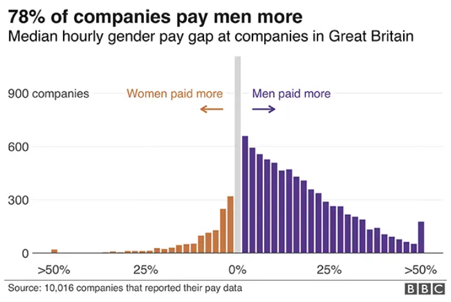
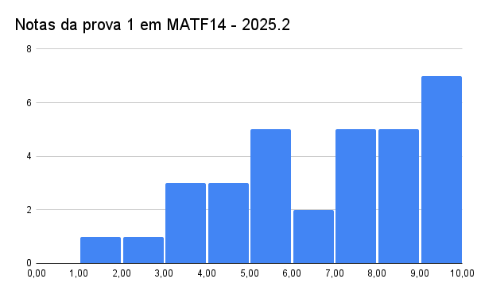
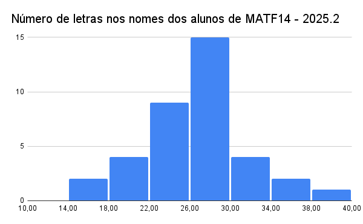
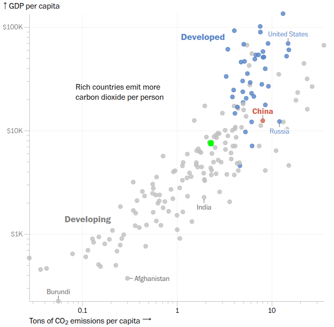

# Estatística Descritiva e Exploratória de Dados


Antes de estimar um modelo, testar uma hipótese ou opinar sobre política econômica, todo trabalho
empírico começa da mesma pergunta: *o que, exatamente, estou olhando?* Considere um punhado de
afirmações que aparecem, quase sem exceção, em qualquer telejornal de economia:

> "O salário médio do brasileiro subiu 3% no último ano."

> "A empresa X teve faturamento recorde, puxado por um crescimento médio de 40%."

> "A pesquisa mostra que 68% dos entrevistados aprovam a medida."

> "O desvio padrão dos retornos desse fundo é de apenas 2% ao mês, um investimento seguro."

Cada uma dessas frases é, ao mesmo tempo, perfeitamente correta do ponto de vista aritmético e
potencialmente enganosa do ponto de vista da leitura que sugere. Este capítulo constrói o
vocabulário, tipo de variável, tabela, gráfico, medidas de posição, dispersão e forma, necessário
para saber, diante de uma frase como essas, exatamente que pergunta fazer em seguida.

Duas bases reais acompanham o capítulo inteiro:

```{=html}
<div class="caixa-aplicacao"><strong>Aplicação: as duas bases do capítulo</strong><br>
<code>empresas</code>: 200 empresas brasileiras, com porte, natureza jurídica, faturamento em 1998
e 1999, número de empregados, idade, cidade, setor e região.<br>
<code>prefeitos</code>: perfil sociodemográfico dos prefeitos eleitos em todos os municípios
brasileiros, sexo, idade, raça, escolaridade, se disputava reeleição, população do município.
</div>
```


``` r
glimpse(empresas)
```

```
## Rows: 106
## Columns: 11
## $ Empresa       <dbl> 1, 2, 3, 4, 5, 6, 7, 8, 9, 10, 11, 12, 13, 14, 15, 16, 1…
## $ constituicao  <chr> "Ltda.", "S.A.", "Ltda.", "Ltda.", "Ltda.", "S.A.", "Ind…
## $ porte         <chr> "Pequena", "Média", "Grande", "Média", "Pequena", "Grand…
## $ empregados99  <dbl> 9, 31, 119, 35, 6, 46, 23, 162, 7, 6, 34, 243, 35, 7, 13…
## $ faturamento98 <dbl> 64302, 177330, 449546, 200223, 86559, 413846, 208081, 43…
## $ faturamento99 <dbl> 74392, 251488, 369409, 230843, 98436, 408905, 226582, 39…
## $ idade         <dbl> 15, 5, 21, 12, 18, 25, 12, 19, 24, 9, 35, 3, 37, 3, 42, …
## $ cidade        <chr> "São Paulo", "Rio de Janeiro", "Salvador", "Salvador", "…
## $ atividade     <chr> "Artigos para embalagens e acondicionamento", "Artigos p…
## $ setor         <chr> "Embalagens", "Embalagens", "Outros", "Embalagens", "Man…
## $ regiao        <chr> "sudeste", "sudeste", "nordeste", "nordeste", "nordeste"…
```

## População e amostra {#populacao-amostra}

Antes de calcular qualquer coisa, uma pergunta administrativa, mas decisiva: os dados que você tem
na tela são *tudo* que existe para responder à pergunta, ou são só uma fatia?

> O Censo Demográfico do IBGE tenta visitar todo domicílio do país, é uma amostra ou uma
> população?

> A PNAD Contínua entrevista cerca de 211 mil domicílios por trimestre, de um total de mais de 70
> milhões no Brasil, e ainda assim seus números viram manchete nacional sobre "o desemprego no
> Brasil". Isso é uma generalização legítima?

> Uma corretora analisa os 200 clientes que fecharam negócio no mês passado para decidir sua
> política de crédito para o mês seguinte. Quem são os clientes que ela está *deixando de
> observar* nessa análise?

Uma **população** é o conjunto de todas as unidades (pessoas, empresas, municípios, transações)
sobre as quais se quer tirar uma conclusão. Uma **amostra** é um subconjunto da população
efetivamente observado. A distinção não é de tamanho, é de *papel*: os 5232
municípios em `prefeitos` são a população de municípios brasileiros com eleição em 2020 (o dado é
censitário, todos foram observados); já `empresas` traz 106 empresas, uma
**amostra** de um universo muito maior de empresas brasileiras.

Essa diferença importa porque muda o que se pode afirmar. Um resumo calculado sobre a população
inteira (um **parâmetro**, geralmente denotado por letras gregas, como $\mu$ para a média
populacional) é um fato, não tem incerteza associada, a não ser erro de medição ou de registro. Um
resumo calculado sobre uma amostra (uma **estatística**, geralmente denotado por letras latinas,
como $\bar{x}$) é uma *estimativa* do parâmetro correspondente, e portanto carrega incerteza: outra
amostra das mesmas 200 empresas provavelmente daria um faturamento médio um pouco diferente. A
Estatística Descritiva deste capítulo não trata dessa incerteza: ela resume o que foi observado,
seja população ou amostra. A pergunta "o que esse número diria se eu tivesse coletado outra
amostra?" é o assunto da Inferência Estatística, fora do escopo desta disciplina, mas que se apoia
inteiramente no vocabulário construído aqui.

```{=html}
<div class="caixa-economia"><strong>Leitura econômica</strong>, quando o IBGE divulga a taxa de
desemprego trimestral pela PNAD Contínua, ele não entrevista toda a força de trabalho brasileira:
entrevista uma amostra de domicílios e generaliza para a população
(@ibge2024pnad). É por isso que a taxa vem sempre acompanhada de um intervalo de confiança
nos relatórios técnicos, mesmo que o número que estampa a manchete seja só o ponto central. A
manchete raramente cita o intervalo, o profissional que sabe ler dados sabe que ele existe e o
procura na nota metodológica.</div>
```

```{=html}
<div class="caixa-discussao"><strong>Para discutir</strong>

<p><strong>1.</strong> Uma rede de farmácias analisa as vendas das suas 40 lojas no último mês
para decidir em quais bairros abrir novas unidades. As 40 lojas atuais são população ou amostra,
em relação à pergunta "onde devo abrir a próxima loja"? E em relação à pergunta "como foi o
desempenho das lojas que já tenho"?</p>

<p><strong>2.</strong> Uma enquete informal em rede social pergunta "você apoia a reforma tributária?"
e recebe 50 mil respostas em um dia. Compare, em amplitude e em confiabilidade, esse "n" grande com
uma pesquisa de opinião profissional que entrevista 2 mil pessoas selecionadas por amostragem
probabilística. Por que "mais respostas" não significa necessariamente "amostra melhor"?</p>

<p><strong>3.</strong> O Banco Central publica o Boletim Focus com a mediana das expectativas de
mais de 100 instituições financeiras para a inflação do ano. Essas 100+ instituições são a
população de "todo mundo que tem uma opinião sobre inflação" ou uma amostra dela? A resposta muda o
que você pensa sobre o número publicado?</p>

<p><strong>4.</strong> Dado o exemplo da PNAD Contínua acima: se a amostra de domicílios for
recrutada só em capitais (por ser mais barato entrevistar), que tipo de erro isso introduziria, um
erro de <em>tamanho</em> de amostra ou um erro de outra natureza? Essa distinção importa para a
confiabilidade do resultado?</p>
</div>
```

## Tipos de variáveis {#tipos-variaveis}

Cada coluna de uma base de dados mede uma **variável**, uma característica que assume valores
diferentes entre as unidades observadas. A primeira decisão analítica, antes de qualquer conta, é
identificar *que tipo* de variável se tem, porque isso determina quais resumos e gráficos fazem
sentido, e quais são, na melhor das hipóteses, sem sentido, e na pior, enganosos.

**Variáveis qualitativas (categóricas)** descrevem uma qualidade ou atributo, não uma quantidade.

- *Nominais*: categorias sem ordem natural. Em `empresas`: `porte` (Pequena/Média/Grande, cuidado,
  este é o único caso *ordinal* de fato) e `regiao`; em `prefeitos`: `sexo`, `raca`.
- *Ordinais*: categorias com ordem natural, mas sem distância numérica bem definida entre elas. Em
  `prefeitos`: `escolaridade` (Ensino fundamental < Ensino médio < Ensino superior < Especialização
  <...), sabemos que Especialização é "mais" que Ensino médio, mas não que a diferença seja "igual"
  entre quaisquer dois níveis consecutivos.

**Variáveis quantitativas (numéricas)** descrevem uma quantidade, mensurável em alguma escala.

- *Discretas*: assumem valores em um conjunto enumerável, tipicamente contagens. Em `empresas`:
  `empregados99` (não existem 31,4 empregados).
- *Contínuas*: assumem, em princípio, qualquer valor em um intervalo real. Em `empresas`:
  `faturamento99` (na prática, arredondado ao centavo, mas conceitualmente contínuo); em
  `prefeitos`: `idade` é tecnicamente discreta (anos completos), mas é comum tratá-la como contínua
  para fins de resumo, dado o grande número de valores possíveis.

<table class="table table-striped table-hover" style="width: auto !important; margin-left: auto; margin-right: auto;">
<caption>(\#tab:tabela-tipos)Classificação de variáveis nas duas bases do capítulo</caption>
 <thead>
  <tr>
   <th style="text-align:left;"> Variável </th>
   <th style="text-align:left;"> Base </th>
   <th style="text-align:left;"> Tipo </th>
  </tr>
 </thead>
<tbody>
  <tr>
   <td style="text-align:left;"> porte </td>
   <td style="text-align:left;"> empresas </td>
   <td style="text-align:left;"> Qualitativa ordinal </td>
  </tr>
  <tr>
   <td style="text-align:left;"> regiao </td>
   <td style="text-align:left;"> empresas </td>
   <td style="text-align:left;"> Qualitativa nominal </td>
  </tr>
  <tr>
   <td style="text-align:left;"> escolaridade </td>
   <td style="text-align:left;"> prefeitos </td>
   <td style="text-align:left;"> Qualitativa ordinal </td>
  </tr>
  <tr>
   <td style="text-align:left;"> empregados99 </td>
   <td style="text-align:left;"> empresas </td>
   <td style="text-align:left;"> Quantitativa discreta </td>
  </tr>
  <tr>
   <td style="text-align:left;"> faturamento99 </td>
   <td style="text-align:left;"> empresas </td>
   <td style="text-align:left;"> Quantitativa contínua </td>
  </tr>
  <tr>
   <td style="text-align:left;"> sexo (prefeitos) </td>
   <td style="text-align:left;"> prefeitos </td>
   <td style="text-align:left;"> Qualitativa nominal </td>
  </tr>
</tbody>
</table>

Por que essa classificação importa na prática: uma média de `porte` (Pequena=1, Média=2, Grande=3)
é aritmeticamente calculável, mas **não tem significado direto**, dizer que o porte médio é "1,8"
não informa nada que a distribuição de frequências não informe melhor. Já a média de
`faturamento99` é diretamente interpretável em reais. Errar essa distinção é uma das fontes mais
comuns de gráfico e estatística sem sentido em relatórios econômicos, e, não coincidentemente, um
dos erros mais comuns em prova.

```{=html}
<div class="caixa-discussao"><strong>Para discutir</strong>

<p><strong>1.</strong> O IBGE, em algumas pesquisas, registra raça/cor como variável autodeclarada
com cinco categorias (branca, preta, parda, amarela, indígena). É nominal ou ordinal? Justifique
com a definição formal, não com intuição.</p>

<p><strong>2.</strong> "Faixa de renda" (até 2 salários mínimos, de 2 a 5, de 5 a 10, acima de 10)
é construída a partir de uma variável contínua (renda em R\$) cortada em intervalos. A variável
derivada é discreta, contínua ou qualitativa? O que se ganha e o que se perde nessa
transformação, pense tanto em termos de informação estatística quanto de facilidade de
comunicação a um público não técnico.</p>

<p><strong>3.</strong> Um aplicativo de delivery classifica cada pedido em uma "nota de satisfação"
de 1 a 5 estrelas. É comum ver relatórios de empresas calculando a "nota média" desse tipo de
variável. Isso é defensável? Sob que condição (bem específica) faria mais sentido tratar essa
variável como quantitativa em vez de ordinal?</p>

<p><strong>4.</strong> O código de um município no IBGE (por exemplo, 2927408 para Salvador) é um
número. Ele é uma variável quantitativa? Por que a resposta a essa pergunta não depende de o valor
"ser um número", mas de outra coisa, o quê?</p>

<p><strong>5.</strong> Pense em uma variável da sua área de interesse (finanças, mercado de
trabalho, comércio exterior, política pública) que seja frequentemente mal classificada por
analistas menos cuidadosos, nominal tratada como ordinal, ou ordinal tratada como quantitativa.
Que erro de interpretação essa má classificação costuma gerar?</p>
</div>
```

## Apresentação tabular e principais tipos de representação gráfica {#tabelas-graficos}

### Tabelas de frequência

Para uma variável qualitativa (ou quantitativa discreta com poucos valores), a **tabela de
frequências** conta quantas unidades caem em cada categoria.


``` r
tab_setor <- empresas |>
  count(setor, name = "f") |>
  mutate(
    `f (%)` = round(100 * f / sum(f), 1)
  ) |>
  arrange(desc(f))

tab_setor |>
  kbl(caption = "Distribuição de frequências das empresas por setor") |>
  kable_styling(bootstrap_options = c("striped", "hover"), full_width = FALSE)
```

<table class="table table-striped table-hover" style="width: auto !important; margin-left: auto; margin-right: auto;">
<caption>(\#tab:tabela-freq-setor)Distribuição de frequências das empresas por setor</caption>
 <thead>
  <tr>
   <th style="text-align:left;"> setor </th>
   <th style="text-align:right;"> f </th>
   <th style="text-align:right;"> f (%) </th>
  </tr>
 </thead>
<tbody>
  <tr>
   <td style="text-align:left;"> Embalagens </td>
   <td style="text-align:right;"> 31 </td>
   <td style="text-align:right;"> 29.2 </td>
  </tr>
  <tr>
   <td style="text-align:left;"> Industrial </td>
   <td style="text-align:right;"> 17 </td>
   <td style="text-align:right;"> 16.0 </td>
  </tr>
  <tr>
   <td style="text-align:left;"> Laminados plásticos </td>
   <td style="text-align:right;"> 17 </td>
   <td style="text-align:right;"> 16.0 </td>
  </tr>
  <tr>
   <td style="text-align:left;"> Domiciliar e pessoal </td>
   <td style="text-align:right;"> 16 </td>
   <td style="text-align:right;"> 15.1 </td>
  </tr>
  <tr>
   <td style="text-align:left;"> Outros </td>
   <td style="text-align:right;"> 13 </td>
   <td style="text-align:right;"> 12.3 </td>
  </tr>
  <tr>
   <td style="text-align:left;"> Manilhas, canos e conexões </td>
   <td style="text-align:right;"> 12 </td>
   <td style="text-align:right;"> 11.3 </td>
  </tr>
</tbody>
</table>

Sendo $f_i$ o número de casos na categoria $i$ e $n = \sum_i f_i$ o total de casos, a **frequência
relativa** (proporção) e a **porcentagem** da categoria $i$ são

$$
p_i = \frac{f_i}{n}, \qquad \%_i = 100 \times \frac{f_i}{n}\,\%.
$$

### Tabelas de dupla entrada

Quando se quer estudar a relação entre duas variáveis qualitativas, usa-se uma **tabela de
contingência** (dupla entrada).


``` r
tab_dupla <- prefeitos |>
  filter(!is.na(sexo), !is.na(Regiao)) |>
  count(Regiao, sexo) |>
  pivot_wider(names_from = sexo, values_from = n, values_fill = 0)

tab_dupla |>
  kbl(caption = "Prefeitos eleitos em 2020, por região e sexo") |>
  kable_styling(bootstrap_options = c("striped", "hover"), full_width = FALSE)
```

<table class="table table-striped table-hover" style="width: auto !important; margin-left: auto; margin-right: auto;">
<caption>(\#tab:tabela-contingencia)Prefeitos eleitos em 2020, por região e sexo</caption>
 <thead>
  <tr>
   <th style="text-align:left;"> Regiao </th>
   <th style="text-align:right;"> Feminino </th>
   <th style="text-align:right;"> Masculino </th>
  </tr>
 </thead>
<tbody>
  <tr>
   <td style="text-align:left;"> 1 - Norte </td>
   <td style="text-align:right;"> 67 </td>
   <td style="text-align:right;"> 349 </td>
  </tr>
  <tr>
   <td style="text-align:left;"> 2 - Nordeste </td>
   <td style="text-align:right;"> 297 </td>
   <td style="text-align:right;"> 1427 </td>
  </tr>
  <tr>
   <td style="text-align:left;"> 3 - Sudeste </td>
   <td style="text-align:right;"> 118 </td>
   <td style="text-align:right;"> 1394 </td>
  </tr>
  <tr>
   <td style="text-align:left;"> 4 - Sul </td>
   <td style="text-align:right;"> 97 </td>
   <td style="text-align:right;"> 1041 </td>
  </tr>
  <tr>
   <td style="text-align:left;"> 5 - Centro-Oeste </td>
   <td style="text-align:right;"> 56 </td>
   <td style="text-align:right;"> 386 </td>
  </tr>
</tbody>
</table>

```{=html}
<div class="caixa-economia"><strong>Leitura econômica</strong>, essa tabela é, sozinha, uma
evidência quantitativa do desequilíbrio de gênero na representação política municipal brasileira:
em toda região, o número de prefeitas eleitas é uma fração pequena do de prefeitos. É o mesmo tipo
de leitura usada para discutir a diferença salarial entre homens e mulheres ("gender pay gap") no
mercado de trabalho, uma tabela de dupla entrada simples, lida com cuidado, já comunica uma
assimetria estrutural, antes de qualquer teste estatístico mais sofisticado.</div>
```

<div class="figure" style="text-align: center">

<p class="caption">(\#fig:fig-gender-pay-gap)78% das empresas britânicas pagam mais aos homens, distribuição da diferença salarial mediana por hora. Fonte: BBC, a partir de dados de 10.016 empresas.</p>
</div>

Note que essa notícia real não usa uma média nem uma mediana isoladas, usa exatamente uma tabela
de frequências (um histograma da diferença salarial entre 900 empresas), o mesmo instrumento desta
seção. É por isso que "78% das empresas pagam mais aos homens" é uma afirmação mais defensável do
que "a mulher ganha X% menos, em média": a distribuição completa mostra que a maioria das empresas
está do mesmo lado, não apenas que a média está deslocada.

<div class="figure" style="text-align: center">

<p class="caption">(\#fig:fig-forca-trabalho)Taxa de participação na força de trabalho por sexo e raça, Brasil, 2012-2022. Fonte: BBC News Brasil, a partir da PNAD Contínua/IBGE.</p>
</div>

Esse segundo gráfico cruza **três** variáveis qualitativas ao mesmo tempo (sexo, raça, e o ano,
tratado como uma sequência temporal): a tabela de dupla entrada da Seção anterior generaliza
diretamente para mais de duas variáveis, ao custo de precisar de um gráfico de linhas múltiplas (uma
linha por combinação sexo×raça) em vez de uma única tabela.

Quando se divide cada célula pelo total da *linha* (em vez do total geral), obtém-se a frequência
relativa **condicional** àquela linha, útil para comparar composições entre grupos de tamanhos
diferentes:

$$
\text{Tabela: Distribuição segundo curso e sexo, \% em relação ao curso}
$$

<table class="table table-striped table-hover" style="width: auto !important; margin-left: auto; margin-right: auto;">
 <thead>
  <tr>
   <th style="text-align:center;"> Curso </th>
   <th style="text-align:center;"> Masculino </th>
   <th style="text-align:center;"> Feminino </th>
   <th style="text-align:center;"> Total </th>
  </tr>
 </thead>
<tbody>
  <tr>
   <td style="text-align:center;"> Física </td>
   <td style="text-align:center;"> 100 (71%) </td>
   <td style="text-align:center;"> 20 (33%) </td>
   <td style="text-align:center;"> 120 (60%) </td>
  </tr>
  <tr>
   <td style="text-align:center;"> Geografia </td>
   <td style="text-align:center;"> 40 (29%) </td>
   <td style="text-align:center;"> 40 (67%) </td>
   <td style="text-align:center;"> 80 (40%) </td>
  </tr>
  <tr>
   <td style="text-align:center;"> Total </td>
   <td style="text-align:center;"> 140 (100%) </td>
   <td style="text-align:center;"> 60 (100%) </td>
   <td style="text-align:center;"> 200 (100%) </td>
  </tr>
</tbody>
</table>

Sem essa normalização por linha, a comparação "Física tem mais homens que Geografia" mistura duas
coisas: o curso é maior *e* mais desbalanceado por sexo. A versão condicional isola a segunda
informação, o mesmo raciocínio, formalizado, reaparece no Capítulo 2 como probabilidade
condicional.

### Gráficos para variáveis qualitativas


``` r
ggplot(tab_setor, aes(x = fct_reorder(setor, f), y = f)) +
  geom_col(fill = "#0d3b54") +
  coord_flip() +
  labs(x = NULL, y = "Número de empresas", title = "Empresas por setor de atividade") +
  theme_minimal(base_size = 12)
```


Gráficos de barras (ou de setores/pizza, para poucas categorias e ênfase em "fatia do total") são
adequados para variáveis qualitativas e discretas com poucos valores. Um erro comum em relatórios
econômicos é usar gráfico de **linha** para conectar categorias sem ordem numérica (por exemplo,
"faturamento médio por setor", em ordem alfabética de setor), a linha sugere uma tendência
contínua entre categorias que é pura ilusão visual.

```{=html}
<div class="caixa-aplicacao"><strong>Aplicação: comparação entre países</strong>: uma reportagem
recente comparou o consumo médio de refrigerante por domicílio em quatro países: México
(270,9 litros/ano), Brasil (76,6), Reino Unido (114) e Portugal (40).</div>
```

<div class="figure" style="text-align: center">

<p class="caption">(\#fig:fig-refri)Consumo médio de refrigerante por domicílio/ano, segundo pesquisa Worldpanel by Numerator.</p>
</div>


``` r
refri <- tibble(
  pais = c("México", "Reino Unido", "Brasil", "Portugal"),
  litros = c(270.9, 114, 76.6, 40)
)
ggplot(refri, aes(x = fct_reorder(pais, litros), y = litros)) +
  geom_col(fill = "#c9971e") + coord_flip() +
  labs(x = NULL, y = "Litros por domicílio/ano",
       title = "Consumo médio de refrigerante") +
  theme_minimal(base_size = 12)
```


País é uma variável qualitativa nominal, e "litros por domicílio/ano" é quantitativa contínua, o
gráfico de barras compara a variável contínua **entre** categorias, o mesmo papel que cumpriu o
gráfico de empresas por setor. Note que a notícia já converteu quatro números brutos em um gráfico
ordenado por magnitude, exatamente a regra de bom senso vista acima (`fct_reorder`), não uma
coincidência de bom design.

### Gráficos para variáveis quantitativas

Para variáveis contínuas, o **histograma** agrupa os valores em classes (intervalos) e mostra a
frequência (ou densidade) em cada uma:


``` r
ggplot(empresas, aes(x = faturamento99)) +
  geom_histogram(bins = 20, fill = "#c9971e", color = "white") +
  labs(x = "Faturamento em 1999 (R$ mil)", y = "Número de empresas",
       title = "Distribuição do faturamento das empresas") +
  theme_minimal(base_size = 12)
```


O número de classes altera a leitura do histograma, poucas classes escondem estrutura, muitas
introduzem ruído. Uma regra prática (não a única) é a **regra de Sturges**: número de classes
$k \approx 1 + \log_2(n)$.

```{=html}
<div class="caixa-r"><strong>Uso do R: bases de dados prontas para praticar</strong>, o R já vem
com dezenas de bases de dados reais embutidas, ótimas para praticar sem precisar carregar nenhum
arquivo externo. Uma clássica é <code>chickwts</code>: peso de pintinhos após seis semanas,
segundo o tipo de ração recebida.</div>
```


``` r
data(chickwts)
hist(chickwts$weight, main = "Peso de pintinhos após 6 semanas",
     xlab = "Peso (gramas)", ylab = "Frequência", col = "#0d3b54")
```


`?chickwts` no console do R mostra a documentação completa, uma boa base para checar rapidamente
se o número de classes escolhido "esconde" ou "inventa" estrutura, antes de aplicar a mesma
checagem em dados econômicos reais, como o faturamento das empresas.

Para séries temporais econômicas (inflação mês a mês, PIB trimestral), o gráfico natural é o
**gráfico de linha/sequência**, que preserva a ordem temporal, nunca se resume uma série temporal
a um histograma sem antes decidir se a ordem no tempo é ou não relevante para a pergunta (quase
sempre é). O R também traz séries temporais reais prontas para uso, como `AirPassengers` (número
mensal de passageiros de linhas aéreas nos EUA, 1949–1960), vale explorá-la com `plot(AirPassengers)`
como exercício adicional de leitura de série temporal.


``` r
set.seed(2026)
ipca <- tibble(
  mes = seq(as.Date("2024-01-01"), as.Date("2025-12-01"), by = "month"),
  variacao_pct = pmax(round(rnorm(24, mean = 0.40, sd = 0.25), 2), -0.10)
)

ggplot(ipca, aes(x = mes, y = variacao_pct)) +
  geom_line(color = "#0d3b54") +
  geom_point(color = "#c9971e") +
  geom_hline(yintercept = 0, linetype = "dashed", color = "grey50") +
  labs(x = NULL, y = "Variação mensal do IPCA (%)",
       title = "IPCA mensal, série ilustrativa (2024–2025, simulada)") +
  theme_minimal(base_size = 12)
```


```{=html}
<div class="caixa-r"><strong>Uso do R</strong>, <code>geom_histogram()</code> escolhe o número de
classes automaticamente (30 por padrão); sempre ajuste com o argumento <code>bins</code> e compare
mais de uma escolha antes de tirar conclusões sobre a forma da distribuição. Para séries no tempo,
<code>geom_line()</code> exige que o eixo x já seja um tipo de data (<code>Date</code>), não texto,
caso contrário o R ordena alfabeticamente, não cronologicamente.</div>
```

```{=html}
<div class="caixa-discussao"><strong>Para discutir</strong>

<p><strong>1.</strong> Um jornal publica um gráfico de pizza com 11 fatias representando a
participação de 11 setores no PIB nacional. Duas fatias adjacentes têm 9% e 11%. É fácil, olhando
o gráfico, dizer qual é maior? Que gráfico alternativo resolveria esse problema, e por quê?</p>

<p><strong>2.</strong> Um relatório de uma rede de lojas de conveniência apresenta um gráfico de
barras do "faturamento médio mensal" em cada uma de suas 6 filiais, com o eixo vertical começando
em R\$ 40.000 (não em zero), fazendo diferenças de poucos milhares de reais parecerem enormes
visualmente. Explique, formalmente, por que cortar o eixo y distorce a leitura de um gráfico de
barras, e descreva como o mesmo gráfico ficaria, e o que mudaria na conclusão do leitor, com o
eixo começando em zero.</p>

<p><strong>3.</strong> Compare o histograma de faturamento acima com um possível gráfico de barras
do faturamento *médio* por setor. Que informação o histograma mostra que o gráfico de barras por
setor esconde completamente?</p>

<p><strong>4.</strong> A regra de Sturges sugere $k\approx1+\log_2(n)$ classes. Para $n=200$
(o tamanho de <code>empresas</code>), quantas classes ela sugere? Teste no histograma acima
alterando <code>bins</code> para esse valor e para valores bem menores e bem maiores, em que ponto
o histograma começa a "esconder" ou a "inventar" estrutura que não existe nos dados?</p>

<p><strong>5.</strong> Um analista de política monetária precisa decidir entre publicar o IPCA
mensal como (i) uma tabela de 24 números, (ii) um gráfico de barras, ou (iii) um gráfico de linha
como o exibido acima. Argumente a favor da opção (iii) usando um critério que não seja apenas
"estética".</p>
</div>
```

## Medidas de tendência central e suas relações {#tendencia-central}

Sejam $x_1, x_2, \ldots, x_n$ os $n$ valores observados de uma variável quantitativa.

**Média aritmética.** É o centro de gravidade dos dados:

$$
\bar{x} = \frac{x_1 + x_2 + \cdots + x_n}{n} = \frac{1}{n}\sum_{i=1}^n x_i.
$$

**Mediana.** É o valor que ocupa a posição central quando os dados são ordenados: metade das
observações fica abaixo, metade acima.

$$
\text{Mediana} =
\begin{cases}
x_{\left(\frac{n+1}{2}\right)}, & n \text{ ímpar}\\[4pt]
\dfrac{x_{\left(\frac{n}{2}\right)} + x_{\left(\frac{n}{2}+1\right)}}{2}, & n \text{ par}
\end{cases}
$$

em que $x_{(k)}$ denota o $k$-ésimo valor da amostra **ordenada**.

**Moda.** É o valor (ou categoria) que ocorre com maior frequência, a única medida de tendência
central que faz sentido para variáveis qualitativas nominais.


``` r
resumo_faturamento <- empresas |>
  summarise(
    media = mean(faturamento99),
    mediana = median(faturamento99),
    minimo = min(faturamento99),
    maximo = max(faturamento99)
  )
resumo_faturamento |> kbl(digits = 1) |> kable_styling(full_width = FALSE)
```

<table class="table" style="width: auto !important; margin-left: auto; margin-right: auto;">
 <thead>
  <tr>
   <th style="text-align:right;"> media </th>
   <th style="text-align:right;"> mediana </th>
   <th style="text-align:right;"> minimo </th>
   <th style="text-align:right;"> maximo </th>
  </tr>
 </thead>
<tbody>
  <tr>
   <td style="text-align:right;"> 334264.9 </td>
   <td style="text-align:right;"> 327898 </td>
   <td style="text-align:right;"> 74392 </td>
   <td style="text-align:right;"> 685430 </td>
  </tr>
</tbody>
</table>

```{=html}
<div class="caixa-economia"><strong>Leitura econômica</strong>, a média de faturamento
(R$ 334.265 mil) fica bem acima da mediana
(R$ 327.898 mil). Isso é a assinatura de uma
distribuição assimétrica à direita: um pequeno número de empresas muito grandes "puxa" a média para
cima, enquanto a mediana, insensível a esses valores extremos, continua descrevendo a empresa
"típica". É exatamente o mesmo fenômeno da distribuição de renda de um país: a renda média nacional
é sistematicamente maior que a renda mediana, e a razão entre as duas já é, informalmente, um
primeiro indicador (bruto) de desigualdade.</div>
```

A relação entre as três medidas é informativa sobre a **forma** da distribuição (retomada na Seção
\@ref(assimetria-curtose)): em distribuições aproximadamente simétricas, média $\approx$ mediana
$\approx$ moda; em distribuições assimétricas à direita (cauda longa de valores altos, como renda
ou faturamento), tipicamente moda $<$ mediana $<$ média; em assimetria à esquerda, a ordem se
inverte.

```{=html}
<div class="caixa-discussao"><strong>Para discutir</strong>

<p><strong>1.</strong> O Ministério do Trabalho divulga o "salário médio" de uma categoria
profissional. Um sindicato, ao negociar reajuste, prefere divulgar a mediana. Explique a motivação
de cada escolha, e o que isso revela sobre como estatísticas descritivas podem ser selecionadas
estrategicamente, mesmo sem nenhuma delas ser "falsa".</p>

<p><strong>2.</strong> Se a variável fosse escolaridade (ordinal, com categorias "fundamental",
"médio", "superior"), faria sentido calcular uma "escolaridade média"? E uma "escolaridade
mediana"? Justifique a diferença.</p>

<p><strong>3.</strong> Pense em uma variável econômica que você esperaria ter moda muito diferente
da média (por exemplo, preço de imóveis em uma cidade com bairros muito distintos). Qual seria a
consequência prática de um agente imobiliário anunciar "o preço médio dos imóveis da cidade" sem
qualificar por bairro?</p>

<p><strong>4.</strong> Um fundo de investimento anuncia "retorno médio anualizado de 15% nos
últimos 5 anos". Que pergunta sobre a mediana e sobre a variabilidade ano a ano você faria antes de
decidir investir, só com base no que já foi discutido até aqui?</p>

<p><strong>5.</strong> É possível uma distribuição ter média, mediana e moda exatamente iguais e,
ainda assim, ser muito diferente de uma distribuição em forma de sino simétrica (pense, por
exemplo, em uma distribuição bimodal simétrica)? O que isso ensina sobre os limites de resumir uma
distribuição inteira só pelas medidas de tendência central?</p>
</div>
```

### Um exemplo com dados da própria turma

As melhores bases de dados para praticar Estatística Descritiva, às vezes, são as mais simples de
coletar, inclusive os dados da própria turma. Duas ilustrações de turmas reais de MATF14 em
semestres anteriores:

<div class="figure" style="text-align: center">

<p class="caption">(\#fig:fig-notas-prova1)Distribuição das notas da Prova 1 em uma turma real de MATF14 (2025.2).</p>
</div>

<div class="figure" style="text-align: center">

<p class="caption">(\#fig:fig-letras-nomes)Número de letras no nome completo dos alunos de uma turma real de MATF14 (2025.2).</p>
</div>

```{=html}
<div class="caixa-discussao"><strong>Para discutir</strong>

<p><strong>1.</strong> Olhando só o histograma de notas, estime visualmente se a média está acima
ou abaixo da mediana. A distribuição é mais parecida com a de faturamento das empresas (Seção
anterior) ou com uma distribuição aproximadamente simétrica? O que isso sugere sobre a prova ter
sido "fácil demais", "difícil demais", ou razoavelmente bem calibrada?</p>

<p><strong>2.</strong> O histograma do número de letras nos nomes é um exercício quase lúdico,
mas ainda assim uma variável quantitativa discreta real, com média, mediana, dispersão e forma
bem definidas. Seria possível repetir esse exercício com a sua própria turma nesta disciplina?
Qual forma você esperaria ver: simétrica, assimétrica à direita, ou outra?</p>
</div>
```

## Medidas de dispersão: amplitude, quantis, variância e coeficiente de variação {#dispersao}

Duas distribuições podem ter a mesma média e serem completamente diferentes na variabilidade dos
dados em torno dela. Medir "quão espalhados" os dados estão é tão importante quanto medir o centro,
e é, sistematicamente, a parte que relatórios populares de economia mais omitem.

> Duas ações têm o mesmo retorno médio anual de 12%. Uma delas variou entre 8% e 16% ao longo dos
> últimos 5 anos; a outra, entre -30% e 45%. Você as consideraria igualmente atraentes?

> Dois municípios têm a mesma renda per capita média. Em um deles, quase todo mundo ganha perto
> dessa média; no outro, há uma elite que ganha 50 vezes a média e uma maioria que ganha bem menos.
> A renda média, sozinha, distingue esses dois cenários?

**Amplitude total.** A diferença entre o maior e o menor valor:

$$
AT = x_{\max} - x_{\min}.
$$

É simples, mas extremamente sensível a um único valor extremo, uma única empresa atípica infla a
$AT$ inteira sem dizer nada sobre as outras 199.

### Quantis, distância interquartílica e boxplot

O **quantil de ordem $p$** ($0<p<1$), $Q_p$, é o valor abaixo do qual está uma proporção $p$ dos
dados. Os **quartis** ($Q_1=Q_{0{,}25}$, $Q_2=Q_{0{,}50}=$ mediana, $Q_3=Q_{0{,}75}$) dividem a
amostra ordenada em quatro partes iguais. A **distância (ou amplitude) interquartílica**

$$
IQR = Q_3 - Q_1
$$

mede a dispersão dos 50% centrais dos dados, sendo por isso muito mais **robusta a valores
extremos** que a amplitude total, não depende dos valores mínimo e máximo.


``` r
quantile(empresas$faturamento99, probs = c(0, .25, .5, .75, 1))
```

```
##       0%      25%      50%      75%     100% 
##  74392.0 256230.5 327898.0 397744.8 685430.0
```

O **boxplot** (diagrama de caixa) representa visualmente $Q_1$, $Q_2$, $Q_3$, e os limites além dos
quais um ponto é considerado um **outlier**, convencionalmente $Q_1 - 1{,}5 \times IQR$ e
$Q_3 + 1{,}5 \times IQR$:


``` r
ggplot(empresas, aes(x = porte, y = faturamento99, fill = porte)) +
  geom_boxplot(show.legend = FALSE) +
  scale_fill_manual(values = c("Pequena" = "#cfe8ef", "Média" = "#7fb8cf", "Grande" = "#0d3b54")) +
  labs(x = "Porte", y = "Faturamento em 1999 (R$ mil)",
       title = "Faturamento por porte da empresa") +
  theme_minimal(base_size = 12)
```


```{=html}
<div class="caixa-aplicacao"><strong>Aplicação</strong>, o boxplot acima já responde, visualmente,
uma pergunta de política de crédito: a variabilidade de faturamento dentro do grupo "Grande" é
muito maior que dentro de "Pequena", um banco que usa "porte" como critério único de risco está
ignorando uma dispersão substancial dentro da própria categoria.</div>
```

### Desvio padrão, variância e coeficiente de variação

A variância mede a dispersão média dos dados em torno da média, em unidades **ao quadrado**:

$$
\mathrm{Var}(X) = \frac{1}{n}\sum_{i=1}^n (x_i - \bar{x})^2.
$$

O **desvio padrão** devolve a medida à escala original dos dados:

$$
dp(X) = \sqrt{\mathrm{Var}(X)} = \sqrt{\frac{1}{n}\sum_{i=1}^n (x_i - \bar{x})^2}.
$$

```{=html}
<div class="caixa-economia"><strong>Nota técnica: duas convenções de variância</strong><br>
A fórmula acima, com divisor $n$, é a <strong>variância descritiva</strong> (às vezes chamada
populacional): resume a dispersão dos dados que você tem em mãos, sem pretender estimar nada além
deles. Quando os mesmos $n$ valores são vistos como uma <em>amostra</em> de uma população maior e o
objetivo é <strong>estimar</strong> a variância populacional, usa-se o divisor $n-1$ (correção de
Bessel), $s^2 = \frac{1}{n-1}\sum_i (x_i-\bar x)^2$, o padrão da Inferência Estatística, e também o
default da função <code>var()</code> do R. Nesta disciplina, que é de estatística descritiva e
probabilidade, o divisor $n$ é o usado nas provas e listas, seguindo o fórmulário oficial; fique
atento a essa diferença em disciplinas futuras de inferência/econometria (@wooldridge2016introducao).</div>
```


``` r
var_n <- function(x) mean((x - mean(x))^2)   # divisor n, usado neste curso
dp_n  <- function(x) sqrt(var_n(x))

c(var_n = var_n(empresas$faturamento99), dp_n = dp_n(empresas$faturamento99),
  var_R = var(empresas$faturamento99))       # var() do R usa divisor n-1
```

```
##         var_n          dp_n         var_R 
## 11086337503.7      105291.7 11191921670.4
```

O desvio padrão tem a mesma unidade da variável original (R\$ mil), o que o torna interpretável,
mas isso também é um problema quando se quer comparar a dispersão de variáveis em unidades
**diferentes**, ou com médias muito diferentes. O **coeficiente de variação**,

$$
CV(X) = \frac{dp(X)}{\bar{x}},
$$

remove essa unidade e permite comparação direta:


``` r
empresas |>
  summarise(
    cv_faturamento = dp_n(faturamento99) / mean(faturamento99),
    cv_empregados  = dp_n(empregados99) / mean(empregados99)
  )
```

```
## # A tibble: 1 × 2
##   cv_faturamento cv_empregados
##            <dbl>         <dbl>
## 1          0.315          1.12
```

```{=html}
<div class="caixa-economia"><strong>Leitura econômica</strong>, não faz sentido comparar
diretamente o desvio padrão de "faturamento em R\$ mil" (ordem de centenas de milhares) com o de
"número de empregados" (ordem de dezenas): são unidades incomparáveis. O $CV$, por ser adimensional,
permite afirmar qual das duas variáveis é <em>relativamente</em> mais dispersa em torno de sua
própria média, uma pergunta genuinamente comparável entre variáveis, moedas ou países. É a mesma
lógica usada para comparar a volatilidade de duas ações com preços médios muito diferentes.</div>
```

```{=html}
<div class="caixa-discussao"><strong>Para discutir</strong>

<p><strong>1.</strong> Retome a pergunta de abertura desta seção sobre as duas ações com retorno
médio de 12%, uma variando entre 8-16% e outra entre -30-45%. Que medida de dispersão você usaria
para quantificar essa diferença de risco, e por que a amplitude total, sozinha, poderia ser
enganosa se um dos 5 anos fosse um evento atípico (uma crise, por exemplo)?</p>

<p><strong>2.</strong> Um gestor de risco reporta apenas o desvio padrão mensal de um fundo
("2%"). Baseado só nesse número, é possível saber se há meses de perdas catastróficas raras
escondidos numa distribuição majoritariamente estável? Que outra informação (ainda não vista, mas
pode arriscar um palpite) ajudaria a responder isso?</p>

<p><strong>3.</strong> Compare o boxplot de faturamento por porte com um hipotético gráfico que só
mostrasse a média de faturamento por porte, sem nenhuma medida de dispersão. Que decisão de
política de crédito mudaria ao ver o boxplot completo, em vez de só as três médias?</p>

<p><strong>4.</strong> O $IQR$ e o desvio padrão respondem, ambos, "quão dispersos são os dados",
mas de formas diferentes. Construa (mentalmente ou em papel) um conjunto de dados pequeno em que os
dois discordem bastante sobre qual de dois grupos é "mais disperso". O que causa essa discordância?</p>

<p><strong>5.</strong> Um artigo de jornal econômico afirma que "o Brasil é mais desigual que a
Argentina" citando apenas a renda média per capita dos dois países. Que medida de dispersão (e por
quê) seria indispensável para essa afirmação fazer sentido?</p>
</div>
```

## Coeficiente de correlação {#correlacao}

Quando duas variáveis quantitativas são observadas nas mesmas unidades, como `empregados99` e
`faturamento99`, nas mesmas 200 empresas, é natural perguntar se elas variam *juntas*. O
**coeficiente de correlação linear de Pearson** mede a força e o sentido dessa associação
**linear**:

$$
r = \frac{\displaystyle\sum_{i=1}^n (x_i - \bar{x})(y_i - \bar{y})}
         {\sqrt{\displaystyle\sum_{i=1}^n (x_i-\bar x)^2}\ \sqrt{\displaystyle\sum_{i=1}^n (y_i-\bar y)^2}},
 \qquad -1 \le r \le 1.
$$

$r$ próximo de $+1$ indica associação linear positiva forte (quando um sobe, o outro tende a
subir); próximo de $-1$, associação negativa forte; próximo de $0$, ausência de associação
**linear** (não necessariamente ausência de qualquer relação, $r$ é cego a relações não lineares,
um ponto retomado adiante).


``` r
r_emp <- cor(empresas$empregados99, empresas$faturamento99)

ggplot(empresas, aes(x = empregados99, y = faturamento99)) +
  geom_point(alpha = 0.6, color = "#0d3b54") +
  geom_smooth(method = "lm", se = FALSE, color = "#c9971e") +
  labs(x = "Número de empregados (1999)", y = "Faturamento em 1999 (R$ mil)",
       title = paste0("Empregados × Faturamento (r = ", round(r_emp, 2), ")")) +
  theme_minimal(base_size = 12)
```


```{=html}
<div class="caixa-aplicacao"><strong>Aplicação: correlação em escala internacional</strong>,
o mesmo tipo de gráfico de dispersão, em escala logarítmica, é usado para mostrar a relação entre
riqueza e emissão de carbono entre países: PIB per capita (eixo vertical) e toneladas de
CO<sub>2</sub> emitidas por pessoa (eixo horizontal).</div>
```

<div class="figure" style="text-align: center">

<p class="caption">(\#fig:fig-gdp-co2)PIB per capita vs. emissão de CO2 per capita, por país. Países mais ricos emitem mais carbono por pessoa. Fonte: Our World in Data.</p>
</div>

Note a escala **logarítmica** nos dois eixos, necessária porque tanto PIB per capita quanto
emissão de CO<sub>2</sub> são fortemente assimétricos à direita (Seção
\@ref(assimetria-curtose)): sem o log, os países mais ricos dominariam visualmente o gráfico e a
relação entre a maioria dos países ficaria amassada perto da origem. É uma técnica que você vai
reencontrar sempre que trabalhar com variáveis econômicas de grande amplitude (renda, PIB, valor
de mercado de empresas).

```{=html}
<div class="caixa-discussao"><strong>Para discutir</strong>

<p><strong>1.</strong> "Correlação não implica causalidade" é um clichê, mas vale a pena ser
concreto: o número de empregados de uma empresa poderia <em>causar</em> maior faturamento (mais
gente produzindo), o faturamento poderia causar o número de empregados (empresas maiores
contratam mais), ou uma terceira variável (porte, setor, capital inicial) poderia causar ambos. Os
dados de correlação, sozinhos, não distinguem essas três histórias, que dado adicional, ou que
desenho de coleta de dados, ajudaria a distinguir?</p>

<p><strong>2.</strong> É famoso o exemplo de que, ao longo do século XX, o número de sorvetes
vendidos e o número de afogamentos em praias estão fortemente correlacionados. Identifique a
variável de confusão (a terceira variável) que explica essa correlação sem que uma cause a
outra.</p>

<p><strong>3.</strong> Construa mentalmente um exemplo em que $X$ e $Y$ têm uma relação forte e
perfeitamente previsível (para cada $x$, existe exatamente um $y$ correspondente), mas
$r\approx0$. (Dica: pense em uma relação em forma de "U" ou parábola.) O que esse exemplo ensina
sobre os limites do coeficiente de correlação?</p>

<p><strong>4.</strong> Um analista de mercado imobiliário calcula a correlação entre "número de
metros quadrados" e "preço do imóvel" numa amostra de apartamentos de um único bairro e obtém
$r=0{,}9$. Ele generaliza a conclusão "área é o principal determinante de preço" para toda a
cidade, incluindo bairros muito diferentes. O que pode dar errado nessa generalização?</p>

<p><strong>5.</strong> No gráfico PIB×CO<sub>2</sub>, países desenvolvidos (azul) aparecem
concentrados no canto superior direito. Um formulador de política climática de um país em
desenvolvimento poderia usar esse gráfico para argumentar que "países ricos deveriam reduzir mais
suas emissões, proporcionalmente, que países pobres". A correlação positiva, sozinha, sustenta
esse argumento normativo (sobre o que "deveria" acontecer), ou ela só descreve um padrão
observado? Qual a diferença entre as duas coisas?</p>
</div>
```

## Medidas de assimetria e curtose {#assimetria-curtose}

A média, a mediana e o desvio padrão resumem posição e dispersão, mas duas distribuições com o
mesmo centro e a mesma dispersão ainda podem ter **formas** muito diferentes. A **assimetria**
mede o desequilíbrio da distribuição em torno da média:

$$
\text{Assimetria} =
\frac{\frac{1}{n}\sum_{i=1}^n (x_i-\bar x)^3}{\mathrm{Var}(X)^{3/2}}
=\frac{\frac{1}{n}\sum_{i=1}^n (x_i-\bar x)^3}{\left(\frac{1}{n}\sum_{i=1}^n (x_i-\bar x)^2\right)^{3/2}}.
$$

Assimetria positiva $\Rightarrow$ cauda mais longa à direita (valores altos raros puxando a cauda,
como faturamento e renda); assimetria negativa $\Rightarrow$ cauda mais longa à esquerda; próxima
de zero $\Rightarrow$ distribuição aproximadamente simétrica.

A **curtose** mede o "achatamento", quão pesadas são as caudas e quão concentrado é o pico central
em relação a uma distribuição Normal (que serve de referência, com curtose igual a 3, formalizada
no Capítulo 4):

$$
\text{Curtose} =
\frac{\frac{1}{n}\sum_{i=1}^n (x_i-\bar x)^4}{\mathrm{Var}(X)^{2}}
=\frac{\frac{1}{n}\sum_{i=1}^n (x_i-\bar x)^4}{\left(\frac{1}{n}\sum_{i=1}^n (x_i-\bar x)^2\right)^{2}}.
$$

Curtose $>3$ (leptocúrtica) indica caudas mais pesadas que a Normal, mais eventos extremos que o
"esperado" sob normalidade; curtose $<3$ (platicúrtica) indica caudas mais leves.


``` r
assimetria <- function(x) {
  n <- length(x); m <- mean(x)
  (mean((x - m)^3)) / (var_n(x)^{3/2})
}
curtose <- function(x) {
  n <- length(x); m <- mean(x)
  (mean((x - m)^4)) / (var_n(x)^2)
}

empresas |>
  summarise(assimetria_faturamento = assimetria(faturamento99),
            curtose_faturamento = curtose(faturamento99))
```

```
## # A tibble: 1 × 2
##   assimetria_faturamento curtose_faturamento
##                    <dbl>               <dbl>
## 1                  0.357                3.58
```

```{=html}
<div class="caixa-economia"><strong>Leitura econômica</strong>, assimetria positiva forte (como a
que aparece acima) é a regra, não a exceção, em variáveis econômicas de valor monetário: renda,
faturamento, patrimônio, retorno de ativos em crise. É por isso que economistas raramente reportam
só a média de renda de um país, relatórios como o do Banco Mundial ou do IPEA sobre desigualdade
sempre acompanham a média de medidas de dispersão e de assimetria (ou de indicadores derivados,
como o índice de Gini), exatamente para não esconder essa cauda longa atrás de um único número.
Curtose alta em retornos financeiros diários é, na prática de gestão de risco, o motivo pelo qual
modelos que assumem normalidade tendem a subestimar a frequência de quedas bruscas de mercado.</div>
```

```{=html}
<div class="caixa-discussao"><strong>Para discutir: síntese do capítulo</strong>

<p><strong>1.</strong> Retome as quatro afirmações de abertura do capítulo ("salário médio subiu
3%", "faturamento recorde de 40%", "68% aprovam a medida", "desvio padrão de apenas 2%"). Para cada
uma, escreva a pergunta específica (envolvendo tipo de variável, medida de posição, dispersão ou
forma) que você faria antes de aceitar a conclusão implícita da manchete.</p>

<p><strong>2.</strong> Duas distribuições de renda municipal têm exatamente a mesma média,
mediana, desvio padrão e correlação com escolaridade, mas uma tem assimetria positiva forte e
curtose alta (poucos super-ricos raros), e a outra tem assimetria próxima de zero (mais
"igualitária" na forma, mesmo com a mesma dispersão total). Explique por que essas duas cidades
poderiam demandar políticas públicas bem diferentes, mesmo tendo os "quatro primeiros números"
idênticos.</p>

<p><strong>3.</strong> Assimetria e curtose são medidas normalizadas (adimensionais, como o $CV$).
Por que essa normalização é necessária para comparar a forma de distribuições de variáveis em
escalas ou unidades diferentes, por exemplo, comparar a assimetria da distribuição de faturamento
de <code>empresas</code> com a assimetria da distribuição etária de <code>prefeitos</code>?</p>
</div>
```

## Fechando o capítulo

O Capítulo 1 construiu o vocabulário para *resumir* dados: tipo de variável, tabela, gráfico,
posição, dispersão, forma e associação. Mais importante que qualquer fórmula individual, o
capítulo tentou deixar um hábito: diante de um número resumido, perguntar sempre "que outro número,
ainda não mostrado, mudaria minha interpretação deste aqui?" O Capítulo
\@ref(introducao-a-teoria-das-probabilidades) muda de pergunta, em vez de resumir dados já
observados, constrói a linguagem formal para **quantificar incerteza sobre o que ainda não foi
observado**, o alicerce necessário para, mais adiante, entender de onde vêm os modelos
probabilísticos (Bernoulli, Binomial, Poisson, Normal) que frequentemente estão por trás dos
próprios dados descritos aqui.
