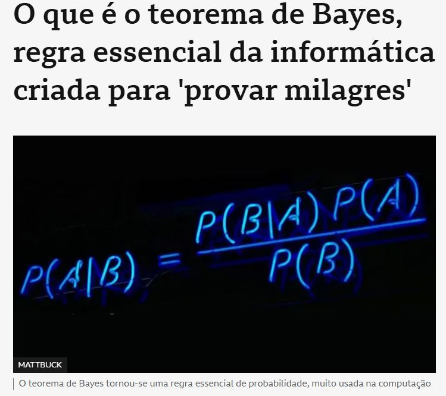

# Introdução à Teoria das Probabilidades {#introducao-a-teoria-das-probabilidades}

```{r setup-cap2, include=FALSE}
knitr::opts_chunk$set(echo = TRUE, warning = FALSE, message = FALSE, fig.align = "center")
suppressPackageStartupMessages({
  library(tidyverse)
  library(kableExtra)
})
options(scipen = 999)
```

O Capítulo 1 resumiu dados já observados. Este capítulo muda de pergunta: como quantificar
a incerteza sobre um resultado que **ainda não ocorreu**? Um investidor não sabe se uma ação vai
subir ou cair amanhã; um banco não sabe se um cliente específico vai inadimplir; o Tesouro Nacional
não sabe, com certeza, se a meta de inflação será cumprida. A Teoria das Probabilidades é a
linguagem matemática para essas perguntas, e é o alicerce necessário para tudo que vem depois:
variáveis aleatórias (Capítulos 3 e 4), e, em disciplinas futuras, inferência estatística e
econometria.

## Introdução: o que significa "probabilidade" {#prob-introducao}

Um **experimento aleatório** é um processo cujo resultado não pode ser previsto com certeza antes
de sua realização, mesmo que se conheçam todos os resultados possíveis. Lançar uma moeda, sortear
um cliente de uma carteira para auditoria, observar se uma ação fecha em alta ou baixa amanhã,
todos são experimentos aleatórios.

Há (pelo menos) duas interpretações de probabilidade relevantes para a Economia:

- **Frequentista**: probabilidade é o limite da frequência relativa de um evento se o experimento
  fosse repetido um número muito grande de vezes, em condições idênticas. É a interpretação natural
  para dizer "a probabilidade de um empréstimo específico entrar em default é de 3%" com base no
  histórico de milhares de empréstimos semelhantes.
- **Subjetiva (bayesiana)**: probabilidade é um grau de crença racional sobre um evento, mesmo
  quando ele não pode ser repetido nas mesmas condições, "a probabilidade de o Banco Central subir
  a Selic na próxima reunião é de 70%" não se refere a uma frequência de reuniões idênticas
  repetidas, mas a uma crença calibrada com a informação disponível hoje.

Ambas obedecem aos mesmos axiomas matemáticos, construídos a seguir, a diferença está apenas em
*como* se interpreta o número, não em como se calcula com ele.

```{r fig-pesquisa-opiniao, echo=FALSE, out.width="75%", fig.cap="Pesquisa Datafolha: 8 em cada 10 brasileiros são a favor da demissão de servidores por má performance."}
knitr::include_graphics("images/pesquisa_opiniao.jpg")
```

Essa manchete ("8 em cada 10 brasileiros") é a interpretação **frequentista** em ação: o Datafolha
não entrevistou todos os brasileiros, entrevistou uma amostra, e reporta a proporção observada
nela como estimativa da proporção que se observaria repetindo o levantamento com amostras
diferentes, exatamente o vocabulário de população e amostra do Capítulo 1. A cada pesquisa desse
tipo acompanha uma margem de erro (não mostrada aqui), quanto essa proporção variaria de amostra
para amostra, um tema que ultrapassa o Capítulo 2, mas que começa exatamente na definição
frequentista de probabilidade dada acima.

```{=html}
<div class="caixa-discussao"><strong>Para discutir</strong>

<p><strong>1.</strong> Classifique cada afirmação a seguir como mais próxima da interpretação
frequentista ou da subjetiva, e justifique: (a) "a probabilidade de um dado honesto dar 6 é
1/6"; (b) "a probabilidade de chover amanhã em Salvador é 40%"; (c) "a probabilidade de a
Argentina vencer a próxima Copa do Mundo é 8%"; (d) "a probabilidade de um segurado de 25 anos
sofrer um sinistro automotivo no ano é 12%, segundo o histórico da seguradora".</p>

<p><strong>2.</strong> Um evento que só pode acontecer uma única vez na história (uma eleição
específica, uma crise financeira específica), faz sentido falar em "probabilidade" desse evento
sob a interpretação frequentista pura? O que a interpretação subjetiva permite que a frequentista,
estritamente, não permite?</p>

<p><strong>3.</strong> Um trader profissional e um segurado comum usam a palavra "probabilidade"
de formas diferentes no dia a dia? Dê um exemplo de cada um usando o termo, e identifique se a
interpretação implícita é a mesma.</p>
</div>
```

## Espaço amostral e eventos {#espaco-amostral-eventos}

O **espaço amostral** $\Omega$ é o conjunto de todos os resultados possíveis de um experimento
aleatório. Um **evento** é qualquer subconjunto $A \subseteq \Omega$, uma coleção de resultados
que nos interessa.

```{=html}
<div class="caixa-aplicacao"><strong>Aplicação: classificação de crédito</strong>: um banco
classifica cada novo empréstimo em uma de quatro categorias de risco:
$\Omega = \{\text{AA}, \text{A}, \text{B}, \text{C}\}$. O evento "empréstimo de risco elevado" é
$A = \{\text{B}, \text{C}\} \subset \Omega$.</div>
```

### Operações com eventos (revisão de teoria de conjuntos)

Como eventos são conjuntos, toda a álgebra de conjuntos se aplica:

| Operação | Notação | Significado |
|---|---|---|
| União | $A \cup B$ | $A$ ou $B$ (ou ambos) ocorre |
| Interseção | $A \cap B$ | $A$ e $B$ ocorrem simultaneamente |
| Complemento | $A^c$ (ou $\bar A$) | $A$ não ocorre |
| Diferença | $A - B$ | $A$ ocorre e $B$ não |

Dois eventos são **mutuamente exclusivos** (ou disjuntos) se $A \cap B = \emptyset$, não podem
ocorrer ao mesmo tempo. Exemplo: "a inflação do mês fecha acima da meta" e "a inflação do mês fecha
abaixo do piso da meta" são mutuamente exclusivos (não podem ocorrer no mesmo mês).

```{r diagrama-venn, echo=FALSE, fig.width=5, fig.height=3.2}
library(ggplot2)
ggplot() +
  annotate("path", x = 0.35 + 0.5*cos(seq(0,2*pi,length.out=100)),
           y = 0.5 + 0.5*sin(seq(0,2*pi,length.out=100)), color = "#0d3b54", linewidth = 1) +
  annotate("path", x = 0.65 + 0.5*cos(seq(0,2*pi,length.out=100)),
           y = 0.5 + 0.5*sin(seq(0,2*pi,length.out=100)), color = "#c9971e", linewidth = 1) +
  annotate("text", x = 0.05, y = 0.5, label = "A", size = 6, color = "#0d3b54") +
  annotate("text", x = 0.95, y = 0.5, label = "B", size = 6, color = "#c9971e") +
  annotate("text", x = 0.5, y = 0.5, label = expression(A %.% B), size = 5) +
  coord_equal() + theme_void()
```

```{=html}
<div class="caixa-discussao"><strong>Para discutir</strong>

<p><strong>1.</strong> Um analista define $\Omega$ para o "resultado do PIB do próximo trimestre"
como $\{\text{crescimento}, \text{recessão}\}$. Outro analista, mais cuidadoso, define
$\Omega=\{\text{crescimento forte}, \text{crescimento fraco}, \text{estagnação},
\text{recessão leve}, \text{recessão severa}\}$. Os dois espaços amostrais estão "errados"? O que
muda na análise dependendo de qual granularidade se escolhe?</p>

<p><strong>2.</strong> Dê um exemplo de dois eventos econômicos reais que sejam mutuamente
exclusivos, e outro de dois eventos que possam ocorrer simultaneamente (não exclusivos). Em cada
caso, explique com base na definição formal, não na intuição.</p>

<p><strong>3.</strong> O evento "a Selic sobe na próxima reunião" e o evento "a Selic sobe mais de
0,5 ponto percentual na próxima reunião" têm alguma relação de subconjunto entre si? Desenhe
mentalmente (ou em papel) o diagrama de Venn correspondente.</p>
</div>
```

## Conceitos e propriedades de probabilidade {#conceitos-probabilidade}

Uma **função de probabilidade** $P(\cdot)$ atribui a cada evento $A \subseteq \Omega$ um número
$P(A)$ satisfazendo os **axiomas de Kolmogorov**:

1. $P(A) \ge 0$ para todo evento $A$.
2. $P(\Omega) = 1$ (algum resultado do espaço amostral certamente ocorre).
3. Se $A_1, A_2, \ldots$ são eventos mutuamente exclusivos dois a dois, então
   $P(A_1 \cup A_2 \cup \cdots) = P(A_1) + P(A_2) + \cdots$ (aditividade).

Desses três axiomas decorrem propriedades usadas o tempo todo na prática:

$$
P(A^c) = 1 - P(A), \qquad P(\emptyset)=0, \qquad A\subseteq B \Rightarrow P(A)\le P(B).
$$

**Regra da adição (evento geral, não necessariamente disjuntos)**:

$$
P(A\cup B) = P(A) + P(B) - P(A\cap B).
$$

```{=html}
<div class="caixa-economia"><strong>Leitura econômica</strong>, a regra da adição é usada, por
exemplo, para calcular a probabilidade de que uma empresa seja afetada por "aumento de juros
\emph{ou} desvalorização cambial" no próximo trimestre, os dois eventos não são mutuamente
exclusivos (podem ocorrer juntos, e frequentemente ocorrem, já que o Banco Central às vezes sobe
juros em resposta à pressão cambial), então subtrair a interseção evita contar duas vezes o cenário
em que ambos acontecem.</div>
```

```{=html}
<div class="caixa-aplicacao"><strong>Aplicação: caindo na malha fina</strong>, a Receita
Federal cruza informações de todas as declarações de Imposto de Renda entregues em um ano. A
tabela abaixo (com números arredondados, em milhares de declarações) cruza a faixa de renda
declarada com o resultado do cruzamento: 80,2 milhões de declarações no total.</div>
```

```{r tabela-malha-fina}
malha_fina <- tribble(
  ~Faixa_de_renda, ~Caiu_na_malha_fina, ~Nao_caiu, ~Total,
  "D, abaixo de 25 mil",      90,  14010, 14100,
  "C, de 25 mil a 49.999",    71,  30629, 30700,
  "B, de 50 mil a 99.999",    69,  24631, 24700,
  "A, acima de 100 mil",      80,  10620, 10700,
  "Total",                    310,  79890, 80200
)
malha_fina |> kbl(col.names = c("Faixa de renda", "Caiu na malha fina", "Não caiu", "Total")) |>
  kable_styling(bootstrap_options = c("striped","hover"), full_width = FALSE)
```

Seja $Z=$ "a declaração caiu na malha fina" e $Y=$ "a declaração é da faixa A (renda mais alta)".
Sorteando uma declaração ao acaso entre as 80,2 milhões:

$$
P(Z) = \frac{310}{80200} \approx 0{,}0039 \qquad P(Y) = \frac{10700}{80200} \approx 0{,}133
\qquad P(Z\cap Y) = \frac{80}{80200} \approx 0{,}0010.
$$

```{r malha-fina-r}
P_Z  <- 310/80200
P_Y  <- 10700/80200
P_ZY <- 80/80200
c(P_Z = P_Z, P_Y = P_Y, P_Z_e_Y = P_ZY)
```

Pela regra da adição, a probabilidade de uma declaração ser da faixa A **ou** ter caído na malha
fina é $P(Y\cup Z) = P(Y)+P(Z)-P(Y\cap Z) \approx 0{,}133+0{,}0039-0{,}0010 = 0{,}136$, subtraindo
a interseção para não contar duas vezes as declarações que satisfazem as duas condições ao mesmo
tempo. Essa base é retomada na Seção \@ref(probabilidade-condicional) para perguntar algo mais
interessante: a probabilidade de cair na malha fina **muda** conforme a faixa de renda?

### Modelo de espaço equiprovável e métodos de contagem

Quando $\Omega$ é finito e todos os resultados são igualmente prováveis (**espaço equiprovável**),

$$
P(A) = \frac{\#A}{\#\Omega} = \frac{\text{nº de resultados favoráveis a } A}{\text{nº total de resultados possíveis}}.
$$

Calcular $P(A)$ nesse caso é um problema de **contagem**. Três regras cobrem a maioria dos casos:

- **Princípio multiplicativo**: se uma escolha tem $k_1$ opções, seguida de outra com $k_2$
  opções (independente da primeira), o total de sequências é $k_1 \times k_2$.
- **Permutações** de $n$ objetos distintos: $n! = n\times(n-1)\times\cdots\times 1$ arranjos
  possíveis (a ordem importa).
- **Combinações**: número de subconjuntos de tamanho $k$ escolhidos entre $n$ objetos, sem
  importar a ordem:
  $$
  \binom{n}{k} = \frac{n!}{k!(n-k)!}.
  $$

```{r combinacoes-r}
choose(10, 3)     # C(10,3): combinações
factorial(5)       # 5! permutações
```

```{=html}
<div class="caixa-aplicacao"><strong>Aplicação: auditoria por amostragem</strong>: um auditor
precisa escolher 3 contratos, de um total de 10, para auditoria detalhada, sem se importar com a
ordem da escolha. O número de amostras de 3 contratos possíveis é $\binom{10}{3}=120$. Se 2 dos 10
contratos têm um problema real, a probabilidade de a amostra sorteada aleatoriamente pegar
\emph{pelo menos um} desses 2 é
$1 - \binom{8}{3}/\binom{10}{3} = 1 - 56/120 \approx 53{,}3\%$, o complementar de "nenhum dos 2
problemáticos entra na amostra".</div>
```

```{=html}
<div class="caixa-discussao"><strong>Para discutir</strong>

<p><strong>1.</strong> Por que a regra $P(A\cup B)=P(A)+P(B)$ (sem subtrair a interseção) só vale
quando $A$ e $B$ são mutuamente exclusivos? Construa um exemplo numérico pequeno em que aplicar
essa regra incorretamente (esquecendo de subtrair a interseção) leva a uma probabilidade maior que
1, o que isso já denuncia sobre o erro?</p>

<p><strong>2.</strong> Em que situação prática você usaria permutação (ordem importa) em vez de
combinação (ordem não importa) para contar possibilidades? Dê um exemplo econômico de cada.</p>

<p><strong>3.</strong> No exemplo da auditoria por amostragem, recalcule a probabilidade se, em vez
de 2, houvesse 5 dos 10 contratos problemáticos. A probabilidade de pegar pelo menos um cresce mais
ou menos que proporcionalmente ao número de contratos problemáticos? Você consegue explicar a
direção desse efeito antes mesmo de fazer a conta?</p>
</div>
```

## Probabilidade condicional {#probabilidade-condicional}

A **probabilidade condicional** de $A$ dado que $B$ já ocorreu é

$$
P(A\mid B) = \frac{P(A\cap B)}{P(B)}, \qquad P(B) > 0.
$$

Condicionar em $B$ significa *restringir o espaço amostral* a apenas os resultados em que $B$
ocorre, dentro desse novo universo, $A\cap B$ é o evento de interesse.

```{r cond-empregos}
tabela <- tribble(
  ~Escolaridade, ~Empregado, ~Desempregado, ~Total,
  "Fundamental/Médio", 180, 70, 250,
  "Superior", 210, 40, 250,
  "Total", 390, 110, 500
)
tabela |> kbl(caption = "500 pessoas por escolaridade e situação ocupacional") |>
  kable_styling(full_width = FALSE)
```

Se $B=$ "ter ensino superior" e $A=$ "estar desempregado", então, sorteando uma pessoa ao acaso
dessa população,

$$
P(A\mid B) = \frac{P(A\cap B)}{P(B)} = \frac{40/500}{250/500} = \frac{40}{250} = 0{,}16.
$$

Compare com a probabilidade **não condicional** $P(A) = 110/500 = 0{,}22$: saber que a pessoa tem
ensino superior *muda* a probabilidade de estar desempregada, de 22% para 16%, o evento
"escolaridade" carrega informação relevante sobre o evento "desemprego" nesta população.

Da definição de probabilidade condicional decorre a **regra do produto**:

$$
P(A\cap B) = P(B)\,P(A\mid B) = P(A)\,P(B\mid A).
$$

```{=html}
<div class="caixa-aplicacao"><strong>Aplicação: voltando à malha fina</strong>, a Seção
\@ref(conceitos-probabilidade) prometeu uma pergunta mais interessante: a chance de cair na malha
fina muda conforme a faixa de renda?</div>
```

```{r malha-fina-condicional}
malha_fina <- malha_fina |> mutate(
  P_malha_dado_faixa = Caiu_na_malha_fina / Total
)
malha_fina |> select(Faixa_de_renda, Caiu_na_malha_fina, Total, P_malha_dado_faixa) |>
  kbl(digits = 4, col.names = c("Faixa", "Caiu na malha", "Total", "P(malha | faixa)")) |>
  kable_styling(full_width = FALSE)
```

A probabilidade condicional de cair na malha fina **quase dobra** entre a faixa de menor renda
(D, $\approx 0{,}64\%$) e a de maior renda (A, $\approx 0{,}75\%$), mesmo com a faixa A
concentrando bem menos declarações no total. A probabilidade não condicional $P(Z)\approx0{,}39\%$
(calculada na Seção anterior) esconde essa heterogeneidade entre faixas, do mesmo jeito que a taxa
de desemprego agregada, adiante, esconde a diferença por escolaridade.

```{=html}
<div class="caixa-discussao"><strong>Para discutir</strong>

<p><strong>1.</strong> Recalcule $P(\text{superior}\mid\text{desempregado})$ (o "outro lado" da
condicional) usando a mesma tabela. Esse valor é igual, maior ou menor que
$P(\text{desempregado}\mid\text{superior})=0{,}16$ calculado no texto? Explique por que, em geral,
$P(A\mid B)\neq P(B\mid A)$, essa confusão tem nome (a "falácia da probabilidade condicional
invertida" ou "falácia do promotor") e é um dos erros mais comuns em leitura de estatística
jurídica e médica.</p>

<p><strong>2.</strong> Um analista político diz "a probabilidade de reeleição, dado que o prefeito
é bem avaliado, é de 80%". Identifique explicitamente quem é $A$ e quem é $B$ nessa frase, e
escreva a expressão formal $P(A\mid B)$ correspondente.</p>

<p><strong>3.</strong> Se $B\subseteq A$ (todo resultado de $B$ também está em $A$), o que se pode
concluir sobre $P(A\mid B)$, sem fazer nenhuma conta? Justifique usando a definição.</p>
</div>
```

## Teoremas básicos de probabilidade {#teoremas-basicos}

### Teorema da probabilidade total

Se $B_1, B_2, \ldots, B_k$ formam uma **partição** de $\Omega$ (mutuamente exclusivos, e
$B_1\cup\cdots\cup B_k = \Omega$), então, para qualquer evento $A$,

$$
P(A) = \sum_{i=1}^k P(A\mid B_i)\,P(B_i).
$$

```{=html}
<div class="caixa-economia"><strong>Leitura econômica</strong>, uma seguradora de crédito
particiona sua carteira por setor econômico ($B_1=$ indústria, $B_2=$ comércio, $B_3=$ serviços) e
conhece a taxa de inadimplência histórica \emph{dentro} de cada setor, $P(A\mid B_i)$. O teorema da
probabilidade total é exatamente a fórmula que a seguradora usa para obter a taxa de inadimplência
\emph{global} esperada da carteira, ponderando cada taxa setorial pela participação $P(B_i)$
daquele setor na carteira total.</div>
```

```{r fig-mapa-homicidios, echo=FALSE, out.width="70%", fig.cap="Homicídios no Brasil por 100 mil habitantes, por estado (2025). Fonte: Atlas da Violência (IPEA e FBSP)."}
knitr::include_graphics("images/mapa_homicidios.png")
```

```{=html}
<div class="caixa-aplicacao"><strong>Aplicação: a taxa nacional é uma probabilidade total</strong>
, o mapa acima mostra a taxa de homicídios por 100 mil habitantes em cada estado, de $6{,}4$ (São
Paulo) a $57{,}4$ (Amapá), com uma taxa nacional agregada de $21{,}2$. Sorteando uma pessoa ao
acaso entre todos os brasileiros, a taxa nacional $21{,}2$ por 100 mil é exatamente
$\sum_i P(\text{homicídio}\mid\text{estado}_i)\times P(\text{estado}_i)$, uma probabilidade total
em que a partição $B_i$ são os 27 estados e o peso $P(B_i)$ é a participação populacional de cada
um. Nenhum estado, isoladamente, tem taxa igual à nacional, o número agregado é sempre uma média
ponderada de realidades estaduais muito diferentes.</div>
```

```{=html}
<div class="caixa-discussao"><strong>Para discutir</strong>

<p><strong>1.</strong> A taxa de inadimplência global calculada pelo teorema da probabilidade total
é uma média ponderada das taxas setoriais. O que aconteceria com essa taxa global se a composição
da carteira (a participação $P(B_i)$ de cada setor) mudasse, mesmo que \emph{nenhuma} taxa setorial
$P(A\mid B_i)$ tivesse mudado? Dê um cenário concreto (por exemplo, crescimento do setor de maior
risco) em que isso levaria um gestor desatento a concluir, erroneamente, que "o risco de crédito
piorou".</p>

<p><strong>2.</strong> Por que a condição "$B_1,\ldots,B_k$ formam uma partição" (mutuamente
exclusivos e exaustivos) é essencial para essa fórmula funcionar? O que quebraria se os segmentos
setoriais se sobrepusessem (uma empresa contada em dois segmentos ao mesmo tempo)?</p>

<p><strong>3.</strong> Um secretário de segurança pública quer decidir onde alocar mais recursos
policiais. A taxa nacional de $21{,}2$ por 100 mil habitantes é útil para essa decisão, ou ela
esconde exatamente a informação que mais importa? Que unidade de análise (estado, município,
bairro) você recomendaria para uma decisão de alocação de recursos, e por quê o teorema da
probabilidade total ajuda a formalizar essa intuição?</p>
</div>
```

## Independência estatística {#independencia}

Dois eventos $A$ e $B$ são **independentes** se a ocorrência de um não altera a probabilidade do
outro:

$$
A \perp B \quad \Longleftrightarrow \quad P(A\mid B) = P(A) \quad \Longleftrightarrow \quad P(A\cap B) = P(A)\,P(B).
$$

A terceira forma (produto das probabilidades) é a mais usada na prática, por não exigir
$P(B)>0$ e por ser simétrica em $A$ e $B$, se ela vale, também vale $P(B\mid A)=P(B)$.

**Independência vs. mutuamente exclusivos**, um erro comum é confundir os dois conceitos. Se
$A$ e $B$ são mutuamente exclusivos ($A\cap B=\emptyset$) e ambos têm probabilidade positiva, eles
são o oposto de independentes: saber que $A$ ocorreu implica $P(B\mid A) = 0 \ne P(B)$, a
ocorrência de um **elimina completamente** a possibilidade do outro, o tipo mais forte possível de
dependência.

```{=html}
<div class="caixa-discussao"><strong>Para discutir: o bloco mais importante do capítulo</strong>

<p><strong>1.</strong> Independência estatística <em>não</em> é o mesmo que "sem relação de
causa". Dois eventos podem ser estatisticamente dependentes sem que um cause o outro (uma terceira
variável causa ambos); e, mais sutil ainda, dois eventos causalmente conectados podem, em uma
amostra específica, apresentar $P(A\cap B)\approx P(A)P(B)$ por coincidência numérica. Por que,
ainda assim, é a definição matemática de independência, não uma noção intuitiva de causa, que
entra nas contas de probabilidade e nas fórmulas de esperança/variância do Capítulo 3?</p>

<p><strong>2.</strong> Dê um exemplo de dois eventos econômicos que você esperaria ser
aproximadamente independentes (por exemplo, "chove em Salvador amanhã" e "a Bolsa de Nova York
fecha em alta hoje"), e outro par que você esperaria fortemente dependente. Justifique cada
intuição.</p>

<p><strong>3.</strong> É possível dois eventos serem independentes numa população e dependentes
numa subpopulação dela? Pense em um exemplo: escolaridade e uso de determinado serviço financeiro
podem ser independentes na população geral, mas dependentes dentro de uma faixa etária específica.
O que esse tipo de situação (às vezes chamada de "paradoxo de Simpson", que você vai reencontrar em
disciplinas futuras) ensina sobre generalizar conclusões de subgrupos para a população inteira, ou
vice-versa?</p>

<p><strong>4.</strong> Um analista de crédito assume, por conveniência de cálculo, que a
inadimplência de dois empréstimos diferentes do mesmo tomador é independente. Em uma crise
econômica generalizada, essa suposição continua razoável? Que tipo de risco (para o banco) essa
suposição incorreta esconde?</p>
</div>
```

## Teorema de Bayes {#teorema-de-bayes}

```{r fig-bayes-neon, echo=FALSE, out.width="65%", fig.cap="O Teorema de Bayes, tornado regra essencial da computação moderna (filtros de spam, sistemas de recomendação, diagnóstico por IA)."}

```

Combinando a regra do produto nos dois sentidos, $P(A\cap B) = P(A\mid B)P(B) = P(B\mid A)P(A)$,
obtém-se o **Teorema de Bayes**:

$$
P(B\mid A) = \frac{P(A\mid B)\,P(B)}{P(A)}.
$$

Quando $B_1,\ldots,B_k$ formam uma partição de $\Omega$, o denominador se expande pelo teorema da
probabilidade total:

$$
P(B_i \mid A) = \frac{P(A\mid B_i)\,P(B_i)}{\sum_{j=1}^k P(A\mid B_j)\,P(B_j)}.
$$

O Teorema de Bayes resolve um tipo específico de pergunta muito comum em Economia e Estatística:
conhece-se $P(\text{evidência}\mid\text{causa})$ (fácil de medir, geralmente por frequência
histórica) e quer-se $P(\text{causa}\mid\text{evidência})$ (o que de fato se quer saber, mas é
difícil de medir diretamente). $P(B)$ é chamada **probabilidade a priori** (antes de observar $A$)
e $P(B\mid A)$, **probabilidade a posteriori** (depois de observar $A$).

```{=html}
<div class="caixa-aplicacao"><strong>Aplicação: teste de fraude em transações de cartão</strong>:
um sistema antifraude classifica uma transação como "suspeita" ($A$) com probabilidade
$P(A\mid \text{fraude})=0{,}95$ (detecta 95\% das fraudes reais) e $P(A\mid \text{legítima})=0{,}03$
(alarme falso em 3\% das transações legítimas). Sabe-se, historicamente, que apenas $0{,}2\%$ das
transações são fraudulentas: $P(\text{fraude})=0{,}002$.</div>
```

```{r bayes-fraude}
p_fraude <- 0.002
p_legit  <- 1 - p_fraude
p_A_dado_fraude <- 0.95
p_A_dado_legit  <- 0.03

p_A <- p_A_dado_fraude * p_fraude + p_A_dado_legit * p_legit
p_fraude_dado_A <- (p_A_dado_fraude * p_fraude) / p_A
p_fraude_dado_A
```

```{=html}
<div class="caixa-economia"><strong>Leitura econômica</strong>, mesmo com um teste que parece
excelente (95\% de detecção, só 3\% de falso alarme), a probabilidade de uma transação marcada como
suspeita ser \emph{de fato} uma fraude é de apenas
`r scales::percent(p_fraude_dado_A, accuracy = 0.1)`. A razão é que fraudes são raras
($0{,}2\%$ da base): mesmo uma taxa pequena de falso alarme (3\%), aplicada à enorme massa de
transações legítimas, gera muito mais alarmes falsos em números absolutos do que fraudes reais
detectadas. Esse é o mesmo raciocínio por trás de por que testes de doenças raras, mesmo precisos,
têm valor preditivo positivo surpreendentemente baixo, e por que sistemas antifraude reais operam
em cascata (o "suspeito" do primeiro filtro vira entrada de uma segunda checagem, mais cara e mais
precisa), em vez de bloquear direto no primeiro alarme.</div>
```

```{=html}
<div class="caixa-r"><strong>Uso do R</strong>, Bayes não precisa de pacote especial: é
manipulação direta de probabilidades, como no chunk acima. O ponto de atenção é sempre calcular
$P(A)$ primeiro (probabilidade total), como denominador comum, antes de aplicar a fórmula de
Bayes propriamente dita.</div>
```

```{=html}
<div class="caixa-discussao"><strong>Para discutir: síntese do capítulo</strong>

<p><strong>1.</strong> Um gestor de risco vê a taxa de detecção (95%) do sistema antifraude e
conclui "o sistema é confiável". Que número, calculado acima, ele está ignorando? Reformule a
frase do gestor de forma tecnicamente correta.</p>

<p><strong>2.</strong> Se a taxa de fraude na base <strong>subisse</strong> de 0,2% para 5% (um
período de fraudes em massa), o que aconteceria com $P(\text{fraude}\mid\text{suspeito})$, mantendo
o mesmo sistema de detecção? Refaça a conta e confirme sua intuição.</p>

<p><strong>3.</strong> Volte ao início do capítulo (as cinco perguntas sobre incerteza econômica da
introdução do livro). Escolha uma delas e esboce, em palavras, como você a atacaria usando
probabilidade condicional, teorema da probabilidade total ou Teorema de Bayes, não precisa
resolver numericamente, só identificar qual ferramenta do capítulo se aplica e por quê.</p>

<p><strong>4.</strong> A "falácia do promotor" (Discussão da Seção
\@ref(probabilidade-condicional)) e o exemplo do antifraude têm uma raiz comum: confundir
$P(\text{evidência}\mid\text{hipótese})$ com $P(\text{hipótese}\mid\text{evidência})$. Escreva, com
suas palavras, uma regra prática de bolso para nunca mais cometer essa confusão.</p>
</div>
```

## Fechando o capítulo

A Unidade 2 construiu a maquinaria formal de incerteza: espaço amostral, eventos, probabilidade
condicional, independência e o Teorema de Bayes. O fio condutor de todas as discussões deste
capítulo foi o mesmo: uma probabilidade só é interpretável se soubermos exatamente *sobre qual
população*, *condicional a que informação*, ela está sendo calculada, trocar essas condições, como
vimos repetidamente, muda o número, às vezes de forma dramática. O Capítulo
\@ref(variaveis-aleatorias-discretas) dá um passo além: em vez de eventos soltos, associa
**números** aos resultados de um experimento aleatório, o conceito de variável aleatória,
permitindo calcular médias e variâncias de quantidades incertas, não apenas probabilidades de
eventos.
