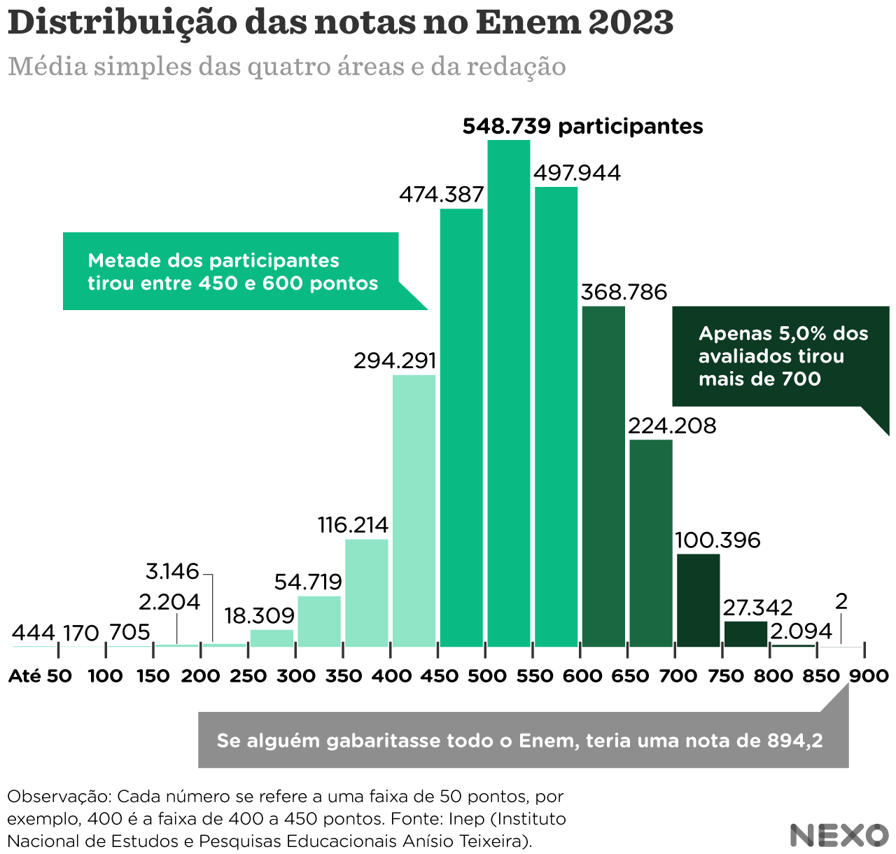

# Variáveis Aleatórias Contínuas {#variaveis-aleatorias-continuas}

```{r setup-cap4, include=FALSE}
knitr::opts_chunk$set(echo = TRUE, warning = FALSE, message = FALSE, fig.align = "center",
                      out.width = "75%")
suppressPackageStartupMessages({
  library(tidyverse)
  library(kableExtra)
  library(patchwork)
})
options(scipen = 999)
empresas  <- read_csv("data/empresas.csv", show_col_types = FALSE)
prefeitos <- read_csv("data/dados_prefeitos.csv", show_col_types = FALSE)
area <- function(f, xlim, a, b, titulo = NULL, rotulo = NULL, ylab = "f(x)", cor = "#1f3fbf", n = 600) {
  d <- tibble(x = seq(xlim[1], xlim[2], length.out = n), y = f(x))
  g <- ggplot(d, aes(x, y)) + geom_area(data = filter(d, x >= a, x <= b), fill = "#f4a6a6", alpha = 0.9) +
    geom_line(color = cor, linewidth = 1.1) + labs(x = "x", y = ylab, title = titulo) + theme_minimal(base_size = 12)
  if (!is.null(rotulo)) g <- g + annotate("text", x = (max(a, xlim[1]) + min(b, xlim[2])) / 2, y = max(d$y) * 0.3, label = rotulo, size = 5)
  g
}
tri  <- function(x) ifelse(x >= 0 & x <= 1, x, ifelse(x > 1 & x <= 2, 2 - x, 0))
f2x  <- function(x) ifelse(x >= 0 & x < 1, 2 * x, 0)
f21x <- function(x) ifelse(x >= 0 & x <= 1, 2 * (1 - x), 0)
```

Tempo, renda, chuva, retorno de investimentos: muitas variáveis econômicas assumem valores em
**intervalos** da reta real, e não em um conjunto enumerável. Para elas, somas viram **integrais** e
probabilidades viram **áreas**. Este capítulo (Unidade 4 da ementa, Aulas 24 a 30) apresenta a densidade de
probabilidade, a esperança, a variância e a FDA de variáveis contínuas, e os modelos Uniforme e Normal. A
revisão de derivadas e integrais necessária está no Apêndice \@ref(revisao-de-calculo). O texto segue
[@morettinbussab2012; @magalhaes2004probabilidade].

## Conceituação de variável aleatória contínua {#va-continua-conceito}

```{r fig-chuva, echo=FALSE, out.width="48%", fig.show="hold", fig.cap="Chuva acumulada em Salvador: uma variável contínua. Fonte: G1 Bahia (12/11/2025)."}
knitr::include_graphics(c("images/chuva_salvador_nov2025_manchete.jpg", "images/chuva_salvador_nov2025_texto.jpg"))
```

Foram 85 mm de chuva em menos de um dia. Poderiam ter sido 85,3 mm, ou 84,97 mm: a quantidade de chuva não
é uma contagem.

::: {.caixa-aplicacao}
Uma **variável aleatória contínua** assume valores em um **intervalo** de números reais. Tipicamente vem de
uma **mensuração**: quantidade de chuva num dia, duração de uma viagem, rentabilidade de um investimento,
renda mensal, tempo de espera em uma fila.
:::

### Probabilidade como área

Para variáveis **discretas**, probabilidades são **somas**. Na avaliação de um posto de saúde com notas 1 a 4 e
probabilidades $0{,}2$, $0{,}1$, $0{,}4$, $0{,}3$, desenhadas como barras de largura 1, cada probabilidade é a **área** de
uma barra e a área total é 1. Para variáveis **contínuas** a ideia é a mesma, com uma curva no lugar das
barras.

```{r fig-area-idea, echo=FALSE, fig.height=3, fig.width=10, out.width="95%", fig.cap="Discreta: probabilidades como áreas de barras. Contínua: P(X > 0) é a área sob a curva, 50% por simetria."}
p1 <- tibble(nota = factor(1:4), p = c(0.2, 0.1, 0.4, 0.3)) |>
  ggplot(aes(nota, p)) + geom_col(width = 1, fill = "#4682b4", color = "white") +
  labs(x = "Nota", y = "Probabilidade") + theme_minimal(base_size = 12)
p1 + area(dnorm, c(-4, 4), 0, 4, rotulo = "50%")
```

::: {.caixa-aplicacao}
A **função densidade de probabilidade** (f.d.p.) de uma variável contínua $X$ é uma função $f$ com

**i.** $f(x) \geq 0$ para todo $x$; e **ii.** $\displaystyle\int_{-\infty}^{\infty} f(x)\,dx = 1$.

Probabilidades são áreas sob $f$:

$$
P(a < X \leq b) = \int_a^b f(x)\,dx.
$$
:::

```{r fig-desenho-area, echo=FALSE, out.width="45%", fig.cap="A área entre a e b é P(a < X ≤ b); a área total é 1."}
knitr::include_graphics("images/fdp_area_desenho.jpg")
```

**Consequências.** $P(X = a) = \int_a^a f(x)\,dx = 0$: para variáveis contínuas, incluir ou não os extremos **não
muda** a probabilidade, $P(a < X < b) = P(a \leq X \leq b)$. E a **densidade não é probabilidade**: $f(x) = 2x$ em
$[0, 1]$ tem $f(1) = 2 > 1$, mas $P(0{,}9 < X < 1) = \int_{0{,}9}^1 2x\,dx = 0{,}19$.

### Exemplo: distribuição triangular

$$
f(x) = \begin{cases} x, & 0 \leq x \leq 1,\\ 2 - x, & 1 < x \leq 2,\\ 0, & \text{caso contrário}. \end{cases}
$$

**a)** $f \geq 0$ e $\int_0^1 x\,dx + \int_1^2 (2 - x)\,dx = \frac{1}{2} + \left[2x - \frac{x^2}{2}\right]_1^2 = \frac{1}{2} + \frac{1}{2} = 1$: é uma densidade.

**b)** $P(0 < X < 0{,}8) = \int_0^{0{,}8} x\,dx = 0{,}32$.

$$
P(0{,}3 < X < 1{,}5) = \int_{0{,}3}^{1} x\,dx + \int_1^{1{,}5} (2 - x)\,dx
$$

$$
= \frac{1 - 0{,}09}{2} + \left[2x - \frac{x^2}{2}\right]_1^{1{,}5} = 0{,}455 + 0{,}375 = 0{,}83.
$$

A segunda integral precisa ser **quebrada** porque a fórmula de $f$ muda em $x = 1$.

```{r fig-triangular, echo=FALSE, fig.height=3, fig.width=10, out.width="95%", fig.cap="Densidade triangular: P(0 < X < 0,8) = 0,32 e P(0,3 < X < 1,5) = 0,83."}
area(tri, c(-0.3, 2.3), 0, 0.8, rotulo = "0,32") + area(tri, c(-0.3, 2.3), 0.3, 1.5, rotulo = "0,83")
```

**Exercício 1.** Mostre que $f(x) = 2(1 - x)$, $0 \leq x \leq 1$, é uma densidade e calcule $P(1/2 < X < 2/3)$.

::: {.caixa-resposta}
$f \geq 0$ e $\int_0^1 2(1 - x)\,dx = [2x - x^2]_0^1 = 1$. $P(1/2 < X < 2/3) = [2x - x^2]_{1/2}^{2/3} = \frac{8}{9} - \frac{3}{4} = \frac{5}{36} \approx 0{,}1389$.
:::

::: {.caixa-economia}
**Tempo de espera numa fila.** O tempo $X$ (minutos) no caixa de um banco tem densidade $f(x) = 0{,}2\,e^{-0{,}2x}$,
$x \geq 0$. Uma primitiva é $-e^{-0{,}2x}$, logo $P(5 \leq X \leq 15) = e^{-1} - e^{-3} \approx 0{,}318$.
:::

```{r integrais-cap4}
c(integrate(tri, 0.3, 1.5)$value, integrate(f21x, 1/2, 2/3)$value, integrate(function(x) 0.2 * exp(-0.2 * x), 5, 15)$value)
```

## Esperança e variância {#va-continua-esperanca-variancia}

```{r fig-aviao, echo=FALSE, out.width="45%", fig.cap="Cabines que excederam o peso esperado de projeto. Fonte: CNN Brasil."}
knitr::include_graphics("images/peso_esperado_aviao.jpg")
```

No caso discreto, $E(X) = \sum x_i P(X = x_i)$. No contínuo, trocamos a **soma** por uma **integral** e a
probabilidade pela **densidade**.

::: {.caixa-aplicacao}
Se $X$ tem densidade $f$,

$$
E(X) = \int_{-\infty}^{\infty} x\, f(x)\,dx, \qquad E[g(X)] = \int_{-\infty}^{\infty} g(x)\, f(x)\,dx,
$$

$$
Var(X) = \int_{-\infty}^{\infty} (x - \mu)^2 f(x)\,dx = E(X^2) - \mu^2, \qquad dp(X) = \sqrt{Var(X)}.
$$

As integrais são calculadas só onde $f(x) \neq 0$, e as **propriedades** de $E$ e $Var$ são as mesmas do
Capítulo 3.
:::

**Exemplo: $f(x) = 2x$, $0 < x < 1$.**

$$
E(X) = \int_0^1 2x^2\,dx = \frac{2}{3}, \qquad E(X^2) = \int_0^1 2x^3\,dx = \frac{1}{2}, \qquad Var(X) = \frac{1}{2} - \frac{4}{9} = \frac{1}{18}.
$$

**Exercício 2: $f(x) = 2(1 - x)$, $0 \leq x \leq 1$.**

::: {.caixa-resposta}
$E(X) = \int_0^1 2(x - x^2)\,dx = 1 - \frac{2}{3} = \frac{1}{3}$; $E(X^2) = \int_0^1 2(x^2 - x^3)\,dx = \frac{2}{3} - \frac{1}{2} = \frac{1}{6}$;
$Var(X) = \frac{1}{6} - \frac{1}{9} = \frac{1}{18}$. As duas densidades são espelhadas: médias diferentes, mesma variância.
:::

```{r fig-medias, echo=FALSE, fig.height=3, fig.width=10, out.width="95%", fig.cap="Histograma de 1.000 valores simulados com densidade 2x (vermelho: densidade; azul: média amostral) e a densidade 2(1 - x) com a média 1/3."}
set.seed(25)
amostra <- sqrt(runif(1000))
g1 <- ggplot(tibble(x = amostra), aes(x)) + geom_histogram(aes(y = after_stat(density)), breaks = seq(0, 1, 0.1), fill = "grey85", color = "grey40") +
  stat_function(fun = f2x, color = "red", linewidth = 1.1, xlim = c(0, 1)) + geom_vline(xintercept = mean(amostra), color = "#3b5bdb", linewidth = 1) +
  labs(y = "Densidade") + theme_minimal(base_size = 12)
g2 <- area(f21x, c(-0.2, 1.2), 0, 1) + geom_vline(xintercept = 1/3, color = "#c0392b", linetype = "dashed", linewidth = 1)
g1 + g2
```

A média amostral de 1.000 valores simulados fica perto de $2/3$: o histograma aproxima a densidade e a
média amostral aproxima $E(X)$.

::: {.caixa-economia}
**Inadimplência de uma carteira.** Se a proporção $X$ de inadimplentes tem densidade $2(1 - x)$, a taxa em
porcentagem $Y = 100X$ tem, pelas propriedades, $E(Y) = 33{,}3\%$ e $dp(Y) = 100/\sqrt{18} \approx 23{,}6$ pontos percentuais,
sem novas integrais. **A média esconde a maioria**: na fila de espera com média de 5 minutos,
$P(X \leq 5) = 1 - e^{-1} \approx 63\%$ dos clientes esperam menos que a média.
:::

## Função de distribuição acumulada {#va-continua-fda}

::: {.caixa-aplicacao}
A FDA de uma variável contínua é a área acumulada até $t$:

$$
F(t) = P(X \leq t) = \int_{-\infty}^{t} f(x)\,dx.
$$

Ela é contínua, não decrescente, vai de 0 a 1, e

$$
F'(t) = f(t), \qquad P(a < X \leq b) = F(b) - F(a).
$$
:::

**Exemplo: $f(x) = 2x$ em $(0, 1)$.** $F(t) = 0$ para $t < 0$; $F(t) = \int_0^t 2x\,dx = t^2$ para $0 \leq t < 1$; $F(t) = 1$ para
$t \geq 1$. **Exercício 3:** para $f(x) = 2(1 - x)$, $F(t) = 2t - t^2$ em $[0, 1)$.

```{r fig-fdas-cont, echo=FALSE, fig.height=3, fig.width=10, out.width="95%", fig.cap="FDAs das densidades 2x (F = t²) e 2(1 - x) (F = 2t - t²)."}
fc <- function(F, titulo) ggplot(tibble(t = seq(-0.2, 1.2, length.out = 400)), aes(t, F(t))) + geom_line(color = "#c0392b", linewidth = 1.2) +
  labs(y = "F(t)", title = titulo) + theme_minimal(base_size = 12)
fc(function(t) ifelse(t < 0, 0, ifelse(t < 1, t^2, 1)), "F(t) = t²") + fc(function(t) ifelse(t < 0, 0, ifelse(t < 1, 2 * t - t^2, 1)), "F(t) = 2t - t²")
```

**Exercício 4.** Seja $f(x) = Cx$ em $[0, 1)$. **a)** Encontre $C$. **b)** Encontre a FDA. **c)** Calcule $P(0{,}2 < X \leq 0{,}4)$.

::: {.caixa-resposta}
**a)** $\int_0^1 Cx\,dx = C/2 = 1$, logo $C = 2$. **b)** $F(t) = t^2$ em $[0, 1)$. **c)** $F(0{,}4) - F(0{,}2) = 0{,}16 - 0{,}04 = 0{,}12$.
:::

**Percentis pela FDA.** O percentil $p$ resolve $F(q) = p$; a mediana, $F(m) = 0{,}5$. Para $f = 2x$, $m = \sqrt{0{,}5} \approx 0{,}707$
(maior que a média $0{,}667$). Na fila, $F(t) = 1 - e^{-0{,}2t}$: a mediana é $5 \ln 2 \approx 3{,}47$ minutos e o percentil 95 é
$-\ln(0{,}05)/0{,}2 \approx 15$ minutos, o tipo de número usado em metas de atendimento ("95% atendidos em até 15
minutos").

## Alguns modelos probabilísticos {#modelos-continuos}

```{r fig-midas, echo=FALSE, out.width="35%", fig.cap="A 'Fórmula de Midas' (Black-Scholes) supõe um modelo probabilístico para preços de ações. Fonte: BBC News Brasil."}

```

Na prática usamos **famílias** de densidades com fórmulas determinadas por **parâmetros**, cujas propriedades
devem refletir o fenômeno analisado.

### Distribuição Uniforme

::: {.caixa-aplicacao}
$X \sim \text{Unif}(\alpha, \beta)$ se

$$
f(x) = \frac{1}{\beta - \alpha}, \quad \alpha \leq x \leq \beta \quad (0 \text{ fora}), \qquad F(t) = \frac{t - \alpha}{\beta - \alpha} \text{ em } [\alpha, \beta],
$$

$$
P(a < X < b) = \frac{b - a}{\beta - \alpha}, \qquad E(X) = \frac{\alpha + \beta}{2}, \qquad Var(X) = \frac{(\beta - \alpha)^2}{12}.
$$
:::

Intervalos de **mesmo comprimento** têm a **mesma probabilidade**: a Uniforme modela situações sem nenhum valor
preferido. Com $\alpha = 0$ e $\beta = 1$: $P(X < 0{,}8) = 0{,}8$, $P(0{,}2 < X < 0{,}9) = 0{,}7$, $P(X > 0{,}5) = 0{,}5$, $E(X) = 1/2$ e
$Var(X) = 1/12$.

**Dedução da média e da variância.** Usando $b^2 - a^2 = (b - a)(b + a)$ e $b^3 - a^3 = (b - a)(b^2 + ab + a^2)$:
$E(X) = \frac{\beta^2 - \alpha^2}{2(\beta - \alpha)} = \frac{\alpha + \beta}{2}$, $E(X^2) = \frac{\alpha^2 + \alpha\beta + \beta^2}{3}$ e
$Var(X) = \frac{\alpha^2 + \alpha\beta + \beta^2}{3} - \frac{(\alpha + \beta)^2}{4} = \frac{(\beta - \alpha)^2}{12}$.

```{r fig-uniformes, echo=FALSE, fig.height=3, fig.width=10, out.width="95%", fig.cap="Densidade e FDA da Unif(2, 7)."}
g1 <- ggplot(tibble(x = seq(1, 8, length.out = 800)), aes(x, dunif(x, 2, 7))) + geom_line(color = "#1f3fbf", linewidth = 1.2) + labs(y = "f(x)") + theme_minimal(base_size = 12)
g2 <- ggplot(tibble(x = seq(1, 8, length.out = 800)), aes(x, punif(x, 2, 7))) + geom_line(color = "#c0392b", linewidth = 1.2) + labs(y = "F(x)") + theme_minimal(base_size = 12)
g1 + g2
```

```{r fig-hist-unif, echo=FALSE, out.width="45%", fig.cap="1.000 valores simulados de Unif(0, 1), com a densidade (vermelho) e a média (azul)."}
knitr::include_graphics("images/hist_fdp_unif01.png")
```

**Exercício 5.** $X \sim \text{Unif}(0, 10)$: FDA, $P(2 < X < 4)$, média e variância.

::: {.caixa-resposta}
$F(t) = t/10$ em $[0, 10)$; $P(2 < X < 4) = F(4) - F(2) = 1/5$; $E(X) = 5$; $Var(X) = 100/12 \approx 8{,}33$.
:::

::: {.caixa-economia}
**Espera pelo metrô.** Trens a cada 8 minutos e chegada aleatória: $X \sim \text{Unif}(0, 8)$. $P(X > 6) = 0{,}25$, espera média
de 4 minutos e 90% embarcam em até 7,2 minutos. Com trens a cada 4 minutos, a espera média cai pela metade.
Já **renda** não é uniforme: a Uniforme ignoraria a forte assimetria à direita do Capítulo 1.
:::

### Distribuição Normal

```{r fig-enem-normal, echo=FALSE, out.width="42%", fig.cap="Notas do ENEM 2023: um pico central e forma aproximadamente simétrica. Fonte: Nexo Jornal, dados do Inep."}

```

A **curva normal** (em forma de sino) é o modelo contínuo mais usado: simétrica, com um único pico. A maioria
dos adultos tem entre 1,50 m e 1,90 m; a maioria das pessoas tem QI entre 85 e 115; a maioria das notas do
ENEM fica entre 400 e 700.

::: {.caixa-aplicacao}
$X \sim N(\mu, \sigma^2)$ se

$$
f(x) = \frac{1}{\sqrt{2\pi\sigma^2}} \exp\left\{-\frac{(x - \mu)^2}{2\sigma^2}\right\}, \qquad -\infty < x < \infty,
$$

com $E(X) = \mu$ (média = moda = mediana) e $Var(X) = \sigma^2$. **Atenção:** em $N(500;\ 100^2)$ o segundo parâmetro é
a **variância**; o desvio padrão é 100.
:::

```{r fig-normal-params, echo=FALSE, fig.height=3, fig.width=10, out.width="95%", fig.cap="μ desloca a curva; σ a alarga ou estreita."}
d1 <- tibble(x = seq(-6, 10, length.out = 500)) |> mutate(`N(0; 1)` = dnorm(x), `N(4; 1)` = dnorm(x, 4)) |> pivot_longer(-x)
d2 <- tibble(x = seq(-8, 8, length.out = 500)) |> mutate(`N(0; 1)` = dnorm(x), `N(0; 2²)` = dnorm(x, 0, 2), `N(0; 0,5²)` = dnorm(x, 0, 0.5)) |> pivot_longer(-x)
(ggplot(d1, aes(x, value, color = name)) + geom_line(linewidth = 1.1) + labs(y = "f(x)", color = NULL) + theme_minimal(base_size = 12) + theme(legend.position = "top")) +
  (ggplot(d2, aes(x, value, color = name)) + geom_line(linewidth = 1.1) + labs(y = "f(x)", color = NULL) + theme_minimal(base_size = 12) + theme(legend.position = "top"))
```

**Regra 68–95–99,7.** Aproximadamente 68,3% dos valores ficam entre $\mu - \sigma$ e $\mu + \sigma$; 95,4% entre $\mu \pm 2\sigma$;
99,7% entre $\mu \pm 3\sigma$.

**Curvas não normais.** A normal **não** serve para distribuições assimétricas, com mais de um pico ou muito
diferentes de um sino. Antes de usá-la, olhe o histograma.

```{r fig-empresas-normal, echo=FALSE, fig.height=2.6, fig.width=10, out.width="95%", fig.cap="Empregados (inadequado), tempo de existência (inadequado) e faturamento (adequado) das 106 empresas."}
h <- function(v, xlab, bw) ggplot(empresas, aes({{ v }})) + geom_histogram(binwidth = bw, fill = "grey80", color = "grey40") + labs(x = xlab, y = NULL) + theme_minimal(base_size = 11)
h(empregados99, "Nº de empregados", 25) + h(idade, "Tempo de existência (anos)", 4) + h(faturamento99 / 1000, "Faturamento (x 1.000)", 60)
```

::: {.caixa-economia}
**Idade dos prefeitos.** A distribuição é simétrica, com um pico: média de cerca de 50 anos e desvio padrão de
10,8. Pelo modelo, metade dos prefeitos tem menos de 50 anos e cerca de 68% têm entre 39 e 61 anos; nos dados,
são 64,7%. O modelo acerta aproximadamente.
:::

```{r fig-prefeitos-normal, echo=FALSE, fig.height=3.2, fig.width=7, out.width="60%", fig.cap="Idade dos 5.232 prefeitos e a curva normal com a mesma média e o mesmo desvio padrão."}
ggplot(prefeitos, aes(idade)) + geom_histogram(aes(y = after_stat(density)), binwidth = 5, boundary = 20, fill = "grey85", color = "grey40") +
  stat_function(fun = dnorm, args = list(mean = mean(prefeitos$idade), sd = sd(prefeitos$idade)), color = "#1f3fbf", linewidth = 1.2) +
  labs(x = "Idade do prefeito", y = "Densidade") + theme_minimal(base_size = 12)
```

#### Normal padrão e tabela {-}

A integral da densidade normal não tem primitiva por fórmula simples. Usamos como referência a **normal
padrão** $Z \sim N(0, 1)$, cuja FDA $\Phi(a) = P(Z < a)$ está **tabelada** (Apêndice C). Para ler a tabela: a **linha** dá o
primeiro dígito e a primeira casa decimal de $a$, e a **coluna**, a segunda casa decimal. Ex.: $P(Z < 1{,}55) = 0{,}9394$
e $P(Z < -2{,}25) = 0{,}0122$.

**Exemplo.** $P(-2 < Z < 1{,}55) = P(Z < 1{,}55) - P(Z < -2) = 0{,}9394 - 0{,}0228 = 0{,}9166$.

**Exercício 6.** $P(Z < 0{,}53)$; $P(-1 < Z < 1)$; $P(Z > -0{,}68)$.

::: {.caixa-resposta}
$0{,}7019$; $0{,}8413 - 0{,}1587 = 0{,}6826$; $1 - 0{,}2483 = 0{,}7517$.
:::

#### Padronização {-}

::: {.caixa-aplicacao}
Se $X \sim N(\mu, \sigma^2)$, então $Z = \dfrac{X - \mu}{\sigma} \sim N(0, 1)$, e

$$
P(X < a) = P\left(Z < \frac{a - \mu}{\sigma}\right), \qquad P(X > a) = 1 - P\left(Z \leq \frac{a - \mu}{\sigma}\right),
$$

$$
P(a < X < b) = P\left(Z < \frac{b - \mu}{\sigma}\right) - P\left(Z \leq \frac{a - \mu}{\sigma}\right).
$$

**Percentil:** $x = \mu + z\,\sigma$, com $z$ lido no **corpo** da tabela.
:::

**Exemplos.**

- Notas do ENEM com média 500 e desvio padrão 100: $P(X < 700) = P(Z < 2) = 0{,}9772$.
- Bolsas de sangue por mês com média 1.300 e desvio padrão 200: $P(X < 850) = P(Z < -2{,}25) = 0{,}0122$. O estoque
  suficiente em 95% dos meses é $1.300 + 1{,}645 \times 200 \approx 1.629$ bolsas.

**Exercício 7.** Renda mensal modelada por $N(2.000;\ 1.000^2)$. Probabilidade de ganhar **a)** menos de 1.830; **b)** menos
de 2.570; **c)** mais de 3.000; **d)** entre 500 e 1.600. **e)** Qual renda separa os 10% mais ricos?

::: {.caixa-resposta}
**a)** $P(Z < -0{,}17) = 0{,}4325$. **b)** $P(Z < 0{,}57) = 0{,}7157$. **c)** $1 - 0{,}8413 = 0{,}1587$.
**d)** $P(Z < -0{,}4) - P(Z < -1{,}5) = 0{,}3446 - 0{,}0668 = 0{,}2778$. **e)** $2.000 + 1{,}28 \times 1.000 = 3.280$.
:::

::: {.caixa-discussao}
**Os limites do modelo.** Esse modelo de renda dá $P(X < 0) = P(Z < -2) = 2{,}3\%$ de rendas **negativas**, e a renda real é
assimétrica à direita. Um fundo com retorno anual médio de 7,98% e desvio padrão de 21,13% tem, pela normal,
$P(X > 10\%) \approx 0{,}46$ e $P(X < -5\%) \approx 0{,}27$; mas retornos de ativos têm caudas mais pesadas que a normal (curtose
maior que 3), e perdas extremas são subestimadas.
:::

```{r normal-r}
c(pnorm(1.55) - pnorm(-2), pnorm(850, 1300, 200), qnorm(0.95, 1300, 200),
  pnorm(1600, 2000, 1000) - pnorm(500, 2000, 1000), 1 - pnorm(10, 7.98, 21.13), pnorm(-5, 7.98, 21.13))
```

## Aplicação: o crescimento do PIB é normal? {#va-continua-macro}

```{r macro4-setup, include=FALSE}
m4_nb <- function(x, d = 3) format(round(x, d), nsmall = d, decimal.mark = ",", big.mark = ".")
m4_nbm <- function(x, d = 3) gsub(",", "{,}", m4_nb(x, d), fixed = TRUE)
m4_tx <- read_csv("data/pib_trimestral_taxas.csv", show_col_types = FALSE) |>
  filter(componente == "PIB a preços de mercado", grepl("imediatamente", taxa))
m4_ipca <- read_csv("data/ipca_mensal.csv", show_col_types = FALSE)
```

Modelos normais são usados o tempo todo em macroeconomia e finanças: cenários de crescimento, bandas de
inflação, risco de carteiras. Antes de usá-los, vale comparar as probabilidades do modelo com as frequências
observadas.

### Crescimento trimestral do PIB

Com as taxas de crescimento do PIB contra o trimestre anterior (Seção \@ref(contas-nacionais)), ajustamos uma
normal com a média e o desvio padrão amostrais:

```{r macro4-normal}
m4_x <- m4_tx$valor_pct
m4_mu <- mean(m4_x); m4_s <- sd(m4_x)
c(media = m4_mu, dp = m4_s,
  P_queda_normal = pnorm(0, m4_mu, m4_s), P_queda_observada = mean(m4_x < 0))
```

```{r fig-macro4-normal, echo=FALSE, fig.height=3.2, fig.width=8, fig.cap="Histograma (densidade) do crescimento trimestral do PIB, 1996 a 2026, e a densidade normal com a mesma média e o mesmo desvio padrão. Fonte: IBGE, tabela 5932."}
ggplot(tibble(x = m4_x), aes(x)) +
  geom_histogram(aes(y = after_stat(density)), binwidth = 0.5, fill = "#7fb8cf", color = "white") +
  stat_function(fun = dnorm, args = list(mean = m4_mu, sd = m4_s), color = "#c0392b", linewidth = 1.1) +
  labs(x = "Crescimento trimestral (%)", y = "Densidade") + theme_minimal(base_size = 13)
```

O modelo normal dá $P(\text{queda}) = P\left(Z < \frac{0 - `r m4_nbm(m4_mu, 2)`}{`r m4_nbm(m4_s, 2)`}\right) \approx `r m4_nbm(pnorm(0, m4_mu, m4_s), 3)`$, mas o PIB caiu em
apenas `r m4_nb(100 * mean(m4_x < 0), 1)`% dos trimestres. O histograma mostra por quê: os dados são muito mais **concentrados** perto
do centro e têm **caudas longas** (a queda e a recuperação de 2020). O desvio padrão, inflado pelas caudas,
"espalha" a normal e superestima quedas pequenas. A curtose amostral é
`r m4_nb(mean((m4_x - m4_mu)^4) / mean((m4_x - m4_mu)^2)^2, 1)`, muito acima do valor 3 da normal (Seção \@ref(assimetria-curtose)).

::: {.caixa-discussao}
**Discussão.** Retirar os dois trimestres da pandemia torna a normal adequada? Refaça as contas sem eles
(`filter(!trimestre %in% c(202002, 202003))`). Que problema há em **retirar** valores atípicos só porque atrapalham o
modelo? Para quem avalia o risco de uma recessão, as caudas são justamente a parte que importa.
:::

### Inflação mensal

Para o IPCA mensal desde 2017, o ajuste é melhor:

```{r macro4-ipca}
m4_i <- m4_ipca$ipca_mensal_pct[as.integer(substr(m4_ipca$data, 1, 4)) >= 2017]
c(meses = length(m4_i), media = mean(m4_i), dp = sd(m4_i),
  P_acima_1_normal = 1 - pnorm(1, mean(m4_i), sd(m4_i)), P_acima_1_observada = mean(m4_i > 1))
```

A normal prevê que `r m4_nb(100 * (1 - pnorm(1, mean(m4_i), sd(m4_i))), 1)`% dos meses teriam inflação acima de 1%; observamos
`r m4_nb(100 * mean(m4_i > 1), 1)`%. Diferenças desse tamanho são comuns em amostras de cerca de uma centena de meses.

::: {.caixa-economia}
**Leitura econômica.** O mesmo modelo pode ser razoável para uma variável e inadequado para outra, e a
verificação é simples: compare algumas probabilidades do modelo com as frequências observadas, especialmente nas
**caudas**. Bancos centrais usam distribuições com caudas mais pesadas e assimetria (como os "gráficos de leque" de
projeções de inflação) justamente porque a normal subestima cenários extremos.
:::

## Fechando o capítulo

| Tópico | O essencial |
|:---|:---|
| Densidade | $f \geq 0$, $\int f = 1$; $P(a < X \leq b) = \int_a^b f$; $P(X = a) = 0$ |
| Esperança e variância | $E(X) = \int x f$; $Var(X) = \int x^2 f - [E(X)]^2$ |
| FDA | $F(t) = \int_{-\infty}^t f$; $F' = f$; $P(a < X \leq b) = F(b) - F(a)$ |
| Uniforme$(\alpha, \beta)$ | $f = 1/(\beta - \alpha)$; $E = (\alpha + \beta)/2$; $Var = (\beta - \alpha)^2/12$ |
| Normal$(\mu, \sigma^2)$ | regra 68–95–99,7; $Z = (X - \mu)/\sigma$; tabela de $P(Z < a)$; percentil $\mu + z\sigma$ |
| Verificar o modelo | compare $P$ do modelo com frequências observadas, sobretudo nas caudas (crescimento do PIB: curtose alta) |

As Listas 11 e 12 e o Simulado da Prova 3 (Lista 14) cobrem este capítulo.
