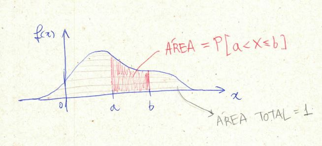
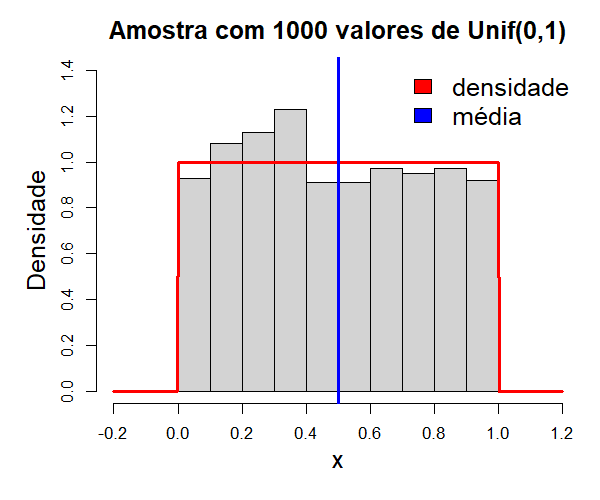

# Variáveis Aleatórias Contínuas {#variaveis-aleatorias-continuas}


O Capítulo 3 tratou de contagens: valores discretos, separados uns dos outros. Muitas variáveis
econômicas relevantes, porém, variam **continuamente**: o tempo até um evento, uma taxa de juros, o
retorno de um ativo, a renda de uma família. Este capítulo estende esperança, variância e FDA para
esse caso, trocando somatórios por integrais, com o ferramental revisado no Apêndice
\@ref(revisao-de-calculo).

## Conceituação de variável aleatória contínua {#va-continua-conceito}

Uma VA $X$ é **contínua** quando pode assumir qualquer valor em um intervalo (finito ou infinito)
da reta real. Diferente do caso discreto, **não existe** uma função de probabilidade $p(x)=P(X=x)$
útil aqui: para uma VA contínua, $P(X=x)=0$ para **todo** valor específico $x$, a probabilidade só
se acumula sobre intervalos, nunca sobre um único ponto.

```{=html}
<div class="caixa-discussao"><strong>Para discutir: antes da definição formal</strong>

<p><strong>1.</strong> Se $P(X=x)=0$ para todo $x$, como é possível que $X$ assuma \emph{algum}
valor com probabilidade total $1$? Não há contradição, mas vale a pena travar nessa pergunta antes
de seguir. (Dica: a soma de "infinitos zeros", num sentido contínuo, não é necessariamente zero,
é o mesmo tipo de sutileza por trás da integral imprópria do Apêndice A.)</p>

<p><strong>2.</strong> A renda mensal exata de uma família, em centavos, é tecnicamente discreta (o
menor incremento monetário é 1 centavo). Por que, ainda assim, ela é quase sempre tratada como
variável contínua em modelos econômicos? O que se ganha nessa aproximação, e o que, na prática, se
perde?</p>
</div>
```

Em vez de $p(x)$, define-se a **função densidade de probabilidade (fdp)** $f(x)$, tal que, para
qualquer intervalo $[a,b]$,

$$
P(a\le X\le b) = \int_a^b f(x)\,dx,
$$

com as condições análogas ao caso discreto:

$$
f(x)\ge 0 \ \text{para todo } x, \qquad \int_{-\infty}^{\infty} f(x)\,dx = 1.
$$

$f(x)$ **não é** uma probabilidade, pode até ser maior que 1 em algum ponto, é uma **densidade**:
a probabilidade "por unidade de comprimento" em torno de $x$. Geometricamente, $f(x)$ é a curva, e
$P(a\le X\le b)$ é a **área** sob essa curva entre $a$ e $b$.

<div class="figure" style="text-align: center">

<p class="caption">(\#fig:fig-fdp-exemplo-mao)Densidade $f(x)$ genérica: a área sob a curva entre $a$ e $b$ é $P(a<X\le b)$; a área total sob toda a curva vale 1.</p>
</div>

```{=html}
<div class="caixa-aplicacao"><strong>Aplicação: chuva acumulada é uma variável contínua</strong>. A
manchete abaixo diz que Salvador registrou, em menos de um dia, 76% do acumulado de chuva esperado
para todo o mês de novembro. O volume de chuva acumulado (em mm) é um exemplo típico de variável
contínua: pode assumir qualquer valor não negativo, ao contrário das contagens discretas do
Capítulo 3. A pergunta que só faz sentido com a linguagem deste capítulo é $P(X\ge x_{obs})$, a
probabilidade de um dia acumular pelo menos o volume observado, segundo a distribuição histórica de
chuva de novembro para a cidade, é essa probabilidade, não o número bruto de milímetros, que separa
um dia "chuvoso, mas normal" de um evento estatisticamente extremo.</div>
```

<div class="figure" style="text-align: center">

<p class="caption">(\#fig:fig-chuva-salvador)Chuva acumulada em Salvador ultrapassa 76% do esperado para novembro em menos de 24 horas (G1, 12/11/2025).</p>
</div>

```{=html}
<div class="caixa-aplicacao"><strong>Aplicação: tempo de espera em uma fila de atendimento</strong>
, o tempo $X$ (em minutos) que um cliente espera em uma fila de banco tem densidade
$f(x) = 0{,}2\,e^{-0{,}2x}$, $x\ge 0$ (distribuição Exponencial, com taxa $0{,}2$).</div>
```


``` r
f <- function(x) 0.2*exp(-0.2*x)
df <- tibble(x = seq(0, 30, length.out = 300), y = f(x))
df_area <- df |> filter(x >= 5, x <= 15)

ggplot(df, aes(x,y)) + geom_line(color="#0d3b54") +
  geom_area(data = df_area, fill = "#c9971e", alpha = .5) +
  labs(x = "minutos", y = "f(x)", title = "P(5 ≤ X ≤ 15) = área sombreada") +
  theme_minimal(base_size = 13)
```


``` r
integrate(f, lower = 5, upper = 15)
```

```
## 0.3180924 with absolute error < 0.0000000000000035
```

## Esperança e variância {#va-continua-esperanca-variancia}

As definições trocam soma por integral, mas a interpretação é idêntica ao Capítulo 3:

$$
E(X) = \mu = \int_{-\infty}^{\infty} x\,f(x)\,dx
\qquad\qquad
\mathrm{Var}(X) = \sigma^2 = \int_{-\infty}^{\infty} (x-\mu)^2\,f(x)\,dx.
$$

Todas as propriedades do Capítulo 3 continuam válidas sem alteração: $E(aX+b)=aE(X)+b$,
$\mathrm{Var}(aX+b)=a^2\mathrm{Var}(X)$, $E(X+Y)=E(X)+E(Y)$ sempre, e
$\mathrm{Var}(X+Y)=\mathrm{Var}(X)+\mathrm{Var}(Y)$ sob independência.


``` r
# E(X) para a fila de atendimento: integral de x*f(x) de 0 a infinito
integrand <- function(x) x * 0.2*exp(-0.2*x)
integrate(integrand, lower = 0, upper = Inf)
```

```
## 5 with absolute error < 0.000038
```

$E(X)=5$ minutos, o tempo médio de espera na fila.

<div class="figure" style="text-align: center">

<p class="caption">(\#fig:fig-peso-esperado)Companhia aérea reforma aviões após o peso real dos passageiros de primeira classe superar o peso esperado usado no projeto das cabines.</p>
</div>

```{=html}
<div class="caixa-aplicacao"><strong>Aplicação: engenharia também usa $E(X)$</strong>, o caso
real acima não é sobre economia, mas ilustra o mesmo conceito com consequências físicas diretas:
companhias aéreas projetam estrutura, distribuição de peso e consumo de combustível de uma
aeronave com base no <em>peso esperado</em> por passageiro, uma média ponderada de uma
distribuição de peso corporal mais bagagem. Quando o peso real observado passa a exceder
sistematicamente o peso de projeto (mudança na composição populacional ao longo de décadas, mais
bagagem de mão, assentos maiores), a estrutura precisa ser refeita. É a mesma lógica de uma
seguradora recalculando $E(X)$ quando o perfil de sinistros muda, ou de um dimensionamento de
capacidade de atendimento baseado no $E(X)=5$ minutos calculado acima: um valor esperado não é uma
verdade estática, é uma estimativa que precisa ser revista quando a distribuição subjacente
muda.</div>
```

```{=html}
<div class="caixa-discussao"><strong>Para discutir</strong>

<p><strong>1.</strong> $E(X)=5$ minutos é o tempo "esperado", mas, como a Exponencial é
assimétrica à direita, grande parte dos clientes espera bem menos que 5 minutos, enquanto uma
minoria espera bem mais. O que isso implica para uma agência que divulga "tempo médio de espera: 5
minutos" como métrica de atendimento ao público? Que medida (do Capítulo 1) complementaria melhor
essa informação?</p>

<p><strong>2.</strong> As fórmulas de $E(aX+b)$ e $\mathrm{Var}(aX+b)$ são idênticas às do Capítulo
3, só trocando soma por integral na definição. Por que isso não deveria ser surpreendente?</p>
</div>
```

## Função de distribuição acumulada {#va-continua-fda}

$$
F(x) = P(X\le x) = \int_{-\infty}^x f(t)\,dt.
$$

Diferente do caso discreto, $F$ é **contínua** (sem saltos) quando $f$ é contínua, reflexo direto
de $P(X=x)=0$. Uma consequência prática importante:

$$
P(X\le x) = P(X<x) \qquad P(X\ge x) = P(X>x),
$$

ao contrário do caso discreto, onde a diferença entre $\le$ e $<$ importava (Capítulo 3). Pela
relação entre $f$ e $F$ (Teorema Fundamental do Cálculo, Apêndice A):

$$
F'(x) = f(x), \qquad P(a\le X\le b) = F(b) - F(a).
$$


``` r
Fx <- function(x) 1 - exp(-0.2*x)   # primitiva de f, calculada à mão
ggplot(tibble(x = seq(0,30,length.out=300), F = Fx(x)), aes(x,F)) +
  geom_line(color = "#0d3b54") +
  labs(x = "minutos", y = "F(x)", title = "FDA, tempo de espera") +
  theme_minimal(base_size = 13)
```


```{=html}
<div class="caixa-discussao"><strong>Para discutir</strong>

<p><strong>1.</strong> No Capítulo 3, $P(X\ge x)\ne P(X>x)$ em geral (a diferença de um ponto
importava). Aqui, $P(X\ge x)=P(X>x)$ sempre. Explique essa diferença usando o fato $P(X=x)=0$ para
VA contínua, qual é exatamente o "ponto a mais ou a menos" que deixou de importar?</p>

<p><strong>2.</strong> Dado $F(x)=1-e^{-0{,}2x}$, como você recuperaria $f(x)$ a partir dela, sem
ter a fórmula de $f$ em mãos? Use a relação $F'(x)=f(x)$ para deduzir.</p>
</div>
```

## Alguns modelos probabilísticos {#modelos-continuos}

Antes dos modelos nomeados a seguir, vale reforçar que "densidade válida" é um conceito mais amplo
que os nomes consagrados (Uniforme, Normal etc.): qualquer função não negativa com área total 1
serve.

<div class="figure" style="text-align: center">

<p class="caption">(\#fig:fig-fdp-triangular)Densidade triangular em [0,2], com pico em x=1: outro exemplo de densidade válida, sem distribuição nomeada correspondente no R.</p>
</div>

```{=html}
<div class="caixa-discussao"><strong>Para discutir</strong>

<p><strong>1.</strong> A densidade triangular acima sobe de 0 (em $x=0$) até 1 (em $x=1$) e desce
de volta a 0 (em $x=2$), formando dois triângulos-retângulos. Usando a fórmula da área de um
triângulo, confirme que a área total sob a curva é de fato 1, condição necessária para ser uma
densidade válida.</p>

<p><strong>2.</strong> Sem calcular nada, apenas observando o desenho: $P(X\le 1)$ é maior, menor
ou igual a $P(X>1)$? E $E(X)$, o desenho sugere que vale exatamente 1? (Aqui a densidade é
simétrica em torno de $x=1$, mas o racional geral vale para qualquer densidade: quando existe um
ponto de simetria, ele é sempre igual a $E(X)$.)</p>
</div>
```

### Distribuição Uniforme

A VA mais simples: densidade **constante** em um intervalo $[a,b]$, zero fora dele, "todos os
valores no intervalo são igualmente prováveis" (no sentido de densidade).

$$
f(x) = \frac{1}{b-a}, \quad a\le x\le b
\qquad E(X)=\frac{a+b}{2} \qquad \mathrm{Var}(X)=\frac{(b-a)^2}{12}.
$$

```{=html}
<div class="caixa-aplicacao"><strong>Aplicação</strong>, o instante, dentro de uma hora, em que um
cliente entra em uma loja (sem padrão de horário de pico) pode ser modelado como
$X\sim\text{Unif}(0,60)$ (minutos após o início da hora).</div>
```


``` r
a <- 0; b <- 60
c(E_X = (a+b)/2, Var_X = (b-a)^2/12)
```

```
##   E_X Var_X 
##    30   300
```

``` r
punif(20, min = a, max = b)   # P(X <= 20)
```

```
## [1] 0.3333333
```

``` r
dunif(30, min = a, max = b)   # densidade em x=30 (constante = 1/60)
```

```
## [1] 0.01666667
```

<div class="figure" style="text-align: center">

<p class="caption">(\#fig:fig-hist-unif)Histograma de 1.000 valores simulados de Unif(0,1): a densidade constante (vermelho) e a média teórica 0,5 (azul) já são bem aproximadas por uma amostra desse tamanho.</p>
</div>

É a lei dos grandes números (fora do escopo formal deste curso, mas já intuída no Capítulo 1) que
garante essa aproximação: quanto maior a amostra simulada, mais o histograma se aproxima da
densidade teórica constante $f(x)=1$ em $[0,1]$, e mais a média amostral se aproxima de
$E(X)=0{,}5$, a mesma lógica por trás de qualquer simulação Monte Carlo usada para verificar um
resultado teórico.

### Distribuição Normal

O modelo contínuo mais importante em Estatística e Economia, descreve bem fenômenos que resultam
da soma de muitos pequenos efeitos independentes (erros de medição, retornos agregados de muitos
fatores). Densidade em forma de sino, simétrica em torno da média:

$$
f(x) = \frac{1}{\sigma\sqrt{2\pi}} \exp\left(-\frac{(x-\mu)^2}{2\sigma^2}\right), \quad x\in\mathbb{R}
\qquad E(X)=\mu \qquad \mathrm{Var}(X)=\sigma^2.
$$

Notação: $X\sim N(\mu,\sigma^2)$. Quando $\mu=0$ e $\sigma=1$, chama-se **Normal padrão**, $Z\sim
N(0,1)$, qualquer Normal pode ser convertida em padrão pela **padronização**:

$$
Z = \frac{X-\mu}{\sigma}.
$$

<div class="figure" style="text-align: center">

<p class="caption">(\#fig:fig-black-scholes)'Fórmula de Midas': a equação de Black-Scholes, criada para precificar opções financeiras, apoiada na suposição de que retornos seguem uma distribuição Normal (ou log-Normal).</p>
</div>

```{=html}
<div class="caixa-economia"><strong>Leitura econômica</strong>, a fórmula de Black-Scholes-Merton
(1973), um dos resultados mais influentes das finanças modernas, precifica opções assumindo que o
log-retorno de um ativo segue uma distribuição Normal. A reportagem acima resume um fato histórico
importante: essa mesma suposição, quando os mercados se afastam dela (crises, "caudas gordas",
Capítulo 1), contribuiu para perdas catastróficas, como a quebra do fundo LTCM em 1998. A lição não
é "não use a Normal", é a mesma do Capítulo 1: todo modelo é uma simplificação, e usá-lo bem
exige saber em que condições ele deixa de valer.</div>
```

```{=html}
<div class="caixa-aplicacao"><strong>Aplicação: retorno mensal de um fundo de ações</strong>,
histórico sugere retorno mensal aproximadamente $X\sim N(1{,}2\%,\ (4{,}5\%)^2)$.</div>
```


``` r
mu <- 1.2; sigma <- 4.5

# probabilidade de retorno negativo no mês
pnorm(0, mean = mu, sd = sigma)
```

```
## [1] 0.3948629
```

``` r
# probabilidade de retorno entre 0% e 5%
pnorm(5, mu, sigma) - pnorm(0, mu, sigma)
```

```
## [1] 0.4059265
```


```{=html}
<div class="caixa-economia"><strong>Leitura econômica</strong>, a probabilidade de retorno mensal
negativo (área sombreada) é o tipo de número que um gestor de risco reporta como parte da
caracterização de um fundo, junto de uma ressalva importante, retomada da discussão de curtose no
Capítulo 1: retornos financeiros reais frequentemente têm caudas mais pesadas que a Normal
(curtose $>3$), de modo que a probabilidade Normal tende a \emph{subestimar} a frequência real de
perdas extremas, a Normal é um ponto de partida útil, não a palavra final em modelagem de
risco.</div>
```

### A regra empírica (68--95--99,7)

Para qualquer $X\sim N(\mu,\sigma^2)$:

$$
P(\mu-\sigma < X < \mu+\sigma)\approx 0{,}683 \quad
P(\mu-2\sigma < X < \mu+2\sigma)\approx 0{,}954 \quad
P(\mu-3\sigma < X < \mu+3\sigma)\approx 0{,}997
$$


``` r
pnorm(2) - pnorm(-2)   # P(-2 < Z < 2) na Normal padrão
```

```
## [1] 0.9544997
```

```{=html}
<div class="caixa-r"><strong>Uso do R</strong>, <code>pnorm</code>/<code>dnorm</code>/
<code>qnorm</code>/<code>rnorm</code> seguem o mesmo padrão das demais distribuições do R.
<code>qnorm(p, mean, sd)</code> é a função inversa da FDA, devolve o valor $x$ tal que
$F(x)=p$, útil para "qual é o retorno que só é superado (ou não superado) por p% dos
casos?".</div>
```

```{=html}
<div class="caixa-discussao"><strong>Para discutir: síntese do capítulo e do curso</strong>

<p><strong>1.</strong> A regra empírica é uma consequência direta da Normal, não uma suposição
extra. Se retornos financeiros reais têm curtose maior que 3 (Capítulo 1), a probabilidade real de
um retorno cair fora de $\mu\pm2\sigma$ é maior ou menor que os 4,6\% previstos pela regra
empírica? Que consequência prática isso tem para um gestor que usa "2 desvios padrão" como limite
de alerta de risco?</p>

<p><strong>2.</strong> Por que a soma de "muitos pequenos efeitos independentes" tende a gerar uma
distribuição aproximadamente Normal? Não é preciso provar, dê uma intuição, pensando no que
acontece ao somar vários erros de medição pequenos e aleatórios, cada um podendo ser positivo ou
negativo.</p>

<p><strong>3.</strong> Volte à primeira pergunta do Prefácio do livro ("vale a pena trocar a
poupança por um fundo multimercado?"). Com o vocabulário completo dos Capítulos 1 a 4 agora
disponível, escreva um parágrafo respondendo, não com uma resposta definitiva ("sim" ou "não"),
mas listando que informações estatísticas (medidas de posição, dispersão, forma, um modelo de
distribuição para o retorno) você exigiria antes de decidir.</p>

<p><strong>4.</strong> Ao longo do curso, cada capítulo teve um bloco de discussão insistindo no
mesmo ponto: um número sozinho raramente basta, é preciso saber sua origem, seu condicionamento e
seus limites. Escolha, dentre todas as discussões do semestre, a que mais mudou sua forma de ler um
número em uma notícia econômica, e explique por quê.</p>
</div>
```

## Fechando o capítulo

Com este capítulo, o curso completa o ciclo: de dados observados (Cap. 1), à linguagem formal de
incerteza (Cap. 2), a modelos de contagens (Cap. 3) e finalmente a modelos de grandezas contínuas
(Cap. 4), o vocabulário completo para ler, questionar e modelar formalmente a maior parte dos
fenômenos quantitativos que um economista ou estatístico encontra na prática. Os Apêndices A e B
seguem como material de referência para revisão e consulta.
